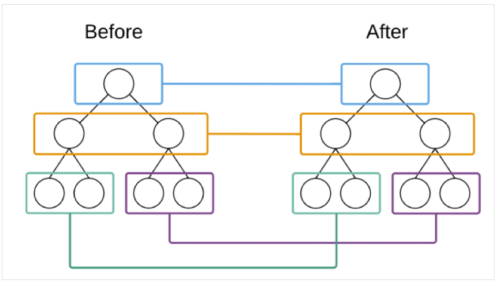
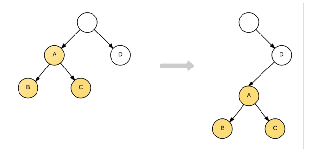
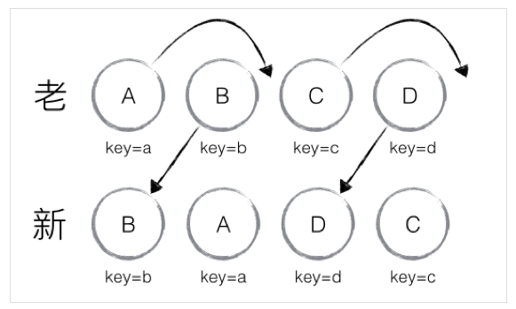
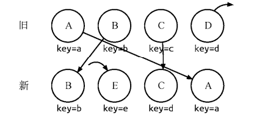

# 13 diff算法简介
React框架使用的目的，就是为了维护状态，更新视图。

为什么会说传统DOM操作效率低呢？当使用document.createElement()创建了一个空的Element时，会需要按照标准实现一大堆的东西，如下图所示。此外，在对DOM进行操作时，如果一不留神导致回流，性能可能就很难保证了。
[](/image/31.png)<br>
相比之下，JS对象的操作却有着很高的效率，通过操作JS对象，根据这个用 JavaScript 对象表示的树结构来构建一棵真正的DOM树，正是React对上述问题的解决思路。之前的文章中可以看出，使用React进行开发时， DOM树是通过Virtual DOM构造的，并且，React在Virtual DOM上实现了DOM diff算法，当数据更新时，会通过diff算法计算出相应的更新策略，尽量只对变化的部分进行实际的浏览器的DOM更新，而不是直接重新渲染整个DOM树，从而达到提高性能的目的。在保证性能的同时，使用React的开发人员就不必再关心如何更新具体的DOM元素，而只需要数据状态和渲染结果的关系。

传统的diff算法通过循环递归来对节点进行依次比较还计算一棵树到另一棵树的最少操作，算法复杂度为O(n^3)，其中n是树中节点的个数。尽管这个复杂度并不好看，但是确实一个好的算法，只是在实际前端渲染的场景中，随着DOM节点的增多，性能开销也会非常大。而React在此基础之上，针对前端渲染的具体情况进行了具体分析，做出了相应的优化，从而实现了一个稳定高效的diff算法。

diff算法有如下三个策略：

- DOM节点跨层级的移动操作发生频率很低，是次要矛盾；
- 拥有相同类的两个组件将会生成相似的树形结构，拥有不同类的两个组件将会生成不同的树形结构，这里也是抓前者放后者的思想；
- 对于同一层级的一组子节点，通过唯一id进行区分，即没事就warn的key。
基于各自的前提策略，React也分别进行了算法优化，来保证整体界面构建的性能。

## 13.1 虚拟DOM树diff
两棵树只会对同一层次的节点进行比较，忽略DOM节点跨层级的移动操作。React只会对相同颜色方框内的DOM节点进行比较，即同一个父节点下的所有子节点。当发现节点已经不存在，则该节点及其子节点会被完全删除掉，不会用于进一步的比较。这样只需要对树进行一次遍历，便能完成整个DOM树的比较。由此一来，最直接的提升就是复杂度变为线型增长而不是原先的指数增长。
<br>
得一提的是，如果真的发生跨层级移动(如下图)，例如某个DOM及其子节点进行移动挂到另一个DOM下时，React是不会机智的判断出子树仅仅是发生了移动，而是会直接销毁，并重新创建这个子树，然后再挂在到目标DOM上。从这里可以看出，在实现自己的组件时，保持稳定的DOM结构会有助于性能的提升。事实上，React官方也是建议不要做跨层级的操作。因此在实际使用中，比方说，我们会通过CSS隐藏或显示某些节点，而不是真的移除或添加DOM节点。其实一旦接受了React的写法，就会发现前面所说的那种移动的写法几乎不会被考虑，这里可以说是React限制了某些写法，不过遵守这些实践确实会使得React有更好的渲染性能。如果真的需要有移动某个DOM的情况，或许考虑考虑尽量用CSS3来替代会比较好吧。
<br>
在许多源码阅读的文章里(搜到的讲的比较细的一般都是两三年前啦)，都是说用一个updateDepth或者某种控制树深的变量来记录跟踪。事实上就目前版本来看，已经不是这样了(如果我没看错…)。ReactDOMComponent .updateComponent方法用来更新已经分配并挂载到DOM上的DOM组件，并在内部调用ReactDOMComponent._updateDOMChildren。而ReactDOMComponent通过_assign将ReactMultiChild.Mixin挂到原型上，获得ReactMultiChild中定义的方法updateChildren（事实上还有updateTextContent等方法也会在不同的分支里被使用，React目前已经对这些情形做了很多细化了）。ReactMultiChild包含着diff算法的核心部分，接下来会慢慢进行梳理。到这里我们暂时不必再继续往下看，可以注意prevChildren和nextChildren这两个变量，当然removedNodes、mountImages也是意义比较明显且很重要的变量:
```javascript
_updateChildren: function(nextNestedChildrenElements, transaction, context) {
      // prevChildren 和nextChildren都是ReactElement，也就是虚拟DOM.cont他们的$$typeof.Symbol(react.element) 可以看出来的
      // removedNodes和mountImages：这些变量会随着调用栈一层层往下作为参数传下去并被修改和包装
      // 之前的children
      var prevChildren = this._renderedChildren;
      // 本次需要移除的node节点集合
      var removedNodes = {};
      // 本次需要挂载到DOM的DOMLazyTree（真实DOM的映射）
      var mountImages = [];
      // 本次需要挂载的children
      var nextChildren = this._reconcilerUpdateChildren(
        prevChildren,
        nextNestedChildrenElements,
        mountImages,
        removedNodes,
        transaction,
        context
      );
      if (!nextChildren && !prevChildren) {
        return;
      }
      ....
```
prevChildren和nextChildren都是ReactElement，也就是virtual DOM，从它们的$$typeof: Symbol(react.element)就可看出；removedNodes保存删除的节点，mountImages则是保存对真实DOM的映射，或者可以理解为要挂载的真实节点，这些变量会随着调用栈一层层往下作为参数传下去并被修改和包装。

而控制树的深度的方法就是靠传入nextNestedChildrenElements，把整个树的索引一层层递归的传下去，同时传入prevChildren这个虚拟DOM，进入_reconcilerUpdateChildren方法，会在里面通过flattenChildren方法（当然里面还有个traverse方法）来访问我们的子树指针nextNestedChildrenElements，得到与prevChildren同层的nextChildren。然后ReactChildReconciler.updateChildren就会将prevChildren、nextChildren封装成ReactDOMComponent类型，并进行后续比较和操作。

至此，同层比较叙述结束，后面会继续讨论针对组件的diff和对元素本身的diff。
## 13.2 组件diff
从脏组件更新章节里面，我们可以看到组件diff算法如下，可以讲组件间的比较策略总结如下：

- 如果是同类型组件，则按照原策略继续比较virtual DOM树；
- 如果不是，则将该组件判断为dirty component，然后整个unmount这个组件下的子节点对其进行替换；
- 对于同类型组件，virtual DOM可能并没有发生任何变化，这时我们可以通过shouldCompoenentUpdate钩子来告诉该组件是否进行diff，从而提高大量的性能。
这里可以看出React再次抓了主要矛盾，对于不同组件但结构相似的情形不再去关注，而是对相同组件、相似结构的情形进行diff算法，并提供钩子来进一步优化。可以说，对于页面结构基本没有变化的情况，确实是有着很大的优势。
例如下图中，当组件D变为组件G时，及时这两个组件结构相似，但是一旦React判断D和G不是同一类型的组件，就不会比较二者的结构，而是直接删除D，重新创建组件G及其子节点。虽然当两个组件不同类似但是结构相似的时候，diff会影响性能，但是正如React官方博客所说：不同类型的组件很少存在相似DOM树的情况，因此这种极端因素下很难在实际开发中造成重大的影响。
<br>

## 13.3 element的diff
通过如下例子进行理解。下面涉及到新集合中有新加入的节点且老集合中存在需要删除的节点的情形。通过点击来控制文字和数字的显示与消失。
```javascript
render() {
    <div>
        <h1 onClick={(e) => { this.handleClick(e)}}>{this.state.title}</h1>
        {
            this.state.showText ?
                <h2 onClick={this.handleShowText.bind(this)}>你好呀</h2> :
                <h3 onClick={this.handleShowText.bind(this)}>123456</h3>
        }
    </div>
}
```
下面来看时如何做到的。
通过`11state机制`章节，我们知道当state改变的时候，通过调用ReactDefaultBatchingStrategy.batchedUpdates()。在事务的close函数处理中，进行脏组件重绘。
performUpdateIfNecessary -> internalInstance.performUpdateIfNecessary(transaction) ->  ReactReconciler.receiveComponent(..) -> ReactDOMComponent.updateComponent()
- ReactDOMComponent._updateDOMChildren() => ReactMultiChild.updateChildren()
通过上面的路径，进入到了ReactMultiChild._updateChildren()。
-  this._reconcilerUpdateChildren(): 从ReactElement数组变成以key 为'.0', '.1'这样带点value为ReactDOMComponent组件这样的对象。这是React为一个个组件们默认分配的key,如果这里强制设置要给key给标签，那么最终拥有如'$123'这样的key。 因此按照上面的例子，preChildren中存放`h1 和 h2标签`， nextChilren存放`h1 和h3标签`对于的ReactDOMComponent。
```javascript
_updateChildren: function(nextNestedChildrenElements, transaction, context) {
      // prevChildren 和nextChildren都是ReactElement，也就是虚拟DOM.cont他们的$$typeof.Symbol(react.element) 可以看出来的
      // removedNodes和mountImages：这些变量会随着调用栈一层层往下作为参数传下去并被修改和包装
      // 之前的children
      var prevChildren = this._renderedChildren;
      // 本次需要移除的node节点集合
      var removedNodes = {};
      // 本次需要挂载到DOM的DOMLazyTree（真实DOM的映射）
      var mountImages = [];
      // 本次需要挂载的children
      var nextChildren = this._reconcilerUpdateChildren(
        prevChildren,
        nextNestedChildrenElements,
        mountImages,
        removedNodes,
        transaction,
        context
      );
      if (!nextChildren && !prevChildren) {
        return;
      }
      ....
```
上面的步骤分析已经进入到element开始diff的逻辑中了，下面我们就来分析详细的逻辑。当节点处于同一层级时，diff之前提供了3种节点操作。分别为INSERT_MARKUP(插入)、MOVE_EXISTING(移动)、REMOVE_NODE(移除)。现在新增了SET_MARKUP和TEXT_CONTENT两种操作。最终的updates就是一个数组(包含哪一个类型(MOVE_EXSITING, INSERT_MARKUP)的操作的对象的集合)
- INSERT_MARKUP：新的component类型(nextChildren里的)不在老集合(prevChildren)里，即是全新的节点，需要对新节点执行插入操作；
- MOVE_EXISTING：在老集合有新component类型，且element是可更新的类型，这种情况下prevChild===nextChild，就需要做移动操作，可以复用以前的DOM节点。
- REMOVE_NODE：老component类型在新集合里也有，但对应的element不同则不能直接复用和更新，需要执行删除操作；或者老component不在新集合里的，也需要执行删除操作。
```javascript
_updateChildren: function(nextNestedChildrenElements, transaction, context) {
    //上面已经准备了prevChildren，nextChildren，removedNodes。下面的逻辑都是按照已有的节点开始
    ...
    // 存放本次diff变化的节点信息
    var updates = null;
    // 遍历中的key值
    var name;
    // `nextIndex`：自增，表示更新节点的索引。例如之前A节点的_mountIndex是2，nextIndex表示本轮该节点的位置。A._MountIndex 也会被改为nextIndex。
    var nextIndex = 0;
    // `lastIndex`将是'prevChildren`中最后一个访问的索引。会取得Math.max(prevChilren[name], lastIndex)
    var lastIndex = 0;
    // preChildren中不存在本次新增的节点，需要挂载的索引
    var nextMountIndex = 0;
    // 本轮被挂在的节点的真实ReactDOMComponent
    var lastPlacedNode = null;
    // 遍历nextChildren,通过hasOwnProperty过滤原型上的属性和方法
    for (name in nextChildren) {
        if (!nextChildren.hasOwnProperty(name)) {
          continue;
        }
        var prevChild = prevChildren && prevChildren[name];
        var nextChild = nextChildren[name];
        // 将同层节点进行比较
        if (prevChild === nextChild) {
          // 节点相同：则enqueue一个moveChild方法返回的type为MOVE_EXISTING的对象到updates里
          // 即把更新放入一个队列，moveChild也就是移动已有节点，但是是否真的移动会根据整体diff算法的结果来决定(本例当然是没移动了)，然后修改若干index量
          updates = enqueue(
            updates,
            this.moveChild(prevChild, lastPlacedNode, nextIndex, lastIndex)
          );
          // 修改lastIndex
          lastIndex = Math.max(prevChild._mountIndex, lastIndex);
          // 将旧对象的_mountIndex更新为新集合中的位置
          prevChild._mountIndex = nextIndex;
        } else {
          // 就会计算一堆index(这里其实是算法的核心，此处先不细说)，然后再次enqueue一个update，事实上是一个type属性为INSERT_MARKUP的对象。
          if (prevChild) {
            // Update `lastIndex` before `_mountIndex` gets unset by unmounting.
            lastIndex = Math.max(prevChild._mountIndex, lastIndex);
            // The `removedNodes` loop below will actually remove the child.
          }
          // The child must be instantiated before it's mounted.
          updates = enqueue(
            updates,
            this._mountChildAtIndex(
              nextChild,
              mountImages[nextMountIndex],
              lastPlacedNode,
              nextIndex,
              transaction,
              context
            )
          );
          nextMountIndex++;
        }
        nextIndex++;
        // 通过ReactReconciler.getHostNode根据nextChild得到真实DOM
        lastPlacedNode = ReactReconciler.getHostNode(nextChild);
      }
      // Remove children that are no longer present.
      // 把需要删除的节点用enqueue的方法继续入队unmount操作。
      for (name in removedNodes) {
        if (removedNodes.hasOwnProperty(name)) {
          // 这里this._unmountChild返回的是REMOVE_NODE对象
          updates = enqueue(
            updates,
            this._unmountChild(prevChildren[name], removedNodes[name])
          );
        }
      }
      // 整个更新的diff流程就走完了，而updates保存了全部的更新队列，最终由processQueue来挨个执行更新。
      if (updates) {
        processQueue(this, updates);
      }
      this._renderedChildren = nextChildren;
    }

    ...
    moveChild: function(child, afterNode, toIndex(上层传入的nextIndex，本次节点的新位置), lastIndex) {
      // 老节点的_mountIndex  小于 lastIndex（上一轮的child的_mountIndex 和 lastIndex的最大值，旧节点中最大的索引）
      if (child._mountIndex < lastIndex) {
        return makeMove(child, afterNode, toIndex);
      }
    },
```
## 13.3.1 element的新老节点都存在
<br>
将图按照上面的代码进行分析：
-  新集合取得B, 旧集合中存在B并相等（B节点到了A节点的位置）nextIndex(本次节点位置) = 0， lastIndex（旧节点中最后一个访问的索引）= 0; preB._mountIndex = 1, 大于lastIndex,不满足child._mountIndex(值为1) < lastIndex(值为0)条件，因此不移动。更新lastIndex = Math.max(preChild._mountIndex, lastIndex),并将B的位置更新为新集合中的位置。preChild._mountIndex = nextIndex。此时B._mountInex  = 0; lastIndex = 1;nextIndex++, 进入下一步；
- 新集合取得A,旧集合中存在A并相等，nextIndex=1，lastIndex = 1。 preA._mountIndex(值为0) < lastIndex(值为1)成立,对A进行移动操作。enqueueMove(this, child._mountIndex, toIndex)。toIndex就是传入的nextIndex本次节点的新位置。更新lastIndex = Math.max(preChild._mountIndex, lastIndex)。lastIndex还是等于1。并将A的位置更新为新集合中的位置。preChild._mountIndex = nextIndex。此时A._mountIndex = 1, lastIndex = 1; nextIndex++; 进入下一步；
- 新集合中取得D,旧集合中存在D并相等，nextIndex = 2, lastIndex = 1, preD._mountIndex(值为3) < lastIndex(值为1) 不成立。因此不移动。更新lastIndex = Math.max(preChild._mountIndex, lastIndex)。lastIndex = 3，并将D的位置更新为新集合中的位置preChild._mountIndex = nextIndex。此时B._mountIndex = 2,lastIndex = 3, nextIndex++, 进入下一步。
- 新集合中取得C,旧集合中存在C并相等，nextIndex = 3, preC._mountIndex(值为2) < lastIndex（值为3）成立，因此对C进行移动操作。enqueueMove(this, child._mountIndex, toIndex)。更新lastIndex = Math.max(preChild._mountIndex, lastIndex)。lastIndex = 3。并将C的位置更新为新集合中的位置，C._mountINdex  = nextIndex,此时C._mountIndex = 3, lastIndex = 3。next++仅需下一个节点的判断。由于C是最后一个，因此diff操作结束。
上面有一个在判断是否放入移动队列中的时候，使用了preChild._mountIndex < lastIndex的比较，lastIndex表示访问过的节点在旧集合中最大（最右）的位置，如果旧节点的索引如果在lastIndex之后，那么说明节点在旧集合中比上一个节点的位置还靠后，不会影响到其他节点的位置，因此不需要添加到差异队列中，不执行移动操作。只有当访问节点比lastIndex小时才需要进行移动。

## 13.3.2 element 的新增或移除
<br/>
将上图按照上面的代码进行分析：
- 新集合中取得B, 旧集合中存在并相等，nextIndex = 0, lastIndex = 0。 child._mountIndex(值为1) < lastIndex不成立，因此不移动。更新lastIndex = Math.max(preChild._mountIndex, lastIndex),并将B的位置更新为新集合中的位置preChild._mountIndex = nextIndex。 此时B._mountIndex = 0, lastIndex =1, nextIndex++ 等于1，进入下一步。
- 新集合中取得E, 旧集合不存在，则创建新节点E(this._mountChildAtIndex(..)内部)存入enqueue中,更新更新lastIndex = Math.max(preChild._mountIndex, lastIndex)。并将E的位置更新为新集合中的位置(在this._mountChildAtIndex(..)内部操作的，将nextIndex赋值给了e._mountIndex)。此时E._mountIndex = 1, lastIndex = 1, nextIndex++ 等于2进入下一步。
- 集合中取得C,旧集合中存在C并相同，由于C的child._mountIndex(值为2) < lastIndex(1)不满足，因此不移动。 更新lastIndex=Math.max(preChild._mountIndex, lastIndex)等于2。并将C的位置更新为新集合中的位置。child._mountIndex = nextIndex等于2,此时C._mountIndex = 2, lastIndex = 2, nextIndex++等于3进入下一步；
- 集合中取得A, 旧集合中存在并相同，并且A在旧集合中A._mountIndex = 0, 此时lastIndex = 2， 因此A._mountIndex < lastIndex, 需要移动操作。更新lastIndex = Math.max(preChild._mountIndex, lastIndex)等于2。将A的位置更新为新集合中的位置，此时，A._mountIndex = 3, lastIndex = 2, nextIndex++ 等于4进入下一步。
- 当完成新集合中所有节点的差异化对比后，需要对旧集合进行循环遍历，判断是否存在新集合中没有但是旧集合中任然存在的节点，发现这样的节点删除操作放入enqueue中。此时diff操作完成。
## 13.3.3 diff不足
上面的diff还是有许多待优化的部分，例如下图，当只有D节点移动到了最前面，而A，B,C保持原来的顺序，理论上diff只需要对D执行移动操作，。但是由于D在旧集合中的位置是最大的，导致其他节点_mountIndex < lastIndex,造成D没有执行移动操作，而是A，B,C全部移动到了D节点的后面。
建议：在开发过程中，尽量减少类似最后一个节点移动到列表首部的操作。当节点数量过大或更新操作过于频繁时，一定程度上会影响React的渲染性能。
## 13.3.4 Patch
上面的diff操作都是在Vitural DOM上进行的，浏览器中并未显示更新的数据，React Patch就是讲tree diff计算出来的DOM差异队列更新到真实的DOM节点上，最终让浏览器能够渲染出的数据。主要实现方式就是通过遍历差异队列，通过更新类型进行相应的操作（新节点的插入，已有节点的移动，移除等）。
为什么要依次插入节点呢？因为上面的diff阶段添加差异节点到差异队列中时，本来就是有序添加的。也就是说新增节点(包括move, insert)在队列中的顺序就是真实DOM的顺序，因此可以直接依次根据index去插入节点。而且React并不是计算出一个差异就执行一次Patch,而是计算出全部差异并放入差异队列后在一次性执行Patch方法完成真实DOM的更新。Patch的方法源码：
[DOMChildrenOperations.js](..\3源码文件\renderers\dom\client\utils\DOMChildrenOperations.js)
参考：https://segmentfault.com/a/1190000010686582#articleHeader3
参考：深入REACT技术栈