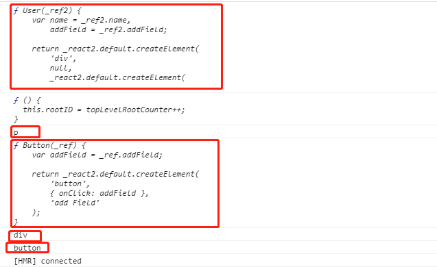
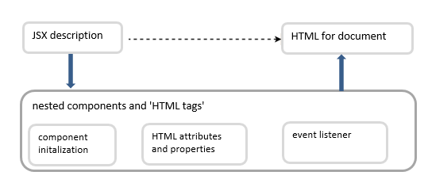
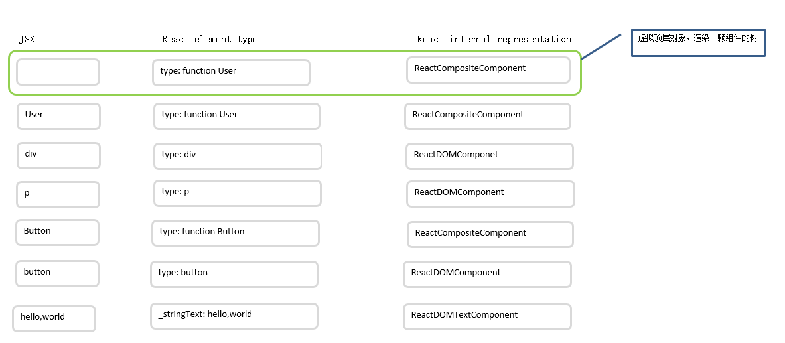
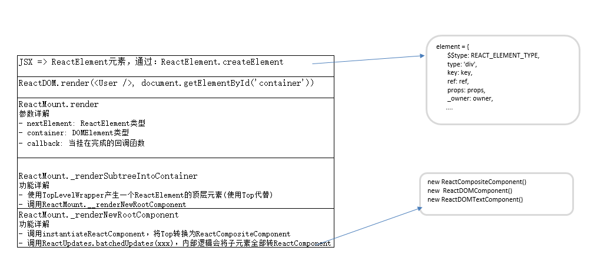

# 2 节点创建

## 2.1 JSX转为ReactElement
在React Component编写时，我们都是使用JSX来描述虚拟DOM。而JSX抽象层是如何联通React的？原因是由于JSX总是被编译成为React.createElement而被调用。一般Bable为我们做了JSX => React.createElement这件事情。<br>
```javascript
function Button({ addField}) {
    return React.creatElement(
        'button',
        { onClick: addField},
        'add Field'
    );
}
function User({ name, addField}) {
    return React.creatElement(
        'div',
        null,
        React.createElement('p', null, name),
        React.createElement('Button', { addField })
    );
}
```
对应的JSX语法编写：
```javascript
function Button({ addField}) {
    return (
        <button onClick={ addField }>add Field</>
    );
}
function User({name, addField}) {
    return (
        <div>
            <p>{name}</p>
            <Button addField={addField}></Button>
            hello,world
        </div>
    );
}
```
执行顺序：User => p => Button => div => button
- 先加载User类，加载render内容的子元素，加载User的div包裹标签。加载子元素的render内容<br>
<br>
从上面可以看出，虽然我们写了JSX语法，但实际最终被编译成调用React的createElement方法，将JSX转为React元素(ReactElement)。他们是简单的，直白的对象，它们仅仅只展示从本组件渲染中返回的内容。当将JSX语法传入React.createElement()方法中，返回元素简洁版参数格式如下:
```javascript
const element = {
  type: 'h1',
  props: {
    className: 'red',
    chidren: 'hello,world'
  }
};
```
, 代码解读：
```javascript
/**
 * createElement 只是做了简单的参数修正，返回一个 ReactElement 实例对象
 * 也就是虚拟元素的实例
 */
ReactElement.createElement = function(type, config, children) {
   // 初始化参数
  var propName;
  var props = {};
  var key = null;
  var ref = null;
  var self = null;
  var source = null;

  // 如果存在 config，则提取里面的内容
  if (config != null) {
    if (hasValidRef(config)) {
      ref = config.ref;
    }
    if (hasValidKey(config)) {
      key = '' + config.key;
    }
    self = config.__self === undefined ? null : config.__self;
    source = config.__source === undefined ? null : config.__source;

     // 复制 config 里的内容到 props（如 id 和 className 等）
    for (propName in config) {
      if (hasOwnProperty.call(config, propName) &&
          !RESERVED_PROPS.hasOwnProperty(propName)) {
        props[propName] = config[propName];
      }
    }
  }

  // 处理 children，全部挂载到 props 的 children 属性上。如果只有一个参数，直接赋值给 children， // 否则做合并处理
  var childrenLength = arguments.length - 2;
  if (childrenLength === 1) {
    props.children = children;
  } else if (childrenLength > 1) {
    var childArray = Array(childrenLength);
    for (var i = 0; i < childrenLength; i++) {
      childArray[i] = arguments[i + 2];
    }
    props.children = childArray;
  }

  // 如果某个 prop 为空且存在默认的 prop，则将默认 prop 赋给当前的 prop
  if (type && type.defaultProps) {
    var defaultProps = type.defaultProps;
    for (propName in defaultProps) {
      if (props[propName] === undefined) {
        props[propName] = defaultProps[propName];
      }
    }
  }
  // 返回一个 ReactElement 实例对象
  return ReactElement(
    type, // 传入
    key, // config 字段获取
    ref, // config 字段获取
    self, // config 字段获取
    source,  // config 字段获取
    ReactCurrentOwner.current, // 指向当前的操作React
    props // props为空则是defaultProps
  );
};
```
通过crateElement的元素，使用ReactElement构造函数最终返回：
```javascript
var ReactElement = function(type, key, ref, self, source, owner, props) {
    var element = {
        // This tag allow us to uniquely identify this as a React Element（这个标签允许我们唯一标识这是一个React元素）
        $$typeof: REACT_ELEMENT_TYPE,
        // Built-in properties that belong on the element
        type: type,
        key: key,
        ref: ref,
        props: props,
        // Record the component responsible for creating this element.(记录负责创建此元素的组件)
        _owner: owner,
    };
    element._store.validated = false;
    // _self: 临时帮助检测对象，检测this和owner不同的情况，我们会发出警告。我们想摆脱owner，使用箭头函数替换ref。只要`this`和owner是一样的，行为就不会发生变化
    element._self = self;
    // 表示文件名，行号和/或其他信息的注释对象（由转译器或其他方式添加）。
    element._source = source;
    if (Object.freeze) {
      Object.freeze(element.props);
      Object.freeze(element);
    }
  }
  return element;
};
```
## 2.2 ReactDOM.render
我们的JSX元素需要渲染为HTML界面，入口在哪里呢？看下面的代码
```javascript
ReactDOM.render(
    <User />,
    document.getElementById('app')
)
```
我们实际上调用了ReactDOM.render方法。这就是入口点。我们传入该render方法的元素是一个ReactElement元素。React.render方法实际挂在的是ReactMount.render。而在ReactMount.render内部调用的是ReactMount._renderSubtreeIntoContainer方法。看下面的代码：
```javascript
// ReactDOM 内部挂在ReactMount的render方法
var ReactDOM = {
     render: ReactMount.render,
     ...
}

// ReactMount.render方法调用的是_renderSubtreeIntoContainer方法
var ReactMount = {
    render: function(nextElement, container, callback) {
        return ReactMount._renderSubtreeIntoContainer(null, nextElement, container, callback);
    }
};

```
### 2.3 ReactMount挂载
从上面可以看出，实际上ReactDOM里面并没有逻辑。是调用的ReactMount.render进行挂载的逻辑。什么是挂载呢？
- 挂载是初始化React组件的过程，该过程通过创建组件所代表的DOM元素，并将它们插入到提供的container中来实现。
可以通过下面的图解来想象一下：<br>
<br>
React实际需要将足见描述转换为HTML,然后放入DOM中，这是怎么做到的呢？它需要处理所有的属性、事件监听，内嵌的组件和逻辑。它需要将你的高阶描述(组件)转换为放入网页的低级数据。这就是真正的挂在过程。

### 2.4 实例化React组件
下面我们来看一下ReactMount._renderSubtreeIntoContainer是如何处理的。
```javascript
 ReactMount = {
    _renderSubtreeIntoContainer: function(parentComponent, nextElement, container, callback) {
        ...
        // 实例化了一个TopLevelWrapper(一个React内部类)
        var nextWrappedElement = React.createElement(
            TopLevelWrapper,
            { child: nextElement }
        );
        ...
        var component = ReactMount._renderNewRootComponent(
            nextWrappedElement,
            container,
            shouldReuseMarkup,
            nextContext
        )._renderedComponent.getPublicInstance();
        return component;
    },
    // 渲染一个新的组件，返回一个ReactComponent
    _renderNewRootComponent: function(nextElement, container, shouldReuseMarkup, context)  {
        ...
        var componentInstance = instantiateReactComponent(nextElement, false);
        ...
    }
    ...
 }
```
在ReactMount的_ 方法占用，调用了instantiateReactComponent方法。而该方法是传入一个ReactNode,创建一个将要被挂在的实际的实例。
- 目录：`react-15.4.2/src/renderers/shared/stack/reconciler`
- 功能：创建一个将要被挂在的实际的实例
```javascript
function instantiateReactComponent(node, shouldHaveDebugID) {
  var instance;
  // 当node为空时，说明node不存在，则初始化空组件
  if (node === null || node === false) {
    instance = ReactEmptyComponent.create(instantiateReactComponent);

  // 当node类型为对象，即使DOM标签组件或者自定义组件
  } else if (typeof node === 'object') {
    var element = node;
    // type 会等于function 或者HTML标签名
    var type = element.type;

    // // 当node节点的type是string,则初始化DOM标签组件
    if (typeof element.type === 'string') {
      // DOM标签（ReactDOMComponent）
      instance = ReactHostComponent.createInternalComponent(element);

      // 检查类型引用是否是已知的内部类型。即 不是用户提供的复合类型。
    } else if (isInternalComponentType(element.type)) {
      // 不是字符串表示的自定义组件暂时无法使用，此处将不做组件初始化操作
      instance = new element.type(element);
      ....
    
    } else {
    // 自定义组件（ReactCompositeComponent）
      instance = new ReactCompositeComponentWrapper(element);
    }
  // 当 node 类型为字符串或数字时，初始化文本组件.当node类型为文本节点时不算Virsual DOM.但是React为了保证渲染的一致性，将其封装为文本组件ReactDOMTextComponent
  } else if (typeof node === 'string' || typeof node === 'number') {
    instance = ReactHostComponent.createInstanceForText(node);
  } else {
   // 不做任何操作
  }
...
  return instance;
}
```
通过上面的转换，下面我们来看User组件转化的一个了流程图：
<br>
从这里可以看到，JSX会被转换为React内部三种组件类型的一种：
- ReactCompositeComponent: 我们自定义的组件
- ReactDOMComponent: HTML标签
- ReactDOMTextCompopnent: 文本节点
这里我们对instantiateReactComponent函数关系整理一下：
```
<br/>
```
上面我们在ReactMount._renderSubtreeIntoContainer方法中，首先会从TopLevelWrapper开始渲染一颗组件的树。它几乎是一个空的包装器。其render方法(组件的render)随后返回的是<User />组件。
```javascript
//TopLevelWrapper路径： src\renderers\dom\client\ReactMount.js
// 记得我们在ReactElement构造器中，将User组件设置到了TopLevelWrapper对象的props对象的child属性。所以这里返回的就是<User />组件
TopLevelWrapper.prototype.render = function () {
  return this.props.child;
};
```

好的，让我们回顾一下这一小节，总体内容就是节点的创建。下面是调用的整体流程图：<br>
<br>
通过上面的操作，最终将它用于mounting流程中的部分如下：<br>
<br>