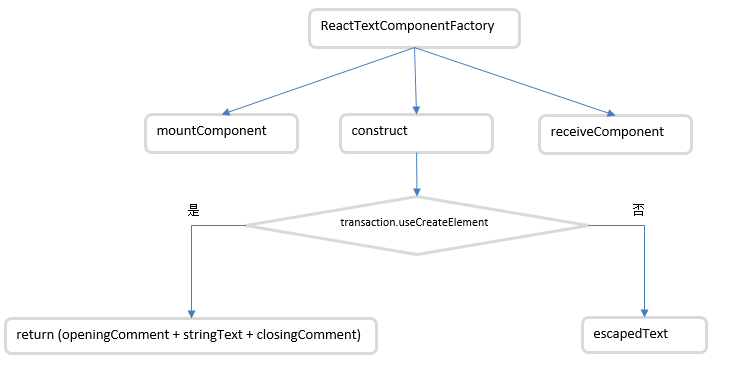
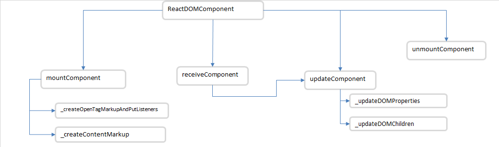
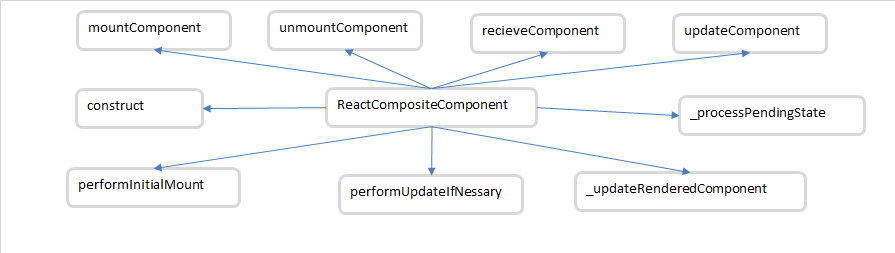

# 4 节点类型分析
## 4.1 文本组件
当node类型为文本节点时是不算Virtual DOM元素。但是为了保证React的渲染的一致性，将其封装为了文本组件ReactDOMTextComponent.
在执行mountComponent()方法时，ReactComponentTextComponent通过transaction.useCreateElement判断该文本是否同createElement方法创建的节点。如果是，则为该节点创建相应的标签和标识domID。这样每个文本节点也能与其他React节点一样拥有自己的唯一标识。同时也拥有了Virtual DOM diff的权利。如果不是通过craeteElement创建的文本，React将不再为其创建`<span>`和domID,而是直接返回文本内容。
<br>
源码路径
[ReactDOMTextComponent](../3源码文件\renderers\dom\shared\ReactDOMTextComponent.js) 
## 4.2 DOM 标签组件
Virtual DOM 涵盖了几乎所有的原生DOM标签。如`<div>, <p> , <span>`等。当开发者使用React时，此时的`<div>`并不是原生的`<div>`标签。它实际是React生成的Virtual DOM对象。只不过标签名称相同。React的大部分工作都在Vitural DOM中完成。对于原生DOM而言，Vitual DOM就像一个隔离的沙盒，因此React的处理并不是直接操作和污染原生的DOM。这样不仅保持了性能的高效和稳定，而且降低了直接操作原生DOM而导致错误的风险。
ReactDOMComponent针对Vitual DOM标签的处理主要分为以下两部分：
- 属性的更新：包括更新样式，更新属性，处理事件等
- 子节点的更新：包括更新内容，更新节点，此部分设计diff算法 
当执行mountComponent()方法时，ReactOMComponent首先会生成标记和标签，通过this.createOpenTagMarkupAndPutListeners(transaction)来处理DOM节点的属性和事件。
- 如果存在事件，则针对当前的节点添加事件代理，即调用enqueuePutListener(this, propsKey, propValue, transaction)
- 如果存在样式，首先会对样式合并操作Object.assign({}, props.style),然后通过CSSPropertyOperations.createMarkupForStyles(propValue, this)创建样式
- 通过DOMPropertyOperations.createMarkupForProperty(propKey, propValue)创建属性
- 通过DOMPropertyOperations.createMarkupForID(this._domID)创建唯一标识
源码路径：
[ReactDOMComponent](../3源码文件\renderers\dom\shared\ReactDOMComponent.js) 
```javascript
 _createOpenTagMarkupAndPutListeners: function(transaction, props) {
    var ret = '<' + this._currentElement.type;
    // 拼凑属性，遍历属性，创建属性
    for (var propKey in props) {
      if (!props.hasOwnProperty(propKey)) {
        continue;
      }
      var propValue = props[propKey];
      if (propValue == null) {
        continue;
      }
      // 针对当前的节点添加事件代理
      if (registrationNameModules.hasOwnProperty(propKey)) {
        if (propValue) {
          enqueuePutListener(this, propKey, propValue, transaction);
        }
      } else {
        // 如果存在样式，首先会对样式合并操作Object.assign({}, props.style)
        if (propKey === STYLE) {
          // 合并样式
          if (propValue) {
            if (__DEV__) {
              // See `_updateDOMProperties`. style block
              this._previousStyle = propValue;
            }
            propValue = this._previousStyleCopy = Object.assign({}, props.style);
          }
          propValue = CSSPropertyOperations.createMarkupForStyles(propValue, this);
        }
        // 创建属性标识， 创建属性
        var markup = null;
        if (this._tag != null && isCustomComponent(this._tag, props)) {
          if (!RESERVED_PROPS.hasOwnProperty(propKey)) {
            markup = DOMPropertyOperations.createMarkupForCustomAttribute(propKey, propValue);
          }
        } else {
          markup = DOMPropertyOperations.createMarkupForProperty(propKey, propValue);
        }
        if (markup) {
          ret += ' ' + markup;
        }
      }
    }
    // For static pages, no need to put React ID and checksum. Saves lots of
    // bytes.
    // 对于静态页面，不需要设置react-id,这样可以节省大量字节
    if (transaction.renderToStaticMarkup) {
      return ret;
    }
    // 设置react-id，创建唯一标识
    if (!this._hostParent) {
      ret += ' ' + DOMPropertyOperations.createMarkupForRoot();
    }
    ret += ' ' + DOMPropertyOperations.createMarkupForID(this._domID);
    return ret;
  }
```
### 4.2.1 属性的更新
当执行receiveComponent方法时，ReactDOMComponent会通过this.updateComponent(transaction, prevElement, nextElement, context)来更新DOM节点。里面第一步调用了thi._updateDOMProperties()方法：该方法中，主要内容时如何高效地把diff作用到新老props上。源码上对该方法的功能的定义是：
- 差分对比更新算法通过探测属性的差异并更新需要更新的 DOM。该方法可能是性能优化上唯一且极其重要的一环。
- 这个方法内部实际是两个循环，第一个循环之前的props,第二个循环遍历下一个props。我们在挂载场景下，lastProps是一个空的。因为第一次时给我们的props赋值。

lastprops 循环
- 1.检查nextProps对象是否包含相同的prop值，相等跳过处理，因为后面会在nextProps循环中处理
- 2.如果props值为STYLE,则我们要重置样式的值，删除事件监听，去除DOM属性名以及DOM属性的值(除去RESERVED_PROPS中的key)。

nextprops 循环
- 1.检查props值是否变化了，也检查下一个值是否与老值不同，相同跳过，不做处理
- 2.对于styles，我们更新从lastProps到现在变化的部分值。然后我们再添加事件监听器(例如onclick等等)
- 3.在处理前一个和下一个 props 的时候，我们会计算 styleUpdates 的配置并且现在把它传递给 CSSPropertyOperations 模块

```javascript
ReactDOMComponent= {
    _updateDOMProperties: function(lastProps, nextProps, transaction) {
        // 属性名称key
        var propKey;
        // 样式名称
        var styleName;
        // 本次样式更新的属性集合
        var styleUpdates;
        // 遍历之前的属性
        for (propKey in lastProps) {
        // nextProps中有该属性，跳过处理，后面会处理
        // 如果属性不是lastProps自有属性或值为空，跳过处理
        if (nextProps.hasOwnProperty(propKey) ||
            !lastProps.hasOwnProperty(propKey) ||
            lastProps[propKey] == null) {
            continue;
        }
        // _previousStyleCopy:之前的style属性对象的备份
        if (propKey === STYLE) {
            // 能够执行进来，表示奔本次nextProps中没有style属性
            var lastStyle = this._previousStyleCopy;
            // 如果属性时lastStyle的自有属性，重置样式的值
            for (styleName in lastStyle) {
            if (lastStyle.hasOwnProperty(styleName)) {
                styleUpdates = styleUpdates || {};
                styleUpdates[styleName] = '';
            }
            }
            // 将_previousStyleCopy重置为null,以备后面存储本轮更新的样式对象
            this._previousStyleCopy = null;
            // 如果是事件监听器（之前设置过的），则删除事件监听器
        } else if (registrationNameModules.hasOwnProperty(propKey)) {
            // 当前属性集中存在
            if (lastProps[propKey]) {
            // 这里的事件监听属性需要去掉监听，针对当前的节点取消事件代理
            deleteListener(this, propKey);
            }
        // 只要不是RESERVED_PROPS上的属性，去除 DOM 属性名以及 DOM 属性值
        } else if (isCustomComponent(this._tag, lastProps)) {
            if (!RESERVED_PROPS.hasOwnProperty(propKey)) {
                // 从DOM上删除掉不需要的属性
            DOMPropertyOperations.deleteValueForAttribute(
                getNode(this),
                propKey
            );
            }
        } else if (
            DOMProperty.properties[propKey] ||
            DOMProperty.isCustomAttribute(propKey)) {
            DOMPropertyOperations.deleteValueForProperty(getNode(this), propKey);
        }
        }
        // 遍历nextProps：对于新的属性，需要写到DOM节点上
        for (propKey in nextProps) {
        // 属性值
        var nextProp = nextProps[propKey];
        // 获取该属性在lastProps中的值（如果是style,则属性值this._previousStyleCopy）
        var lastProp =
            propKey === STYLE ? this._previousStyleCopy :
            lastProps != null ? lastProps[propKey] : undefined;
            // 不是新属性或与旧属性相同
        if (!nextProps.hasOwnProperty(propKey) ||
            nextProp === lastProp ||
            nextProp == null && lastProp == null) {
            continue;
        }
        // 在DOM上需要写的新样式
        if (propKey === STYLE) {
            // 值不为空，则将其转为对象，并赋值给_previousStyleCopy
            if (nextProp) {
            if (__DEV__) {
                checkAndWarnForMutatedStyle(
                this._previousStyleCopy,
                this._previousStyle,
                this
                );
                this._previousStyle = nextProp;
            }
            nextProp = this._previousStyleCopy = Object.assign({}, nextProp);
            } else {
            this._previousStyleCopy = null;
            }
            // 如果之前存在样式属性
            if (lastProp) {
            // 在旧样式中且不再新样式中，清除掉样式
            for (styleName in lastProp) {
                if (lastProp.hasOwnProperty(styleName) &&
                    (!nextProp || !nextProp.hasOwnProperty(styleName))) {
                styleUpdates = styleUpdates || {};
                styleUpdates[styleName] = '';
                }
            }
            //新样式与旧样式都存在，但是值不相同，则更新该样式为新样式
            for (styleName in nextProp) {
                if (nextProp.hasOwnProperty(styleName) &&
                    lastProp[styleName] !== nextProp[styleName]) {
                styleUpdates = styleUpdates || {};
                styleUpdates[styleName] = nextProp[styleName];
                }
            }
            } else {
            // 不存在旧样式则直接写入新样式
            styleUpdates = nextProp;
            }
            // 如果时插件模块的名称
        } else if (registrationNameModules.hasOwnProperty(propKey)) {
            // 添加事件监听的属性
            if (nextProp) {
            enqueuePutListener(this, propKey, nextProp, transaction);
            } else if (lastProp) {
            deleteListener(this, propKey);
            }
        
            // 添加新样式，或者更新旧的同名属性
        } else if (isCustomComponent(this._tag, nextProps)) {
            // 如果是自定义属性并且不是RESERVED_PROPS上的属性，将当前的属性设置到DOM的属性中
            if (!RESERVED_PROPS.hasOwnProperty(propKey)) {
            DOMPropertyOperations.setValueForAttribute(
                getNode(this),
                propKey,
                nextProp
            );
            }
        } else if (
            DOMProperty.properties[propKey] ||
            DOMProperty.isCustomAttribute(propKey)) {
            var node = getNode(this);
            // If we're updating to null or undefined, we should remove the property
            // from the DOM node instead of inadvertently setting to a string. This
            // brings us in line with the same behavior we have on initial render.
            if (nextProp != null) {
            DOMPropertyOperations.setValueForProperty(node, propKey, nextProp);
            } else {
            // 如果更新为ull或undefined，则只需删除属性操作 
            DOMPropertyOperations.deleteValueForProperty(node, propKey);
            }
        }
        }
        // 如果styleUpdates不为空，则设置新样式
        if (styleUpdates) {
        CSSPropertyOperations.setValueForStyles(
            getNode(this),
            styleUpdates,
            this
        );
        }
    },
  ...
 }
```
### 4.2.2 更新子节点
当执行mountComponent方法时，ReactDOMComponent会通过this._createContentMarkup(transaction, props, context)来处理DOM节点的内容。
首先会获取节点内容props.dangerouslySetInnerHTML。如果存在子节点，则通过mountChildren(childrenToUse, transaction, context)对子节点进行初始化渲染。
```javascript
  _createContentMarkup: function(transaction, props, context) {
    var ret = '';
    // 获取子节点渲染出来的内容
    var innerHTML = props.dangerouslySetInnerHTML;
    if (innerHTML != null) {
      if (innerHTML.__html != null) {
        ret = innerHTML.__html;
      }
    } else {
      var contentToUse =
        CONTENT_TYPES[typeof props.children] ? props.children : null;
      var childrenToUse = contentToUse != null ? null : props.children;
      if (contentToUse != null) {
        // TODO: Validate that text is allowed as a child of this node
        ret = escapeTextContentForBrowser(contentToUse);
        if (__DEV__) {
          setAndValidateContentChildDev.call(this, contentToUse);
        }
      } else if (childrenToUse != null) {
        // 对子节点进行初始化渲染
        var mountImages = this.mountChildren(
          childrenToUse,
          transaction,
          context
        );
        ret = mountImages.join('');
      }
    }
    // 是否需要换行
    if (newlineEatingTags[this._tag] && ret.charAt(0) === '\n') {
      return '\n' + ret;
    } else {
      return ret;
    }
  },
```
当执行reveiveComponent方法时，ReactDOMComponent会通过this.updateComponent()方法调用this._updateDOMChildren(lastProps, nextProps, transaction, context)来更新DOM内容和子节点。
- 删除不需要的子节点和内容。
    1. 如果旧节点存在，新节点不存在，则表示当前节点在更新后被删除。此时执行this.updateChildren（null, transaction, context)。
    1. 如果旧的内容存在，而新的内容不存在，说明当前内容早更新后被删除，此时执行this.updateContext('');
- 更新子节点和内容
    1. 如果新节点存在，则更新其子节点。此时执行方法this.updateChildren(nextChildren, transaction, context)。
    1. 如果新的内容存在，则更新内容，此时执行方法this.updateTextContext('' + nextContext)
相关代码如下：
```javascript
_updateDOMChildren: function(lastProps, nextProps, transaction, context) {
    var lastContent =
      CONTENT_TYPES[typeof lastProps.children] ? lastProps.children : null;
    var nextContent =
      CONTENT_TYPES[typeof nextProps.children] ? nextProps.children : null;

    var lastHtml =
      lastProps.dangerouslySetInnerHTML &&
      lastProps.dangerouslySetInnerHTML.__html;
    var nextHtml =
      nextProps.dangerouslySetInnerHTML &&
      nextProps.dangerouslySetInnerHTML.__html;

    // Note the use of `!=` which checks for null or undefined.
    var lastChildren = lastContent != null ? null : lastProps.children;
    var nextChildren = nextContent != null ? null : nextProps.children;

    // If we're switching from children to content/html or vice versa, remove
    // the old content
    var lastHasContentOrHtml = lastContent != null || lastHtml != null;
    var nextHasContentOrHtml = nextContent != null || nextHtml != null;
    if (lastChildren != null && nextChildren == null) {
      // 旧节点存在，新节点不存在，说明当前节点在更新后被删除了
      this.updateChildren(null, transaction, context);
    } else if (lastHasContentOrHtml && !nextHasContentOrHtml) {
      // 旧内容存在，新内容不存在，说明当前内容在更新后被删除了
      this.updateTextContent('');
    }
    // 新节点存在
    if (nextContent != null) {
      // 新节点 不等于 旧节点
      if (lastContent !== nextContent) {
        // 更新内容
        this.updateTextContent('' + nextContent);
      }
    } else if (nextHtml != null) {
      // 更新属性标识
      if (lastHtml !== nextHtml) {
        this.updateMarkup('' + nextHtml);
      }
    } else if (nextChildren != null) {
      // 更新子节点
      this.updateChildren(nextChildren, transaction, context);
    }
  },
```
### 4.3.3 总结
当卸载组件时，ReactDOMComponent会进行一系列操作，如卸载子节点，清除事件监听，清空标识等(unmountComponent方法)。
通过上面的分析，我们可以看到ReactDOMComponent大概分为以下内容：
<br/>

## 4.4 自定义组件
ReactCompositeComponent自定义组件实现了一整套React生命周期和setState机制。因此自定义组件是在声明周期的环境中进行更新属性，内容和子节点的操作。这些更新操作与ReactDOMComponent的操作类似。2.9节中会进行声明周期的知识部分。
