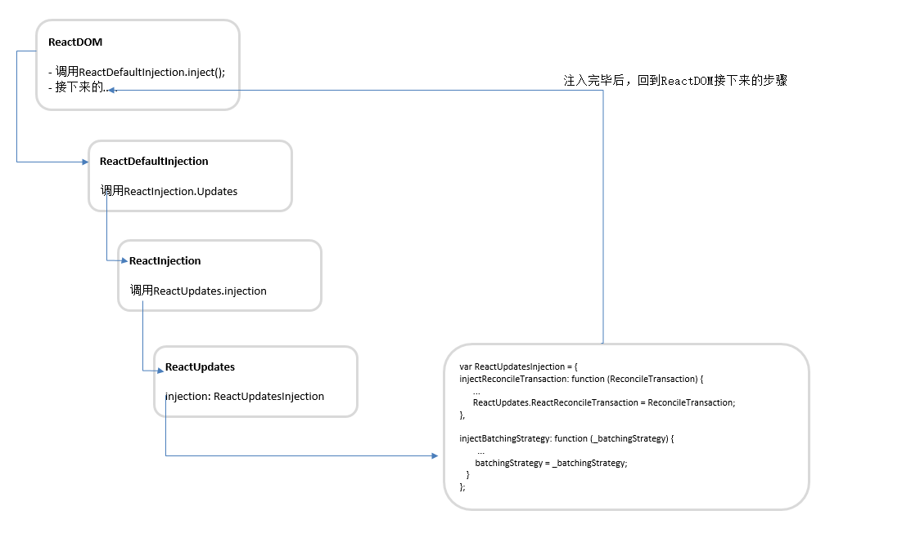

# 5 Inject 注入
在React中，Inject在代码中使用的频率还是比较高，我今天在看代码的时候，看到ReactUpdates文件的如下内容：
```javascript
var ReactUpdatesInjection = {
  injectReconcileTransaction: function (ReconcileTransaction) {
    ...
    ReactUpdates.ReactReconcileTransaction = ReconcileTransaction;
  },

  injectBatchingStrategy: function (_batchingStrategy) {
    ...
    batchingStrategy = _batchingStrategy;
  }
};
// 导出了injection
var ReactUpdates = {
  ReactReconcileTransaction: null,
  injection: ReactUpdatesInjection,
  ...
};

```
这里面给ReactUpdates的ReactReconcileTransaction和batchingStrategy设置了值。但是我并没有找到它的来源是从哪里来的。后来在网上搜索了，在`http://front-ender.me/react/react-transaction.html`这片文章里，提到了`注入`这个概念。我就开始查找源码的，看是从哪里注入的，下面我就以上面代码中的injectReconcileTransaction注入一个事务对象为例子。下面是我查找的结果：
## 5.1 ReactDOM 入口
ReactDOM的路径
- \src\renderers\dom\ReactDOM.js
在这个文件里，我们看到先引入了ReactDefaultInjection模块，然后调用了inject方法。这个具体是什么呢？我们到下一小节详细介绍。这里总之就有了注入的入口。
```javascript
var ReactDefaultInjection = require('ReactDefaultInjection');
ReactDefaultInjection.inject();
```
## 5.2 ReactDefaultInjection
下面我们到ReactDefaultInjection里面去查找是怎么注入的。
```javascript
var ReactInjection = require('ReactInjection');
var ReactDefaultBatchingStrategy = require('ReactDefaultBatchingStrategy');
var ReactReconcileTransaction = require('ReactReconcileTransaction');

// alreadyInjected 注入标签。为true则表示下面的内容正在注入
var alreadyInjected = false;
function inject() {
    // 正在注入则什么也不做
    if (alreadyInjected) {
    return;
    }
    // 当前正在注入标记
    alreadyInjected = true;
    ... 
    // 这里调用了ReactInjection的Updates。 注入我们上面代码中需要的对象
    ReactInjection.Updates.injectReconcileTransaction(
    ReactReconcileTransaction
    );
    ReactInjection.Updates.injectBatchingStrategy(
    ReactDefaultBatchingStrategy
    );
}
module.exports = {
  inject: inject,
};
```
## 5.3 ReactInjection
通过上面ReactDefaultInjection的分析，我们知道是调用了ReactInjection的Updates的方法，并传入了初始化参数。下面我们来看是怎么个情况？
```javascript
var ReactUpdates = require('ReactUpdates');

var ReactInjection = {
    ...
    // 引入了ReactUpdates模块
    Updates: ReactUpdates.injection,
};
module.exports = ReactInjection;
```
终于知道了，原来这个方法就是来自于ReactUpdates的injection.也就是文章开头处ReactUpdates导出的injection。
## 5.4 两个事务源码
我们从上面知道该例子中注入了两个对象。ReactReconcileTransaction和ReactDefaultBatchingStrategy。
- ReactReconcileTransaction路径：src/renderers/dom/client/ReactReconcileTransaction.js
- ReactDefaultBatchingStrategy路径：src/renderers/shared/stack/reconciler/ReactDefaultBatchingStrategy.js

### ReactReconcileTransaction
该包装器的主要作用是：保留实际状态。React将确保在事务的方法调用之前锁住某些可变值，钓完后再释放它们。举个例子：
- SELECTION_RESTORATION： 范围选择(输入当前选择的文本)不会被事务的方法执行干扰(在initialize时选中并在close时恢复)
- EVENT_SUPPRESSION： 阻止因为高级DOM操作(例如临时从DOM中移除文本)而无意间触发的事件(例如模糊/选中焦点)。React在 initialize 时 暂时禁用 ReactBrowserEventEmitter 并在事务执行到 close 时重新启用
- ON_DOM_READY_QUEUEING: 这里处理`componentDidMount`和`componentDidUpdate`。在initialize时重置队列，在close时调用队列的notifyAll
```javascript
// 继承
Object.assign(ReactReconcileTransaction.prototype, Transaction, Mixin);
// 添加到ReactReconcileTransaction缓存池中
PooledClass.addPoolingTo(ReactReconcileTransaction);
module.exports = ReactReconcileTransaction;
```
ReactReconcileTransaction模块不仅拥有Transaction的方法，也有自己的方法。首先定义了三种TransactionWrappers。
```javascript
// 每一种类型里面都有自己的initialize和close方法
var TRANSACTION_WRAPPERS = [
  SELECTION_RESTORATION,
  ON_DOM_READY_QUEUEING, 
];

// 构造函数
function ReactReconcileTransaction(useCreateElement: boolean) {
    // 调用Transaction里面的方法，清除事务标记等。
    this.reinitializeTransaction();
    this.renderToStaticMarkup = false;
    this.reactMountReady = CallbackQueue.getPooled(null);
    this.useCreateElement = useCreateElement;
}
var Mixin = {
    // 返回Wappers集合
    getTransactionWrappers: function() {
    return TRANSACTION_WRAPPERS;
    },
    ...自己的方法
};
```
### ReactDefaultBatchingStrategy
下面的代码中，我们可以看到ReactDefaultBatchingStrategy中使用了一个叫ReactDefaultBatchingStrategyTransaction。它继承于Transaction。并重写了getTransactyionWrappers方法。
Transaction最重要的就是包装器，而这个事务里面有自己的包装器：
- RESET_BATCHED_UPDATES
- FLUSH_BATCHED_UPDATES
```javascript
var RESET_BATCHED_UPDATES = {
    // 空函数
    initialize: emptyFunction,
    // 将isBatchingUpdate标志设置为false
    close: function() {
    ReactDefaultBatchingStrategy.isBatchingUpdates = false;
    },
};
var FLUSH_BATCHED_UPDATES = {
  initialize: emptyFunction,
  // 对脏组件的验证进一步重新渲染。我们调用 mount 方法并将其包装在这个事务中，因为在 mount 执行后，React检查已加载的组件对环境有什么影响并执行相应的更新。
  close: ReactUpdates.flushBatchedUpdates.bind(ReactUpdates),
};
// 该对象也有自己的wrappers。initialize方法都是空的
var TRANSACTION_WRAPPERS = [FLUSH_BATCHED_UPDATES, RESET_BATCHED_UPDATES];

// 初始化事务，设置Wrapper,清空wrapperInitData，将当前的事务标志设置为false
function ReactDefaultBatchingStrategyTransaction() {
    // 这个方法是继承与Transaction
    this.reinitializeTransaction();
}

// ReactDefaultBatchingStrategyTransaction类:继承Transaction事务的子类。重写了的getTransactionWrappers
Object.assign(
    ReactDefaultBatchingStrategyTransaction.prototype,
    Transaction,
    {
    getTransactionWrappers: function() {
        return TRANSACTION_WRAPPERS;
    },
    }
);

// new 了一个事务
var transaction = new ReactDefaultBatchingStrategyTransaction();

// 定义了自己身上的方法
var ReactDefaultBatchingStrategy = {
    // batchedUpdates在执行的标志
    isBatchingUpdates: false,
    /**
    * Call the provided function in a context within which calls to `setState`
    * and friends are batched such that components aren't updated unnecessarily.
    */
    batchedUpdates: function(callback, a, b, c, d, e) {
    var alreadyBatchingUpdates = ReactDefaultBatchingStrategy.isBatchingUpdates;
    ReactDefaultBatchingStrategy.isBatchingUpdates = true;

    // The code is written this way to avoid extra allocations
    if (alreadyBatchingUpdates) {
        return callback(a, b, c, d, e);
    } else {
        return transaction.perform(callback, null, a, b, c, d, e);
    }
    },
};

```


## 5.4 整体流程
ReactDOM中注入操作完成后，还需要回到主流程中，继续执行下面的代码。
