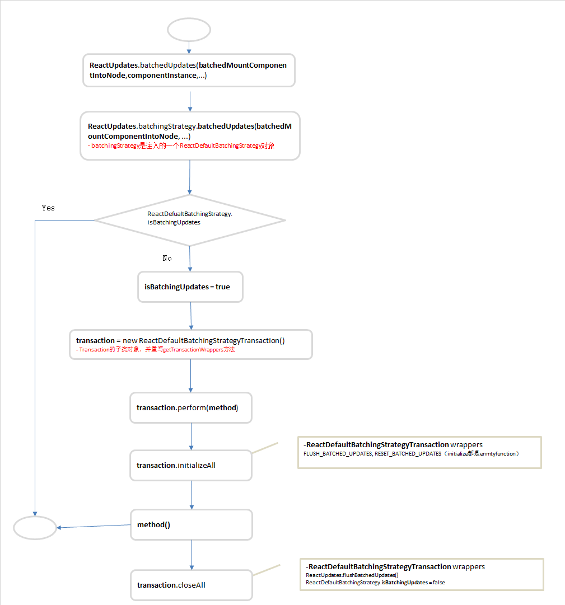
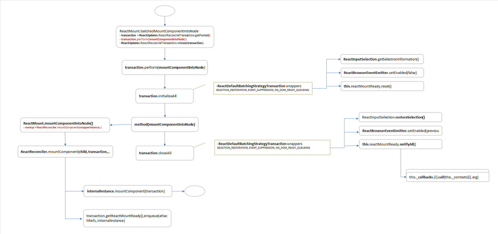

# 6 事务使用
借鉴别人的事务使用总结地方：
- 在差分对比更新渲染步骤的前后，保留输入选取的范围，即使在发生意外错误的情况下也能保存
- 在重排DOM时，停用事件，防止模糊/焦点选中，同时保证事件系统在DOM重拍后重新启动
- 在worker线程完成了差分对比更新算法后，将一组选定的DOM变化直接应用到UI主线程上
- 在渲染新内容后触发任何收集到的componentDidUpdate回调

# 6.1 ReactDefaultBatchingStrategy

下面我们回到具体的案例，这里重新梳理了ReactDefaultBatchingStrategy的执行过程。
在2创建节点章节中，我们在ReactMount._renderSubtreeIntoContainer方法中，调用_renderNewRootComponent。在这个方法中，通过事务,实现了nextElement的子节点转换为React组件的行为。我们先来看从哪里入口：
```javascript
 ReactMount = {
    // 渲染一个新的组件，返回一个ReactComponent
    _renderNewRootComponent: function(nextElement, container, shouldReuseMarkup, context)  {
        ...
        var componentInstance = instantiateReactComponent(nextElement, false);
        // The initial render is synchronous but any updates that happen during
        // rendering, in componentWillMount or componentDidMount, will be batched
        // according to the current batching strategy.
        // 初始render是同步的，但是发送在渲染其间，在componentWillMount或componentDidMount，将按照当前的策略进行批量处理
        // 这里进入了事务的入口
        ReactUpdates.batchedUpdates(batchedMountComponentIntoNode, componentInstance, container, shouldReuseMarkup, context);
        ...
    }
    ...
 }
```
上面的方法中，调用了ReactUpdates.batchedUpdates方法，这和事务有什么关系呢，下面我们引入该部分源码：
```javascript
function batchedUpdates(callback, a, b, c, d, e) {
    ensureInjected();
    return batchingStrategy.batchedUpdates(callback, a, b, c, d, e);
}
var ReactUpdatesInjection = {
    injectReconcileTransaction: function(ReconcileTransaction) {
    ....
    ReactUpdates.ReactReconcileTransaction = ReconcileTransaction;
    },

    injectBatchingStrategy: function(_batchingStrategy) {
    ....
    batchingStrategy = _batchingStrategy;
    },
};
// 导出的ReactUpdates模块
var ReactUpdates = {
  batchedUpdates: batchedUpdates,
  injection: ReactUpdatesInjection,
  ...
};
```
在`5 inject`章节中，我们看到了从ReactDOM进行注入情况，当时注入了ReactUpdates.injection。可以知道当调用ReactUpdates.batchedUpdates，实际是调用了下面的方法。
```javascript
batchingStrategy.batchedUpdates(callback, a, b, c, d, e)
```
那batchingStrategy是什么对象呢？我们知道，ReactUpdates.injection是一个在模块加载的时候，就已经注入到了代码中。我们可以找到`ReactDefaultInjection`文件，查找出注入的对象到底是哪一个？
```javascript
var ReactInjection = require('ReactInjection');
var ReactDefaultBatchingStrategy = require('ReactDefaultBatchingStrategy');
// alreadyInjected 注入标签。为true则表示下面的内容正在注入
var alreadyInjected = false;
function inject() {
    // 正在注入则什么也不做
    if (alreadyInjected) {
    return;
    }
    // 当前正在注入标记
    alreadyInjected = true;
    ... 
    // 这里调用了ReactInjection的Updates。 注入我们上面代码中需要的对象[ReactInjection.Updates就是 ReactUpdates.injection]
    ReactInjection.Updates.injectBatchingStrategy(
    ReactDefaultBatchingStrategy
    );
}
```
终于，我们在`ReactDefaultInjection`中找到了注入的真实对象，也就是上面我们调用`ReactUpdates.batchedUpdates`对于的事务对象，就是`ReactDefaultBatchingStrategy`对象。一个事务对象。它有自己的initialize，close方法。
通过`3事务`，`5 inject`的分析，我们可以知道这个事务的流程应该是如下的样子：
<br/>

## 6.2 ReactReconcileTransaction
下面的代码就是上面的代码的入口，我们知道通过ReactDefaultBatchingStrage.perform()方法的执行，会调用参数`batchedMountComponentIntoNode`这个方法。
```javascript
 ReactMount = {
    _renderNewRootComponent: function(nextElement, container, shouldReuseMarkup, context)  {
        ...
        // 这里将TopLevelWrapper包装为了一个顶层的ReactCompositeComponentWrapper对象，并包含了_instantiateReactComponent方法(该方法是将元素变为ReactCompositeComponentWrapper，ReactDOMComponent,ReactDOMTextComponent)
        var componentInstance = instantiateReactComponent(nextElement, false);
        ReactUpdates.batchedUpdates(batchedMountComponentIntoNode, componentInstance, container, shouldReuseMarkup, context);
        ...
    }
    ...
 }
```
下面我们开始进入`batchedMountComponentIntoNode`这个方法进行解析ReactReconcileTransaction事务。
```javascript
function batchedMountComponentIntoNode(
  componentInstance,
  container,
  shouldReuseMarkup,
  context
) {
  // 对象缓存池中获取事务
  var transaction = ReactUpdates.ReactReconcileTransaction.getPooled(
    /* useCreateElement */
    !shouldReuseMarkup && ReactDOMFeatureFlags.useCreateElement
  );
  // 将mountComponentIntoNode的上下文设置为null,后面的5个作为该方法的参数进行调用
  transaction.perform(
    mountComponentIntoNode,
    null,
    componentInstance,
    container,
    transaction,
    shouldReuseMarkup,
    context
  );
  // 释放缓存池中的对象
  ReactUpdates.ReactReconcileTransaction.release(transaction);
}
```
通过上面的代码进行了3个步骤。我们的重点是在perform方法的调用，里面也执行了调用initializeAll(), 传入函数， close()这三个方法。
- 获取ReactReconcileTransaction事务对象(缓存池中获取，先跳过，只管拿到了一个事务对象)
- 调用perform
- 释放缓存池对象
我们的业务方法mountComponentIntoNode，挂在组件到Node上面。
```javascript
// 挂在这个组件，将它插入DOM
function mountComponentIntoNode(wrapperInstance, container, transaction, shouldReuseMarkup, context) {
  var markerName;
    ...
    // 这就是我们梦寐以求的挂在，该方法会返回我们需要挂着的元素，里面会是递归，最终返回整个节点的markup
    var markup = ReactReconciler.mountComponent(wrapperInstance, transaction, null, ReactDOMContainerInfo(wrapperInstance, container), context, 0 /* parentDebugID */);
    ...
}
```
下面是ReactReconciler的部分源码。就是渲染组件的内容，不进行详细分析，因为与事务关联到这里就差不多了。
```javascript
var ReactReconciler = {
    // initializes the component, renders markup, and registers event listeners.
  mountComponent: function(internalInstance, transaction, hostParent, hostContainerInfo, context, parentDebugID // 0 in production and for roots
  ) {
    // internalInstance是一个ReactCompositeComponent,进行挂在元素
    var markup = internalInstance.mountComponent(transaction,hostParent,hostContainerInfo,context,parentDebugID);
    // 处理ref的队列
    if (internalInstance._currentElement &&
        internalInstance._currentElement.ref != null) {
        transaction.getReactMountReady().enqueue(attachRefs, internalInstance);
    }
    return markup;
  },
```
上面的流程就是ReactReconcileTransaction的执行。下面是整个流程图。
