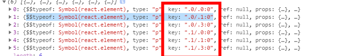
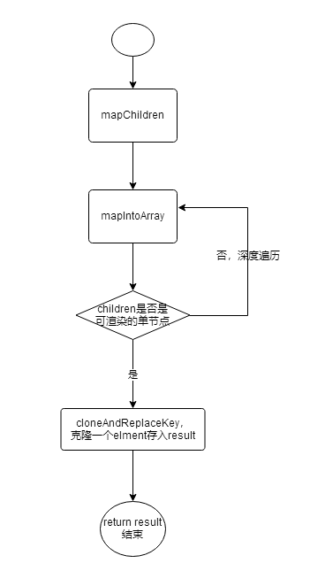
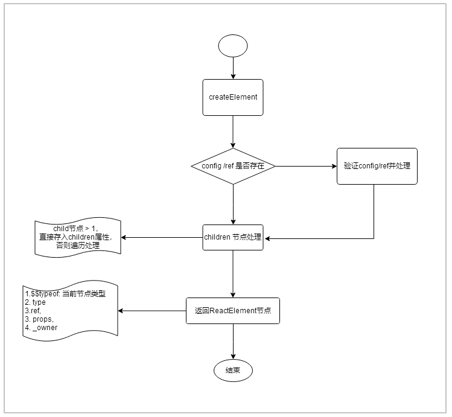
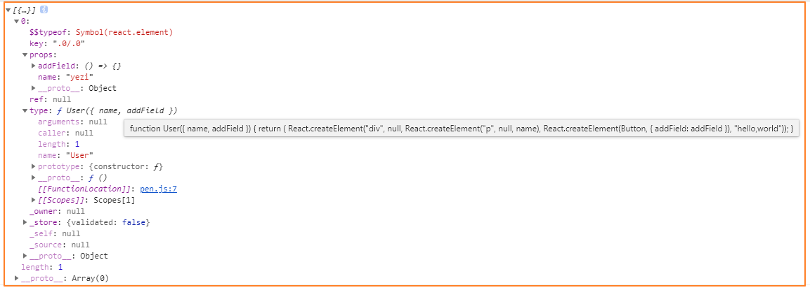

在线编辑：https://codepen.io/pen?editors=0010<br>
在线编辑：https://jsfiddle.net/reactjs/69z2wepo/<br>

## 1. React顶层API 列表
URL: http://react.html.cn/docs/react-api.html#react.children<br>
React的源码实际上并没有多少复杂的内容，它将mobile和pc公用的模块提取出来，而核心其实是在React-Dom和React-native中。在React的源码中，着重关注于React提供给我们的API（我们经常使用的API）。
```javascript
- Children,
- Component,
- PureComponent,
- createElement,
- cloneElement,
- createFactory
- isValidElement,
- createRef,
- createContext,
- forwardRef,
- lazy,
- memo,
- useCallback,
- useContext,
- useEffect,
- useMemo,
- useReducer,
- useRef,
- useState,
```
### 1.1 了解什么是$$typeof
React元素，会有一个$$typeof，来表示该元素是什么类型。该属性是使用2中方式生成，当本地有symbol,则使用symbol生成，没有时使用16进制。
```javascript
export let REACT_ELEMENT_TYPE = 0xeac7;
export let REACT_PORTAL_TYPE = 0xeaca;
export let REACT_FRAGMENT_TYPE = 0xeacb;
....
if (typeof Symbol === 'function' && Symbol.for) {
  const symbolFor = Symbol.for;
  REACT_ELEMENT_TYPE = symbolFor('react.element');
  REACT_PORTAL_TYPE = symbolFor('react.portal');
  REACT_FRAGMENT_TYPE = symbolFor('react.fragment');
  ....
}
```

## 2. React.Children详解
children由`map, forEach, count, toArray, only`组成。看起来和数组的方法很类似，用于处理`this.props.children`这种不透明数据结构的应用程序。由于children几个方法的核心都是`mapIntoArray`,因此这里只对map做分析，其他的可以自己去查看。
### 2.1 React.Children.map
map的使用实例，虽然处理函数给的是多维数组，但是通过map处理后，返回的结果其实被处理成为了一维数组。
- tip: 如果是fragment，将会被视为一个子组件，不会被遍历。
```javascript
class Child extends React.Component {
  render() {
    console.log(React.Children.map(this.props.children, c => [[c],[c],[c]]));
    return (
      <div>{
        React.Children.map(this.props.children, c => [[c],[c],[c]])
      }</div>
    )
  }
}
class App extends React.Component {
  render() {
    return(
      <div>
        <Child><p>hello1</p><p>hello2</p></Child>
      </div>
    )
  }
}
// 渲染结果：
<p>hello1</p>  
<p>hello1</p> 
<p>hello1</p>
<p>hello2</p>
<p>hello2</p>
<p>hello2</p>
```
打印dom结构，每隔节点都各自生成了一个key，下面会解析生成该key的步骤。<br>
<br>
#### 2.1.1 mapChildren
`mapChildren`就是map函数，但是其核心处理方法是`mapIntoArray`。下面我们先看map是如何实现的。
```javascript
/**
 * 如果children是一个数组，则将遍历它，并且将为数组中的每个children调用function函数。
 *
 * @param children 需要遍历的children树。可以是对象，但是必须具备属性$$type的reactChild对象，否则报错
 * @param func 对符合规定的children执行的函数，func会被传入两个参数，符合规定的children以及到当前children的数量。
 *             所有执行func返回的children都会添加到一个数组中，没有嵌套。
 * @param context 一般都为null，如果传入context则func运行中的this为context
 * @return 将children处理过后的有序的结果数组对象
 */
function mapChildren(children: ?ReactNodeList, func: MapFunc, context: mixed, ): ?Array<React$Node> {
  // 如果为null，则直接换回。
  if (children == null) {
    return children;
  }
  // 引用类型，会将对应的child添加到数组中，最终作为map函数的返回值。
  const result = [];
  // 存储当前child中的数量
  let count = 0;
  // 核心处理方法
  mapIntoArray(children, result, '', '', function(child) {
    return func.call(context, child, count++);
  });
  // 返回存储的一维数组
  return result;
}
```
#### 2.1.2 mapIntoArray
mapIntoArray其中会用到key相关的转换函数，我们先来看看其中内部会使用到的哪些函数。
#### 2.1.2.1 escape
将key转换成一个安全的reactid来使用 ，传入的key中所有的'='替换成'=0',':'替换成 '=2',并在key之前加上'$'。
```javascript
function escape(key: string): string {
  const escapeRegex = /[=:]/g;
  const escaperLookup = {
    '=': '=0',
    ':': '=2',
  };
  const escapedString = key.replace(escapeRegex, function(match) {
    return escaperLookup[match];
  });
  return '$' + escapedString;
}
```

#### 2.1.2.2 getElementKey
如果element存在不为null的key，则返回escape(element.key)，否则返回index.toString(36)。
```javascript
function getElementKey(element: any, index: number): string {
  if (typeof element === 'object' && element !== null && element.key != null) {
    return escape('' + element.key);
  }
  return index.toString(36);
}
```
#### 2.1.2.3 escapeUserProvidedKey
用于mapIntoArray深度遍历时，child的key值转换。一般会在第二层递归开始用到。配一个或者多个`/`,并用`$&/`替换。相当于 如果是`/`，那么后面再添加一个`/`。 
```javascript
const userProvidedKeyEscapeRegex = /\/+/g;
function escapeUserProvidedKey(text: string): string {
  return text.replace(userProvidedKeyEscapeRegex, '$&/');
}

// 例如：
let a='aa/a/'
console.log(a.replace(/\/+/g, '$&/'));  // aa//a//
```
#### 2.1.2.4 isValidElement
严重对象是不是一个ReactElement，我们可以看到最终要的就是使用`$$typeof`这个属性判断。
```javascript
export function isValidElement(object) {
  return (
    typeof object === 'object' &&
    object !== null &&
    object.$$typeof === REACT_ELEMENT_TYPE
  );
}
```
#### 2.1.2.5 cloneAndReplaceKey
使用newKey, 克隆一个新的React元素。
```javascript
export function cloneAndReplaceKey(oldElement, newKey) {
  const newElement = ReactElement(
    oldElement.type,
    newKey,
    oldElement.ref,
    oldElement._self,
    oldElement._source,
    oldElement._owner,
    oldElement.props,
  );

  return newElement;
}

const ReactElement = function(type, key, ref, self, source, owner, props) {
  const element = {
    // 这个标签使我们能够唯一地将其标识为React Element
    $$typeof: REACT_ELEMENT_TYPE,
    // Built-in properties that belong on the element
    type: type,
    key: key,
    ref: ref,
    props: props,
    // Record the component responsible for creating this element.
    _owner: owner,
  };
//   ...dev环境下的代码省略
  return element;
};

```
#### 2.1.2.5 mapIntoArray function
终于到了我们的mapIntoArray函数了，下面是对代码的解析。可以先瞅瞅。
-  判断child是什么类型，如果是简单类型，那么直接放入 array数组中作为返回
- 如果是数组，则进行深度遍历，直到解析出element元素为止
```javascript
const SEPARATOR = '.'; // 第一次执行时， nameSoFar 为空，使用这个作为key的一部分传入
const SUBSEPARATOR = ':';

function mapIntoArray( children: ?ReactNodeList, array: Array<React$Node>, escapedPrefix: string, nameSoFar: string, callback: (?React$Node) => ReactNodeList,): number {
    // 判断传入的children是什么类型， 如果是 `undefined` || 'boolean' 处理为 null
    const type = typeof children;
    if (type === 'undefined' || type === 'boolean') {
    children = null;
    }
    // 是否调用callback函数  
    let invokeCallback = false;
    // 判断children是什么类型，当children为null或者非数组, 直接调用函数。
    if (children === null) {
    invokeCallback = true;
    } else {
    switch (type) {
        case 'string':
        case 'number':
        invokeCallback = true;
        break;
        case 'object':
        switch ((children: any).$$typeof) {
            case REACT_ELEMENT_TYPE:
            case REACT_PORTAL_TYPE:
            invokeCallback = true;
        }
    }
    }
    if (invokeCallback) {
    // 调用callback
    const child = children;
    let mappedChild = callback(child);
    // 深度遍历，第一次执行时，nameSoFar为空，SEPARATOR作为一部分传入。第一次生成 key为 `.0` 
    const childKey = nameSoFar === '' ? SEPARATOR + getElementKey(child, 0) : nameSoFar;
    // 如果执行后的数据是一个数组，则递归调用mapIntoArray，将数组变成一维数组，放在 `array` 中返回，也就是 map函数中的 result 变量
    if (Array.isArray(mappedChild)) {
      
      // 生成child 的 escapedPrefix， 第一次生成 `.0/`
      let escapedChildKey = '';
      if (childKey != null) {
        escapedChildKey = escapeUserProvidedKey(childKey) + '/'; 
      }
      mapIntoArray(mappedChild, array, escapedChildKey, '', c => c);
    } else if (mappedChild != null) {
      // 如果是有效的element,使用新的keyclone一个对象，放入array对象中，作为最终map函数返回的结果。
      if (isValidElement(mappedChild)) {
        mappedChild = cloneAndReplaceKey(mappedChild, 
            escapedPrefix + (mappedChild.key && (!child || child.key !== mappedChild.key) ? escapeUserProvidedKey('' + mappedChild.key) + '/'  : '') + childKey,);
      }
      array.push(mappedChild);
    }
    return 1;
  }

 // 递归调用mapIntoArray，无论你嵌套多少层数组，都将被展示位一个平铺数组。
  let child;
  let nextName;
  let subtreeCount = 0; // 当前树种有多少个子节点
  const nextNamePrefix = nameSoFar === '' ? SEPARATOR : nameSoFar + SUBSEPARATOR;

  if (Array.isArray(children)) {
    for (let i = 0; i < children.length; i++) {
      child = children[i];
      nextName = nextNamePrefix + getElementKey(child, i);
      subtreeCount += mapIntoArray(
        child,
        array,
        escapedPrefix,
        nextName,
        callback,
      );
    }
  } else {
      // 如果是可迭代的数据还是还是按照 数组方式 进行深度遍历
      ....
  }
  return subtreeCount;
}
```
#### 2.1.2 React.childen.map 流程图
上面我们看了代码的详细情况，下面我们对流程进行一个绘制，方便我们记住它的处理流程。代码我们是不可能一个字不漏的记住，但是主要是思想，我们需要进行吸收。
<br>
## 3. ReactBaseClasses
ReactBaseClasses中有两个我们时常使用的函数，分别是`React.Component`和`React.PureComponent`,其实这两个函数很类似，在React文件中，该函数很简单，复杂的逻辑全部都在react-dom文件夹中，react-dom其实就是React和UI之间的胶水层，可以兼容多个平台，例如 Web,RN,SSR等。<br>
### 3.1 Component
下面，我们先来看一下源代码，已经对源代码进行了注释，还是比较清晰的。需要注意的是`Component`有refs和updater。updater部分会在react-dom中进行详细分析，此处先进行略过。
```javascript
const emptyObject = {};
function Component(props, context, updater) {
  this.props = props;
  this.context = context;
  // 如果组件有字符串refs,后面会分配一个不同的对象。
  this.refs = emptyObject;
  // 我们初始化一个默认的updater,在真正渲染时会注入一个updater
  this.updater = updater || ReactNoopUpdateQueue;
}
Component.prototype.isReactComponent = {};
// 可以认为this.state是不可变的。可以使用setState来更新state的状态
// 不能保证`this.state`立即更新，因此调用该方法可能会返回旧值
// 多次调用setState，不能保证setState的调用是同步进行，因为它们会分批次执行。你可以提供一个可选的callback,改回调会在setState的调用实际完成后执行
// 当函数提供给setState,将在后面的某个时刻被调用（不同步），它拥有最新的组件参数（state,props,context）,因为该函数是在receiveProps 之后，shouldComponentUpdate之前调用，因此还未分配给当前的组件（此时的组件的参数还未更新）
Component.prototype.setState = function(partialState, callback) {
  this.updater.enqueueSetState(this, partialState, callback, 'setState');
};
// 强制更新，当我们确认组件的某些深层次的数据修改，未调用setState时，我们可以直接调用forceUpdate来更新组件，该方法不会调用 shouldComponentUpdate,但是会调用componentWillUpdate和componentDidUpdate。
Component.prototype.forceUpdate = function(callback) {
  this.updater.enqueueForceUpdate(this, callback, 'forceUpdate');
};
```
### 3.2 PureComponent
PureComponent使用了寄生式组合继承，并在自己身上标记了一个`isPureReactComponent`的标签。而`Componment`身上也有一个`isReactComponent`标签，其实可以看出来，每一个组件都有一个isXXX来表示自己是属于什么组件的。
```javascript
function ComponentDummy() {}
ComponentDummy.prototype = Component.prototype;
/**
 * 进行了浅层比较的组件
 */
function PureComponent(props, context, updater) {
  this.props = props;
  this.context = context;
  this.refs = emptyObject;
  this.updater = updater || ReactNoopUpdateQueue;
}

const pureComponentPrototype = (PureComponent.prototype = new ComponentDummy());
pureComponentPrototype.constructor = PureComponent;
Object.assign(pureComponentPrototype, Component.prototype);
pureComponentPrototype.isPureReactComponent = true;

export {Component, PureComponent};
```
### 4. React.createElement
我们先看一下createElement的流程图。
<br>
#### 4.1 React组件的各种形态
我们先来看一下React组件呈现的各种形态，首先我们的编写react组件时，最终都是通过Bable编译为JSX,而在JSX中调用了`React.createElement`。因此有三种状态：<br>
- 我们编写的组件形态
```javascript
function User({name, addField}) {
    return (
        <div>
            <p>{name}</p>
            <Button addField={addField}></Button>
            hello,world
        </div>
    );
}
```
- 编译为JSX的形态，可以看到最终调用的还是`React.createElement`方法。
```javascript
"use strict";

function User( { name, addField } ) {
  return React.createElement(
        "div",  
        null, 
        React.createElement("p", { id: "pid" }, name), 
        React.createElement(Button, { addField: addField }), 
        "hello,world"
    );
}
```
- ReactElement形态， 最终返回的`User`组件的React节点如下：<br/>
<br>
### 4.2React.createElement 源码分析
OK,那我们就可以来看一下编译为ReactElement的过程是怎样的。首先就是调用`createElement`方法了。
```javascript
const RESERVED_PROPS = {
  key: true,
  ref: true,
  __self: true,
  __source: true,
};
// 跟踪当前的所有者，拥有当前正在被构造的组件
const ReactCurrentOwner = {
  current: (null: null | Fiber), // ReactComponent
};
/*
*创建并返回一个新的ReactElement
*/
export function createElement(type, config, children) {
  let propName;
  // 存储从config中传进来的props参数名称
  const props = {};

  let key = null;
  let ref = null;
  let self = null;
  let source = null;

  if (config != null) {
    // 验证ref
    if (hasValidRef(config)) {
      ref = config.ref;
    }
    // 验证key
    if (hasValidKey(config)) {
      key = '' + config.key;
    }
    self = config.__self === undefined ? null : config.__self;
    source = config.__source === undefined ? null : config.__source;
    // 出来key,ref,__self,__soource,其余属性保存在props中
    for (propName in config) {
      if (hasOwnProperty.call(config, propName) && !RESERVED_PROPS.hasOwnProperty(propName)
      ) {
        props[propName] = config[propName];
      }
    }
  }

  // 该部分是children的计算与存储，函数参数除了type 和config,就是children节点参数（可以有N个child）。
  const childrenLength = arguments.length - 2;
  if (childrenLength === 1) {
    props.children = children;
  } else if (childrenLength > 1) {
    const childArray = Array(childrenLength);
    for (let i = 0; i < childrenLength; i++) {
      childArray[i] = arguments[i + 2];
    }
    props.children = childArray;
  }
  // 返回ReactElement节点
  return ReactElement(
    type,
    key,
    ref,
    self,
    source,
    ReactCurrentOwner.current,
    props,
  );
}
```
### 4.3 ReactElement 源码
```javascript
// self: 临时帮助对象，用于检测调用React.creatElement时的`this`和`owner`不同的地方...在开发环境中使用，因此此处不进行详解
const ReactElement = function(type, key, ref, self, source, owner, props) {
  const element = {
    // 这个标签使我们能够唯一标识为React Element的类型
    $$typeof: REACT_ELEMENT_TYPE,
    // 属于元素的内置属性： 从上面图中打印看出，type是组件的jsx语法，但传入的参数看起来是标签(div，span等)
    type: type,
    key: key,
    ref: ref,
    props: props,
    _owner: owner, // 记录负责创建此元素的组件。当前的操作React
  };
  return element;
};
```
## 5 createRef
创建ref很简单，如果想使用ref,只需要拿current对象即可。另外，对于函数式组件不可以使用ref,可以参考 [React官网](https://react.docschina.org/docs/refs-and-the-dom.html#refs-%E4%B8%8E%E5%87%BD%E6%95%B0%E5%BC%8F%E7%BB%84%E4%BB%B6)。
```javascript
export function createRef(): RefObject {
  const refObject = {
    current: null,
  };
  return refObject;
}

```
如果要在函数式组件中使用ref,可以使用`forwardRef`，或者将组件转为class组件。
```javascript
export function forwardRef<Props, ElementType: React$ElementType>(
  render: (props: Props, ref: React$Ref<ElementType>) => React$Node,
) {
  const elementType = {
    $$typeof: REACT_FORWARD_REF_TYPE,
    render,
  };
  return elementType;
}
```
forwardRef的使用详细使用可以参考[掘金文章](https://juejin.im/post/5c0dd44b51882530e4617e92)