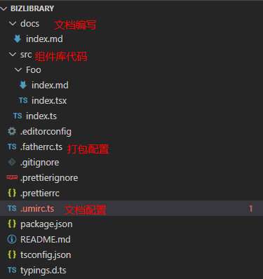
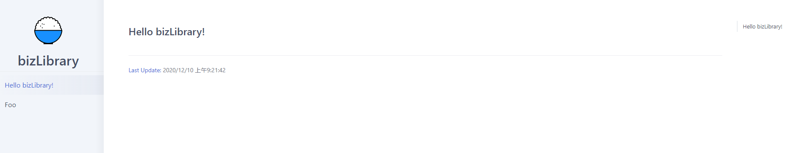
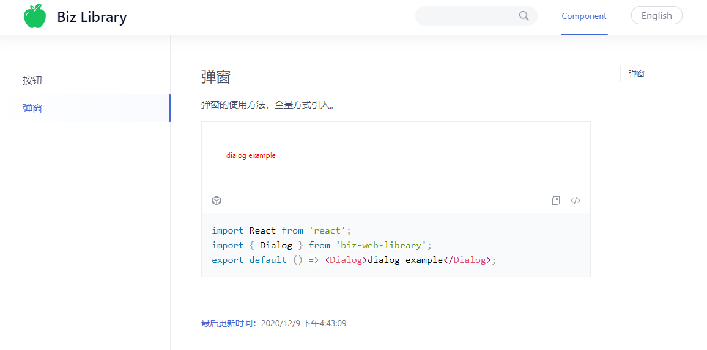
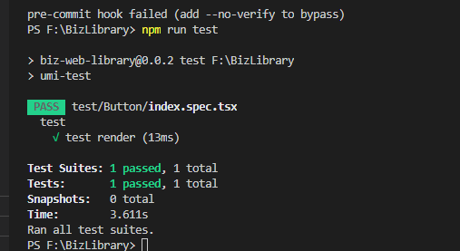
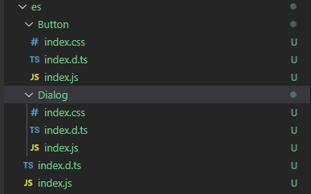
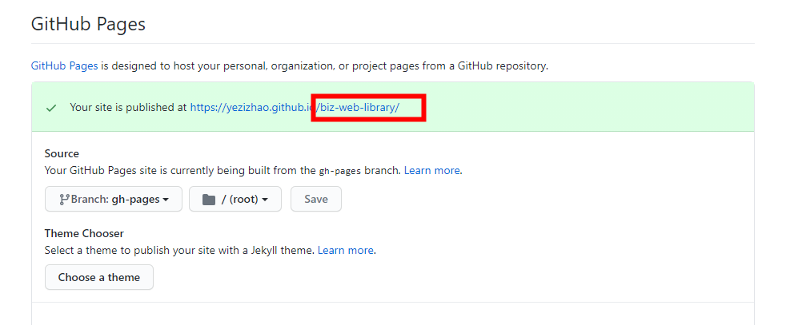

## 1. 背景
目前我所在业务组是负责后台管理系统，但是对于使用的组件并没有引入第三方库，全有开发人员自己编写。但是对于Common Project还是处于拷贝的方式。然后萌生了对公共组件库进行管理的想法。这个方式有什么好处呢？<br>
- 能够沉淀组内组件，避免重复造轮子的缺陷。
- 统一维护组件，使不同开发人员遵循同一套使用标准。
- 自己的UI库，能够保证系统视觉和交互一致性。
- 提高产品研发效率，资源重复利用，减少重复开发。
- 项目统一设计、编码语言规则，沟通更轻松。
- 专注业务，在视觉要求方面减少花费时间，争取更好的时间写业务。<br>

## 2. 技术选择(dumi + father-build)
当然，在网上进行查询，发现很多很多人都做过类似的事情，我们可以借鉴很多的经验。有人是自己编写的配置。而我在芸芸博客中，筛选了满足我的条件的技术(dumi + father-build)。为何选择它呢？<br>
- dumi 是蚂蚁金服插件化的企业级前端框架，专门为组件开发场景而生的文档工具。与father的文档打包相比，构建编译速度更快，更友好。
- father-build属于father(集文档与组件打包一体的库)的一部分。专注于组件打包。<br>
为什么我不选择自己编写呢？不仅仅是搭建时间的成本，还有后续优化等，目前我没有自信会比专注于该业务的人做的更好。后续也会去好好学习一下大神是如何实现的，但是迫在眉睫的是我希望完成我的组件库搭建，因此先偷个小懒了^^。

## 3. 文档库搭建
`@umijs/create-dumi-lib`是基于Umi的文档工具，开箱即用，专注于开发和文档编写。运行以下命令，会初始化项目结构。
```javascript
$ npm init
$ npx @umijs/create-dumi-lib
```

### 3.1 文档目录结构
<br>

#### .umirc.ts
是umi项目的配置文件，而dumi是umi在组件库开发中的一个最佳实践，但是它本质还是一个umi插件，因此只要umi的配置，都是可以在dumi中正常使用的。
#### .fatherrc.ts
是father-build的配置文件，组件库如何编译以及编译后产生的类型都需要在这里使用。

#### 启动
运行`npm start`即可启动。
<br>

## 4. 编写组件以及引用文档

编写一个简单的实例和docs。

### 4.1 配置官网logo（.umirc.ts）

tips: 资源需要放在`public`目录下面。例如`public/image/xxx.png`。不然会访问不了。
```javascript
// .umirc.ts

import { defineConfig } from 'dumi';
let BaseUrl = ''
export default defineConfig({
    mode: 'site', // site: 站点模式（导航头 + 左侧菜单 + 右侧内容）。 doc：文档
    title: 'Biz Library', // 组件库名称
    favicon: BaseUrl + '/images/favicon.ico', 
    logo: BaseUrl + '/images/photos.svg',
    description: '用于Biz Web Dev 前端组件开发。',
});
```

### 4.2 编写组件与组件文档
#### component：/src/Dialog/index.tsx
```javascript
import React, { FC } from 'react';
import './index.less';
interface DialogProps {
  onClick?: React.MouseEventHandler<HTMLElement>;
  type?: 'default' | 'primary' | 'secondary';
  disabled?: boolean;
}
const Dialog: FC<DialogProps> = ({ children, onClick, type = 'dialog' }) => {
  return (
    <div className={'biz_dev_dialog'} onClick={onClick}>
      {children}
    </div>
  );
};
export default Dialog;
```

#### css：/src/Dialog/index.less
```css
@btn-prefix-cls: ~'biz_dev';

.@{btn-prefix-cls} {
  &_dialog {
    padding: 6px 16px;
    font-size: 12px;
    min-width: 64px;
    color: red;
  }
}
```

#### 文档编写
- 组件文档en： docs/component/dialog.md
- 组件文档中文： docs/component/dialog.zh-CN.md
- 包名biz-web-library： 是package.json 中的name
```javascript
import React from 'react';
import { Dialog } from 'biz-web-library'; // 可通过包名引入，而不是相对路径
export default () => <Dialog>dialog example</Dialog>;
```

#### 启动
运行`npm run start`,至此本地的开发环境就已经完成啦，你可以一边开发一边调试了。
<br>

## 5. CI 测试
测试对于组件库来说，是必不可少的。在father-build 中，集成了jest用于单元测试。但是对于React组件进行测试还需要进行额外的配置。

#### jest.config.js
```javascript
module.exports = {
  setupFiles: ['<rootDir>/testSetUp.js'],
  testEnvironment: 'jsdom', // default: jsdom, 可配置： node
};
```
#### testSetUp.js

记得安装 `enzyme-adapter-react-16`和`enzyme`。
```javascript
import { configure } from 'enzyme';
import Adapter from 'enzyme-adapter-react-16';
configure({ adapter: new Adapter() });
```

#### 编写测试用例
```javascript
import React from 'react';
import { render } from 'enzyme';
import Button from '../../src/Button';

describe('test', () => {
	it('test render', () => {
		let Wrapper = render(<Button>case one</Button>);
		expect(true).toBeTruthy();
	})
})
```
运行`npm run test`,执行通过。<br>

<br>

## 6. 全量加载 和 按需加载
我们知道，很多组件库是将组件统一打包，通过以下方式引入。默认情况下`father-build`也是这样的。

```javascript
import { componentName } from 'biz-library';
```

常见的库(例如antd)是通过配置babel插件实现按需引入。而我希望我的组件库可以不通过配置插件，即可实现按需引入。
```javascript
import componentName from 'biz-library/componentName';
```

### 6.1 实现按需加载

#### .fatherrc.ts
作为`father-build`的配置文件，用于配置组件库被如何编译和编译产物的类型。一般设置 `esm: 'rollup'`就够用了。但它缺点是会打包在一起，无法实现按需引入。因此我采用`esm: 'babel'`。
```javascript
export default {
  target: 'browser',
  esm: 'babel',
  lessInBabelMode: true, // babel 模式下做 less 编译
  entry: ['src/Button/index.tsx', 'src/Dialog/index.tsx'],
  autoprefixer: {
    browsers: ['ie>9', 'Safari >= 6'],
  },
  pkgs: [
    // 组件依赖构建顺序， 例如 a组件依赖于b组件，那么需要先编译 b,在编译a,则 这里可以控制组件编译顺序
  ],
};
```

#### tsconfig.json
其他属性没什么好说的，` "declaration": true`是必须配置的，生成`typescript`项目中`.d.ts`后缀的文件。
```javascript
{
  "compileOnSave": true,
  "compilerOptions": {
    "target": "es6",
    "module": "esnext",
    "lib": ["es2018", "dom"],
    "rootDir": "./",
    "outDir": "es",
    "moduleResolution": "node",
    "importHelpers": true,
    "jsx": "react",
    "esModuleInterop": true,
    "sourceMap": true,
    "baseUrl": "./",
    "strict": true,
    "declaration": true, // 只有declaration设置为true才能生成.d.ts后缀的文件
    "allowJs": true,
    "forceConsistentCasingInFileNames": true,
    "noImplicitReturns": true,
    "noImplicitThis": true,
    "noImplicitAny": true,
    "strictNullChecks": false,
    "suppressImplicitAnyIndexErrors": true,
    "noUnusedLocals": true,
    "experimentalDecorators": true,
    "skipLibCheck": true,
    "paths": {
      "@/*": ["src/*"],
      "@@/*": ["src/.umi/*"],
      "@@@/*": ["docs/*"]
    },
    "allowSyntheticDefaultImports": true,
    "typeRoots": ["typings", "node_modules/@types"]
  },
  "include": ["src/**/*", "dosc/**/*"],
  "exclude": [
    "node_modules",
    "lib",
    "es",
    "dist",
    "typings",
    "**/__test__",
    "test"
  ]
}
```


#### 打包发布至npm
运行`npm run build`命令，本地打包后，将组件一个个拆分了的，为我们按需引入做好了铺垫。<br>
<br>

运行`npm run release`，将其发布到npm上，便可以通过npm进行安装，在项目中进行使用。发布至npm需注意`version: 1.0.0`每一次不能相同。<br>
```javascript
import React from 'react';
import Button from 'biz-web-library/es/Button';
function App() {
  return (<Button>click me</Button>);
}
export default App;
```

#### 打包路径修改
从上面的使用方式可以看出，`Button`并没有在`biz-web-library`的下面，我其实期待按需引入使用以下方式：
```javascript
import Button from 'biz-web-library/Button';
```
经过查询，终于找到了一个比较优雅的使用方式，[Click Me](https://stackoverflow.com/questions/38935176/how-to-npm-publish-specific-folder-but-as-package-root)<br>
在`package.json`中配置以下语句，然后直接运行`npm publish`即可。
```javascript
"prepublishOnly": "npm run build && cp -r ./es/* . && rm -rf ./es",
"postpublish": "git clean -fd",
"release": "npm publish",
```

## 7. 发布组件官网 到 GitHub Pages
至此，我希望的组件库编写已经完成，既可以全量引入，也可以按需引入。那么如何让别人能够看到我们的组件库呢。这里我使用`github pages`。

#### github 配置
运行`npm run deploy`可将文档部署至github的`github pages`上。这相当于你组件的官网。请确保`github`组件仓库的设置如下：(Path: Settings => Options => GitHub Pages:)<br>
<br>

我们可以看到生成的地址`https://yezizhao.github.io/biz-web-library/`,它包含了厂库的名称，因此你访问改地址时，会发现`js`和`css`出现`404`不能访问了。此时不要慌，说明打包产生的路径不正确。在`.umirc.ts`文件中，以以下方式编写,然后在重新运行`npm run deploy`进行发布即可。
```javascript
import { defineConfig } from 'dumi';

let BaseUrl = '/biz-web-library'; // 仓库的路径

export default defineConfig({
  // 网站描述配置
  mode: 'site',
  title: 'Biz Library',
  favicon: BaseUrl + '/images/favicon.ico',
  logo: BaseUrl + '/images/photos.svg',
  description: '用于Biz Web Dev 前端组件开发。',

  // 打包路径配置
  base: BaseUrl,
  publicPath: BaseUrl + '/', // 打包文件时，引入地址生成 publicPath/xxx.js
  outputPath: 'docs-dist',
  exportStatic: {}, // 对每隔路由输出html
  dynamicImport: {}, // 动态导入

  hash: true, //加hash配置，清除缓存
  manifest: {
    // 内部发布系统规定必须配置
    fileName: 'manifest.json',
  },

  // 多国语顺序
  locales: [
    ['en-US', 'English'],
    ['zh-CN', '中文'],
  ],

  // 主题
  theme: {
    '@c-primary': '#16c35f',
  },
});

```

#### dumi css丢失
现在，你的网页可以访问了，但是此时的css却不见了。其实是因为 `md`中引入的css是指向构建后的目录，不能直接指向源码目录。我是在`package.json`中配置`sideEffects`解决了该问题。
```javascript
"sideEffects": ["./src/**/*.less"],
```

## 78. 结束语
至此，一个简易的组件库开发环境和发布环境就已经搭建完成，但是上面的例子其实是用的公网的github。而公司内部组件并不应该发布到公网，因此你还需要搭建一个内部的私有npm。就不进行描述了。<br>
- 私有库搭建：https://www.jianshu.com/p/a0216d791dbf。
- nrm: https://www.jianshu.com/p/94f788e4c0c9。<br>

example实例：https://github.com/YeziZhao/biz-web-library/tree/master