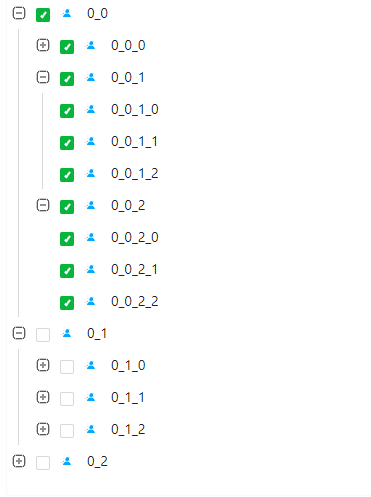
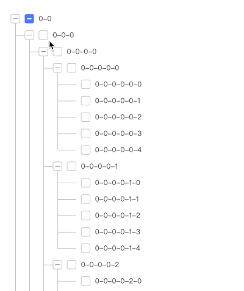
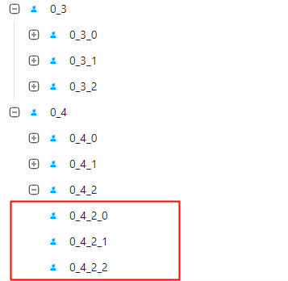

# 1. 背景
之前在重构ECMS项目的所涉及到的组件中，Tree组件占据了半壁江山。而该组件的产生，也是由该项目演化未来。虽然该项目后来停止了，但是所累积的设计经验确是延续下来了的。在组件库中，我结合了虚拟列表，将Tree组件再一次进行了升华，让该组件成为了可以处理上万条数据的高性能组件。下面，我就开始详细介绍如何进行该组件的开发，我们一起看看吧。<br>
<br>

# 2. 高性能Tree实现的原理

## 2.1 old 思维
当使用Tree组件时，可以知道它是一个如下结构的数据。数组内进行嵌套 children,一层一层嵌套下去。如果数据量不大，其实直接遍历该结构，结合CSS 生成相应的缩进格式，就能够实现一个可用的Tree组件。
```javascript
let treeData = [
  {
    key: '0',
    title: 'parent 0',
    children: [
      {
        key: '0-0',
        title: 'children 0-0',
         children: [
          {
            key: '0-0-0',
            title: 'children 0-0-0',
          },
        ],
      },
      {
        key: '0-1',
        title: 'children 0-1',
      },
    ],
  }
];
```
但是，有时候如果你需要显示的数据量比较大时，就不能满足了。例如公司组织架构，树节点可能达到成千上万，Tree组件本来也有比较复杂的交互逻辑，内部计算可能涉及地柜等等，这里，我借助网上一个小视频，该小视频表示在节点为741的Tree组件交互时，就已经开始明显卡顿了。当然，这个视频的效果其实就是根据最`treeData`结构实现的建议tree，且在开发过程中 未减少不必要的渲染导致的。<br>
<br>

## 2.2 改进思维
其实Tree列表将children-parent 关系抛开，直接看呈现效果，它其实也就是一个列表。在组件系列中，我分享过Virtual List。这里我们可以将Tree数据结构转换后，适用到Virtual List吗？<br>
答案当时是 `YES`。我们将上面的数据结构，利用dom进行嵌套结构和平铺处理两种情况，进行展示：<br>

<strong>平铺之前</strong>
```html
<ul>
  <li>
    <div>0</div>
    <ul>
      <li>
        <div>0-0</div>
        <ul>
          <li><div>0-0-0</div></li>
        </ul>
      </li>
      <li><div>0-1</div></li>
    </ul>  
  </li>
</ul>
```
<strong>平铺之后</strong>

```html
<ul>
  <li><div>0</div></li>
  <li><div>0-0</div></li>
  <li><div>0-0-0</div></li>
  <li><div>0-1</div></li>
</ul>
```

此时，平铺之后的数据，我们能很好的利用virtual list 实现大数据渲染。但是这种结构，怎么来确保层级关系缩进呢？我们只能在数据结构上处理该关系。接下来我们就开始实现吧。<br>

# 3. 组件实现

## 3.1 数据列表字段

上面已有传入的数据结构，其中 `key, title, icon, children, disable` 这几个属性是传入组件时，数据的结构。当我们进行了转换后，添加了其他的属性。最终形成的每一条item实际结构如下：
```javascript
export interface TreeItem {

  // 外部传入字段
  key: string | number; // 每条数据唯一key
  title: string; // 数据的显示内容
  icon: any; // 自定义显示图标
  children?: Array<TreeItem>; // 所有child集合
  disabled: boolean; // 是否禁用状态

  // 自动生成字段
  isLeaf?: boolean; // 是否是最后一个叶子节点
  deep?: number; // 节点深度
  expand?: boolean; // 是否展开
  parentId?: string | number;
  visible?: boolean; // 是否显示
  listIndex?: number; // 列表中对应的索引
  isLastSiblingCollection?: Array<number>; // 节点如果没有下一个兄弟节点，记录该节点的deep,放入 child节点的isLastSiblingCollection集合中（不显示showLine）
  checked?: CheckedType; // 是否复选框选中
  selected?: boolean; // 是否label选中
}
```
在我的计算中， `listIndex`字段将在后面的各个运算中占着举足轻重的地位。它是每一条数据，在平铺列表中的索引key。

## 3.2 组件参数
这里我们先把外部参数整理一遍，这些参数会参与组件的计算。其实只要阅读参数，就知道它们的作用是什么了，这里分为6大类型参数：
- 原始children 结构data数据
- 展开关闭相关参数
- 复选框相关参数
- 节点点击相关参数
- 虚拟列表参数
- css相关参数

```javascript
export interface TreeProps extends ConfigProviderProps {
  // 原始children 结构data数据
  treeData: Array<TreeItem>;
  
  // 展开关闭相关参数
  expandedKeys?: Array<string | number>; // expand的节点id集合
  defaultExpandedKeys?: Array<string | number>; //// 默认打开的id
  onExpand?: (expandedKeys: Array<number | string>, extrea?: any) => void;

  // 复选框相关参数
  checkable?: boolean; // 是否使用复选框
  checkedKeys?: Array<string | number>; // 选中项id(受控组件，优先于defaultCheckedKeys使用)
  defaultCheckedKeys?: Array<string | number> // 默认选中的id
  checkStrictly?: boolean; // checkable 状态下节点选择完全受控（父子节点选中状态不再关联）
  onCheck?: (checkedKeys: Array<string | number>, extrea?: CheckExtrea) => void; // 选中的事件

  // 节点点击相关参数
  multiple?: boolean; // 支持节点select多选
  selectedKeys?: Array<string | number>; // 是否选中
  onSelect?: (checkedKeys: Array<string | number>, extrea: CheckExtrea) => void; // 选中的事件
  defaultSelectedKeys?: Array<string | number> // 默认选中的id,用于非受控组件

  isVirtual?: boolean; // 是否使用虚拟列表

  // css界面显示相关参数
  className?: string; // 自定义class名称
  style: Object; // 自定义style
  switcherIconUp?: any, // expand切换图标Up
  switcherIconDown?: any, // expand切换图标Down
  showLine?: boolean; // 是否显示带线样式结构
}
```

## 3.2 数据列表转换
将children嵌套数据转换为平铺数据。这个操作应该在`constructor`中完成。

```javascript
class Tree extends React.PureComponent<TreeProps, TreeState> {
  constructor(props: TreeProps) {
    super(props);
    // step1: 读取props 中的所有相关计算的参数

    // step2: 如果外部传入了参数，应该赋值
    let currentExpandKeys = getDefaultKeys(expandedKeys, defaultExpandedKeys);
    let currentSelectedKeys = getDefaultKeys(selectedKeys, defaultSelectedKeys);

    // step3: 平铺数据
    const { treeItems, currentCheckedKeys, indeterminateKeys } = flatten(....一系列参数);

    this.state = {
      treeData, // 存放外部props传入的treeData
      currentExpandKeys, // 存放当前打开的节点
      showItems: getShowItems(treeItems), // 存放目前列表中显示的项

      treeItems, // 平铺节点list
      currentCheckedKeys, // 当前被选中的项
      currentSelectedKeys, // 计算出来的 当前select项
      indeterminateKeys, // 半选状态下的key
    };
  }
}
```
### 3.2.1 flatten 平铺函数

flatten 将遍历外部传入的数据列表，再对每一条数据进行递归。处理为平铺数据。其他属性并没有什么特殊的，这里主要介绍2个比较重要的

- checkStrictly： 该参数是外部传入，用于控制点击复选框时，状态要不要与child,parent节点相关联
- isLastSiblingCollection：从最顶上面的例子图片我们可以知道，左侧有一条线连起来的。但是如果节点没有下一个兄弟节点时，不应该有左侧线。这个集合存放当前节点哪些位置不渲染左侧线。
```javascript
/**
 * 用于将传入的数组（children结构）修改为平级的
 * @param treeData // origin 数据，需要被展开的数据
 * @param treeItems // 存放展开的数据
 * @param expandedKeys // expand需要为true的节点
 * @param currentCheckedKeys // 当前状态为选中的key集合（计算结果）
 * @param indeterminateKeys // 状态为半选的key集合
 * @param checkedKeys // 默认选中的key
 * @param deep // 节点层级
 * @param parentId // 节点parent
 * @param visible // 节点是否可见
 * @param isLastSiblingCollection 从祖先算起，是最后一个节点的集合
 * @param checkStrictly: checkable 状态下节点选择完全受控（父子节点选中状态不再关联）
 * @param selectedKeys: 节点Label是否被选中
 */
export const flatten = (
  treeData: Array<TreeItem> = [], 
  treeItems: Array<TreeItem> = [], 
  currentCheckedKeys: Array<string | number> = [],
  indeterminateKeys: Array<string | number> = [],
  expandedKeys: Array<string | number> = [],
  checkedKeys: Array<string | number> = [],
  deep: number = 0,
  parentId: string | number = undefined,
  visible: boolean = false,
  isLastSiblingCollection: Array<number> = [],
  checkStrictly: boolean = false,
  selectedKeys: Array<string | number> = [],
) => {

  treeData.map(({children, ...item}: TreeItem, index: number) => {
    let hasChild = children?.length > 0;

    // 1： 处理节点状态
    // 1.1： expand 是否展开， selected 表示label是否选中
    let expand = expandedKeys.includes(item.key), 
    selected = selectedKeys.includes(item.key), 
    checked;

    // 1.2：复选框是否选中
    if (checkStrictly) {
      checked = checkedKeys.includes(item.key) ? CheckedType.ALL_CHECKED : CheckedType.NOT_CHECKED;
    } else {
      checked = isNull(item.checked) ? getDefaultChecked(children, item.key, checkedKeys) : item.checked; 
    }

    // 2. 生成一个新的平铺节点元素，放入 treeItems
    treeItems.push({ 
      ...item,  // 传入值的属性
      isLeaf: !hasChild, // 是否是最后一个叶子节点
      deep, // 节点的层次
      expand, // 状态是否展开
      parentId, 
      visible, // 显示状态（显示或隐藏）
      listIndex: treeItems.length, // 平铺后，该节点存放在treeItems里的索引
      isLastSiblingCollection,
      checked,
      selected,
      children,
    });

    // 3. 处理 全选半选节点
    checked === CheckedType.ALL_CHECKED && currentCheckedKeys.push(item.key);
    checked === CheckedType.INDETERMINATE_CHECKED && indeterminateKeys.push(item.key);

    // 4. 递归处理， 有child节点，且默认需要展开
    if (hasChild) {

      // 4.1: 处理 deep
      let childDeep = deep + 1;

      // 4.2: 下一个兄弟节点是否存在: 不存在时，放入isLastSiblingCollection,用于隐藏左侧line
      isLastSiblingCollection = 
        (!treeData[index + 1]) 
          ? isLastSiblingCollection.concat(deep) 
          : isLastSiblingCollection;

      // 4.3: 递归调用处理
      flatten(children, treeItems, currentCheckedKeys, indeterminateKeys, expandedKeys, checkedKeys, childDeep, item.key, expand, [...isLastSiblingCollection]);
    }
  })
 
  return {
    treeItems,
    currentCheckedKeys,
    indeterminateKeys,
  };
};
```

### 3.2.2 getDefaultChecked 节点默认选中计算
在flutten函数中，在计算的checked时使用到了该函数。它主要是用于计算节点的选中状态。
- ALL_CHECKED： 全选状态
- INDETERMINATE_CHECKED： 半选状态
- NOT_CHECKED： 完全不选中<br>

状态计算：
- 如果节点是默认选中（外部传入），那么child状态需要全选
- 节点未被选中，查看child是否有选中的，有则是半选，没有则是未选中
```javascript
const getDefaultChecked = (children: Array<TreeItem>, key: string | number, checkedKeys: Array<string | number>) => {

  // 如果key 输入外部输入默认选中的，那么child也需要全选。
  if (checkedKeys.includes(key)) {
    setChildrenChecked(children);
    return CheckedType.ALL_CHECKED;
  }

  // 不存在，则需要判断子孙节点，是否存在选中的，有返回半选状态，没有返回not check
  let count = 0, keys = getChildrenKeys(children, []);
  for(let i = 0; i < keys.length; i++) {
    if (checkedKeys.includes(keys[i])) {
      count++;
    }
  }

  let checkStatus = count === 0
    ? CheckedType.NOT_CHECKED
    : ( count === keys.length
      ? CheckedType.ALL_CHECKED
      : CheckedType.INDETERMINATE_CHECKED);
  return checkStatus;
}

// 获取所有子孙节点key
const getChildrenKeys = (children: Array<TreeItem>, keys: Array<number | string>) => {
  children?.map(item => {
    keys.push(item.key);
    if (item.children) {
      getChildrenKeys(item.children, keys);
    }
  });
  return keys;
}

// 设置child状态为选中
const setChildrenChecked = (children: Array<TreeItem>) => {
  children?.map( item => {
    item.checked = CheckedType.ALL_CHECKED;
    item.children && setChildrenChecked(item.children);
  })
}
```

## 3.2.3 获取显示的列表 showItems

- treeItems：外部源数据 转化为平铺数据
- showItems: 从treeItems中，过滤出的所有显示在界面的数据列表。<br>

`showItems`和`treeItems`是贯穿组件的数据。`showItems`也是我们性能提升的一个特别重要的元素。当数据量很大的时候，`treeItems`数量级别很大。但其实可视化区域的数据并没有那么多，那么我们把可视化区域的数据单独提取出来，用于显示，那不就比较美好了吗？这样就是`showItems`的由来。<br>

具体方法在下面，其实其中比较重要的一个小细节，就是当 父节点是未展开状态， 子节点的visible即使为true,也应该被跳过。而这个父节点下的子孙节点可能有很多，我们可以利用索引特性，通过`searchSiblingIndex`查找到下一个兄弟节点。
```javascript
/**
 * 获取最终呈现在列表中的数据集合
 * 
 * @param treeItems 平铺数据集合（所有）
 * @returns showData:显示的列表集合
 */
export const getShowItems = (treeItems: Array<TreeItem>) => {

  // 获取所有visible为true的集合
  let visibleData = treeItems.filter(item => (item.visible));

  let showData = [], //存放显示列表
    i = 0;

  // 如果父节点是未展开状态， 子节点的visible即使为true,也应该被跳过
  while (i < visibleData.length) {
    let item = visibleData[i];
    showData.push(item);
    if (!item.expand) {
      i = searchSiblingIndex(visibleData, i, item.deep).siblingIndex;
      continue;
    }
    i++;
  }

  return showData;
}

/**
 * 查找相临近的兄弟节点
 * 
 * @param dataset 平铺数据列表
 * @param beginIndex 查找与该节点deep相同的兄弟节点的索引
 * @param deep deep的值
 */
export const searchSiblingIndex = (
  dataset: Array<TreeItem>, 
  beginIndex: number, 
  deep: number
) => {
  let siblingIndex = undefined; // 兄弟节点或 下一个父节点的兄弟节点
  let hasNextSibling = false; // 是否有兄弟节点
  for(let i = beginIndex + 1; i < dataset.length; i++) {
      // dataset[i].deep === deep: 自己的兄弟节点
      // dataset[i].deep < deep: 自己已经同层级最后一个节点，返回父级兄弟节点index
      if (dataset[i].deep <= deep) {
          hasNextSibling = dataset[i].deep === deep;
          siblingIndex = i;
          break;
      }
  }
  return {
    siblingIndex,
    hasNextSibling
  };
}
```

# 3.2 渲染列表入口
现在数据已经准备好了，我们可以开始列表渲染了。阅读代码，可以看出有 `展开`和`选中`的事件，这个功能后面在描述。<br>

这里重点查看`isVirtual`功能，该属性判断后，使用了`VirtualList`虚拟组件。结合它，实现了大数据渲染列表。

```javascript
class Tree extends React.PureComponent<TreeProps, TreeState> {
  
   render() {
    const { showItems } = this.state;
    const { isVirtual, draggable, prefixCls, checkStrictly, checkable, showLine, className, switcherIconDown, switcherIconUp } = this.props;
    
    // 将其作为参数，传入到virtual list中（用以具体itemRender使用）
    let extrea = {
      prefixCls,
      checkable,
      showLine,
      toggleExpand: this.toggleExpand,
      toogleChecked: checkStrictly ? this.checkStrictlyToggleExpand: this.toogleChecked,
      onSelect: this.onSelect,
      switcherIconDown: switcherIconDown,
      switcherIconUp: switcherIconUp,
    };

    return (
      <div
        className={className}
      >
        {
          isVirtual 
          ? <VirtualList
              ItemRender={TreeNode}
              resources={showItems}
              estimatedItemSize={32}
              extrea={extrea}
            />
          : showItems.map((item: TreeItem) => {
              return (
                <TreeNode
                  key={item.key}
                  data={item}
                  {
                    ...extrea
                  }
                />
              )
          }
          )
        }
      </div>
    );
  }
}
```
## 3.3 TreeNode Render
OK，我们开始实现，具体某一条数据是如何渲染的。<br>
`getTreeIndent`方法，就是列表渲染时，左侧实现的连接线。当child的depp是多少，我们就像后面缩进几个格子。然后，缩进的格子就使用`连接线`连起来。当deep为4，则需要向后退4。每个位置渲染一个左侧线。如果 格子deep是属于 `isLastSiblingCollection`的值，那么就不渲染线，而是只往后退一个。这样最后一个节点左侧就没有连接线了。如下图:<br>
<br>
```javascript
import React from 'react';
import CheckBox from './CheckBox';
import { BizDown, BizMinus_square, BizPlus_square, BizUp } from '../Icon/icons';
import { TreeeNodeProps } from './type';
import './index.less';

const TreeNode = ({
  data,
  prefixCls,
  toggleExpand,
  toogleChecked,
  onSelect,
  switcherIconUp,
  switcherIconDown,
  showLine,
  checkable,
}: TreeeNodeProps) => {
  
  const { listIndex, deep, expand, selected, icon, checked, title, isLeaf, disabled, isLastSiblingCollection } = data;

  /**
   * 绘制tree的连接线
   * @param item 
   */
  const getTreeIndent = () => {
    let index = 0;

    // 循环，深度为多少，就往后移动多少个span
    let indent = [];
    while(index < deep) {
      indent.push(
        <span 
          key={index} 
          className={`${prefixCls}-tree-${ (isLastSiblingCollection.includes(index++)|| !showLine ) ? 'leaf' : 'indent'}`} 
      />);
    }

    // 如果不是最后一个叶子节点，则放入切换的switcher按钮
    indent.push(
      !isLeaf 
      ? (<span 
        key={index} 
        className={`${prefixCls}-tree-switcher-${expand ? 'open' : 'close'}`}
        onClick={() => { toggleExpand(data) }}
        > { 
            expand 
            ? switcherIconUp || ( showLine ? <BizMinus_square/>: <BizUp/>)
            : switcherIconDown || (showLine ? <BizPlus_square/> : <BizDown/>) } 
        </span>)
      : null
      );
    
    return indent;
  }

  return(
    <div className={`${prefixCls}-tree-item`}>

      {/* 前排缩进 */}
      {
        getTreeIndent()
      }

      {/* 是否使用checkbox */}
      {
        checkable &&
          <span className={`${prefixCls}-tree-icon`}>
            <CheckBox
              disabled={disabled}
              checked={checked}
              changeEvent={() => { toogleChecked(data); }}
            />
          </span>  
      }
     
      {/* 是否展示icon */}
      {
        icon && <span className={`${prefixCls}-tree-icon`}>{icon}</span>
      }

      {/* 显示内容: 两个span 为了 选中区域 显示部分 */}
      <span className={`${prefixCls}-tree-title`}>
        <span 
          onClick={() => { onSelect(data); }} 
          className={selected ? `${prefixCls}-tree-selected`: ''}>
          {title}
        </span>
      </span>
    
    </div>)
};

export default React.memo(TreeNode);
```

# 3.4 展开关闭功能
click具体某一条 `node`, 需要进行一下操作步骤
- 更新`treeItems`平铺列表中的状态 status
- 更新 `treeItems` 列表中 `node`所有child 的visible状态 
- 根据`treeItems` 重新获取最新的`showItems`
- 根据计算状态，更新当前选中的`currentExpandKeys`当前展开节点的列表

```javascript
class Tree extends React.PureComponent<TreeProps, TreeState> {
  toggleExpand = (treeItem: TreeItem) => {
    const { onExpand } = this.props;
    let { showItems, currentExpandKeys, treeItems } = toggleExpand(treeItem, [...this.state.treeItems], [...this.state.currentExpandKeys], !treeItem.expand);
    this.setState({ treeItems, showItems, currentExpandKeys });
    onExpand && onExpand(currentExpandKeys);
  }
}

// 工具函数
/**
 * 点击节点 展开关闭业务逻辑
 * @param treeItem 点击的item
 * @param treeItems 整个列表平铺的数据
 */
export const toggleExpand = (treeItem: TreeItem, treeItems: Array<TreeItem>, currentExpandKeys: Array<string | number>, isExpand: boolean) => {

  const { key, deep, listIndex } = treeItem;
  let length = treeItems.length;

  // 更新点击的状态
  treeItems[listIndex] = { ...treeItems[listIndex], expand: isExpand };

  for(let i = listIndex + 1; i < length; i++) {
    if (treeItems[i].parentId === key) {
      treeItems[i] = { ...treeItems[i], visible: isExpand };
    }
    if (treeItems[i].deep === deep) {
      break;
    }
  }
  let showItems = getShowItems(treeItems);

  // 计算该节点的状态
  if (isExpand) {
    currentExpandKeys.push(key);
  } else {
    currentExpandKeys = currentExpandKeys.filter(value => value !== key);
  }

  return  { showItems, currentExpandKeys, treeItems };
}
```
## 3.5 复选框切换功能
- 复选框进行点击事件后，当前点击的复选框状态需要 修改为  全选中/ 未选中状态
- 同步child,所有的子孙节点的状态，需要和node同步
- 修改父节点和祖先节点的状态。祖先节点可能会根据该节点的装填，变为 未选中状态、全选状态、或者半选状态。需要通过递归的方式处理所有的祖先节点。

```javascript
class Tree extends React.PureComponent<TreeProps, TreeState> {
  toogleChecked = (item: TreeItem) => {
    const { onCheck } = this.props;
    let { 
      showItems,
      treeItems,
      checked, 
      currentCheckedKeys, 
      indeterminateKeys 
    } = toogleChecked([...this.state.treeItems], { ...item }, [...this.state.currentCheckedKeys], [...this.state.indeterminateKeys]);
    
    this.setState({
      treeItems,
      showItems,
      currentCheckedKeys,
      indeterminateKeys,
    });
    onCheck && onCheck(currentCheckedKeys, { checked: checked === CheckedType.ALL_CHECKED, indeterminateKeys })
  }
}


// 工具函数
export const toogleChecked = (treeItems: Array<TreeItem>, item: TreeItem, currentCheckedKeys: Array<number | string>, indeterminateKeys: Array<number | string>) => {

  let { checked, deep, listIndex, parentId, key } = item;
  // 点击的item 不是allChecked,就是not Checked。 half Checked是半选状态
  checked = checked !== CheckedType.ALL_CHECKED ? CheckedType.ALL_CHECKED : CheckedType.NOT_CHECKED;
  treeItems[listIndex] = { ...treeItems[listIndex], checked};

  // 更新点击这一条的存储状态 
  if (checked === CheckedType.ALL_CHECKED) {
    currentCheckedKeys.push(key);
  } else {
    currentCheckedKeys = currentCheckedKeys.filter(value => key !== value);
  }
  indeterminateKeys = indeterminateKeys.filter(value => key !== value);

  // 更新父节点，同步与item状态一致
  let retParenthange = toogleParentNode(treeItems, parentId, currentCheckedKeys, indeterminateKeys);
 
  // 更新子节点，同步与item状态一致
  let retChildChange = toogleChildNode(treeItems, listIndex, checked, deep, retParenthange.currentCheckedKeys, retParenthange.indeterminateKeys);

  return {
    ...retChildChange,
    checked,
    showItems: getShowItems(treeItems),
  };
}

const toogleParentNode = (
  treeItems: Array<TreeItem>, 
  parentId: string | number, 
  currentCheckedKeys: Array<number | string>, 
  indeterminateKeys: Array<number | string>): {
    currentCheckedKeys: Array<number | string>, 
    indeterminateKeys: Array<number | string>,
    treeItems: Array<TreeItem>, 
  } => {
  if (!isNull(parentId)) {
    let parentNodeIndex = treeItems.findIndex(item => item.key === parentId);
    let siblings = treeItems.filter(item => item.parentId === parentId);

    // 根据子节点，计算parentNode的状态
    let checked = nodeCheckedStatus(siblings);
    treeItems[parentNodeIndex] = { ...treeItems[parentNodeIndex], checked };
    
    // 计算全选中 / 半选状态, 更新checkedKeys， indeterminateKeys
    let { key } = treeItems[parentNodeIndex];

    if (checked === CheckedType.ALL_CHECKED) {
      currentCheckedKeys.push(key);
      indeterminateKeys = indeterminateKeys.filter(k => key !== k);
    }else if(checked === CheckedType.INDETERMINATE_CHECKED) {
      !indeterminateKeys.includes(key) && indeterminateKeys.push(key);
      currentCheckedKeys = currentCheckedKeys.filter(k => k !== key);
    } else {
      currentCheckedKeys = currentCheckedKeys.filter(k => k !== key);
      indeterminateKeys = indeterminateKeys.filter(k => key !== k);
    }

    // 循环处理parent,知道deep为0
    toogleParentNode(treeItems, treeItems[parentNodeIndex].parentId, currentCheckedKeys, indeterminateKeys);
}
  return {
    treeItems,
    currentCheckedKeys,
    indeterminateKeys
  };
}

/**
 * 当父节点为选中，子节点全部选中。子节点取消，子节点全部取消
 * 
 * @param treeItems 平铺数组
 * @param index 点击节点的索引
 * @param checked 点击节点的状态
 * @param deep  点击节点的层级
 */
const toogleChildNode = (treeItems: Array<TreeItem>, index: number, checked: CheckedType, deep: number, currentCheckedKeys: Array<number | string>, indeterminateKeys: Array<number | string>) => {
  for (let i = index + 1; i < treeItems.length; i++) {
    if (treeItems[i].deep <= deep) {
      break;
    }
    treeItems[i] = { ...treeItems[i], checked };

    // 点击后，子节点要不全选，要么不选，更新 currentCheckedKeys
    let { key } =treeItems[i];
    if (checked === CheckedType.ALL_CHECKED) {
      !currentCheckedKeys.includes(key) && currentCheckedKeys.push(treeItems[i].key);
    } else {
      currentCheckedKeys = currentCheckedKeys.filter(value => key !== value);
    }
    indeterminateKeys = indeterminateKeys.filter(value => key !== value);

  }
  return {
    treeItems,
    currentCheckedKeys,
    indeterminateKeys
  };
}

/**
 * 计算子节点为sibling的check状态
 * 
 * @param sibling 子节点集合（子孙节点）
 */
const nodeCheckedStatus = (sibling: Array<TreeItem>) => {
  let childCheckedCount = 0, checkStatus;
  for(let i = 0; i< sibling.length; i++) {
    if (sibling[i].checked === CheckedType.INDETERMINATE_CHECKED) {

      // 只要有一个半选状态，则parent的状态就是半选
      checkStatus = CheckedType.INDETERMINATE_CHECKED;
      break;
    }
    if (sibling[i].checked === CheckedType.ALL_CHECKED) {
      childCheckedCount++;
    }
  }

  checkStatus = checkStatus
    ? checkStatus // 有值 直接半选
    : (
      childCheckedCount === sibling.length // child全是选中，则父级选中
      ? CheckedType.ALL_CHECKED
      : (
        childCheckedCount > 0 // child未全部选中
        ? CheckedType.INDETERMINATE_CHECKED
        : CheckedType.NOT_CHECKED // child未选中
      )
    );
    return checkStatus;
}
```

## 3.5 Label点击功能
该功能和上面的两个很类似，就是点击后，会触发的事件。其中`multiple`表示，我们是否支持同时多选。
```javascript
class Tree extends React.PureComponent<TreeProps, TreeState> {
  onSelect = (item: TreeItem) => {
    const { onSelect, multiple } = this.props;
    let {
      treeItems,
      currentSelectedKeys,
      showItems,
      selected,
    } = toogleSelect([...this.state.treeItems], { ...item }, [...this.state.currentSelectedKeys], multiple);
   
    // 更改item和showItem
    this.setState({
      treeItems,
      showItems,
      currentSelectedKeys,
    });
    onSelect && onSelect(currentSelectedKeys, { selected });
  }
}

// 工具函数
export const toogleSelect = (treeItems: Array<TreeItem>, item: TreeItem, currentSelectedKeys: Array<number | string>, multiple: boolean) => {
  const { key, listIndex } = item;
    let selected = false;
    if (multiple) {

      // 可多选
      if (currentSelectedKeys.includes(key)) {
        currentSelectedKeys = currentSelectedKeys.filter(value => value !== key);
      } else {
        currentSelectedKeys.push(key);
        selected = true;
      }
    } else {

      // 只能选择一个的时候
      let preItem = treeItems.find(item => currentSelectedKeys.includes(item.key));
      if (preItem) {
        treeItems[preItem.listIndex] = { ...preItem, selected: false};
      }

      selected = true;
      currentSelectedKeys = [key];
    }
    treeItems[listIndex] = { ...item, selected };

    return {
      treeItems,
      currentSelectedKeys,
      showItems: getShowItems(treeItems),
      selected,
    }
}
```

# 4. 组件使用
