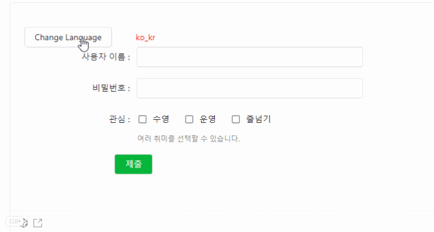

在工作中，我们组的所有项目都是多国语，当然并没有将其抽离出来，每次都是通过拷贝拷贝的方式实现。鉴于这一次编写React组件库的机会，将该组件纳入到组件库中。

# 1.效果
<br>

# 2.常规组件
下面实现一个正常的表单。将页面文本内容写到组件内部。
```tsx

import React, { useState } from 'react';
import { Form, Input, Button, ConfigProvider, CheckBox } from 'biz-web-library';

const hobbys = [
  { value: 1, label: 'swimming' },
  { value: 2, label: 'running' },
  { value: 3, label: 'rope skipping'},
  { value: 4, label: 'boxing'},
];

export default () => {
  return (
    <Form 
      labelCol= {{span: 5}}
      filedCol = {{span: 10}}
      >
        <Form.Item label={'UserName'} name={'name'} >
          <Input />
        </Form.Item >
          <Form.Item label={'Password'} name={'password'}>
        <Input />
      </Form.Item>
      <Form.Item  label={'Hobby'} desc={'You can choose multiple'} name={'hobby'}>
        <CheckBox.Group dataSource={hobbys} />
      </Form.Item>
      <Form.Item filedCol={{span: 8, offset: 4}}>
        <Button htmlType='submit' type={'primary'}>Commit</Button>
      </Form.Item>
      <Form.Item filedCol={{span: 8, offset: 4}}>
        <Button htmlType='submit' type={'primary'}>Cancel</Button>
      </Form.Item>
    </Form>
 )
};
```
# 2. 实现多国语组件
现在项目如果需要支持多国语，那么我们需要编写多国语文件。通过js判断当前页面是属于那种语言，再获取相应的文件。

## 2.1 提取多国语文件
这里选择英语，中文，韩语三种语言。
```javascript
// en_us
export default {
  username: 'UserName',
  password: 'Password',
  hobby: 'Hobby',
  hobby_des: 'You can choose multiple',
  commit: 'Commit',
  cancel: 'Cancel'
}

// zh_cn
export default {
  username: '用户名',
  password: '密码',
  hobby: '兴趣',
  hobby_des: '你可以选择多个爱好',
  commit: '提交',
  cancel: '取消'
}

// ko_kr
export default {
  username: '사용자 이름',
  password: '비밀번호',
  hobby: '관심',
  hobby_des: '여러 취미를 선택할 수 있습니다.',
  commit: '제출',
  cancel: '취소'
}

class I18N {
	static getMultiMessages(local?: string) {
		let cookieLocal = getCookie('urlmap_lan');
		let localmsg = (local || cookieLocal).toLocaleLowerCase();
		if (!['en_us', 'ja_jp', 'ko_kr', 'zh_cn', 'zh_tw'].includes(localmsg)) {
			localmsg = 'ko_kr';
		}
		let messages = require(`./${localmsg}.ts`);
		return messages.default;
	}
}
```

## 2.2 多国语组件使用
多国语文件如何管理，在哪个地方进行加载到项目中呢。这里我们的组件命名为`ConfigProvider`。建议最好在项目路由配置的地方，也就是项目入口进行配置多国语，因为多国语毕竟是全局的。<br>
`ConfigProvider`组件的`locale`参数就是传入项目的多国语文件。
```javascript
<Provider store={store}>
				<ConnectedRouter history={reducerUtils.getHistory()}>
					<ConfigProvider locale={I18N.getMultiMessages()} size={'middle'}>
						<Switch>
							{
								routers.map(({path, Component}, index) => {
									return (<Route key={index} exact={true} path={path} component={Component} />);
								})
							}
						</Switch>
					</ConfigProvider>
			</ConnectedRouter>
			</Provider>
		, document.getElementById('app'),
);
```

## 2.3 多国语组件实现
React的Context是整个项目都可以访问的。因此，这里使用`React.Context`来存储数据是最好不过的。<br/>
这里的`locale`属性便是我们的多国语了。我们通过`ConfigContext.Provider`存储数据，然后使用`ConfigContext.Consumer`进行消费。

```javascript
import ko_kr from '../locale/ko_kr';
import React from 'react';
import renderEmpty from './renderEmpty';
import { ConfigProviderProps } from './type';

export const ConfigContext = React.createContext<ConfigProviderProps>({
  prefixCls: 'biz',
  renderEmpty,
  size: undefined,
  locale: ko_kr,
});

const ConfigProvider: React.FC<ConfigProviderProps> = ({
  children,
  ...config
}) => {
  return (
    <ConfigContext.Consumer>
      {originConfig => {
        // 重置config的值， 如果config未传入的，使用默认值
        Object.keys(originConfig).forEach(v => {
          config[v] = config[v] || originConfig[v];
        });

        return (
          <ConfigContext.Provider value={config}>
            {children}
          </ConfigContext.Provider>
        );
      }}
    </ConfigContext.Consumer>
  );
};

export default ConfigProvider;
```
## 2.4 globalConfig组件

组件如何使用呢，其实就是在每个组件中，通过`ConfigContext.Consumer`去获取数据。但是如果每个组件只要使用，就需要写相同的逻辑，因此，这里提供一个高阶组件，将获取数据的逻辑抽取出来变成`globalConfig`组件。

```javascript
import React from 'react';
import { ConfigContext } from './index';
import { ConfigProviderProps } from './type';

/**
 * 获取组件的名称：用于获取该组件对应的多国语
 *
 * @param Component 组件对象
 */
export const getComponentName = (Component: React.ComponentType) => {
  return Component.displayName || Component.name || 'Component';
};

/**
 * 全局配置 consumer方法
 *
 * @param Component 适用组件
 */
const globalConfig = <T extends {}>(Component: any) => {
  let displayName = getComponentName(Component as React.ComponentType);
  const ConfigComponent = (props: T & ConfigProviderProps) => {
    return (
      <ConfigContext.Consumer>
        {(config: ConfigProviderProps) => {

          return <Component {...config} {...props} />;
        }}
      </ConfigContext.Consumer>
    );
  };

  ConfigComponent.displayName = `Config${displayName}`;
  return ConfigComponent;
};

export default globalConfig;
```
## 2.5 组件适用
针对上面的组件，我们通过多国语来完成。
```tsx
import React, { useState } from 'react';
import { Form, Input, Button, ConfigProvider, globalConfig, CheckBox } from 'biz-web-library';

// en_us
const language = {
  en_us: {
  username: 'UserName',
  password: 'Password',
  hobby: 'Hobby',
  hobby_des: 'You can choose multiple',
  commit: 'Commit',
  hobbylist:  [
    { value: 1, label: 'swimming' },
    { value: 2, label: 'running' },
    { value: 3, label: 'rope skipping'},
    ]
  },
  zh_cn: {
  username: '用户名',
  password: '密码',
  hobby: '兴趣',
  hobby_des: '你可以选择多个爱好',
  commit: '提交',
  hobbylist:  [
    { value: 1, label: '游泳' },
    { value: 2, label: '跑步' },
    { value: 3, label: '跳绳'},
    ]
  },
  ko_kr: {
  username: '사용자 이름',
  password: '비밀번호',
  hobby: '관심',
  hobby_des: '여러 취미를 선택할 수 있습니다.',
  commit: '제출',
  hobbylist:  [
    { value: 1, label: '수영' },
    { value: 2, label: '운영' },
    { value: 3, label: '줄넘기'},
  ]
}
}

const FormField = ({locale}) => {
  return (
      <Form 
      labelCol= {{span: 5}}
      filedCol = {{span: 10}}
      >
        <Form.Item label={locale.username} name={'name'} >
          <Input />
        </Form.Item >
          <Form.Item label={locale.password} name={'password'}>
        <Input />
      </Form.Item>
      <Form.Item  label={locale.hobby} desc={locale.hobby_des} name={'hobby'}>
        <CheckBox.Group dataSource={locale.hobbylist} />
      </Form.Item>
      <Form.Item filedCol={{span: 8, offset: 4}}>
        <Button htmlType='submit' type={'primary'}>{locale.commit}</Button>
      </Form.Item>
    </Form>
    )
};

const App = globalConfig(FormField);


export default () => {
  const [ languageIndex, setLanguageIndex ] = useState(0);

  let langs = ['ko_kr', 'zh_cn',  'en_us'];
  const changeLanguage = () => {
    let index = languageIndex + 1;
    index = index === 3 ? 0 : index;
    setLanguageIndex(index);
  }

  return (
   <>
      <Button onClick={changeLanguage}>Change Language</Button> 
      <span style={{marginLeft: '40px', color: 'red'}}>{langs[languageIndex]}</span>

      <ConfigProvider locale={language[langs[languageIndex]]}>
        <App/>
      </ConfigProvider>
   </>
 )
};
```
# 3. 全局配置
当然，其实这种方式并不是只适用于多国语，例如全局size/theme 等都可以通过该组件进行定制。目前我支持size, 样式前缀，多国语是那种，如果有其他需要配置的，后续可以进行补上。