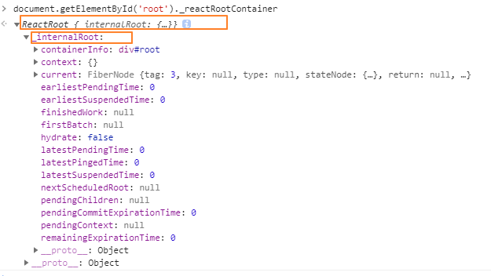
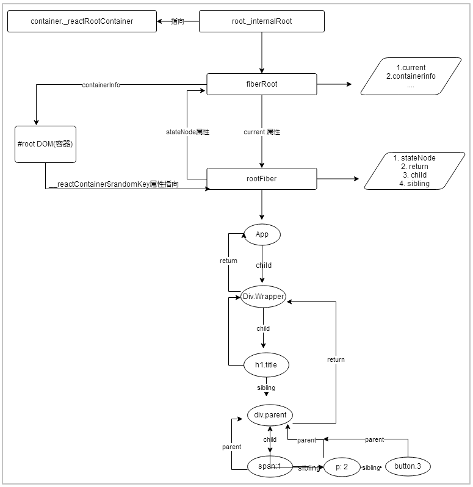

Tip: 代码分析中，会忽略到 __DEV__环境的代码，有需要自己可以深入哈~~<br>

在React16中，我们编写的Reac组件通过JSX编译得到一个虚拟DOM对象，渲染流程是jsx => element tree => fiber tree => html dom。这篇文章，我们就来分析一些fiber tree的生成。
## 1. render
在常见的开发环境中，我们经常会用到下面这段代码，这个就是我们渲染的入口。
```javascript
ReactDOM.render(<App />, document.getElementById('root'));
```
那么当调用render发生了什么，是如何转为fiber tree的呢? 看看下面的源代码。
```javascript
/**
* element : 对应我们传入的ReactElement对象
* container ： 需要将我们的组件挂在到页面的DOM容器
* callback ： 渲染完成后执行的回调
**/
export function render(element: React$Element<any>, container: Container, callback: ?Function) {
    // 注意： 第一个参数为空，第4个参数为false
    return legacyRenderSubtreeIntoContainer(null, element, container, false, callback);
```

## 2. legacyRenderSubtreeIntoContainer
legacyRenderSubtreeIntoContainer带领我们正式进入渲染流程。在这里，我们先不管更新流程，因此将更新流程的代码去掉，只留下构建FiberRoot和RootFiber的代码。先来看看代码：
```javascript
/**
* parentComponent ：父组件，可以传入null
* children ReactDOM.render()或者ReactDOM.hydrate()中的第一个参数，可以理解为根组件。也就是render里的ReactElement对象
* container： 组件需要挂在的容器
* forceHydrate： true 为 服务端渲染，false为客户端渲染，我们研究的是客户端渲染
* callback： 组件渲染完成后需要执行的回调函数，我没有使用过这个参数，大家可以尝试一下
**/
function legacyRenderSubtreeIntoContainer(parentComponent: ?React$Component<any, any>,children: ReactNodeList,container: Container,forceHydrate: boolean,callback: ?Function,) {
  let root: RootType = (container._reactRootContainer: any);
  let fiberRoot;
  // 首次加载，root是不存在的，因此进行首次初始化
  if (!root) {
    root = container._reactRootContainer = legacyCreateRootFromDOMContainer(container,forceHydrate,);
    fiberRoot = root._internalRoot;
    // ...移除掉callback和初始化关在流程
  } else {
    fiberRoot = root._internalRoot;
    // 移除掉更新流程
  }
  return getPublicRootInstance(fiberRoot);
}
```
我们可以看到，首先定义了`root`,并且指向了`container._reactRootContainer`，也就是我们的container DOM容器也同样挂在了ReactRoot对象。还创建了一个`fiberRoot`。`fiberRoot`指向了`root._internalRoot`。`_internalRoot`也就是我们的重点`fiber`对象。我们编写一个例子，并在浏览器控制台打印以下内容：
```javascript
document.getElementById('root')._reactRootContainer
```
<br>

## 3. legacyCreateRootFromDOMContainer
首先这里的`forceHydrate`对于客户端渲染来说，永远都是false。一般在使用render函数时，我们传入的挂在节点是`<div id="root"></div>`.可以看出，我们传入的DOM不会有任何子节点。加入你传入了子节点，那么这个函数也会将你的子节点给清除掉。
```javascript
/**
* container： 组件需要挂在的容器
* forceHydrate： true 为 服务端渲染，false为客户端渲染，我们研究的是客户端渲染
**/
function legacyCreateRootFromDOMContainer(container: Container, forceHydrate: boolean): RootType {
  const shouldHydrate = forceHydrate || shouldHydrateDueToLegacyHeuristic(container);
  // 清除任何存在的子节点
  if (!shouldHydrate) {
    let rootSibling;
    while ((rootSibling = container.lastChild)) {
      container.removeChild(rootSibling);
    }
  }
  return createLegacyRoot(container, shouldHydrate? {hydrate: true,} : undefined,); // =>   return new ReactDOMBlockingRoot(container, LegacyRoot, options);
}
```
## 4. ReactDOMBlockingRoot
从这里开始，我们要理解`FiberRoot`和`RootFiber`这两个概念了。`ReactDOMBlockingRoot`类创建了一个`FiberRoot`对象，并将其挂在到`_internalRoot`属性上，也它就是我们上面在`legacyRenderSubtreeIntoContainer`函数中使用到的`_internalRoot`属性。
```javascript
export type RootTag = 0 | 1 | 2;
export const LegacyRoot = 0; 
export const BlockingRoot = 1;
export const ConcurrentRoot = 2;

/**
* container： 组件需要挂在的容器
* forceHydrate： true 为 服务端渲染，false为客户端渲染，我们研究的是客户端渲染
**/
function createLegacyRoot(container: Container, options?: RootOptions,): RootType {
  return new ReactDOMBlockingRoot(container, LegacyRoot, options);
}

function ReactDOMBlockingRoot( container: Container, tag: RootTag, options: void | RootOptions) {
  this._internalRoot = createRootImpl(container, tag, options);
}
```
## 5. createRootImpl
下面的方法，创建并返回一个fiberRoot。并给容器dom生成一个随机key,挂载current属性对应的rootFiber。
```javascript
/**
* container：组件需要挂在的容器
* tag: fiberRoot节点的标记(LegacyRoot、BatchedRoot、ConcurrentRoot)
* options： hydrate时才有值，否则为undefined
**/
function createRootImpl(container: Container,tag: RootTag,options: void | RootOptions,) {
  //   .....
  // 创建一个fiberRoot
  const root = createContainer(container, tag, hydrate, hydrationCallbacks);
  // 给container附加一个内部属性用于指向fiberRoot的current属性对应的rootFiber节点
  markContainerAsRoot(root.current, container);
// ....
  return root;
}

const randomKey = Math.random().toString(36).slice(2);
// 将rootFiber绑定到coantainer容器上，key是随机数
const internalContainerInstanceKey = '__reactContainer$' + randomKey;
function markContainerAsRoot(hostRoot: Fiber, node: Container): void {
  node[internalContainerInstanceKey] = hostRoot;
}
```

## 5. createContainer/createFiberRoot
终于到真正创建`FiberRoot`这一步骤了，这个方法被抽离在`react-reconciler`包中。和Dom树一样，fiber会构建一个树结构，每一个dom节点对应一个fiber对象，而`RootFiber`就是整个fiber tree的根节点。fiber 和 Fiber 是两个不一样的东西，前者代表着数据结构，后者代表着新的架构。<br>
在`createFiberRoot`函数中，分别创建了两个root,一个root叫做`FiberRoot`,一个叫做`RootFiber`。并且它们两之间相互引用。
- FiberRootNode： 创建FiberRoot实例 `fiberRoot`
- createHostRootFiber： 创建 fiber tree的根节点，即 `rootFiber`

```javascript
/**
* container：组件需要挂在的容器
* tag: fiberRoot节点的标记(LegacyRoot、BatchedRoot、ConcurrentRoot)
* hydrate: 服务端渲染才有值
* hydrationCallbacks： 服务端渲染才有值，不深入分析
**/
export function createContainer(containerInfo: Container,tag: RootTag, hydrate: boolean, hydrationCallbacks: null | SuspenseHydrationCallbacks,): OpaqueRoot {
  return createFiberRoot(containerInfo, tag, hydrate, hydrationCallbacks);
}

export function createFiberRoot(containerInfo: any,tag: RootTag, hydrate: boolean,hydrationCallbacks: null | SuspenseHydrationCallbacks,): FiberRoot {
 // 创建FiberRoot实例
  const root: FiberRoot = (new FiberRootNode(containerInfo, tag, hydrate): any);
  // 通过createHostRootFiber方法创建fiber tree的根节点，即 rootFiber
  const uninitializedFiber = createHostRootFiber(tag);
  // 将rootFiber 树节点挂在在 fiberRoot的current属性上
  root.current = uninitializedFiber;
  // 同时将fiberRoot挂在 rootFiber的stateNode属性上,形成相互引用
  uninitializedFiber.stateNode = root;
//   .....
  return root;
}
```
### 5.1 FiberRootNode
一个`FiberRoot`肯定包含许多属性， 我们其实目前只需要知道它两个属性:<br>
- containerInfo : 渲染的容器
- current： 指向的RootFiber实例<br>
```javascript
/**
* FiberRootNode构造函数
* container：组件需要挂在的容器
* tag: fiberRoot节点的标记(LegacyRoot、BatchedRoot、ConcurrentRoot)
* hydrate: 服务端渲染才有值
**/
function FiberRootNode(containerInfo, tag, hydrate) {
  this.tag = tag;  // 用于标记fiberRoot的类型
  this.containerInfo = containerInfo; // 容器对象
  this.pendingChildren = null; // react-dom不会用到
  this.current = null; // 指向当前激活的与之对应的rootFiber节点
  this.pingCache = null;

  // 已经完成的任务的FiberRoot对象，如果你只有一个Root，那他永远只可能是这个Root对应的Fiber，或者是null
  // 在commit阶段只会处理这个值对应的任务
  this.finishedWork = null;
  this.timeoutHandle = noTimeout;
  // 顶层context对象，只有主动调用`renderSubtreeIntoContainer`时才会有用
  this.context = null; 
  this.pendingContext = null;

  this.hydrate = hydrate; // 当前的fiberRoot是否处于hydrate模式
  this.callbackNode = null; // // 每个fiberRoot实例上都只会维护一个任务，该任务保存在callbackNode属性中
  this.callbackId = NoLanes;
  this.callbackPriority = NoLanePriority; // 当前任务的优先级
  this.expirationTimes = createLaneMap(NoTimestamp);

  this.pendingLanes = NoLanes;
  this.suspendedLanes = NoLanes;
  this.pingedLanes = NoLanes;
  this.expiredLanes = NoLanes;
  this.mutableReadLanes = NoLanes;
  this.finishedLanes = NoLanes;

  this.entangledLanes = NoLanes;
  this.entanglements = createLaneMap(NoLanes);
}
```
### 5.2 createHostRootFiber / createFiber
阅读下面的代码，在生成 mode 的过程中，用到了上面这些常量，是二进制的值。0b0100 | 0b0001 = 0b0101。使用按位或操作，不仅能提高运行速度，在常量的判断上也很方便。
```javascript
export const HostRoot = 3; // HostRoot 也是一个常量，用做标记，因为 root 节点的 Fiber 对象是Fiber树的头节点。后续会用的上

export const NoMode = 0b00000;
export const StrictMode = 0b00001;
export const BlockingMode = 0b00010;
export const ConcurrentMode = 0b00100;
export const ProfileMode = 0b01000;
export const DebugTracingMode = 0b10000;

export function createHostRootFiber(tag: RootTag): Fiber {
  let mode;
  if (tag === ConcurrentRoot) {
    mode = ConcurrentMode | BlockingMode | StrictMode;
  } else if (tag === BlockingRoot) {
    mode = BlockingMode | StrictMode;
  } else {
    mode = NoMode;
  }
  return createFiber(HostRoot, null, null, mode);
}

/**
 * 创建并返回一个FiberNode实例
 * @param tag 用于标记fiber节点的类型
 * @param pendingProps 表示待处理的props数据
 * @param key 用于唯一标识一个fiber节点(特别在一些列表数据结构中，一般会要求为每个DOM节点或组件加上额外的key属性，在后续的调和阶段会派上用场)
 * @param mode 表示fiber节点的模式
 */
const createFiber = function(tag: WorkTag,pendingProps: mixed,key: null | string,mode: TypeOfMode): Fiber {
  return new FiberNode(tag, pendingProps, key, mode);
};
```
### 5.4 FiberNode
下面是FiberNode的构造函数，有许多属性，对于注释，有一部分是拷贝的，方便后续查看，目前我也不太懂它的意思。
```javascript
/**
 * FiberNode构造函数
 * @param tag 用于标记fiber节点的类型
 * @param pendingProps 表示待处理的props数据
 * @param key 用于唯一标识一个fiber节点
 * @param mode 表示fiber节点的模式
 */
function FiberNode(tag: WorkTag, pendingProps: mixed,key: null | string,mode: TypeOfMode) {
  // Instance
  this.tag = tag; // 用于标记fiber节点的类型。 FunctionComponent | HostRoot | HostPortal....
  this.key = key; // 用于唯一标识一个fiber节点
  this.elementType = null; // ReactElement.type，也就是我们调用`createElement`的第一个参数
  this.type = null; // 步组件resolved之后返回的内容，一般是`function`|`class`|module 类型组件名
  this.stateNode = null; // 对于rootFiber节点而言，挂在fiterRoot. 对于child fiber，挂在对应的组件实例

  // 以下属性创建单链表树结构
  // return属性始终指向父节点
  // child属性始终指向第一个子节点
  // sibling属性始终指向第一个兄弟节点
  this.return = null;
  this.child = null;
  this.sibling = null;

  // index属性表示当前fiber节点的索引
  this.index = 0;

  this.ref = null;

  this.pendingProps = pendingProps;  // 表示待处理的props数据
  this.memoizedProps = null; // 表示之前已经存储的props数据
  this.updateQueue = null; // 当前fiber身上的更新队列（在执行的过程中，props,state，effects信息都会改变）
  this.memoizedState = null; // 表示之前已经存储的state数据
  this.dependencies = null; // 一个列表，存放这个Fiber依赖的context

  // 用来描述当前Fiber和他子树的`Bitfield`
  // 共存的模式表示这个子树是否默认是异步渲染的
  // Fiber被创建的时候他会继承父Fiber
  // 其他的标识也可以在创建的时候被设置
  // 但是在创建之后不应该再被修改，特别是他的子Fiber创建之前
  this.mode = mode; // 表示fiber节点的模式。 StrictMode || BlockingMode || ConcurrentMode ...

  // Effects
  this.effectTag = NoEffect; // 用来记录Side Effect, 一系列决定如何操作(删除、替换、更新)的值
  this.nextEffect = null; // 指向下一个操作的fiber节点

  this.firstEffect = null; // 指向第一个操作的fiber节点
  this.lastEffect = null; // 指向最后一个操作的fiber节点

// 调度优先级相关
  this.lanes = NoLanes; // 任务在未来哪个时间点应该被完成，不包含子任务
  this.childLanes = NoLanes; // 子节点的过期时间

 // 在Fiber树更新的过程中，每个Fiber都会有一个跟其对应的Fiber
  // 我们称他为`current <==> workInProgress`
  // 在渲染完成之后他们会交换位置
  this.alternate = null; // 指向work-in-progress ，更新进行过程中的fiber
}
```
我们知道一个节点对应一个fiber,多个fiber节点之间建立连接，然后会生成一个fiber tree。fiber tree 其实是一个单链表树结构，而构建这个tree的关键属性就是`return`,`child`, `sibling`。例如下面的例子，构建一个fiber tree。绘制流程图：
- Return: 每一个fiber都有值，指向父节点
- child: 指向当前节点的`第一个`子节点
- sibling: 指向当前节点的`第一个`兄弟节点 
- stateNode: 每隔fiber对象对应的组件或者dom
```javascript
<div class="root">
    <h1 class="title">React header</h1>
    <div class="parent">
        <span>child1</span>
        <p>child2</p>
        <button>child3</button>
    </div>
</div>
```


### 5.5 FiberNode 的alternate 属性
通常来说，React应用中通常有两个fiber tree,一个叫做`old tree`, 一个交过`worksInProgress tree`.前者对应已经渲染好的DOM树，后者表示正在指向更新中的`fiber tree`，能很好的方便中断后恢复。两棵树之间相互引用，便于共享一些内部的属性，减少内存的开销。当结束更新的时候，`worksInProgress tree`会替换掉`old tree`,这种做法称之为 double buffering。
