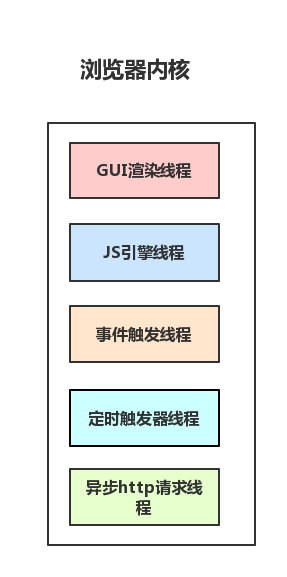
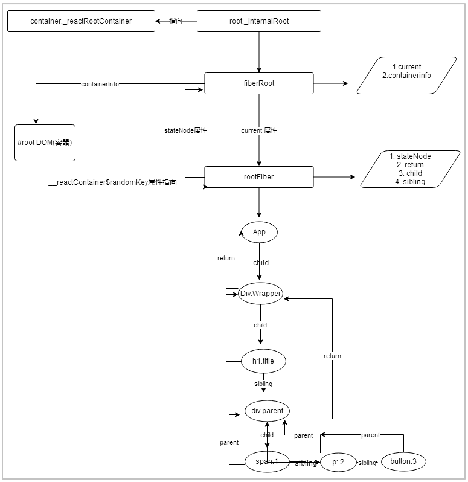

## 1. 为什么使用Fiber
如果使用过`React15`的人，可能大致了解，其实`15版本`是基于`Stack Reconcilation`。它是递归、同步的方式。栈的优点在于用少量的代码就可以实现diff功能。并且非常容易理解。但是它也带来了严重的性能问题。接下来，我们了解一下原因。<br>

### 1.1 浏览器渲染中的部分线程
<br>
- GUI渲染线程： 负责渲染浏览器界面，解析HTML，CSS，构建DOM树和RenderObject树，布局和绘制等。
- JS引擎线程: 负责处理Javascript脚本程序。GUI渲染线程与JS引擎线程是互斥的，所以如果JS执行的时间过长，这样就会造成页面的渲染不连贯，导致页面渲染加载阻塞。
- 事件触发线程: 归属于浏览器而不是JS引擎，用来控制事件循环（Event Loop）。
- 定时触发器线程: 传说中的setInterval与setTimeout所在线程, 通过单独线程来计时并触发定时（计时完毕后，添加到事件队列中，等待JS引擎空闲后执行）
- 异步http请求线程: 将检测到状态变更时，如果设置有回调函数，异步线程就产生状态变更事件，将这个回调再放入事件队列中。再由JavaScript引擎执行。<br>

如上图所示，浏览器中其实有很多很多线程，但是JS是单线程的，只要其中某一个线程阻塞，那么其他线程就会长时间得不到执行。因此各个线程是互斥的。假如JS是多线程，我们想想会发生什么事情？当线程A修改Dom1的数据, 线程2删除Dom1的数据，浏览器就会产生矛盾，到底以哪个为准呢？所以这也就注定了JS需要是单线程运行的。<br>

### 1.2 为何要优化Stack Reconcilation(栈调和器)
`Stack Reconcilation(栈调和器)`在进行计算的时候会阻塞整个线程，整个渲染过程必须是连续不断完成。而其他的任务（例如动画等）就会被阻塞，长时间地霸占CPU资源，这会产生明显感觉到卡顿。因此`Stack Reconcilation`既不能暂停渲染任务，也不能切分任务，更不能有效地平衡渲染和动画的执行顺序等等，这些也就注定了`Stack Reconcilation`被替代，而这也就是`React 16`引入`Fiber架构`的原因。<br>
下面我借鉴[荒山](https://juejin.im/post/6844903975112671239#heading-1)的文章的图片呈现对比：<br>
- React 15 使用递归对比VirtualDom树，需要将变动的节点找出并且更新，不能间断。这个过程被称为调和`Reconcilation`，在`Reconcilation`期间，浏览器一直霸占浏览器资源，导致用户触发的事件得不到响应，并且会导致掉帧，造成明显的卡顿。<br>
<br>
### 1.3 为何要使用Fiber Reconcilation(纤维调和器）
在分析之前，我们可以先用以下例子来体验分片执行的好处。例子是通过不同方式生成1万个节点。
- 一气呵成不中断
- 分100次，每隔40毫秒插入节点
```html
<!doctype html>
<html lang="en">
 <head>
<script>
function randomHexColor(){
    return "#" + ("0000"+ (Math.random() * 0x1000000 << 0).toString(16)).substr(-6);
}
// 2选一： 生成一个10000个dom节点，一气呵成
setTimeout(function() {
    var k = 0;
    var root = document.getElementById("root");
    for(var i = 0; i < 10000; i++){
        k += new Date - 0 ;
        var el = document.createElement("div");
        el.innerHTML = k;
        root.appendChild(el);
        el.style.cssText = `background:${randomHexColor()};height:40px`;
    }
}, 1000);

// 选一： 生成10000个节点，分批次插入，每次插入100个节点，共插入100次。
setTimeout(function () {
	var root = document.getElementById("root");
    function loop(n) {
        var k = 0;
        for (var i = 0; i < 100; i++) {
            k += new Date - 0;
            var el = document.createElement("div");
            el.innerHTML = k;
            root.appendChild(el);
            el.style.cssText = `background:${randomHexColor()};height:40px`;
        }
        if (n) {
            setTimeout(function () {
                loop(n - 1);
            }, 40);
        }
    }
    loop(100);
}, 1000);

  </script>
 </head>
 <body>
  <div id="root"></div>
 </body>
</html>
```
<br>
一气呵成的插入，明显感觉掉帧，普遍fps为1529ms
<br>
分时分片插入，让浏览器有个喘息的机会，普遍1fps为17ms。<br>

通过上面的对比，可知与其一次性操作大量 DOM 节点相比, 分批延时对DOM进行操作可以得到更好的用户体验。<br>
其最终原因，浏览器每隔一段时间需要重绘当前页面，一般来说这个频率是60次/1s.也就是说美16毫秒(1/60 )浏览器会有一个周期性的重绘行为。每16ms重绘周期我们称为一帧。这一帧里，浏览器的主线程是需要处理GUI描绘，事件处理，JS执行，资源加载,布局等。<br>
而同一个时间段又只能处理一件事情。假如有足够的时间，给浏览器一点喘息的机会，浏览器还会对我们代码进行编译优化（JIT）及进行热代码优化，一些DOM操作，内部也会对reflow进行处理。reflow是一个性能黑洞，很可能让页面的大多数元素进行重新布局。<br>

React 16采用`Fiber Reconcilation`。为了给用户造成一种`应用很快`的假象，不能让一个进程一直霸占着资源,因此配合合理的调度策略进行分配CPU资源，利用Fiber架构，让`Reconcilation`过程变为可被中断，`适时`让出CPU执行权，让浏览器及时响应用户交互，从而提高浏览器的响应速率。再次借鉴[荒山](https://juejin.im/post/6844903975112671239#heading-1) 的文章的图片呈现React16版本的高性能对比图。<br>
- 同步模式,React16虽然实现了异步，但是并没有对外开放，可以使用实验版本进行一探究竟，应该在17版本性能会有质的提升<br>
<br>
- 优化后的 Concurrent 模式
<br>
## 2. 什么是Fiber
Fiber也称为`协程`或者`纤程`,它和`线程`是不一样的，并不拥有并发或者并行能力，它只是一种控制流程的`让出机制`。

### 2.1 React主动出让机制
React Fiber: 和`协程`概念一致，React Fiber将任务划分为一个个不同优先级的工作单，配合调度策略，当渲染时出现高优先级任务，渲染过程可以被中断，将控制权交还给浏览器，让位给高优先级的任务，浏览器空闲后再恢复渲染。<br>
浏览器没有进程概念，`任务`的界限模糊，也不具备`中断/恢复`的条件，并且也没有抢占机制，我们无法中断一个正在执行的程序。因此，只能采取`控制权出让`机制。专业名词叫`合作式调度(Cooperative Scheduling)`。<br>
这是一种`契约`调度，要求我们的程序与浏览器紧密结合，相互信任。由浏览器给我们分配执行时间片,我们按照按照约定的时间内完成任务后，又将控制权返还给浏览器,一切都听从浏览器的指挥调度。<br>
<br>

### 2.2 浏览器调度执行任务
React采用时间分片的策略，将任务划分为不同等级的工作单位，利用浏览器的空闲时间进行任务的执行，以保证UI操作的流畅。在浏览器中，主要由以下两个api可实现高优先级和低优先级的执行：<br>
- requestAnimationFrame: 执行高优先级任务
- requestIdleCallback: 执行低优先级任务<br>

[函数详细链接](https://juejin.im/post/6844903592831238157)
#### 2.2.1 requestAnimationFrame
requestAnimationFrame 会在每一帧的开始阶段执行，一般用于绘制复杂的动画。属于高优先级任务。因为是每一帧开始时执行，我们可以模拟简单的时间分片调度。<br>
- 参数：
```javascript
// 创建1000个任务
const tasks = Array.from({length: 1000}, ()=> () => { console.log('task');});

// 没20ms执行一次一个分片任务
const doTask = (index = 0) => {
    const start = Date.now();
    let i = index;
    let end;
    do {
        // 执行任务
        tasks[i++]();
        // 获取当前任务执行结束时间
        end = Date.now();
    } while( i < tasks.length && end - start < 20);
    
    console.log('----------', '20ms分界线');
    // 设置新的分片任务
    if (i < tasks.length) {
        // 调用requestAnimationFrame执行分片任务
        requestAnimationFrame(doTask.bind(null, i));
    }
};

// 第一次调用任务调度器
requestAnimationFrame(doTask.bind(null, 0));

// 执行结果：
// 347 task
// ---------- 20ms分界线
// 393 task
// ---------- 20ms分界线
// 260 task
// ---------- 20ms分界线
```
上面我们通过requestAnimationFrame简单地实现了每隔20ms执行一次任务的分时分片功能，但是加入我们的任务不到20ms或者超过20ms,那么执行时间就会出现过多或不够的问题。此时，我们就需要使用requestIdleCallback。
#### 2.2.2 requestIdleCallback
当我们关注用户体验，不希望一些不重要的任务（例如统计上报）导致用户页面卡顿，可以使用requestIdleCallback。该函数属于低优先级任务，不确定回调一定执行。<br>
我们看到的网页，是浏览器一帧一帧绘制的，通常FPS为60是比较流畅的。FPS为个位数，就能感知明显卡顿。浏览器再每一帧做了什么事情呢？<br>
<br>
我们可以看到，在每一帧浏览器处理了交互、js执行、requestAnimationFrame调用、布局、绘制等等。假如浏览器再16ms (1000ms/60pfs)执行的任务不多，就有空闲时间执行requestIdleCallback的回调。<br>
<br>
当页面没什么更新，其实浏览器是空闲状态，这时会有很长时间执行requestIdleCallback。但是当浏览器处于繁忙状态，也可能会出现requestIdleCallback回调一直无法执行。这其实也不是我们希望看到的。还好requestIdleCallback有第二个参数`timeout`，过期后就会执行。但是加入真在过期才知晓，用户也就能明显感知卡顿现象了。<br>
```javascript
// 创建1000个任务
const tasks = Array.from({length: 1000}, ()=> () => { console.log('task');});

// 没20ms执行一次一个分片任务
const doTask = (index = 0, idleDeadline) => {
    let i = index;
    do {
        // 执行任务
        tasks[i++]();
    } while( i < tasks.length && idleDeadline.timeRemaining() > 0); // 任务执行时间未过期
    
    console.log('----------', '20ms分界线');
    // 过期了，需要干什么
    if (idleDeadline.didTimeout) {
        console.log('过期啦', i);
    }
    // 设置新的分片任务
    if (i < tasks.length) {
        // 调用requestIdleCallback执行分片任务
        requestIdleCallback(doTask.bind(null, i), { timeout: 1000 });
    }
};

// 第一次调用任务调度器
requestIdleCallback(doTask.bind(null, 0), { timeout: 1000 }); // 1000ms过期时间，如果任务未执行，则立即执行
```
```javascript
不建议在requestIdleCallback中进行DOM操作，因为这可能导致样式重新计算或重新布局(比如操作DOM后马上调用 getBoundingClientRect)，这些时间很难预估的，很有可能导致回调执行超时，从而掉帧。
```

### 2.3 执行单元
Fiber另一种解读叫`纤维`：一种数据结构或者执行单元。将其视为`执行单元`，每完成一个`执行单元`,React会检查剩余时间，没有时间就将控制权让出来。<br>
前面说到，当有更新时，会往`updateQueue`队列中插入任务。例如`setState`执行更新组件，会将任务加入`队列中`，等待更新的任务通过`requestIdleCallback`进行调用。
```javascript
updateQueue.push(updateTask);
requestIdleCallback(performWork, {timeout});

// 1. performWork 会拿到一个Deadline，表示剩余时间
function performWork(deadline) {

  // 2️. 循环取出updateQueue中的任务
  while (updateQueue.length > 0 && deadline.timeRemaining() > ENOUGH_TIME) {
    workLoop(deadline);
  }

  // 3️. 如果在本次执行中，未能将所有任务执行完毕，那就再请求浏览器调度
  if (updateQueue.length > 0) {
    requestIdleCallback(performWork);
  }
}
```
performWork: 分段执行的任务片段。只要有空闲时间就调用执行。<br>
workLoop: 从`updateQueue`中获取更新任务进行执行，每执行一个`执行单元`，检测是否还有剩余时间，有就进入下一个`执行单元`，无剩余时间则保存现场，等下次拥有执行权再恢复。<br>
```javascript
// 保存当前的处理现场
let nextUnitOfWork: Fiber | undefined // 保存下一个需要处理的工作单元
let topWork: Fiber | undefined        // 保存第一个工作单元

function workLoop(deadline: IdleDeadline) { // deadline: 过期时间
  // updateQueue中获取下一个或者恢复上一次中断的执行单元
  if (nextUnitOfWork == null) {
    nextUnitOfWork = topWork = getNextUnitOfWork();
  }

  // 每执行完一个执行单元，检查一次剩余时间
  // 如果被中断，下一次执行还是从 nextUnitOfWork 开始处理
  while (nextUnitOfWork && deadline.timeRemaining() > ENOUGH_TIME) {
    // 下文我们再看performUnitOfWork
    nextUnitOfWork = performUnitOfWork(nextUnitOfWork, topWork);
  }

  // 提交工作
  if (pendingCommit) {
    commitAllWork(pendingCommit);
  }
}
```
<br>
## 3. React中的Fiber结构
上面我们提到，`React15`是`Stack Reconcilation`,而`React16`使用的是`Fiber Reconcilation`。Fiber采用链表结构，每一个`VirtualDom`节点，对应一个`fiber`节点。
```javascript
/**
 * FiberNode构造函数
 * @param tag 用于标记fiber节点的类型
 * @param pendingProps 表示待处理的props数据
 * @param key 用于唯一标识一个fiber节点
 * @param mode 表示fiber节点的模式
 */
function FiberNode(tag: WorkTag, pendingProps: mixed,key: null | string,mode: TypeOfMode) {
  // Instance
  this.tag = tag; // 用于标记fiber节点的类型。 FunctionComponent | HostRoot | HostPortal....
  this.key = key; // 用于唯一标识一个fiber节点
  this.elementType = null; // ReactElement.type，也就是我们调用`createElement`的第一个参数
  this.type = null; // 步组件resolved之后返回的内容，一般是`function`|`class`|module 类型组件名
  this.stateNode = null; // 对于rootFiber节点而言，挂在fiterRoot. 对于child fiber，挂在对应的组件实例

  // 以下属性创建单链表树结构
  // return属性始终指向父节点
  // child属性始终指向第一个子节点
  // sibling属性始终指向第一个兄弟节点
  this.return = null;
  this.child = null;
  this.sibling = null;
  ....
}
```
一个节点对应一个fiber,多个fiber节点之间建立连接，然后会生成一个fiber tree。fiber tree就是单链表树，而构建这个tree的关键属性就是`return`,`child`, `sibling`。
- Return: 每一个fiber都有值，指向父节点
- child: 指向当前节点的`第一个`子节点
- sibling: 指向当前节点的`第一个`兄弟节点 
- stateNode: 每隔fiber对象对应的组件或者dom<br>
```javascript
<div class="root">
    <h1 class="title">React header</h1>
    <div class="parent">
        <span>child1</span>
        <p>child2</p>
        <button>child3</button>
    </div>
</div>
```

### 3.1 中断恢复机制
有了链表结构，我们就能够来处理React树的节点啦。结合上面`浏览器调度`部分和`workLoop`,克制其实`FiberNode`就是我们的工作单元。`performUnitOfWork`负责对`FiberNode`进行操作，进行深度遍历，返回下一个`工作单元FiberNode`。<br>
```javascript
/**
 * @params fiber 当前需要处理的节点
 * @params topWork 本次更新的根节点
 */
function performUnitOfWork(fiber: Fiber, topWork: Fiber) {
  // 对该节点进行处理
  beginWork(fiber);

  // 如果存在子节点，那么下一个待处理的就是子节点
  if (fiber.child) {
    return fiber.child;
  }

  // 没有子节点了，上溯查找兄弟节点
  let temp = fiber;
  while (temp) {
    completeWork(temp);

    // 到顶层节点了, 退出
    if (temp === topWork) {
      break
    }

    // 找到，下一个要处理的就是兄弟节点
    if (temp.sibling) {
      return temp.sibling;
    }

    // 没有, 继续上溯
    temp = temp.return;
  }
}
```
结合`workLoop`, 因为是链表结构，即使流程被中断，我们保存了上一个执行单元，能够准确地从上次未处理完成的`FiberNode`继续执行，恢复工作流程。
### 3.2 Reconciliation(协调阶段) 和 Commit(提交阶段)
React除了Fiber工作单元的拆分，还有`阶段`拆分，也是非常重要的改造。在`Stack Reconcilaition`中是一遍进行diff,一遍进行commit。而`Fiber Reconcilication`是分为两个阶段：<br>
协调阶段： diff阶段，可被中断，找出所有节点变更（节点增加、删除、修改、props修改等），这些被称为`副作用Effect`。以下生命周期会被调用(
* constructor, 
* static getDerivedStateFromProps, 
* shouldComponentUpdate, render<br>
Commit阶段：将上一阶段计算的`副作用Effect`一次执行更新，该阶段同步不可打断。以下什么周期执行
* getSnapshotBeforeUpdate() 严格来说，这个是在进入 commit 阶段前调用
* componentDidMount
* componentDidUpdate
* componentWillUnmount<br>
`协调阶段`执行的工作时不会对用于造成任何`可见的变更`，改阶段可被中断、可恢复，可让出执行控制权。生命周期函数也可能被多次执行。而`Commit阶段`是不能被中断执行的。因为要正确地处理各种副作用变更(包括DOM变更),因为有副作用，所以必须保证按次序只调用一次。<br>
## 4 结束
对于调和阶段和commit阶段，后续再进行详细的学习。学到这里，终于对Fiber架构有一个清楚的认识了，该部分并没有通过阅读原来来学习，而是从别人的总结中获得，因为理解了Fiber架构，才能更好地进行分析后续的代码。特别参考以下的文章：<br>
- [这可能是最通俗的 React Fiber(时间分片) 打开方式](https://juejin.im/post/6844903975112671239#heading-7)<br>
后续会对React的调度原理进行学习，学习源码的过程中，确实太容易产生懈怠了，希望自己坚持住。附上之间的所有学习链接。<br>

1. [React源码系列一：React相关API](https://juejin.im/post/6855129007852109837)<br>
2. [React源码系列二：React Render之 FiberRoot](https://juejin.im/post/6857408790698917901)<br>
3. [React源码系列三：React.Render流程 二 之更新](https://juejin.im/post/6867710713754812423)<br>
