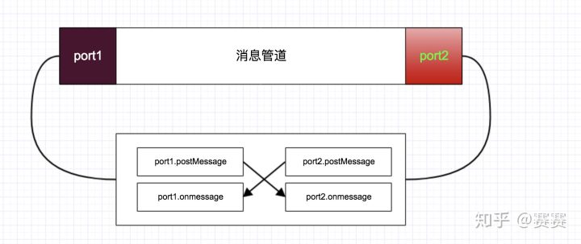
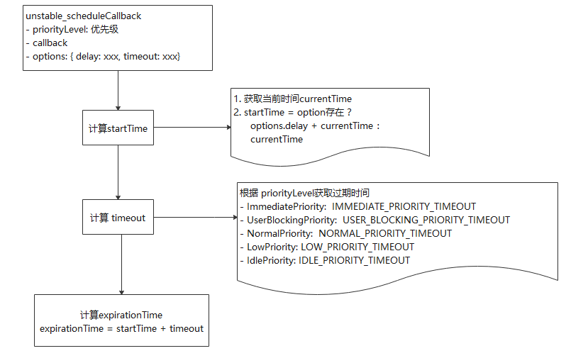
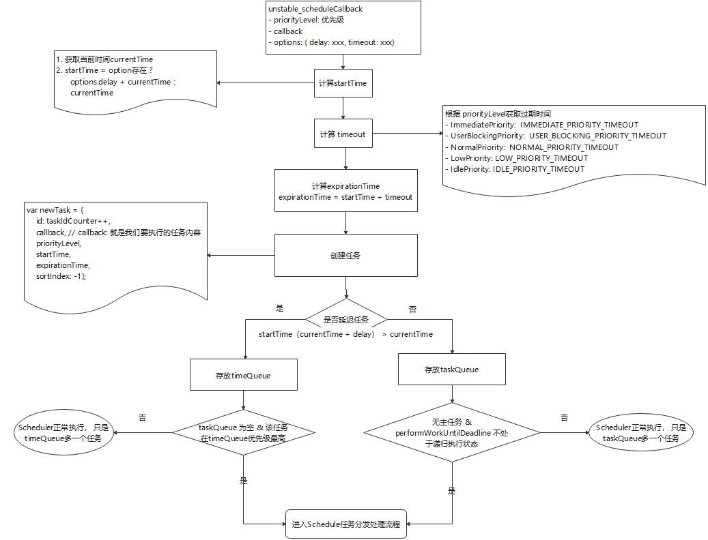
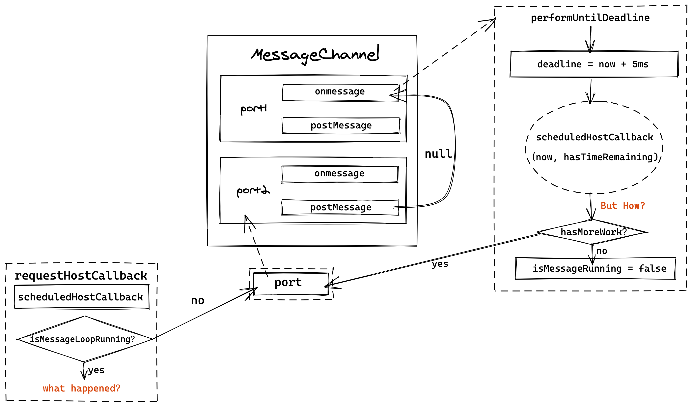

## 进入学习前提准备
React源码分析所有文章均属原创，是结合网上别人的总结和分析源码所得。我觉得文章可能不是写的最好的一篇，但一定敢确定是比较详细的一篇。如果哪些地方不正确，请指正，因为自己也是小白一枚。<br>

`Scheduler`模块我认为是比较困难的一部分，每次想啃这部分的时候，都想找理由退缩。幸运还是坚持了下来。也感谢对我启发最大的一片文章[shockw4ver](https://segmentfault.com/a/1190000022942008),让我有了学习的思路，由于我是边学习变总结，低估了这一部分的学习内容，本计划一篇文章结束，但是发现内容真的太多了，因此打算分为两篇总结。下面开始我们的第一篇学习吧：<br>

- tips：文章中所涉及的源码，并不会显示react中该部分相关的全部代码，只会保留主流程。因为代码量过多，其实并不方便整体理解。可以一边看文章一边阅读源码，会理解的更快。<br>

## 1. MessageChannel 与 requestIdleCallback的较量
在[React源码系列四：React Fiber 架构](https://juejin.im/post/6875521310181556231)中，我们分析了为什么要进行`时间分片`。而`requestIdleCallback`能够在浏览器空闲时间按照设置的优先级顺序执行。React开始确实采用了`requestIdleCallback`。但是在2019年9月27日，React在发布[release](https://github.com/facebook/react/releases/tag/v16.10.0)中，启用了新的调度任务方法。在[PR](https://github.com/facebook/react/pull/16214)中，可以查看到替换为`MessageChannel`的原因。<br>
- 由于`requestIdleCallback`依赖于显示器的刷新频率，使用时需要看`vsync cycle（指硬件设备的频率）`的脸色
- 为了尽量在每帧尽可能多地执行任务，采用了`5ms间隔的消息event`来发起调度，这里就利用了postMessage的方式
- postMessage的方式也存在风险，因为更加频繁的调度任务，会加剧`主线程`与`其他浏览器任务`的资源争夺
- 相比于`requestIdleCallback`和`setTimeout`，浏览器在后台标签下对消息事件进行了什么程度的节流还需要进一步确定，该试验是假设它与定时器有相同的优先级。<br>

总结与句话：采用`MessageChannel`,是放弃了浏览器对帧的依赖策略，转为认为控制调度的频率。提升了任务的处理速度，优化React运行时的性能。

### 1.1 什么是MessageChannel
在[React源码系列四：React Fiber 架构](https://juejin.im/post/6875521310181556231)中，已经对`requestIdleCallback` API 进行了详细的学习，那么这里我们也来学习一下`MessageChannel`的基本使用。<br>
`MessageChannel（消息通道通信）`是`点对点`的`管道`通信方式。它可将`代码块`独立地运行在不同的浏览器上下文中。不同的上下文，通过它建立的`管道`进行消息传输。`MessageChannel`主要有以下特点：<br>
- 两个只读的`MessagePort`: port1和port2。这两个端口搭建起了消息通道接手的桥梁
- 一个端口作为本地端口，另一个端口传递给远程窗口使用
- 消息将以DOM事件的方式传递，不会中断或阻塞事件循环中的task任务<br>
```javascript
var channel = new MessageChannel();
var port1 = channel.port1;
var port2 = channel.port2;
port1.onmessage = function(event) {
	console.log("port1接收port2的数据：" + event.data);
}
port2.onmessage = function(event) {
	console.log("port2接收port1的数据：" + event.data);
}

port1.postMessage("Port2 你好");
port2.postMessage("Port1 我收到你的问候了"); 
```
<br/>

这里我们对MessageChannel浅尝辄止，对于React源码阅读，只要理解这一步就足够了。以后再详细地学习它吧~~

## 2. Scheduler的原理
我看了Schedule的源码，没有整体的概念。后来在网上找到了[react scheduler 再解析篇](https://zhuanlan.zhihu.com/p/110161396)这篇文章，我觉得讲的很好。<br>
发现姓`修`的都是好厉害的人物，`修言`是我膜拜的对象，而这篇文章是`修范`写的。怀疑以后我是不是会变成`修姓世家`的虔诚徒孙（嘻嘻）。当然，毫无疑问，我会引用该篇中理解的知识。<br>
### 2.1 优先级类型 timeoutForPriorityLevel（/scheduler/src/Scheduler.js）
先来看看获取`任务过期时间`的方法。可见Schedule对任务优先级的划分，总共5总优先级。
```javascript
function timeoutForPriorityLevel(priorityLevel) {
  switch (priorityLevel) {
    case ImmediatePriority:
      return IMMEDIATE_PRIORITY_TIMEOUT;
    case UserBlockingPriority:
      return USER_BLOCKING_PRIORITY_TIMEOUT;
    case IdlePriority:
      return IDLE_PRIORITY_TIMEOUT;
    case LowPriority:
      return LOW_PRIORITY_TIMEOUT;
    case NormalPriority:
    default:
      return NORMAL_PRIORITY_TIMEOUT;
  }
}

// maxSigned31BitInt: 最多31位整数。 对于32位系统，V8中的最大整数大小。
var maxSigned31BitInt = 1073741823;
// Times out immediately
var IMMEDIATE_PRIORITY_TIMEOUT = -1;
// Eventually times out
var USER_BLOCKING_PRIORITY_TIMEOUT = 250;
var NORMAL_PRIORITY_TIMEOUT = 5000;
var LOW_PRIORITY_TIMEOUT = 10000;
// Never times out
var IDLE_PRIORITY_TIMEOUT = maxSigned31BitInt;
```

那么到底过期时间是怎么定义的呢，从以下表格中可查到对应方式：数字越大，超时时间越长，优先级越低。

| 优先级priorityLevel|  字段名称  | 描述  |
|  ----  | ----  | ----  |
| NoPriority = 0: 无优先级 | | React内部使用：初始化和重置root；用户自定义使用| 
| ImmediatePriority = 1: 立即实行 | IMMEDIATE_PRIORITY_TIMEOUT = -1 | Times out immediately，立即超时，表示立即执行 | 
| UserBlockingPriority = 2： 用户阻塞优先级 | USER_BLOCKING_PRIORITY_TIMEOUT = 250 | 超时时间 = 当前时间 + 250 |
| NormalPriority = 3：一般的优先级 |  NORMAL_PRIORITY_TIMEOUT = 5000 | 超时时间 = 当前时间 + 5000 |
| LowPriority = 4： 低级的优先级 |  LOW_PRIORITY_TIMEOUT = 10000 | 超时时间 = 当前时间 + 10000 |
| IdlePriority = 5：空闲再执行的优先级 | IDLE_PRIORITY_TIMEOUT = maxSigned31BitInt | 没有超时时间，可能被永远阻塞不执行 |
<br/>

### 2.2 任务队列
`Scheduler`在`React`更新中，占据非常重要的位置。不管是同步渲染还是异步渲染，不管是初次渲染还是更新节点，都会使用到`Scheduler`。`Scheduler`采用`Heap堆`存放任务队列。并采用一定的规则进行任务调度。下面我们开始学习该`任务队列`的生成规则。

### 2.1 unstable_scheduleCallback(priorityLevel, callback, options)
`Scheduler`的入口函数`unstable_scheduleCallback`。该函数的将会计算任务的开始时间、过期时间、生成任务并将任务放入任务队列。

```javascript
/**
* priorityLevel： 该调度任务的优先级。对应的值及上面介绍的优先级。
* callback：执行的任务函数
* options: { delay: xxx, timeout:xxx}。决定了任务的startTime和timeout。
*/
unstable_scheduleCallback(priorityLevel, callback, options) {

}
```

### 2.2.1 计算startTime 和timeout
unstable_scheduleCallback 计算时间总的来说分为下面三个步骤：
- startTime =  options.delay(存在值) + currentTime
- timeout = 根据优先级 返回的过期时间（上面的timeoutForPriorityLevel方法对应的值）
- expirationTime = startTime + timeout<br>

```javascript
function unstable_scheduleCallback(priorityLevel, callback, options) {
  // 获取当前时间
  var currentTime = getCurrentTime();
  var startTime;
  if (typeof options === 'object' && options !== null) {
    var delay = options.delay;
    if (typeof delay === 'number' && delay > 0) {
      startTime = currentTime + delay;
    } else {
      startTime = currentTime;
    }
  } else {
    startTime = currentTime;
  }

  // timeout = IMMEDIATE_PRIORITY_TIMEOUT | USER_BLOCKING_PRIORITY_TIMEOUT | ....
  var timeout = timeoutForPriorityLevel(priorityLevel);

// 过期时间 = startTime + timeout
  var expirationTime = startTime + timeout;

}
```
tip: 根据分局，其实`任务的执行时机 = 当前时间currentime + 延时(delay) + 优先级定时(xxx_PRIORITY_TIMEOUT)`, 按代码，绘制出以下部分流程图：<br>
<br>

### 2.2.2 任务队列维护
我们先来理解一点点执行原理，`Scheduler`用于调度任务，为了防止浏览器主线程长时间忙于运行一些事情，关键任务却被推迟，因此任务需要进行优先级排序。每次优先执行优先级最高的任务。`Scheduler`采用`Heap堆`存放任务队列。<br>
根据优先级的高低，shceudler采用`位运算取中位节点`的方式，交换`heap堆`中任务的位置。而添加任务、移除任务会用到`Shceduler`中的工具方法(例如push,peek等)。`Scheduler`使用`Heap堆`机制，构造了两个任务队列`taskQueue`和`timeQueue`。
- taskQueue: 存放将被处理的任务
- timeQueue: 存放延期处理的任务<br>

每个任务存放`Heap堆`之前，会根据`sortIndex`,`id`属性进行优先级排序。
- sortIndex: 值越小，优先级越高 
- id：是任务创建的顺序，id越小，优先级越高<br>

基本获取任务方式：`Scheduler`首先`peek(获取)`一个`taskQueue`的任务并执行，完成后从任务列表中`pop移除`。执行任务过程中，检查`当前时间`是否满足`timeQueue`中任务的延期标准，如果满足，将`timeQueue`中的任务移除后放入`taskQueue`....<br>
好的，我们通过代码来学习这个任务维护流程。

#### 2.2.2.1 任务创建
任务队列的初始化创建：newTask详解：<br>

| 字段 |  描述  |
|  ----  | ----  |
| id | 任务节点的序号，创建任务时通过`taskIdCounter` 自增 1 |
| callback | `任务函数` 执行内容 |
| priorityLevel | 任务的优先级。优先级按 ImmediatePriority、UserBlockingPriority、NormalPriority、LowPriority、IdlePriority 顺序依次越低 |
| startTime | 时间戳，任务`预期执行`时间，默认为当前时间，即同步任务。可通过 options.delay 设为异步延时任务 |
| expirationTime | 过期时间，scheduler 基于该值进行异步任务的调度。通过 options.timeout 设定或 priorityLevel 计算 timeout 值后，timeout 与 startTime 相加称为 expirationTime|
| sortIndex | 默认值为 -1。对于异步延时任务，该值将赋为 expirationTime |

```javascript
// 上面说到，任务优先级根据 id排序，创建任务时，task的id自增来源，就是 taskIdCounter
var taskIdCounter = 1;

function unstable_scheduleCallback(priorityLevel, callback, options) {
// 上面创建任务的过期时间的代码
// .....

// 创建新任务
  var newTask = {
    id: taskIdCounter++,
    callback, // callback: 就是我们要执行的任务内容
    priorityLevel,
    startTime,
    expirationTime,
    sortIndex: -1,
  };

// ....存放任务
}
```

#### 2.2.2.1 添加任务
这里，我们先将需要使用到的全局变量整理一下。
| 字段 |  描述  |
|  ----  | ----  |
| taskQueue | 存放及时任务 |
| timerQueue | 存放`delay task`延时任务，即 `startTime > currentTime`的任务  |
| currentTask | 当前执行任务|
| currentPriorityLevel | 默认当前的优先级为一般优先级（该变量会在全局进行使用，经常会有地方 getCurrentPriorityLevel,就是返回这个值） |
| isPerformingWork | 这是在执行工作时设置的，以防止重新进入。 |

到这里，任务已经创建完成，过期时间也计算完成。我们开始存放任务进入任务队列
- startTime（currentTime + delay） > currentTime: 表明是延时任务。存入tiemQunene。如果是优先级最高的延时任务，且无及时任务(taskQueue为空)， 则通过`requestHostTimeout`将timeQueue中的task推入`taskQueue`中
- 如果是即时任务，则存入taskQueue。如果无主任务执行且performWorkUntilDeadline 也没有递归调用，则调用`requestHostCallback`进入正常的任务调度
```javascript
// 任务队列创建
var taskQueue = []; // 存放及时任务
var timerQueue = []; //  存放`delay task`延时任务，即 `startTime > currentTime`的任务 

var isSchedulerPaused = false; // 调度是否中断: 暂停调度程序对于调试很有用。
var currentTask = null;
var currentPriorityLevel = NormalPriority; // 默认当前的优先级为一般优先级（该变量会在全局进行使用，经常会有地方 getCurrentPriorityLevel,就是返回这个值）
var isPerformingWork = false; // 这是在执行工作时设置的，以防止重新进入。

// 是否有回调函数调度（是否安排了主任务）
var isHostCallbackScheduled = false;
var isHostTimeoutScheduled = false;

function unstable_scheduleCallback(priorityLevel, callback, options) {
  // 计算过期时间
  // ...
  // 创建新任务
  // ...

  // startTime > currentTime,表示还未达到执行时间。是一个延时任务
  if (startTime > currentTime) {
    // 将startTime 设置为sortIndex, 前面提到，该变量用于任务在taskQueue/ timeQueue中排序
    newTask.sortIndex = startTime; // This is a delayed task.
	// 存入异步任务(排序)
    push(timerQueue, newTask);
	// taskQueue无即时任务， 并且当前新任务优先级最高
    if (peek(taskQueue) === null && newTask === peek(timerQueue)) {
      // All tasks are delayed, and this is the task with the earliest delay.
	  // 所有任务都被延迟，因为这是优先级最高的延迟任务。
      if (isHostTimeoutScheduled) {
        // 取消之前的延迟任务
        cancelHostTimeout();
      } else {
        isHostTimeoutScheduled = true;
      }
	  //startTime - currentTime秒后执行handleTimeout，将timeQueue中的task推入taskQueue
      requestHostTimeout(handleTimeout, startTime - currentTime); 
    }
  } else {
	// 将expirationTime作为sortIndex,用于即将执行的任务队列(taskQueue)的排序
    newTask.sortIndex = expirationTime;
    push(taskQueue, newTask);
   
	// isHostCallbackScheduled： 是否有主任务正在执行
	// isPerformingWork: 一个标识,用于确认performWorkUntilDeadline 是否正处于递归的执行状态中
    if (!isHostCallbackScheduled && !isPerformingWork) {
	 // 无主任务执行，performWorkUntilDeadline 也不在递归调用 进入该流程

      isHostCallbackScheduled = true;
      requestHostCallback(flushWork);
    }
  }
  return newTask;
}
```
好的，那么我们汇总一下`unstable_scheduleCallback`干了什么，通过流程图再复习一下。<br>
<br>


### 2.3 Scheduler的MessageChannel（SchedulerHostConfig.default.js）
经过冗长的分析，终于到了这一步。scheduler 模块用于管理重绘完成后回调的执行逻辑。上面提到了使用的方法`requestHostCallback`, `requestHostTimeout`, `cancelHostTimeout`都是该部分的。接下来我们就开始学习吧。

#### 2.3.1 方法变量一览
以下就是`Sheduler`实现`任务分片`的核心函数了。我们接下来一个一个学习。
- requestHostCallback：用于实现在重绘完成后，根据线程的空闲程度与任务的超时时间，在特定的时间执行任务。
- requestHostTimeout： 
- cancelHostCallback：取消任务
- shouldYieldToHost： 是否中断，用于判断任务是否超时、需要被打断。超时就暂停
- getCurrentTime：获取当前时间
- requestPaint: 请求绘制。如果浏览器支持`navigator.scheduling.isInputPending`，则可以判断是否有新的输入和绘制，这个函数会返回true, 否则返回false<br>

`Schduler`中，我们还是用到的全局变量需要注意。下面我们将其罗列朱来：<br>
- isMessageLoopRunning: 标志当前消息循环是否开启
- scheduledHostCallback: 当前要执行的任务，将会在 requestHostCallback  中将callback函数赋值给该变量
- taskTimeoutID: 当前任务id(setTimeout返回的变量)
- yieldInterval: 任务分片的间隔时间。上面我们提到，`requestIdleCallback`是利用浏览器的空闲时间进行调度任务。而React现在要要自己控制`时间分片`。这个变量就是间隔时间。接定义为 5ms。
- deadline：截止时间。在代码中 我后面可以查到 `deadline = currentTime + yieldInterval;`这里先大概知道这个东西<br>
- needsPaint： 是否需要绘制。（根据浏览器的`用户输入`和`浏览器绘制`来判断，后面会讲到）
- maxYieldInterval：最大终止间隔时间

```javascript
// 这些方法都export的状态，也就是外部调用到的函数
export let requestHostCallback; // 线程空闲，执行taskQueue中的任务
export let cancelHostCallback; // 取消任务
export let requestHostTimeout;
export let cancelHostTimeout;
export let shouldYieldToHost; // 任务是否需要被打断（根据超时判断）
export let requestPaint; // 空函数
export let getCurrentTime; // 获取当前时间
export let forceFrameRate;

// 标志当前消息循环是否开启
let isMessageLoopRunning = false;
// 当前要执行的任务，将会在 requestHostCallback  中将callback函数赋值给该变量
let scheduledHostCallback = null;

// 当前任务id(setTimeout返回的变量)
let taskTimeoutID = -1;


// 任务分片的间隔时间。接定义为 5ms。
let yieldInterval = 5;
let deadline = 0;

// 最大终止间隔时间
const maxYieldInterval = 300;
// 是否需要绘制
let needsPaint = false;

// 将window的变量挂载到局部变量中
const setTimeout = window.setTimeout;
const clearTimeout = window.clearTimeout;
const requestAnimationFrame = window.requestAnimationFrame;
const cancelAnimationFrame = window.cancelAnimationFrame;
```

#### 2.3.2 getCurrentTime
获取当前的时间。如果支持`performance.now()`,则`currentTime = performance.now`。不支持则`currentTime = new Date.now() - initialTime`。<br>
- `initialTime`是React应用初始化生成的一个变量（值也是`Date.now()`）,但这个值在后期不会改变。那么`Date.now() - initialTime` 得到的结果就是离React应用初始化所耗费的时间。<br>


`performance.now()`和`Date.now()`有什么不同呢？
- performance.now() 返回的时间戳没有被限制在一毫秒的精确度内，而它使用了一个浮点数来达到微秒级别的精确度。
- performance.now() 是以一个恒定的速率慢慢增加的，它不会受到系统时间的影响（可能被其他软件调整）<br>

```javascript
const hasPerformanceNow = typeof performance === 'object' && typeof performance.now === 'function';

if (hasPerformanceNow) {
  const localPerformance = performance;
  getCurrentTime = () => localPerformance.now();
} else {
  const localDate = Date;
  const initialTime = localDate.now();
  getCurrentTime = () => localDate.now() - initialTime;
}
```

#### 2.3.3 shouldYieldToHost 和 requestPaint
这里提到了`navigator.scheduling`,其实我并不怎么了解这个东西。在google上搜索了一下,再结合[Scheduler解析](https://segmentfault.com/a/1190000022942008)中的介绍：<br>
- 对于支持 navigator.scheduling 属性的环境，React 有更进一步的考虑，也就是 `浏览器绘制` 和 `用户输入` 要优先进行，这其实就是 React 设计理念中的 [Scheduling 部分所阐释](https://zh-hans.reactjs.org/docs/design-principles.html#scheduling)的内涵.当然了，由于这个属性并非普遍支持，因此也 else 分支里的定义则是单纯的判断是否超过了 deadline。考虑到 API 的健壮性。<br>

大概感觉是浏览器如果支持`navigator?.scheduling?.isInputPending`,那么就能更精准的知道用户的输入，浏览器有新的绘制等情况。如果存在`浏览器绘制`和`用户输入`，那么就应该优先执行。调用`requestPaint`函数，将`needsPaint`设置为true。请再结合下面的代码进行稳固，我觉得`shouldYieldToHost`就算基本弄明白了。

```javascript
// 支持navigator.scheduling
if (enableIsInputPending && navigator?.scheduling?.isInputPending !== undefined
  ) {
    const scheduling = navigator.scheduling;
    shouldYieldToHost = function() {
	  // 获取当前时间（performance.now()）
      const currentTime = getCurrentTime();
	  // 当前时间 > 截止时间
      if (currentTime >= deadline) {
		// 已经没有剩余时间了。我们需要将主线程的控制权暂时让出去。因为浏览器有更高级的任务。主要是渲染和用户输入。
        //如果有待处理的渲染或待处理输入，
        //那么我们应该暂停。但是如果两者都不存在，那么我们可以
        //在保持响应速度的同时降低暂停的频率。
        //我们最终无论如何都会暂停，因为可能存在尚未提交的待定渲染
        //伴随调用`requestPaint`或其他主线程任务
        //就像网络事件一样。 
        if (needsPaint || scheduling.isInputPending()) {
		// There is either a pending paint or a pending input.
		// 存在等待的绘制和输入
          return true;
        }
		// 当没有待处理的输入。只有在达到最大值时才屈服终止
        return currentTime >= maxYieldInterval;
      } else {
        // 不终止，还有剩余时间
        return false;
      }
    };
	// 如果有待处理的输入和绘制绘制等情况，返回true
    requestPaint = function() {
      needsPaint = true;
    };
  } else {
    // `isInputPending` 不可用。我们不知道是否有待处理的输入，所以始终在帧末尾暂停
    shouldYieldToHost = function() {
      return getCurrentTime() >= deadline;
    };
	//由于无论如何我们每一帧都会暂停，因此`requestPaint`无效。 
    requestPaint = function() {};
  }
```

#### 3.4.5 forceFrameRate
`yieldInterval`是React自己控制`时间分片`任务执行的间隔时间。这个方法是提供给开发者的公共API.可以根据不同设备的刷新设置调度间隔周期。
```javascript
 forceFrameRate = function(fps) {
    if (fps < 0 || fps > 125) {
      console['error']( 'forceFrameRate takes a positive int between 0 and 125, ' + 'forcing frame rates higher than 125 fps is not supported');
      return;
    }
    if (fps > 0) {
      yieldInterval = Math.floor(1000 / fps);
    } else {
      // 显然，如果没传或者传了个负的，就重置为 5ms
      yieldInterval = 5;
    }
  };
```
#### 3.4.6 MessageChannel(requestHostCallback、requestHostTimeout、cancelHostCallback / performWorkUntilDeadline)
先按注释阅读代码：
```javascript
const channel = new MessageChannel(); // 定义channel对象
  const port = channel.port2; // 定义port执行 channel的port2

channel.port1.onmessage = performWorkUntilDeadline;
// 用于实现在重绘完成后，根据线程的空闲程度与任务的超时时间，在特定的时间执行任务
requestHostCallback = function(callback) {
	// 设置立即执行的任务
    scheduledHostCallback = callback;
    if (!isMessageLoopRunning) {
		// 如果是关闭的状态，有任务来了，开启消息循环标志
      isMessageLoopRunning = true;
	  // 发起消息， performWorkUntilDeadline 函数接收消息执行任务
      port.postMessage(null);
    }
	// else 会发生什么？
  };

// 取消任务
cancelHostCallback = function() {
	// 将 立即执行任务设置为null
    scheduledHostCallback = null;
};

// 下一轮浏览器 eventloop 的定时器阶段执行回调，如果传入了具体时间则另说 
requestHostTimeout = function(callback, ms) {
taskTimeoutID = setTimeout(() => {
	callback(getCurrentTime());
}, ms);
};
 
//  相关的 cancel 方法则是直接 clear 掉定时器并重置 taskTimoutID
  cancelHostTimeout = function() {
    clearTimeout(taskTimeoutID); // 清楚定时器
    taskTimeoutID = -1; // 将taskTimeoutID设置为-1
  };
}

const performWorkUntilDeadline = () => {
	 // 判断 `立即执行任务`是否为空
    if (scheduledHostCallback !== null) {
	// 获取当前时间（performance.now() 或者 Date.now() - React应用程序启动time）
      const currentTime = getCurrentTime();
	  //在`yieldInterval` ms之后暂停，无论我们在vsync循环中处于什么位置。
      //这意味着在message 事件前总是有剩余的时间。
      deadline = currentTime + yieldInterval;

	  // 是否含有剩余时间
      const hasTimeRemaining = true;
      try {
        const hasMoreWork = scheduledHostCallback(
          hasTimeRemaining,
          currentTime,
        );

		// 是否还有更多的任务要做
        if (!hasMoreWork) {
		  // 没有任务则 将 消息循环标志 设为false
		  // 清除 立即执行任务
          isMessageLoopRunning = false;
          scheduledHostCallback = null;
        } else {
          // 如果还有更多工作要做，请将下一个消息事件安排在前一个事件的末尾。
          port.postMessage(null);
        }
      } 
    } else {
	 // 立即执行任务为空，关闭循环标志
      isMessageLoopRunning = false;
    }
    // 将needsPaint 标记打上false
    needsPaint = false;
  };
```
`MessageChannel(消息通道通信)`前面我们已经学习了它的使用方法，在`Scheduler`中也利用这一点，控制`分片任务`执行。下面我们看一下基本步骤：<br>
- 定义一个`channel`的`MessageChannel`,并制定一个port变量指向 `port2`
- 将`performWorkUntilDeadline`作为 channel 的 port1 端口的消息事件处理函数
- 在`requestHostCallback`设置当前需要执行的任务，开启消息调度循环，通过`port2`的`postMessage`发送消息
- 调用`performWorkUntilDeadline`方法，开始执行任务<br>


涉及的变量整理：<br>
- scheduledHostCallback: 前面提到，当前需要执行的任务
- isMessageLoopRunning：标志当前消息循环是否开启。用于不断地检查有没有新的消息（任务）<br>

<br/>

