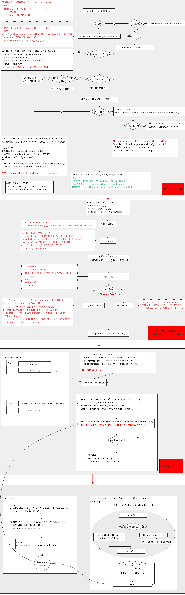

上篇文章中，我们详细分析了`React Scheduler`的原理。如果对这一部分不清楚的，请移步[React源码系列五：React Scheduler调度原理第一篇](https://juejin.im/post/6889314677528985614)，接下来，我们开始分析`Scheduler`在`React`中是如何使用的。

### 1. scheduleUpdateOnFiber
该方法是开始一次更新。也是React Scheduler 入口。还记得[React源码系列三：React.Render流程 二 之更新](https://juejin.im/post/6867710713754812423)中，不论是`更新`还是`首次render`，都会进入`updateContainer`方法。最后调用了`scheduleUpdateOnFiber(current, lane, eventTime)`函数，进入`Scheduler流程`。参数解析：<br>
- fiber: 整个应用程序的rootFiber，如果对`rootFiber`不熟悉，可以参考[React源码系列二：React Render之 FiberRoot](https://juejin.im/post/6857408790698917901)
- lane：`React 17`中，对任务优先级定制 `区间优先级`，具体请看[启发式更新算法](https://juejin.im/post/6860275004597239815#heading-0),这里先不做深入，后续再学习
- eventTime: 获取程序运行到目前为止的时间，用于`React Scheduler` 进行任务优先级排序<br>

```
tips: 对于Lane，似乎是一种新的架构，这里不进行深入，等后面再学习。例如 markRootUpdated 和 markUpdateLaneFromFiberToRoot 等方法，这里先不深入。
```

```javascript
/**
*fiber: container.current: 指向整个应用程序的rootFiber
*lane：优先级区间模型被称为lanes（车道模型）
*eventTime: 获取程序运行到目前为止的时间，用于进行任务优先级排序
**/
function scheduleUpdateOnFiber(fiber: Fiber, lane: Lane, eventTime: number) {
  // 检查是否进入无限循环
  checkForNestedUpdates();

  //找到rootFiber并遍历更新子节点的expirationTime（触发状态更新的fiber一直向上遍历到rootFiber，并返回rootFiber）
  const root = markUpdateLaneFromFiberToRoot(fiber, lane);
 
  // 标记根目录有待处理的更新
  markRootUpdated(root, lane, eventTime);

  // 如果是正在进行中(更新操作中)的 root
  if (root === workInProgressRoot) {
    // 如果root是正在更新的树，如果root不是deferRenderPhaseUpdateToNextBatch（已关闭，处于渲染阶段）标志， 在该树上标记更新的内容，
    if (deferRenderPhaseUpdateToNextBatch ||(executionContext & RenderContext) === NoContext) {
      workInProgressRootUpdatedLanes = mergeLanes(workInProgressRootUpdatedLanes, lane);
    }
    if (workInProgressRootExitStatus === RootSuspendedWithDelay) {
      // 如果任务已经延迟了，那么意味着后续还会进行更新渲染。将其标志位 `立即暂停`。将会达到中断当前渲染进行更新的效果？？？
      markRootSuspended(root, workInProgressRootRenderLanes);
    }
  }

  // 获取当前任务的优先级
  const priorityLevel = getCurrentPriorityLevel();

  // 如果是同步任务
  if (lane === SyncLane) {
    // 通过是：初次渲染
    if (
      // 检查是否在未批处理的更新内
      (executionContext & LegacyUnbatchedContext) !== NoContext &&
      // 检查是否尚未渲染
      (executionContext & (RenderContext | CommitContext)) === NoContext
    ) {
      // 首次挂在时， batchedUpdates内部的根应该是同步的，但是布局更新应该推迟到批处理结束。 这是不需要调度任务的同步任务的入口
      performSyncWorkOnRoot(root);
    } else {
      // 更新渲染

      // 确保root在调度，任务过期则立马同步执行
      ensureRootIsScheduled(root, eventTime);
      // 在根上注册待处理的交互，以避免丢失跟踪的交互数据。
      schedulePendingInteractions(root, lane);

      // 当前没有update时
      if (executionContext === NoContext) {

        // 刷新同步任务队列
        resetRenderTimer();
        flushSyncCallbackQueue();
      }
    }
  } else {
    // Schedule a discrete update but only if it's not Sync.
    // 仅在异步时执行离散更新
    if (
      (executionContext & DiscreteEventContext) !== NoContext &&
      // 只有在 ·用户阻止优先级· 或 ·更高优先级· 的更新才被视为离散，即使在离散事件中也是如此
      (priorityLevel === UserBlockingSchedulerPriority ||
        priorityLevel === ImmediateSchedulerPriority)
    ) {
      //这是离散事件的结果。 跟踪每个根的最低优先级离散更新，以便我们可以在需要时尽早清除它们。
      //如果rootsWithPendingDiscreteUpdates为null，则初始化它
      if (rootsWithPendingDiscreteUpdates === null) {
        rootsWithPendingDiscreteUpdates = new Set([root]);
      } else {
        rootsWithPendingDiscreteUpdates.add(root);
      }
    }
    // Schedule other updates after in case the callback is sync.
    // 确保FiberRoot节点已经被调度: 开启调度的入口
    ensureRootIsScheduled(root, eventTime);
    schedulePendingInteractions(root, lane);
  }
  mostRecentlyUpdatedRoot = root;
}
```

### 2. ensureRootIsScheduled
##### 函数param
该方法用于rootFiber的任务调度。一个root只有一个任务在执行。每次更新和任务退出前都会调用此函数。
1. callbackNode： 每个fiberRoot实例上都只会维护一个`历史任务`，该任务保存在callbackNode属性中。
2. callbackPriority： 当前执行任务的优先级
3. nextLanes: 此次任务的Lane
4. newCallbackPriority: 此次任务的优先级

##### 函数作用
1. 计算新任务的`过期时间`、`优先级`
2. 无新任务，退出调度
3. 有历史任务
   - 新旧任务的`优先级`相同，继续执行旧任务，（新任务会在旧任务执行完成之后的同步刷新钩子中执行）。
   - 新旧任务的`优先级`不相同，取消旧任务
4. 根据 不同的`Priority` 执行不同的调度(scheduleSyncCallback(同步)或scheduleCallback（异步）), 最后将返回值设置到fiberRoot.callbackNode

```javascript
function ensureRootIsScheduled(root: FiberRoot, currentTime: number) {
  const existingCallbackNode = root.callbackNode;  // 每个fiberRoot实例上都只会维护一个任务，该任务保存在callbackNode属性中
 
  markStarvedLanesAsExpired(root, currentTime);
  // nextLanes：此次任务的Lane值
  // newCallbackPriority: 此次任务的优先级
  const nextLanes = getNextLanes( root, root === workInProgressRoot ? workInProgressRootRenderLanes : NoLanes);
  const newCallbackPriority = returnNextLanesPriority();

  if (nextLanes === NoLanes) {
    if (existingCallbackNode !== null) {
      cancelCallback(existingCallbackNode);
      root.callbackNode = null;
      root.callbackPriority = NoLanePriority;
    }
    return;
  }

  // 历史任务不为空，
  if (existingCallbackNode !== null) {
    const existingCallbackPriority = root.callbackPriority;
    // 新任务和历史任务 优先级相同，则继续执行历史任务。
    if (existingCallbackPriority === newCallbackPriority) {
      return;
    }
    // 取消历史任务，scheduler会安排新的任务
    cancelCallback(existingCallbackNode);
  }

  // 准备新任务（new callback）
  let newCallbackNode;

  // 同步任务：
  if (newCallbackPriority === SyncLanePriority) {
    // Special case: Sync React callbacks are scheduled on a special internal queue
    // 特殊情况：Sync React回调被安排在特殊的内部队列中
    newCallbackNode = scheduleSyncCallback(performSyncWorkOnRoot.bind(null, root));

  // 同步批量更新 
  } else if (newCallbackPriority === SyncBatchedLanePriority) {
    newCallbackNode = scheduleCallback( ImmediateSchedulerPriority, performSyncWorkOnRoot.bind(null, root));
  } else {
    // 异步：获取任务优先级登记
    const schedulerPriorityLevel = lanePriorityToSchedulerPriority(newCallbackPriority);
    newCallbackNode = scheduleCallback(schedulerPriorityLevel,  performConcurrentWorkOnRoot.bind(null, root));
  }

  // 更新rootFiber的 最新任务优先级 和任务
  root.callbackPriority = newCallbackPriority;
  root.callbackNode = newCallbackNode;
}
```

### 3. 异步scheduleCallback / 同步scheduleSyncCallback 

该方法用于设置`调度优先级`和`回调函数`。
#### 3.1 scheduleCallback
根据传入的react优先级获取 当前任务 `调度的优先级`。
```javascript
export function scheduleCallback(reactPriorityLevel: ReactPriorityLevel, callback: SchedulerCallback, options: SchedulerCallbackOptions | void | null,) {
    // 将react的优先级转换为scheduler优先级
    const priorityLevel = reactPriorityToSchedulerPriority(reactPriorityLevel);
    return Scheduler_scheduleCallback(priorityLevel, callback, options);
}
```

#### 3.2 scheduleSyncCallback
- 同步渲染，将 `performSyncWorkOnRoot`添加至`syncQueue`中，
- 如果是首次添加，则同异步一样，调用`Scheduler_scheduleCallback`。优先级为`Scheduler_ImmediatePriority`。
- 将flushSyncCallbackQueueImpl 传入scheduler
```javascript
export function scheduleSyncCallback(callback: SchedulerCallback) {
  // 放回调放入队列（不存在创建），将在进行下一个任务时执行该任务。（如果有人flushSyncCallbackQueue，那会更快地执行）
  if (syncQueue === null) {
    syncQueue = [callback];
    // Flush the queue in the next tick, at the earliest.
    // 刷新任务队列
    immediateQueueCallbackNode = Scheduler_scheduleCallback(
      Scheduler_ImmediatePriority,
      flushSyncCallbackQueueImpl,
    );
  } else {
    // 放入现有·syncQueue·，不需要调用回调，因为我们已经在创建时进行了对任务进行了调度
    syncQueue.push(callback);
  }
  return fakeCallbackNode;
}
```

#### 3.3 flushSyncCallbackQueueImpl(更新同步队列)

```javascript
// 在React内部替换runWithPriority。
export const decoupleUpdatePriorityFromScheduler = false;

function flushSyncCallbackQueueImpl() {
  // isFlushingSyncQueue： 同步队列已更新
  // syncQueue: 同步队列

  // 同步队列为更新 且 队列不为空
  if (!isFlushingSyncQueue && syncQueue !== null) {
    // 防止再次进入
    isFlushingSyncQueue = true;
    let i = 0;
    if (decoupleUpdatePriorityFromScheduler) {
      // 获取当前任务优先级
      const previousLanePriority = getCurrentUpdateLanePriority();
      try {
        // 将当前执行的任务设置为同步
        const isSync = true;
        const queue = syncQueue;
        setCurrentUpdateLanePriority(SyncLanePriority);

        // 执行所有同步任务
        runWithPriority(ImmediatePriority, () => {
          for (; i < queue.length; i++) {
            let callback = queue[i];
            do {
              callback = callback(isSync);
            } while (callback !== null);
          }
        });
        // 清空同步任务
        syncQueue = null;
      } catch (error) {
        // 如果发生异常，请将其余的回调保留在队列中。
        if (syncQueue !== null) {
          syncQueue = syncQueue.slice(i + 1);
        }
        // 在下一个任务中继续执行
        Scheduler_scheduleCallback(Scheduler_ImmediatePriority, flushSyncCallbackQueue);
        throw error;
      } finally {
        // 同步任务执行完毕，将当前任务优先级设置为 之前的优先级
        setCurrentUpdateLanePriority(previousLanePriority);
        // 并将标志设置为false
        isFlushingSyncQueue = false;
      }
    } else {

      // 与上面的try catch 相比，只是 少了 获取当前优先级， 以及恢复优先级 的一个操作。其他是一样的。将syncQueue中的任务执行完毕，并将isFlushingSyncQueue=false
      try {
        xxx
      } catch (error) {
       xxxx
      }
    }
    // 执行了任务，返回true
    return true;
  } else {
    // 没有任何操作 返回false
    return false;
  }
}
```

### 5. Scheduler_scheduleCallback
至此，终于与上一篇文章衔接起来，在上一章节调度中，进行发起调度。`Scheduler_scheduleCallback`请移步[React源码系列五：React Scheduler调度原理第一篇](https://juejin.im/post/6889314677528985614)。

#### 5.1 新建task
将上面传入 `Scheduler_scheduleCallback`函数的 `回调函数`挂在到了task/callback上 .
- 及时任务： 添加至 `taskQueue`
- 延时任务： 添加至 `timerQueue`<br>

#### 5.2 发起调度
- 及时任务: 直接调用`requestHostCallback(flushWork)`, 设置回调为`flushWork`
- 延时任务： 调用`requestHostTimeout(handleTimeout)`设置定时器回调， 定时器触发之后调用`requestHostCallback(flushWork)`, 设置回调为`flushWork`
- `requestHostCallback`函数把`flushWork`设置为`scheduledHostCallback`
- 添加宏任务：`requestHostCallback`通过`MessageChanel`的 api 添加一个宏任务,使得最终的回调`performWorkUntilDeadline`在下一个事件循环才会执行<br>

##### 5.2.1 requestHostTimeout / handleTimeout / advanceTimers
这里插入一个小插曲，在调度原理一中遗漏的。当无`及时任务`，我们会将延时任务通过定时器，将``延时任务`推入`及时任务`队列中。这里，我们来详细看一下，是如何实现的。<br>

###### 5.2.1.1 requestHostTimeout
在`requestHostTimeout`中，我们通过设置定时器，执行了方法`handTimeout`
```javascript
requestHostTimeout = function(callback, ms) {
taskTimeoutID = setTimeout(() => {
	callback(getCurrentTime());
}, ms);
};

requestHostTimeout(handleTimeout, startTime - currentTime); 
```

###### 5.2.1.2 handleTimeout
- isHostTimeoutScheduled：是否有延时任务正在调度，设置为false
- advanceTimers: 获取`延时任务`中优先级较高的任务（到期该执行），移出`延时任务`，放入`及时任务`。
- 如果无延时任务调度，则将`isHostTimeoutScheduled = true`,表示开始延时任务调度。如果`taskQueue`中无任务，则重新执行`handleTimeout`，否则就从`taskQueue`中获取任务，`requestHostCallback(flushWork)`执行任务。
```javascript
function handleTimeout(currentTime) {

  // 是否有延时任务正在调度
  isHostTimeoutScheduled = false;

  // 获取 timerQueue的任务 放入 taskQueue
  advanceTimers(currentTime);
  
  // 无延时任务调度
  if (!isHostCallbackScheduled) {
    // 从taskQueue中 获取任务，将 `isHostCallbackScheduled`设置为true,表示有延时任务正在调度
    if (peek(taskQueue) !== null) {
      isHostCallbackScheduled = true;

      // 通过 requestHostCallback 开始执行flushWork
      requestHostCallback(flushWork);
    } else {

      // 如果 taskQueue中无任务，则 从timerQueue中获取任务，通过`requestHostTimeout`定时器，重新执行`handeTimeout`
      const firstTimer = peek(timerQueue);
      if (firstTimer !== null) {
        requestHostTimeout(handleTimeout, firstTimer.startTime - currentTime);
      }
    }
  }
}
```

###### 5.2.1.3 advanceTimers
循环遍历`timerQueue`,获取出应该执行的任务，并将其从`timerQueue`中移动到`taskQueue`中
```javascript
function advanceTimers(currentTime) {
  // Check for tasks that are no longer delayed and add them to the queue.
  // 获取timerQueue中优先级最高的timer
  let timer = peek(timerQueue);
  while (timer !== null) {
    // 如果callback为空，取消该timer
    if (timer.callback === null) {
      pop(timerQueue);

    // 如果timer的开始执行时间 <=currentTime,表示任务早该执行了
    } else if (timer.startTime <= currentTime) {
      // 计时器触发，将该timer从`timerQueue`中移除，放入`taskQueue`中
      pop(timerQueue);
      timer.sortIndex = timer.expirationTime;
      push(taskQueue, timer);

    } else {
      // 如果还没到执行时间，则不作任何操作
      return;
    }

    // 循环处理，获取已经到时间，应该执行的任务
    timer = peek(timerQueue);
  }
}
```

##### 5.2.2 flushWork（执行任务）
`flushWork`作为`requestHostCallback`回调函数，在经历`requestHostCallback`复杂的`Scheduler`过程后，`flushWork`开始执行调度任务。<br>
- hasTimeRemaining: 代表当前帧是否还有时间留给 react
- initialTime: 即 currentTime<br>

在`flushWork`中，主要是对几个状态的重置。因为 `requestHostCallback`并不一定会立即执行那些传入的回调函数，因此使用`isHostCallbackScheduled`状态需要为此一段时间。
```javascript
function flushWork(hasTimeRemaining, initialTime) {
 
  /// 全局变量，代表调度任务是否执行
  isHostCallbackScheduled = false;

  // 全局变量，是否有延时任务正在调度（上面在handleTimeout中设置的， 从timerQueue中获取任务，放入taskQueue,这里不需要了）
  if (isHostTimeoutScheduled) {
    //因为已经进入flushWork流程，不需要再执行超时任务，因此取消它
    isHostTimeoutScheduled = false;
    // 清除定时器（清除requestHostTimeout函数设置的定时器）
    cancelHostTimeout();
  }

  // 全局变量，代码执行完成后变成 false
  isPerformingWork = true;
  // 当前执行任务的优先级
  const previousPriorityLevel = currentPriorityLevel;
  try {
    return workLoop(hasTimeRemaining, initialTime);
    } finally {

      // 执行完毕后，清除标识
      currentTask = null; // 当前任务 null
      currentPriorityLevel = previousPriorityLevel; // 恢复 currentPriorityLevel
      isPerformingWork = false; // 代码执行结束（正在执行works = false）
    }
}
```

##### 5.2.3 workloop
- hasTimeRemaining: 是否还有时间用于执行任务
- initialTime: 当前时间
- shouldYieldToHost(): 用于判断任务是否超时、需要被打断，超时就需要暂停。
```javascript
function workLoop(hasTimeRemaining, initialTime) {

  // 获取当前时间
  let currentTime = initialTime;

  // 将 `timerQueue` 中需要执行的任务 放入 `taskQueue`
  advanceTimers(currentTime);

  // 获取当前需要执行的任务 currentTask
  currentTask = peek(taskQueue);
  // 只要任务存在，loop就会一直循环下去
  while (currentTask !== null) {
    // task 未过期 但是 hasTimeRemaining 没有执行时间了
    // task 未过期 但是需要被暂停
    if (
      currentTask.expirationTime > currentTime &&
      (!hasTimeRemaining || shouldYieldToHost())
    ) {
      // 任务没有过期，但是已经到了react的运行截止时间，跳出循环。任务会在下个周期执行
      break;
    }
    const callback = currentTask.callback;

    if (typeof callback === 'function') {
      currentTask.callback = null;
      currentPriorityLevel = currentTask.priorityLevel;

      // 判断当前任务是否过期（是否还有剩余时间）
      const didUserCallbackTimeout = currentTask.expirationTime <= currentTime;

      const continuationCallback = callback(didUserCallbackTimeout);
      currentTime = getCurrentTime();

      if (typeof continuationCallback === 'function') {
       // 如果 continuationCallback 成立（存在），则将其取代 callback
        currentTask.callback = continuationCallback;
      } else {
        // continuationCallback 不存在，不执行该任务了，将任务从 taskQueue中取弹出
        if (currentTask === peek(taskQueue)) {
          pop(taskQueue);
        }
      }

      // 轮询成立 tiemrQueue，将需要执行的任务添加到 taskQueue
      advanceTimers(currentTime);
    } else {

      // callback为空，则直接取消该任务，不再执行
      pop(taskQueue);
    }

    // while 循环处理 taskQueue，
    currentTask = peek(taskQueue);
  }

  // Return whether there's additional work
  // 这里就是检查 `是否还有更多任务`
  // true,表示 还有任务未执行完毕， hasMoreWork = 返回值
  // hasMoreWork： 会继续 调用 `performWorkUntilDealine`
  if (currentTask !== null) {
    return true;
  } else {

    // 没有更多任务，继续 执行 requestHostTime, 查看 timerQueue中到期任务，放入 taskQueue中
    const firstTimer = peek(timerQueue);
    if (firstTimer !== null) {
      requestHostTimeout(handleTimeout, firstTimer.startTime - currentTime);
    }
    return false;
  }
}
```


#### 5.3 进度Scheuduler流程图
至此，已结束任务调度相关的学习，我们这里来整理一下整个调度流程。<br>

<br>

### 6. 结束语
调度原理这一部分，如果深入挖掘细节，确实还有很多可以学习的。感觉代码真的是很复杂，因此也只能停留在表面浅层。留作记录，期待以后再研究这部分时，现在的记录能够帮到以后的自己。下一篇，会进行研究`更新流程(diff等)`,阅读这个源码，是有空在研究，因此持续时间很长了，期待自己坚持。<br>