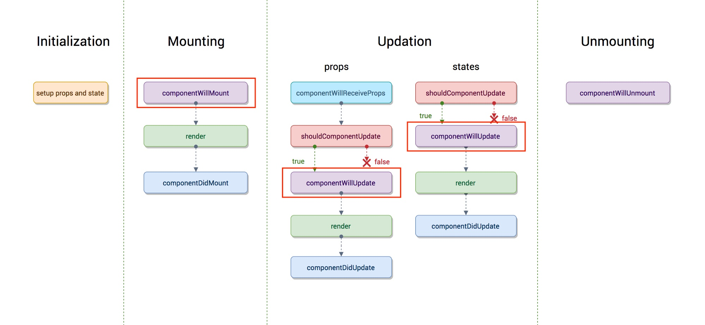

# 1. react16移除了（未来）Willxxx生命周期(除了componentWillUnmount)
# componentWillMount
- 有些开发者在componentWillMount进行异步调用数据接口进行获取数据，官网鼓励使用constructor中初始化异步数据。
- 在服务端渲染中，可以在componentWillMount中进行数据获取，因为componentDidMount在服务端渲染是不会被调用的。解决办法：如果不需要立即在页面上进行显示的数据，建议放入到componentDidMount,在客户端进行调用。页面需要的数据，可以将请求逻辑提取出来，在服务端根据当前的路由找到相应的数据请求，利用链式的Promise在渲染最终页面之前将数据塞入redux store,这样服务端返回的html中就包含异步数据结果。
- 事件订阅：我们在componentWillMount中订阅事件，在componentWillUnmount中取消订阅事件。但实际上componentWillMount调用后并不能保证componentWillUnmount一定能够调用，例如服务端渲染中componentWillUnmount就不会被调用。会直接导致服务端内存泄漏。尤其是未来React开启异步渲染模式后，在componentWillMount被调用后，极有可能被其他事务所打断，导致componentWillUnmount不被调用。而componentDidMount不存在这个问题，当它被调用，componentWillUnmount一定会被调用。<br>
因此，如果之前使用到了componentWillMount的代码，可以迁移到ComponentDidMount中。

# componentWillReceiveProps
在React15中，如果自身的某个state与其他的props密切相关，最好的方式就是：在componentWillReceiveProps中判断前后两个props是否相同，再决定是否在需要将新的props更新到相应的state上去。<br>
```javascript
// before
componentWillReceiveProps(nextProps) {  
  if (nextProps.translateX !== this.props.translateX) {
    this.setState({ 
      translateX: nextProps.translateX, 
    }); 
  } 
}
```
在React16中，移除掉了componentWillRecieveProps，增加了getDerivedStateFromProps。
```javascript
// after
static getDerivedStateFromProps(nextProps, prevState) {
    if (nextProps.translateX !== prevState.translateX) {
        return {
        translateX: nextProps.translateX,
        };
    }
    return null;
}
```
两者看起来没有什么区别，而网上说的是：这是 React 团队对于软件工程深刻理解的一个改动，React 团队试图通过框架级别的 API 来约束或者说帮助开发者写出可维护性更佳的 JavaScript 代码。
```javascript
// before
componentWillReceiveProps(nextProps) {
  if (nextProps.isLogin !== this.props.isLogin) {
    this.setState({ 
      isLogin: nextProps.isLogin,   
    });
  }
  if (nextProps.isLogin) {
    this.handleClose();
  }
}

// after
static getDerivedStateFromProps(nextProps, prevState) {
  if (nextProps.isLogin !== prevState.isLogin) {
    return {
      isLogin: nextProps.isLogin,
    };
  }
  return null;
}
componentDidUpdate(prevProps, prevState) {
  if (!prevState.isLogin && this.props.isLogin) {
    this.handleClose();
  }
}
```
在React15中，componentWillRecieveProps中 `会做根据新的props更新state`。第二个就是`触发一些回调，例如动画或页面跳转`。在新版本中，官方将跟新state与触发回调重新分配到了`getDerivedStateFromPorps`和`componentDidUpdate`中，使得整体的更新逻辑较为清晰。并且getDerivedStateFromProps禁止访问`this.props`,强制开发者比较nextProps和prevState,以确保开发者使用的是getDerivedStateFromProps声明周期函数，就是在根据当前的 props 来更新组件的 state，而不是去做其他一些让组件自身状态变得更加不可预测的事情。<br>
将现在componetWillReceiveProps中的代码触发state的放到getDerivedStateFromProps方法中，回调放入到componentDidUpdate中。

# componentWillUpdate
处理一些props改变带来的副作用。开发者可能在该方法中也根据props的变化触发一些回调，但不论是componentWillUpdate还是componentWillRecieveProps，都有可能在更新中被调用多次，也就是说在这里的回调函数可能被调用多次，显然是不正确的。与componentDidMount类似，componentDidUpdate是不存在这个问题，一次更新中只会被调用一次，所以可以将代码迁移到componentDidUpdate中。<br>
另外一个常见的：就是在组件更新之前读取当前某个DOM元素的状态，并在componentDidUpdate中进行相应的处理。在React异步渲染模式开启以后，render阶段和commit阶段之前并不是无缝衔接的，也就是说render阶段读取到的DOM元素并不总是和commit阶段相同，这回导致componentDidUpdate中使用componentWillUpdate中读取到的DOM是不安全的，可能这个值已经失效了。这是React提供了一个新的生命周期函数：`getSnapshotBeforeUpdate(prevProps, prevState)`。<br>
`getSnapshotBeforeUpdate`方法会在最终render方法调用之前被调用，也就是说在该方法中读取到的DOM元素是可以保证与componentDidUpdate中一致的，虽然`getSnapshotBeforeUpdate`不是一个静态方法，但是我们应该尽量使用它去返回一个值，这个值随后被传入`componentDidUpdate`中，然后就可以去更新组件的状态了，而不是在`getSnapshotBeforeUpdate`中直接更新组件状态。
```javascript
class ScrollingList extends React.Component {
  listRef = null;

  getSnapshotBeforeUpdate(prevProps, prevState) {
    // Are we adding new items to the list?
    // Capture the scroll position so we can adjust scroll later.
    if (prevProps.list.length < this.props.list.length) {
      return (
        this.listRef.scrollHeight - this.listRef.scrollTop
      );
    }
    return null;
  }

  componentDidUpdate(prevProps, prevState, snapshot) {
    // If we have a snapshot value, we've just added new items.
    // Adjust scroll so these new items don't push the old ones out of view.
    // (snapshot here is the value returned from getSnapshotBeforeUpdate)
    if (snapshot !== null) {
      this.listRef.scrollTop =
        this.listRef.scrollHeight - snapshot;
    }
  }

  render() {
    return (
      <div ref={this.setListRef}>
        {/* ...contents... */}
      </div>
    );
  }

  setListRef = ref => {
    this.listRef = ref;
  };
}
```
解决办法：将现有的 componentWillUpdate 中的回调函数迁移至 componentDidUpdate。如果触发某些回调函数时需要用到 DOM 元素的状态，则将对比或计算的过程迁移至 getSnapshotBeforeUpdate，然后在 componentDidUpdate 中统一触发回调或更新状态。

# 生命周期函数图解

之前的生命周期图如下所示：被红框圈起来的三个生命周期函数就是在新版本中即将被移除的,并且将要被移除的三个生命周期函数都是在 render 之前会被调用到的，根据原来的设计，这三个生命周期都可以做一些注入发送请求，setState等包含副作用的事情，在老版本中这样会带来一些性能损耗。<br>
<br>
React16新版本的生命周期：在React开启了异步渲染模式后，无法接受Willxxx方法带来的副作用（例如开发者commit10个文件更新后，又对当前或其他文件做了更新，但是push时任然只push了刚刚commit的10个文件，会导致提交记录与实际更新不符，为了避免这个情况，需要保证每一次的文件更新都需要经历commit阶段，再被提交到远端，这就是React在开启异步渲染模式之后要做的）。增加了getDerivedStateFromProps和getSnapshotBeforeUpdate方法。
<br>


https://zhuanlan.zhihu.com/p/36062486?group_id=973241957228765184