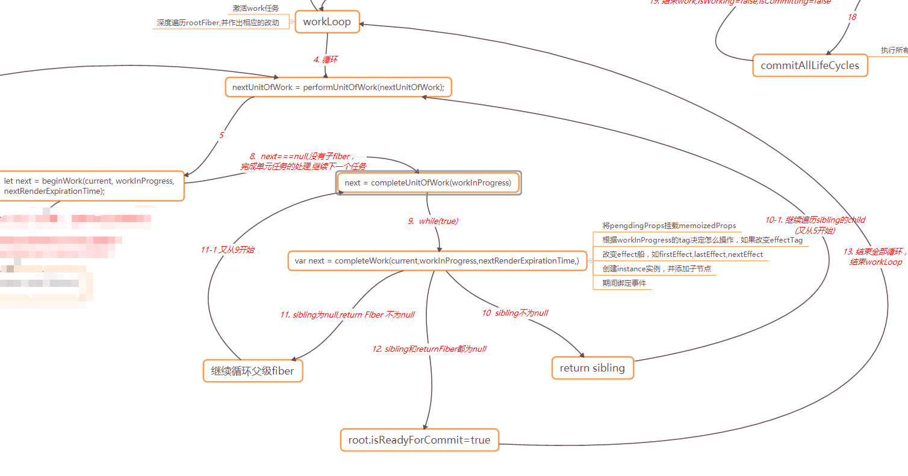

# 1. 整体图解
在React16中，虽然也是通过JSX编译得到一个虚拟DOM对象，渲染流程是jsx => element tree => fiber tree => html dom。
- schedule work: 执行虚拟DOM (fiber 树)的更新，有schedulework, requestWork, performWork三部曲。
- reconcile Work: 分为调度阶段h(render/reconciliation)和渲染阶段(commit)
  1. 调度阶段：在这个阶段React会更新数据生成Virual DOM,然后通过diff算法，快速找出更新的元素，放入到更新队列中，得到新的更新队列（改变pendingState,pendingProps,最后构建新的fiber tree）。在初始时则生成子fiber,链接fiber与siblingFiber
  1. 渲染commit阶段：React会遍历更新队列，将其所有的变更一次性更新到DOM上，并触发响应生命周期函数钩子。<br>
<br>

# 2. Schedule Work 阶段
<br>
# 2.1 legacyRenderSubtreeIntoContainer(入口)
在ReactDOM的源代码中，可以看到下面的方法：
```javascript
const ReactDOM: Object = {
  createPortal,
  hydrate(element: React$Node, container: DOMContainer, callback: ?Function) {
    // TODO: throw or warn if we couldn't hydrate?
    return legacyRenderSubtreeIntoContainer(
      null,
      element,
      container,
      true,
      callback,
    );
  },
  // 在17版本中慢慢会退出历史舞台
  render( element: React$Element<any>,container: DOMContainer,callback: ?Function,) {
    return legacyRenderSubtreeIntoContainer(
      null,
      element,
      container,
      false,
      callback,
    );
  },
```
我们来看一下legacyRenderSubtreeIntoContainer，这是一个内部API。如果根root,那么root个结构返回：
- 新增一个_internalRoot属性（它的containerInfo指向root自身DOM节点）
```javascript
function legacyRenderSubtreeIntoContainer(
  parentComponent: ?React$Component<any, any>, // 父组件
  children: ReactNodeList, // 需要渲染的子组件(是一个List)
  container: DOMContainer, // 页面根DOM元素
  forceHydrate: boolean,  // 是否hydrate
  callback: ?Function, // 回调函数
) {
  let root: Root = (container._reactRootContainer: any);
  if (!root) {
    // Initial mount
    // 初次渲染时初始化， 创建react Fiber Root 。
    root = container._reactRootContainer = legacyCreateRootFromDOMContainer(
      container,
      forceHydrate,
    );
    ...
    // Initial mount should not be batched.
    //对newRoot对象进行更新
    DOMRenderer.unbatchedUpdates(() => {
      // parentCompopnent不为空，则legacy_renderSubtreeIntoContainer方法，否则直接调用自己的render方法
      if (parentComponent != null) {
        root.legacy_renderSubtreeIntoContainer(
          parentComponent,
          children,
          callback,
        );
      } else {
        root.render(children, callback);
      }
    });
  } else {
    ...
    //对root对象进行更新
    if (parentComponent != null) {
      root.legacy_renderSubtreeIntoContainer(
        parentComponent,
        children,
        callback,
      );
    } else {
      root.render(children, callback);
    }
  }
  // 返回根容器fiber树的根fiber实例
  return DOMRenderer.getPublicRootInstance(root._internalRoot);
}

```
# 2.2 createContainer
DOMRenderer传入渲染UI操作API,调用调和算法(ReactFiberReconciler)返回的DOM渲染器对象。
```javascript
function legacyCreateRootFromDOMContainer(container: DOMContainer,forceHydrate: boolean): Root {
  const shouldHydrate = forceHydrate || shouldHydrateDueToLegacyHeuristic(container);
  // 清空存在的内容
  if (!shouldHydrate) {
    let warned = false;
    let rootSibling;
    while ((rootSibling = container.lastChild)) {
      container.removeChild(rootSibling);
    }
  }
  // Legacy roots are not async by default. 旧版本默认不是异步的
  const isAsync = false;
  return new ReactRoot(container, isAsync, shouldHydrate);
}

function ReactRoot(container: Container, isAsync: boolean, hydrate: boolean) {
  const root = DOMRenderer.createContainer(container, isAsync, hydrate);
  // 将root Fiber 挂在_internalRoot对象上
  this._internalRoot = root;
}
```
createContainer是怎么创建root对象的呢？
```javascript
// containerInfo就是ReactDOM.render(<div/>, containerInfo)的第二个对象，换言之是一个元素节点
createContainer: function (containerInfo, hydrate) {
   return createFiberRoot(containerInfo, hydrate);
},

// 再看createFiberRoot是怎么将一个真实DOM变成一个Fiber对象
export function createFiberRoot(
  containerInfo: any,
  isAsync: boolean,
  hydrate: boolean,
): FiberRoot {
  // Cyclic construction. This cheats the type system right now because
  // stateNode is any.
  // 创建rootFiber
  const uninitializedFiber = createHostRootFiber(isAsync); 
  const root = {
    current: uninitializedFiber,
    containerInfo: containerInfo,
    pendingChildren: null,
    pendingCommitExpirationTime: NoWork,
    finishedWork: null,
    context: null,
    pendingContext: null,
    hydrate,
    remainingExpirationTime: NoWork,
    firstBatch: null,
    nextScheduledRoot: null,
  };
  uninitializedFiber.stateNode = root;
  return root;
}

function createHostRootFiber() {
  var fiber = createFiber(HostRoot, null, NoContext);
  return fiber;
}

var createFiber = function (tag, key, internalContextTag) {
  return new FiberNode(tag, key, internalContextTag);
};
```
# 2.3 scheduleRootUpdate
- createUpdate： 创建一个update更新队列
- enqueueUpdate:将update对象放入队列，如果是初始状态，lastUpdate 与firstUpdate都是一样的，否则直接追加到链表最后
- scheduleWork： 开始调度
```javascript
 function scheduleRootUpdate(
    current: Fiber,
    element: ReactNodeList,
    currentTime: ExpirationTime,
    expirationTime: ExpirationTime,
    callback: ?Function,
  ) {
    // 创建update 更新对象
    const update = createUpdate(expirationTime);
    update.payload = {children: element};

    callback = callback === undefined ? null : callback;
    if (callback !== null) {
      update.callback = callback;
    }
    // 放入更新队列
    enqueueUpdate(current, update, expirationTime);
    // 计划开始更新
    scheduleWork(current, expirationTime);
    return expirationTime;
  }
```
# 2.4 requestWork
- 当调度器有 update 工作的时候，就会调用 requestWork 。在其中改变 firstScheduledRoot ， lastScheduledRoot 等被调度的 FiberRoot。
- 函数中需要判断的 isBatchingUpdates，在事件触发后会改变。以下代码是事件触发后会执行，所以在 requestWork 时，isBatchingUpdates 为 true
```javascript
function batchedUpdates(fn, a) {
    var previousIsBatchingUpdates = isBatchingUpdates; // 批量处理嘛
    isBatchingUpdates = true;
    try {
        return fn(a); // // 此过程中可能改变state所以需要再performWork
    } finally {
        isBatchingUpdates = previousIsBatchingUpdates; 
        if (!isBatchingUpdates && !isRendering) {
            performWork(Sync, null);
        }
    }
}
```
# 2.5 performWork
找到优先级最高的 work ，并激活它，此后开始构建 fiber 树。

# 2.6 performWorkOnRoot
开始渲染，isRendering = true 区分同步渲染还是异步渲染
在 performWorkOnRoot 方法中有两个重要的步骤。1. renderRoot 。2. commitRoot。
```javascript
function performWorkOnRoot() {
// Flush sync work.
    var finishedWork = root.finishedWork;
    if (finishedWork !== null) {
      // This root is already complete. We can commit it.
      completeRoot(root, finishedWork, expirationTime);
    } else {
      finishedWork = renderRoot(root, expirationTime, false);
      if (finishedWork !== null) {
        // We've completed the root. Commit it.
        // 内部调用commitRoot
        completeRoot(root, finishedWork, expirationTime);
      }
    }
  }
```
# 2. reconcile work 阶段
<br>
开始 work ，设置 workloop 函数中所用到的 nextUnitOfWork（复制 nextRoot.current 得到） ，然后执行 workloop 循环函数，得到更新后的 fiber 树。
# 2.1 renderRoot
```javascript
  function renderRoot(
    root: FiberRoot,
    expirationTime: ExpirationTime,
    isAsync: boolean,
  ): Fiber | null {
    isWorking = true;
    // 通过根root创建work-in-progress，设置到nextUnitOfWork
    nextUnitOfWork = createWorkInProgress(
        nextRoot.current,
        null,
        nextRenderExpirationTime,
      );
      root.pendingCommitExpirationTime = NoWork;
    do {
        // 循环处理
        workLoop(isAsync);
        const sourceFiber: Fiber = nextUnitOfWork;
        let returnFiber = sourceFiber.return;
        ....
      }
      break;
    } while (true);

    // We're done performing work. Time to clean up.
    let didCompleteRoot = false;
    isWorking = false;

    // Yield back to main thread.
    if (nextUnitOfWork === null) {
      // We reached the root.
      if (isRootReadyForCommit) {
        didCompleteRoot = true;
        // The root successfully completed. It's ready for commit.
        root.pendingCommitExpirationTime = expirationTime;
        const finishedWork = root.current.alternate;
        return finishedWork;
      } 
      ....
  }
```

# 2.2 workLoop
以深度遍历方式，激活所有期望 work ，对每个 work 都执行 performUnitOfWork。<br>
<br>
```javascript
function workLoop(isAsync) {
    if (!isAsync) {
      // Flush all expired work.
      // 处理所有已经到期的更新
      while (nextUnitOfWork !== null) {
        nextUnitOfWork = performUnitOfWork(nextUnitOfWork);
      }
    } else {
      // Flush asynchronous work until the deadline runs out of time.
      // 依次处理异步更新，直至deadline到达
      while (nextUnitOfWork !== null && !shouldYield()) {
        nextUnitOfWork = performUnitOfWork(nextUnitOfWork);
      }
    }
  }
```
<br>
# 2.3 performUnitOfWork
```javascript
 function performUnitOfWork(workInProgress: Fiber): Fiber | null {
    // 当前最新版本fiber实例使用fiber的alternate属性获取
    const current = workInProgress.alternate;
    // See if beginning this work spawns more work.
    startWorkTimer(workInProgress);
    // 根据fiber.tag类型，更新不同的fiber节点。返回子组件fiber实例-----（深度处理child）
    let next = beginWork(current, workInProgress, nextRenderExpirationTime);
    if (next === null) {
      // If this doesn't spawn new work, complete the current work.
      // 不存在子级fiber，完成单元任务的处理，之后继续处理下一个任务
      // 处理sibling,return(parent)
      next = completeUnitOfWork(workInProgress);
    }
    ReactCurrentOwner.current = null;
    return next;
  }  
```
# 2.4 beginWork
期间执行生命周期函数getDerivedStateFromProps。在 updateClassComponent 中执行 render。
根据 workInProgress 的 tag （ component 类型）来做出相应的更新。将更新后得到的 child（可为 null）返回，置为 child 属性，此时 alternate 仍为 null。
```javascript
// beginWork，开始任务处理
 function beginWork(
   current, workInProgress, renderExpirationTime
 ) {
   switch (workInProgress.tag) {
     // 对应不同类型fiber，执行不同处理逻辑
     case IndeterminateComponent:
       ...
     case FunctionalComponent:
       return updateFunctionalComponent(current, workInProgress);
     case ClassComponent:
       // 更新类组件，返回子级fiber实例
       return updateClassComponent(
         current, workInProgress, renderExpirationTime
       );
     case HostRoot:
       return updateHostRoot(current, workInProgress, renderExpirationTime);
     case HostComponent:
       ...
     case HostText:
       return updateHostText(current, workInProgress);
     case CallHandlerPhase:
       // This is a restart. Reset the tag to the initial phase.
       workInProgress.tag = CallComponent;
     case CallComponent:
       ...
     case ReturnComponent:
       // A return component is just a placeholder, we can just run through the
       // next one immediately.
       return null;
     case HostPortal:
       ...
     case Fragment:
       return updateFragment(current, workInProgress);
     default:;
   }
 }
```
beginWork的详细分解图：<br>
<br>

# 2.5 completeUnitOfWork
```javascript
function completeUnitOfWork(workInProgress) {
  // 努力完成当前的work unit,然后返回sibling。如果没有sibling，返回parent
  while (true) {
    
    var current = workInProgress.alternate;
    var returnFiber = workInProgress.return;
    var siblingFiber = workInProgress.sibling;
    if ((workInProgress.effectTag & Incomplete) === NoEffect) {
      // This fiber completed. 当前的work unit完成
      var next = completeWork(current, workInProgress, nextRenderExpirationTime);
      if (returnFiber !== null && (returnFiber.effectTag & Incomplete) === NoEffect) {
        
        // 将所有的subtree的effects添加到父级effect 列表中
        if (returnFiber.firstEffect === null) {
          returnFiber.firstEffect = workInProgress.firstEffect;
        }
        if (workInProgress.lastEffect !== null) {
          if (returnFiber.lastEffect !== null) {
            returnFiber.lastEffect.nextEffect = workInProgress.firstEffect;
          }
          returnFiber.lastEffect = workInProgress.lastEffect;
        }
      ....
      if (siblingFiber !== null) {
       // sibling存在，直接返回
        return siblingFiber;
      } else if (returnFiber !== null) {
        // sibling不存在，循环继续， Complete the returnFiber.
        workInProgress = returnFiber;
        continue;
      } else {
        // sibling 不存在，parent不存在，则准备好了commit
        isRootReadyForCommit = true;
        return null;
      }
    } 
}
```
<br>

# 2.7 completeWork（通过completeWork完成DOM节点更新）
```javascript
function completeWork(current, workInProgress, renderExpirationTime) {
  var newProps = workInProgress.pendingProps;
  switch (workInProgress.tag) {
    case FunctionalComponent:
      return null;
    case ClassComponent:
     ...
    case HostRoot:
     ....
    case HostComponent:
      {
        popHostContext(workInProgress);
        var rootContainerInstance = getRootHostContainer();
        var type = workInProgress.type;
        if (current !== null && workInProgress.stateNode != null) {
          // If we have an alternate, that means this is an update and we need to
          // schedule a side-effect to do the updates.
          var oldProps = current.memoizedProps;
          // If we get updated because one of our children updated, we don't
          // have newProps so we'll have to reuse them.
          // TODO: Split the update API as separate for the props vs. children.
          // Even better would be if children weren't special cased at all tho.
          var instance = workInProgress.stateNode;
          var currentHostContext = getHostContext();
          // TODO: Experiencing an error where oldProps is null. Suggests a host
          // component is hitting the resume path. Figure out why. Possibly
          // related to `hidden`.
          var updatePayload = prepareUpdate(instance, type, oldProps, newProps, rootContainerInstance, currentHostContext);

          updateHostComponent$1(current, workInProgress, updatePayload, type, oldProps, newProps, rootContainerInstance, currentHostContext);

          if (current.ref !== workInProgress.ref) {
            markRef$1(workInProgress);
          }
        
      }
    case HostText:
    ...
      }
    case ForwardRef:
      return null;
    case TimeoutComponent:
    ...
```
<br>
# 3. commitRoot
<br>
```javascript
finishedWork = renderRoot(root, expirationTime);
...
commitRoot(finishedWork);
```
在renderRoot后，构建了一个新的fiber树，但此树只是root.current的替代品，还没有正真应用到root.current上。当调用了root.commitRoot后，将root.current改变为finishedWork，这时root.current.alertnate===finishedWork.alertnate,为最初的currentFiber对象。<br>
在 commitRoot 中，将已经连接起来的 effect 串从头开始执行，对于 effect fiber ，根据其 effectTag ，来标记其操作方式。

# 3.1 commitAllHostEffects
向 parent 插入真实 dom 节点。

# 3.2  commitAllLifeCycles
```javascript
var finishedWork = nextEffect;
if (finishedWork.effectTag & Update) {
    if (current === null) {
        instance.props = finishedWork.memoizedProps;
        instance.state = finishedWork.memoizedState;
        instance.componentDidMount(); // 执行componentDidMount钩子函数
    } else {
        var prevProps = current.memoizedProps;
        var prevState = current.memoizedState;
        instance.props = finishedWork.memoizedProps;
        instance.state = finishedWork.memoizedState;
        instance.componentDidUpdate(prevProps, prevState);
    }
}
```
参考：https://github.com/UNDERCOVERj/tech-blog/issues