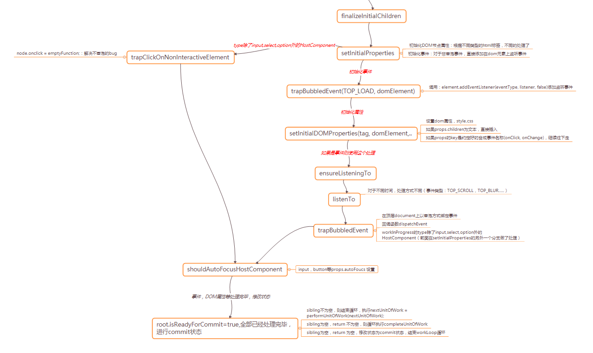

首先需要明白一点，一个事件的发生分为冒泡阶段与捕获阶段。有些事件可冒泡，有些则不行：例如focus,blur。
# 1 事件绑定原理
react中的事件是根据`nativeEvent对象`修改后的合成对象，对于事件采用事件委托，将事件绑定到顶层docuemnt对象上，对于全局dom元素所涉及到的事件，react都会处理。对于冒泡事件，是在document对象的冒泡阶段触发，对于非冒泡事件，是在document对象的捕获阶段触发。最后再dispatchEvent中决定真正回调函数的执行。<br>
# 2. 合成事件对象
以下列举了合成事件对象，对于事件类别不同，而有不同的属性<br>
MouseEvent,AnimationEvent, UIEvent, InputEvent, CompositionEvent, ClipboardEvent, FocusEvent, KeyboardEvent, DragEvent, TouchEvent, TransitionEvent, WheelEvent 等事件都是在以下基础属性上再添加属性。
```javascript
var EventInterface = { // nativeEvent对象属性
    type: null,
    target: null,
    // currentTarget is set when dispatching; no use in copying it here
    currentTarget: emptyFunction.thatReturnsNull,
    eventPhase: null,
    bubbles: null,
    cancelable: null,
    timeStamp: function (event) {
        return event.timeStamp || Date.now();
    },
    defaultPrevented: null,
    isTrusted: null
};
```
新建事件对象时，会重写stopPropagation(阻止冒泡事件)和preventDefault（阻止默认行为）这样的原生事件函数，后面讲解重写的函数是如何达到目的的。<br>
并且新建的事件对象用 proxy 对象来拦截，以便于处理异常。
# 3. 事件的绑定过程
事件绑定发生在completeWork阶段，也就是在发现workInProgresss没有childFiber时，进而对workInProgress进行处理(改变effectTag,更新isntance)过程中，记录绑定的事件。对某一事件注册监听器，只是为了触发dispatchEvent，创建合成事件对象和详细事件处理是在 dispatchEvent 中进行。<br>
<br>

# 4. 事件触发过程
在 listenTo 函数中，初始化 isListening 对象，对某类型事件，用顶层 document 对象委托监听（分为冒泡阶段和捕获阶段）。之后所有元素的此类型事件，都不再监听。换句话说，想要在 dom 监听某类型事件，只需要在顶层 document 对象监听此类型事件，之后触发 dispatchEvent 函数，再在其中判定是否执行事件回调函数<br>
<br>
举个例子：<br>
```javascript
<div onClick={this.handleClick3} onClickCapture={this.handleClick1}>
    <p onClick={this.handleClick2}></p>
</div>
```
当遍历 fiber 到 div 时，处理它，因指定了 click 事件回调函数，故在此时，就在 document 上注册监听器，之后处理p时，因有 click 类型的监听器，所以就不需要注册监听器了，因为监听器（ dispatchEvent ）触发后，会结合合成事件对象进而详细处理。
# 4.1 合成事件
```javascript
// 获得bookKeeping对象。
// {
//    topLevelType: topLevelType, : 事件类型 click
//    nativeEvent: nativeEvent, // 真实dom节点
//    targetInst: targetInst, // dom节点对应的fiber
//    ancestors: [] // 存储dom节点从底到最顶的所有父节点和组件节点
//  }
var bookKeeping = getTopLevelCallbackBookKeeping(topLevelType, nativeEvent, targetInst);

function handleTopLevel(bookKeeping) {
    var events = extractEvents(bookKeeping);
    runEventQueueInBatch(events);
}
```
生成合成事件，执行之间的方法。
```javascript
function runExtractedEventsInBatch(topLevelType, targetInst, nativeEvent, nativeEventTarget) {
    // 合成事件
  var events = extractEvents(topLevelType, targetInst, nativeEvent, nativeEventTarget);
  // 执行事件
  runEventsInBatch(events, false);
}
```
在 extractEvents 中收集事件，不同类型的合成事件对象的处理方式会不同，故利用 EventPluginHub ，对不同事件对象采用不同的事件插件( extractEvents )处理。这是因为不同事件的合成事件名不一样，收集事件具体做法也不一样。
```javascript
function extractEvents(topLevelType, targetInst, nativeEvent, nativeEventTarget) {
  var events = null;
  // plugins 是一开始便注入的
  for (var i = 0; i < plugins.length; i++) {
    // Not every plugin in the ordering may be loaded at runtime.
    var possiblePlugin = plugins[i];
    if (possiblePlugin) {
      var extractedEvents = possiblePlugin.extractEvents(topLevelType, targetInst, nativeEvent, nativeEventTarget);
      if (extractedEvents) {
        events = accumulateInto(events, extractedEvents);
      }
    }
  }
  return events;
}
```
在 possiblePlugin.extractEvents 过程中创建合成事件对象实例。然后模拟捕获和冒泡过程，从顶层元素到触发事件的元素（捕获阶段）以 captured 形式收集事件，然后从触发事件的元素到顶层元素（冒泡阶段）以 bubbled 形式收集事件。
- 捕获是由 外 => 内
- 冒泡是由内到外
- fn: accumulateDirectionalDispatches，先添加捕获事件，再添加冒泡事件
```javascript
function traverseTwoPhase(inst, fn, arg) { // fn为accumulateDirectionalDispatches
    var path = []; // 本fiber和祖先fiber。从内(child) => 到外(parent)
    while (inst) {
        path.push(inst);
        inst = getParent(inst);
    }
    var i;
    // 捕获是由 外 => 内
    for (i = path.length; i-- > 0;) {
        fn(path[i], 'captured', arg);
    }
    // 冒泡是由内到外
    for (i = 0; i < path.length; i++) {
        fn(path[i], 'bubbled', arg);
    }
}
function accumulateDirectionalDispatches(inst, phase, event) {
    var listener = listenerAtPhase(inst, event, phase);  // 找到props中的事件回调函数, capture和bubble
    if (listener) {
        event._dispatchListeners = accumulateInto(event._dispatchListeners, listener); // 加入事件队列
        event._dispatchInstances = accumulateInto(event._dispatchInstances, inst);
    }
}

// 合并当前和传入的事件
function accumulateInto(current, next) {
  if (current == null) {
    return next;
  }
  if (Array.isArray(current)) {
    if (Array.isArray(next)) {
      current.push.apply(current, next);
      return current;
    }
    current.push(next);
    return current;
  }
  if (Array.isArray(next)) {
    // A bit too dangerous to mutate `next`.
    return [current].concat(next);
  }
  return [current, next];
}
```
# 4.2 调用事件
如何运行事件收集好后的队列?当事件收集好后，我们得到一个 events 数组，在 runEventQueueInBatch 中对这个 events 数组进行处理。先得到 eventQueue，也就是 target 为合成事件对象的 proxy 对象。然后对数组元素挨个进行 executeDispatchesInOrder，也就是对合成事件对象的 _dispatchListeners 按序执行。
```javascript
function executeDispatchesInOrder(event, simulated) {
  var dispatchListeners = event._dispatchListeners;
  var dispatchInstances = event._dispatchInstances;
  {
    validateEventDispatches(event);
  }
  if (Array.isArray(dispatchListeners)) {
    for (var i = 0; i < dispatchListeners.length; i++) {
      if (event.isPropagationStopped()) {
        break;
      }
      // Listeners and Instances are two parallel arrays that are always in sync.
      executeDispatch(event, simulated, dispatchListeners[i], dispatchInstances[i]);
    }
  } else if (dispatchListeners) {
    executeDispatch(event, simulated, dispatchListeners, dispatchInstances);
  }
  event._dispatchListeners = null;
  event._dispatchInstances = null;
}
```
# 4.3 event.target和event.currentTarget的区别
- event.target返回触发事件的元素
- event.currentTarget返回绑定事件的元素(由于事件委托的存在)
而在react 的 executeDispatch 中 event.currentTarget 想表达的就是 event.target 想表达的意思 , 制造了一个实际是绑定到触发事件元素的假象<br>
```javascript
function executeDispatch(event, simulated, listener, inst) {
  var type = event.type || 'unknown-event';
  event.currentTarget = getNodeFromInstance(inst);
  ReactErrorUtils.invokeGuardedCallbackAndCatchFirstError(type, listener, undefined, event);
  event.currentTarget = null;
}
// 这里 getNodeFromInstance是从fiberNode中取得dom节点，dom节点即是触发事件对应的元素
function getNodeFromInstance$1(inst) {
  if (inst.tag === HostComponent || inst.tag === HostText) {
    return inst.stateNode;
  }
}
```
# 5 示例
因为 JSX 语法中可以指定冒泡或者捕获阶段触发回调函数，如向添加 click 事件并在捕获阶段触发，则设置 onClickCapture ;在冒泡阶段触发，则设置 onClick 。上面代码两个 for 循环，分别指定了captured参数和bubbled参数，是为了分别到 fiber 的 props 中找 props.onClickCapture ，props.onClick。如下图所示：
```javascript
<div onClick={this.handle3} onClickCapture={this.handle1}>
    <p onClick={this.handle2}></p>
</div>
```
<br>
# 6. 如何阻止冒泡
从上述代码中可以看到，event.isPropagationStopped -合成事件的 isPropagationStopped 方法。当 JSX 中指定的事件回调函数中传入的event对象，实际是 proxy 对象，执行 stopPropagation 后，就是执行合成对象的 stopPropagation 函数，故指定了 isPropagationStopped 函数执行是返回 true ，之后再 break ，便不再冒泡执行。
```javascript
function stopPropagation () { // 阻止冒泡
    var event = this.nativeEvent;
    event.stopPropagation();
    this.isPropagationStopped = function () {
        return true
    };
}
```
参考：https://github.com/UNDERCOVERj/tech-blog/issues