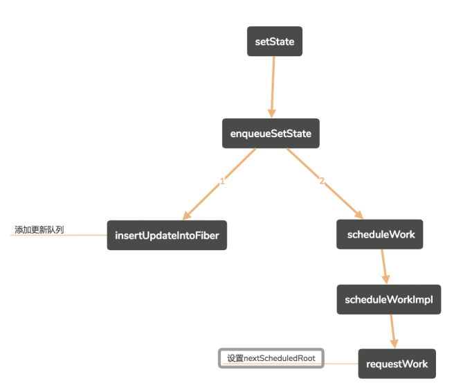
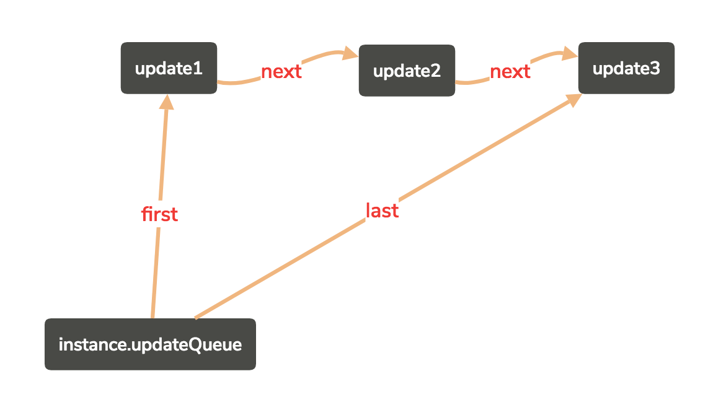

当我们使用state改变视图时，如果连续使用setState,并且没有批量更新优化时，我们能够想象，每一次设置setState,那么就会调用render函数渲染。如果有批量更新优化，那么只会调用一次render函数渲染。
```javascript
class Button extends Component {
    constructor () {
        super()
        this.state = {
            title: 'click 1'
        }
    }
    handleClick = (e) => {
        e.stopPropagation();
        this.setState({
            title: 'click2'
        })
        this.setState({
            title: 'click3'
        })
        this.setState({
            title: 'click4'
        })
    }
    render () {
        return (
            <button onClick={this.handleClick}>{this.state.title}</button>
        )
    }
}
```
在事件绑定机制中已经提到，触发 dispatchEvent 回调函数的处理过程中，会执行到 batchedUpdates，此时将 isBatchingUpdates 改变为 true ，说明此时正在批量更新优化处理，这时，真正触发的回调函数（如上面代码的 handleClick ）还没有执行。
```javascript
function batchedUpdates(fn, a) {
    var previousIsBatchingUpdates = isBatchingUpdates; // 批量处理嘛
    isBatchingUpdates = true;
    try {
        return fn(a); // // 此过程中可能改变state所以需要再performWork
    } finally {
        isBatchingUpdates = previousIsBatchingUpdates;
        if (!isBatchingUpdates && !isRendering) {
            performWork(Sync, null);
        }
    }
}
```
当 handleClick 执行时，三个 setState 都会在 scheduleWork 的时候 requestWork ，requestWork 的代码片段如下。由于 isBatchingUpdates 在回调函数 handleClick 执行之前被置为了true，而 isUnbatchingUpdates 为 false ，故这三个 setState 结果都不能立即 performWork，也就是将改变应用到视图。
```javascript
// 当根节点发生更新时，调度器将调用requestWork方法开始任务处理过程
// It's up to the renderer to call renderRoot at some point in the future.
// 只要root收到更新(update对象)，requestWork就会被调度程序调用。渲染器在将来的某个时刻调用renderRoot。
function requestWork(root: FiberRoot, expirationTime) {
   
  addRootToSchedule(root, expirationTime);
   if (isBatchingUpdates) {
      // Flush work at the end of the batch.
      if (isUnbatchingUpdates) {
        // ...unless we're inside unbatchedUpdates, in which case we should
        // flush it now.
        nextFlushedRoot = root;
        nextFlushedExpirationTime = Sync;
        performWorkOnRoot(root, Sync, false);
      }
      return;
    }

  if (expirationTime === Sync) {
    // 同步
    performSyncWork(Sync, null); // 将当前更新提交
  } else {
    // 异步
    scheduleCallbackWithExpiration(expirationTime);
  }
}
```
但是在回调函数 handleClick 执行完后，才会一次性的 performWork

# 1. ssetState方法
```javascript
Component.prototype.setState = function (partialState, callback) {
  this.updater.enqueueSetState(this, partialState, callback, 'setState');
}
```
这里的updater是什么？重新到`render和reconciler小节`中，可以记得，在初始化过程中的updateClassComponent => adoptClassInstance方法中，有如下操作。
```javascript
instance.updater = classComponentUpdater;//设置更新器实例(拥有enqueueSetState， enqueueReplaceState, enqueueForceUpdate)

var classComponentUpdater = {
  isMounted: isMounted,
  enqueueSetState: function (inst, payload, callback) {
    // 根据实例创建fiber
    var fiber = get(inst);
    // 获取当前事件
    var currentTime = recalculateCurrentTime();
    // 获取过期时间
    var expirationTime = computeExpirationForFiber(currentTime, fiber);
    // 创建一个更新
    var update = createUpdate(expirationTime);
    // 更新数据({title:"click1"})
    update.payload = payload;
    if (callback !== undefined && callback !== null) {
        warnOnInvalidCallback$1(callback, 'setState');
      }
      update.callback = callback;
    }
    // 将更新添加到队列
    enqueueUpdate(fiber, update, expirationTime);
    // 开始调用执行
    scheduleWork$1(fiber, expirationTime);
  },
  enqueueReplaceState: function (inst, payload, callback) {
    ...
    // 修改tag为替换
    update.tag = ReplaceState;
  },
  enqueueForceUpdate: function (inst, callback) {
    .....
    // 修改tag为强制更新
    update.tag = ForceUpdate;
    ...
  }
};

```
<br>
因此，我们可以知道 instance.setState 的时候实际是调用了 instance.updater.enqueueSetState。将setState中的更新通过enqueueUpdate都添加到了fiber.updateQueue中，成为了一个更新链表：
```javascript
var update3 = {
    next: null,
    partialState,
    nextCallback,
    callback,
    isForced,
    isReplace
};

var update2 = {
    next: update2
};

var update1 = {
    next: update2;
};

instance.updateQueue = {
    first: update1,
    last: update3
}
```
<br>
到此为止，就能将多次 setState(partialState) 的 partialState 记录并联系起来。当实例中的`handleClick`方法执行完毕，则isBatchingUpdates 为false。在requestWork中就能够通过，顺利执行performWork。
# 2. setState的异步性

虽然 setState 并非使用了 setTimeout 或 promise 的那种进入到事件循环( Event loop )的异步执行，但它的执行行为在 React 库中时，的确是异步的，也就是有延时执行的行为。以官方文件中较精确的说法 - "它不是保证同步的"。上面已经提到了，关键在`isBatchingUpdates`
变量，因为在 requestWork 中，由于在 isBatchingUpdates 在 dispatchEvent 中被置为了 true ， isUnbatchingUpdates 为 false ，所以每次只改变了 partialState 后，就返回了，而不是每次 performWork 将改变 state 应用到视图。<br>
因为 setState(partialState, callback) 是先将包含 partialState 的 update 对象加入到 updateQueue 中， callback 加入到 updateQueue.callbackList 中，等回调函数执行完后，再 performWork 。而 callback 是在 commit 阶段才执行，而此时，state 已改变
```javascript
this.state = {
    name: 'original'
}

setState({
    name: 'haha'
}, () => {
    console.log(this.state.name + ' 2')
})

console.log(this.state.name + ' 1')

// original 1
// haha 2
```

# 3 如何破坏批量更新优化?
```javascript
this.state = {
    title: 'original'
}

setTimeout(() => {
    this.setState({
        title: 'click2'
    })
    console.log(this.state.title)
    this.setState({
        title: 'click3'
    })
    console.log(this.state.title)
    this.setState({
        title: 'click4'
    })
    console.log(this.state.title)
}, 0);

// original
// click2
// click3
// click4
```
由于 js 单线程特性， setTimeout 的回调函数须等 react-dom 代码中的 dispatchEvent 函数执行完，也就是须等到 performWork 之前提到的必会执行的 performWork 函数，然而在 performWork 中， nextFlushedRoot 为 null ， while 循环无法进行。
```javascript
function performWork () {
    while (nextFlushedRoot !== null && nextFlushedExpirationTime !== NoWork && (minExpirationTime === NoWork || nextFlushedExpirationTime <= minExpirationTime) && !deadlineDidExpire) {
        performWorkOnRoot(nextFlushedRoot, nextFlushedExpirationTime);
        // Find the next highest priority work.
        findHighestPriorityRoot();
    }
}
```
待 react 接下来的代码执行完后，才执行 setTimeout 的回调函数，此时 isBatchingUpdates 为 false，所以每次 setState 都会触发 performWork ，这样就不能进行批量更新优化了，没有延迟执行的效果了

# 4 setState为什么可以接受函数？
因为在 getStateFromUpdate 函数中，对于 setState(partialState) 的 partialState 处理兼容了函数情形。但最终 return 的都是一个对象。
```javascript
function getStateFromUpdate(update, instance, prevState, props) {
    var partialState = update.partialState;
    if (typeof partialState === 'function') {
        var updateFn = partialState;

        // Invoke setState callback an extra time to help detect side-effects.
        if (debugRenderPhaseSideEffects) {
            updateFn.call(instance, prevState, props);
        }

        return updateFn.call(instance, prevState, props);
    } else {
        return partialState;
    }
}
```
参考：https://github.com/UNDERCOVERj/tech-blog/issues