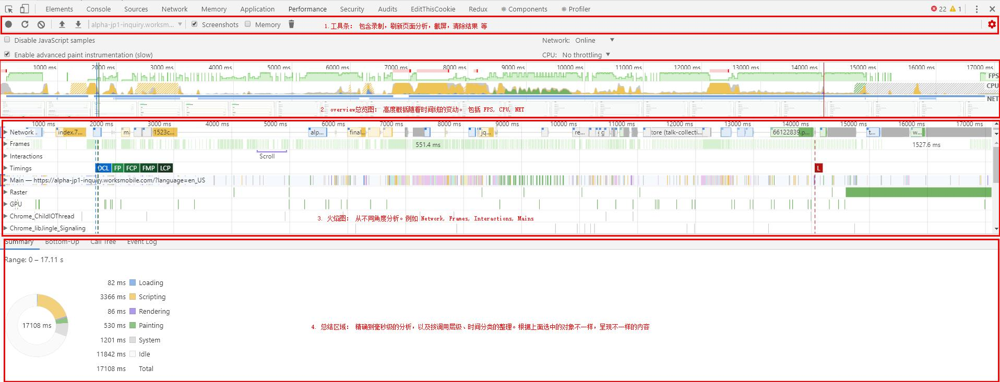

<h1>Chrome Performance </h1>
运行时性能表现（runtime performance）：当页面在浏览器中运行时的性能表现。当然我们得有一个网站来使用。这里我用平时的开发页面进行分析。在chrome的performance tab，点击（start profiling and reload page）。

 

# 1. performance setting
- Disable Javascript samples: 关闭JavaScript样本，禁用堆栈信息，禁用后在 火焰图的 `Main`部分看不到堆栈信息。为了减少手机运行时的开销，模拟手机运行时勾选。
- Network: 录制时的网络限制。（online,在线， fast3G,slow3G,offline 离线）
- CPU: 录制时的CPU限制（no throttling 不限制，4*slowdown 根据自己的电脑CPU情况降速4倍），注意点是电脑无法真正模拟mobile的CPU状况，因为本来这两者的设计架构就不一样。
- Enable advanced paint instrumentation：记录渲染事件的细节：选择frames中的一块，可以看到区域四多了个Layers。
- W,A,S,D 放大，缩小，向右，向左 的快捷键
- Screenshots: 当选中后，在Overview中就会有每一帧的截图
 
- Memory: 内存消耗记录，勾选后在 Flame chart 模块 可以看到各种内存消耗的曲线 
 

# 2. [Overview]
- FPS : 60FPS(每秒的帧数)，FPS 图表上的红色块表示长时间帧，很可能会出现卡顿。绿色竖线越高，FPS越高。
- CPU: CPU 资源，此面积图表示消耗CPU 资源的事件类型。（rendering, scripting, loading等）
- NET: 每条彩色横杠表示一种资源。横杠越长，表示检索的资源时间越久。每个横杠的浅色部分表示等待的时间（从请求资源到第一个字节下载完成的时间）。

# 3. Flame chart（火焰图）
在Flame chart中有三条垂直的虚线，它们分别代表：
- 蓝色: 代表DOMContentLoaded事件
- 绿色: 代表开始绘制（paint）的时间
- 红色: 代表load事件 

相关概念术语： 
- DCL: DOMContentLoaded
- FP: 首次绘制，浏览器第一次显示内容
- FCP: 首次内容绘制，浏览器第一次显示来自DOM 的内容
- LCP: Largest Contentful Paint(最大内容渲染)，代表在viewport中最大的页面元素加载的时间。通过PerformanceEntry对象记录，每次出现更大的内容渲染，则会产生一个新的PerformanceEntry对象。
- TBT: Total Blocking Time(页面阻塞总时长)，
- CLS: Cumulative Layout Shift(累积布局位移).
- FMP: 首次重要绘制。在网页上，几乎总有一部分内容比其他部分更重要。 如果页面最重要的部分能迅速加载，用户可能不会注意到其余部分是否加载。【这部分内容往往只有开发者清楚，浏览器无法给出指标】
- TTI: 页面可交互时间

## 3.1 Network
每条彩色横杠表示一种资源。横杠越长，表示检索的资源时间越久。每个横杠的浅色部分表示等待的时间（从请求资源到第一个字节下载完成的时间）。 
 
- HTML 文件为蓝色。
- 脚本为黄色。
- 样式表为紫色。
- 媒体文件为绿色。
- 其他资源为灰色。

## 3.2 Frames
帧线程，鼠标悬浮在绿色块上，可以查看到fps。 在设置中`Enable advanced paint instrumentation` 选中，reload记录后，选择frames中的一块，可以看到区域四多了个Layers。 
也可以在 `More Tools ` => `Layers` 查看当前页面层级的分布 
 
- pan mode: 平行模式，水平（X轴）或垂直（Y轴）拖拽
- Rotate Mode: 绕着Z轴旋转
- Reset Transform: 将图标置于原始位置

## 3.3 Main
主线程，负责解析HTML/CSS, 执行JavaScript， 完成绘制等。在该板块，可以看到各个函数的调用栈和耗时情况，每隔长条表示一个事件，悬浮上去可以看到耗时事件和事件名称。如果在setting部分设置` Disable JavaScript samples`为true,那么则看不到 call stack。 
- x轴：时间，最上面的第一条是事件触发的地方，表示耗时时间 over time
- y轴：表示自上而下内嵌的event call stack，越到下面数量越少 
 

不同颜色代表不同的事件类型，以下对常见的事件类型进行区分： 
- Parse HTML: chrome执行其HTML 解析算法
- Event: Javascript事件（例如 mousedown）
- Layout: 页面布局被执行
- Recalculate style: chrome重新计算了元素的样式
- Paint: 合成的图层被绘制到显示画面的一个区域
- Composite: Chrome的渲染引擎合成了图像层

## 3.4 Raster
Raster线程，负责完成某个layer或者某些块(tile)的绘制。任何页面都是由浏览器将dom和css转换为图像绘制在浏览器屏幕，即使页面上没有任何的图像，在Raster线程仍然能看到一个线程。

## 3.5 Timings
 
# 4. Summary
- summary：统计图，展示各个事件阶段耗费的时间。
- Bottom-Up: 排序，可以看到各个事件消耗事件的排序。（self-time: 事件本身耗时。 total-time: 包含子事件，从开始到结束的耗时。）
- Call-Tree: 调用栈，在`Main`选中一个事件，可以看到整个事件的调用栈（从最顶层到最底层，而不是只有当前事件）
- Event Log: 事件日志。（多了一个start time, 指事件在多少毫秒开始触发。右边有事件描述信息） 

Sumarry 统计图的颜色表示： 
- 蓝色(Loading)：网络通信和HTML解析
- 黄色(Scripting)：JavaScript执行
- 紫色(Rendering)：样式计算和布局，即重排
- 绿色(Painting)：重绘
- 灰色(other)：其它事件花费的时间
- 白色(Idle)：空闲时间 

***: 比重占的大的颜色可能有问题，如上图中的紫色部分Rendering，表示渲染耗费时间久

