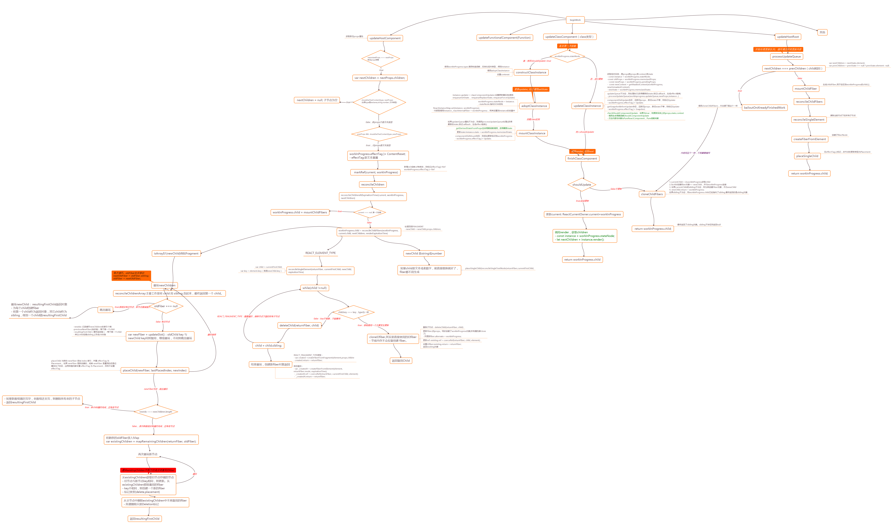
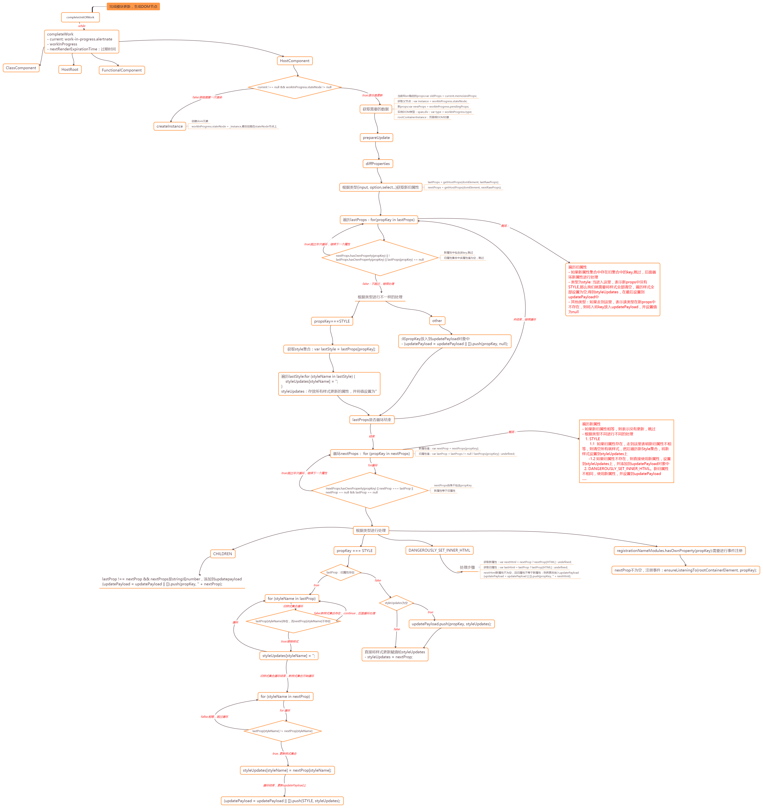
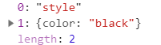
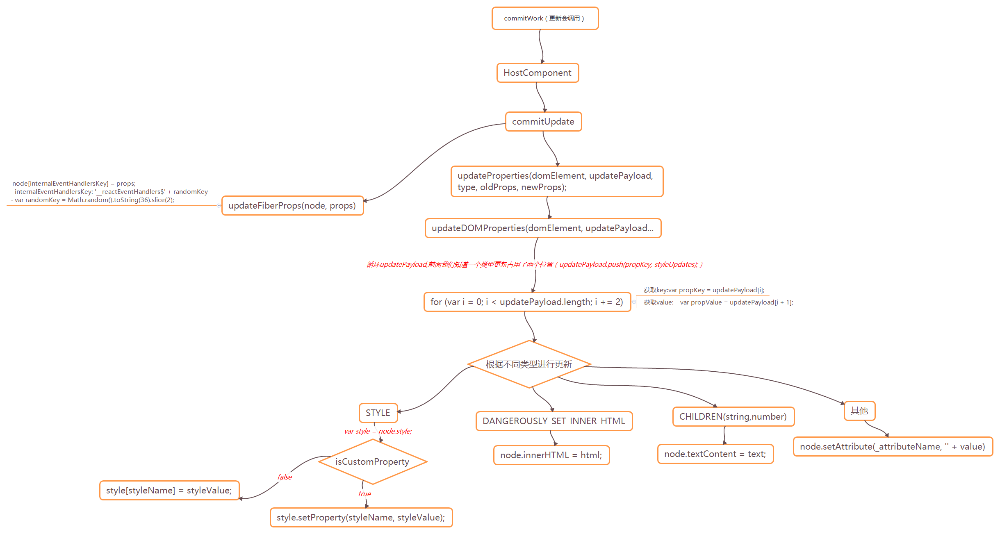

# 1. setStae例子
```javascript
class User extends Component {
    constructor(props) {
        super(props);
        this.state = {
            showText: true,
            title: 'zhaoyeziTitle'
        };
    }
    addField() {
        this.setState({
            showText: false
        }, function() {
            console.log(1)
        });
        this.setState({
            showText: true
        },function() {
            console.log(2)
        });
        this.setState({
            showText: false
        },function() {
            console.log(3)
        });
    }
  
    render() {
        let { name, children } = this.props;
        let { show, text } = this.state;
        return (
            <div>
                <button onClick={this.addField.bind(this)}>CLICK</button>
            {
                this.state.showText ?
                    <Button text={'button text'}/>: 
                    <Child text={'child text'}/>
            }
        </div>
        );
    }
}
```
# 2. 生成updateQuque
通过上一节的批量优化，我们得到一个updateQueue,且以first,next形式将update对象链接起来。updateQueue挂载在具体的instance下，待遍历到该实例对应的fiber时，处理更新队列。<br>
在回调函数执行完后，需要performWork,将状态改变应用到视图上，这样就进入了页面渲染流程，不过不一样的是这次不是第一次渲染。
- 当从root遍历到此instance对应的fiber时，会根据updateQueue处理得到新的newState。
```javascript
// - 更新数据，使用setState,调用this.updater.enqueueSetState
// - enqueueSetState: 通过appendUpdateToQueue将update添加到队列中
// - processUpdateQueue：处理更新链表(getStateFromUpdate得到新的newState)
function getStateFromUpdate() {
    ...
    partialState = _payload2.call(instance, prevState, nextProps);
    return _assign({}, prevState, partialState);
    ...
 }
```
处理过程从第一个udpate对象开始，迭代循环update.next。不停的使用 assign 形式，将 partialState 覆盖 oldState 到 newState 上，直到不再有 nextUpdate，然后返回 newState。此过程中还能收集 setState的回调函数，具体做法是将 callback 添加至 updateQueue.callbackList 队列，并设置 effectTag，以便在 commitRoot 阶段触发。具体做法如下图所示：
```javascript
var classComponentUpdater = {
  isMounted: isMounted,
  enqueueSetState: function (inst, payload, callback) {
    // 根据实例创建fiber
    var fiber = get(inst);
    // 获取当前事件
    var currentTime = recalculateCurrentTime();
    // 获取过期时间
    var expirationTime = computeExpirationForFiber(currentTime, fiber);
    // 创建一个更新
    var update = createUpdate(expirationTime);
    // 更新数据({title:"click1"})
    update.payload = payload;

    // callback:添加到更新队列callbackList
    if (callback !== undefined && callback !== null) {
        warnOnInvalidCallback$1(callback, 'setState');
      }
      update.callback = callback;
    }
    // 将更新添加到队列
    enqueueUpdate(fiber, update, expirationTime);

    // 开始调用执行
    scheduleWork$1(fiber, expirationTime);
  },
  enqueueReplaceState: function (inst, payload, callback) {
    ...
    // 修改tag为替换
    update.tag = ReplaceState;
  },
  enqueueForceUpdate: function (inst, callback) {
    .....
    // 修改tag为强制更新
    update.tag = ForceUpdate;
    ...
  }
};
```
<br>
# 3. scheduleWork-（执行processUpdateQueue），源码看`更新队列`小结
scheduleWork => requestWork => performWork => renderRoot => workLoop => performUnitWork => beginWork => updateClassComponent 内调用了processUpdateQueue。
- 循环处理updateQueue：最终标记callback,得到最新state,并生成effect链表
    1. 如果callback不为空，标记effectTag：Callback
    1. newFirstUpdate:记录第一个update
    1. 获取最新state: resultState = getStateFromUpdate
    1. 如果lastEffect为空： queue.firstEffect = queue.lastEffect = update;否则追加到queue.lastEffect链表上
- 更新state:queue.baseState = newBaseState;
- 更新firstUpdate： queue.firstUpdate = newFirstUpdate;
- 更新expirationTime
- workInProgress.memoizedState = resultState;
# 3.1 DOM diff
beginWork 中，我们知道会按照不同的类型（function, class等）进行不同的设置不同的tag处理。
<br>
# 4. completeUnitOfWork
scheduleWork => requestWork => performWork => renderRoot => workLoop => performUnitWork => completeUnitOfWork => completeWork => HostComponent<br>

此时进入reconciliation的completeUnitOfWork阶段。如果workInProgress对应的fiber是需要更新的HostComponent(请注意，不是第一次渲染，判断逻辑如下），那么需要对props进行diff区分，如果有不一样的键值对，则假如到updatePayload数组中，并挂载到workInProgress.updateQueue中。
```javascript
workInProgress.alternate !== null && workInProgress.stateNode != null
```
# 4.1 diffProperties（diff算法）
<br>
```javascript
// Calculate the diff between the two objects.
function diffProperties$1(domElement, tag, lastRawProps, nextRawProps, rootContainerElement) {
  {
    validatePropertiesInDevelopment(tag, nextRawProps);
  }
  // 根据不同类型，获取lastProps,nextProps。并初始化updatePayload（存放所有更新属性）。
  var updatePayload = null;

  var lastProps = void 0;
  var nextProps = void 0;
  switch (tag) {
    case 'input':
      lastProps = getHostProps(domElement, lastRawProps);
      nextProps = getHostProps(domElement, nextRawProps);
      updatePayload = [];
      break;
    case 'option':
      lastProps = getHostProps$1(domElement, lastRawProps);
      nextProps = getHostProps$1(domElement, nextRawProps);
      updatePayload = [];
      break;
    case 'select':
      lastProps = getHostProps$2(domElement, lastRawProps);
      nextProps = getHostProps$2(domElement, nextRawProps);
      updatePayload = [];
      break;
    case 'textarea':
      lastProps = getHostProps$3(domElement, lastRawProps);
      nextProps = getHostProps$3(domElement, nextRawProps);
      updatePayload = [];
      break;
    default:
      lastProps = lastRawProps;
      nextProps = nextRawProps;
      if (typeof lastProps.onClick !== 'function' && typeof nextProps.onClick === 'function') {
        // TODO: This cast may not be sound for SVG, MathML or custom elements.
        trapClickOnNonInteractiveElement(domElement);
      }
      break;
  }

  assertValidProps(tag, nextProps, getStack);

  var propKey = void 0;
  var styleName = void 0;
  // 存放样式更改所有的属性
  var styleUpdates = null;
  // 先循环旧属性
  for (propKey in lastProps) {
      // 如果新属性中包含该属性，则跳过，后面会处理
    if (nextProps.hasOwnProperty(propKey) || !lastProps.hasOwnProperty(propKey) || lastProps[propKey] == null) {
      continue;
    }
    // 如果是样式属性，循环样式属性值，并清空所有样式值
    if (propKey === STYLE) {
      var lastStyle = lastProps[propKey];
      for (styleName in lastStyle) {
        if (lastStyle.hasOwnProperty(styleName)) {
          if (!styleUpdates) {
            styleUpdates = {};
          }
          styleUpdates[styleName] = '';
        }
      }
    } 
    // 其他的指定情况 
    else if (propKey === DANGEROUSLY_SET_INNER_HTML || propKey === CHILDREN) {
      // Noop. This is handled by the clear text mechanism.
    } else if (propKey === SUPPRESS_CONTENT_EDITABLE_WARNING || propKey === SUPPRESS_HYDRATION_WARNING$1) {
      // Noop
    } else if (propKey === AUTOFOCUS) {
      // Noop. It doesn't work on updates anyway.
    } else if (registrationNameModules.hasOwnProperty(propKey)) {
      if (!updatePayload) {
        updatePayload = [];
      }
    } else {
      // 上面不包含的情况，将其放入到updatePayload中，并将其值设置为null
      (updatePayload = updatePayload || []).push(propKey, null);
    }
  }
  // 循环新的props属性
  for (propKey in nextProps) {
    var nextProp = nextProps[propKey];
    var lastProp = lastProps != null ? lastProps[propKey] : undefined;
    // 如果新旧属性相同，则跳过，不需要添加
    if (!nextProps.hasOwnProperty(propKey) || nextProp === lastProp || nextProp == null && lastProp == null) {
      continue;
    }
    // 样式处理
    if (propKey === STYLE) {
      {
        if (nextProp) {
          // Freeze the next style object so that we can assume it won't be
          // mutated. We have already warned for this in the past.
          Object.freeze(nextProp);
        }
      }
      // 如果旧属性存在
      if (lastProp) {
        // Unset styles on `lastProp` but not on `nextProp`.
        // 新属性不存在，则清空属性值
        for (styleName in lastProp) {
          if (lastProp.hasOwnProperty(styleName) && (!nextProp || !nextProp.hasOwnProperty(styleName))) {
            if (!styleUpdates) {
              styleUpdates = {};
            }
            styleUpdates[styleName] = '';
          }
        }
        // Update styles that changed since `lastProp`.
        // 新属性存在，但是值不相等，则替换为新属性
        for (styleName in nextProp) {
          if (nextProp.hasOwnProperty(styleName) && lastProp[styleName] !== nextProp[styleName]) {
            if (!styleUpdates) {
              styleUpdates = {};
            }
            styleUpdates[styleName] = nextProp[styleName];
          }
        }
      } else {
        // Relies on `updateStylesByID` not mutating `styleUpdates`.
        // 如果旧属性不存在，直接使用新属性，并将其放入updatePayload对象中
        if (!styleUpdates) {
          if (!updatePayload) {
            updatePayload = [];
          }
          updatePayload.push(propKey, styleUpdates);
        }
        styleUpdates = nextProp;
      }
    } else if (propKey === DANGEROUSLY_SET_INNER_HTML) {
        // 新旧属性不同，放入updatePayload中
      var nextHtml = nextProp ? nextProp[HTML] : undefined;
      var lastHtml = lastProp ? lastProp[HTML] : undefined;
      if (nextHtml != null) {
        if (lastHtml !== nextHtml) {
          (updatePayload = updatePayload || []).push(propKey, '' + nextHtml);
        }
      } else {
        // TODO: It might be too late to clear this if we have children
        // inserted already.
      }
    } else if (propKey === CHILDREN) {
        // 新旧属性不同，放入updatePayload中
      if (lastProp !== nextProp && (typeof nextProp === 'string' || typeof nextProp === 'number')) {
        (updatePayload = updatePayload || []).push(propKey, '' + nextProp);
      }
    } else if (propKey === SUPPRESS_CONTENT_EDITABLE_WARNING || propKey === SUPPRESS_HYDRATION_WARNING$1) {
      // Noop
      // registrationNameModules:所有事件
    } else if (registrationNameModules.hasOwnProperty(propKey)) {
        // 如果nextProps.propKey有值，在 document 上绑定 eventName 函数，确保能触发 dispatchEvent 回调函数。如果新旧props的props[eventName]不一样
      if (nextProp != null) {
        // We eagerly listen to this even though we haven't committed yet.
        if (true && typeof nextProp !== 'function') {
          warnForInvalidEventListener(propKey, nextProp);
        }
        ensureListeningTo(rootContainerElement, propKey);
      }
      if (!updatePayload && lastProp !== nextProp) {
        // This is a special case. If any listener updates we need to ensure
        // that the "current" props pointer gets updated so we need a commit
        // to update this element.
        updatePayload = [];
      }
    } else {
      // For any other property we always add it to the queue and then we
      // filter it out using the whitelist during the commit.
      (updatePayload = updatePayload || []).push(propKey, nextProp);
    }
  }
  // styleUpdates 样式改变对象，放入updatePayload中
  if (styleUpdates) {
    (updatePayload = updatePayload || []).push(STYLE, styleUpdates);
  }
  return updatePayload;
}
```
# 4.2 diff完后
当 diff 完有差异，updatePayload 就为数组，否则，updatePayload 为 null。待 updatePayload 返回后，在 updateHostComponent 中，将 updatePayload 挂载在 workInProgress.updateQueue 上，并且 updatePayload 不为 null ，则将 workInProgress 标志为更新。
```javascript
workInProgress.updateQueue = updatePayload;
if (updatePayload) {
    // 这会把Placement变为UpdateAndPlacement
    workInProgress.effectTag |= Update;
}
```
在最后的 commitWork 阶段，才根据 effectTag 来执行视图的更新。

# diff的作用
- 检查是否有 dom 属性更新（体现在 props 中）
- 若有不同，需要标记更新，并提供 updatePayload，供 commitWork 阶段使用。<br>
上面通过下面的语句将变更放入updatePayload，每次放入一个更新时占用了两个位置。
```javascript
(updatePayload = updatePayload || []).push(STYLE, styleUpdates);
```
<br>
```javascript
function updateDOMProperties(domElement, updatePayload, wasCustomComponentTag, isCustomComponentTag) {
  debugger;
  // TODO: Handle wasCustomComponentTag
  for (var i = 0; i < updatePayload.length; i += 2) {
    var propKey = updatePayload[i];
    var propValue = updatePayload[i + 1];
    if (propKey === STYLE) {
      setValueForStyles(domElement, propValue, getStack);
    } else if (propKey === DANGEROUSLY_SET_INNER_HTML) {
      setInnerHTML(domElement, propValue);
    } else if (propKey === CHILDREN) {
      setTextContent(domElement, propValue);
    } else {
      setValueForProperty(domElement, propKey, propValue, isCustomComponentTag);
    }
  }
}
```
<br>

参考：https://github.com/UNDERCOVERj/tech-blog/issues/15