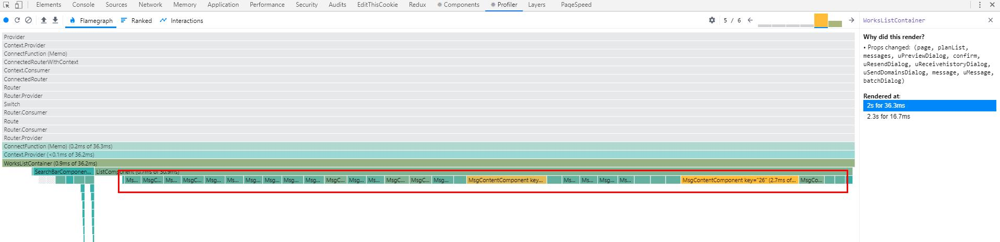
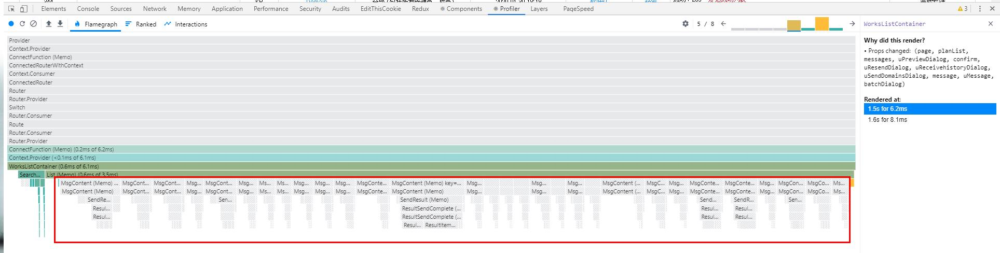

# 1. React Profiler
什么是React Profiler,以及如何使用，请参考 http://react.html.cn/blog/2018/09/10/introducing-the-react-profiler.html。

# 2. React 性能优化实例结果
  本来想研究一下React Profiler, 结果我只会从里面看到React组件的渲染花费时间。不管是初始化渲染还是更新渲染都毫不意外地重新渲染。于是我很迷茫，直到看到了
`https://juejin.im/post/5d045350f265da1b695d5bf2`。于是我在开发的过程中进行了组件的优化，通过React Profiler 进行测试，发现竟然真的可以提高渲染能力。这篇文章用于记录下我的使用经历，后续如果有新的优化方式，我会进行追加：
希望大家不要被网上的虚拟dom,diff算法等描述误导，以为React的渲染比原生渲染更好，其实并不然。以下是只对项目中的列表的优化效果：<br>
- 优化前
<br>
- 优化后
<br>

# 3. 如何进行优化
引用 `荒山`的结论，首先我们应该 减少渲染节点/降低渲染计算量(复杂度)， 从以下方面入手。其实以下的这些除了第一条，另外四项都是前端开发通用的。
- 避免在Render中不必要的计算： 渲染函数中进行数组排序、数据转换、订阅事件、创建事件处理器等等. 渲染函数中不应该放置太多副作用。
- 减少不必要的嵌套： 例如避免使用style-component, 利用props,React hooks 减少使用HOC高阶组件。避免地狱式嵌套。
- 虚拟列表： 当渲染列表时，只渲染可视窗口部分。使用场景： 无限滚动列表，无限切换的日历或轮播图，大数据量或无限嵌套的树，聊天窗口，时间轴等。
- 惰性渲染：只有需要才将内容渲染出来，例如 不要一次将所有的tab绘制出来，当切换到某个tab才将其渲染。
- 延迟加载： 页面没有显示出来的内容先不尽兴渲染。等需要的时候再渲染。

# 4. React代码层如何优化

## 4.1 React.PruneComponent / React.memo
class组件使用集成 React.PruneComponent（比较props/state）, 函数式组件使用React.memo(比较props)。在render之前会进行shallowEqual(浅比较),只会比较第一层。
```javascript
import React from "react";
import { fromJS } from 'immutable';

class Test extends React.PureComponent {
  constructor(props) {
    super(props);
    this.state = {
      count: {
        first: 1,
        next: 2
      }
    };
  }
  addFirst = () => {
    // let newCount = fromJS(this.state.count).toJS(); // 页面会更新
    let newCount = this.state.count; // newCount：同count引用地址一样，render 方法就不会触发
    newCount.first = ++newCount.first;
    this.setState(
      {
        count: newCount
      }
    );
  };
  render() {
    return (
      <div>
        <p>the first count is: {this.state.count.first}</p>
        <button onClick={this.addFirst}>Click me to add first</button>
      </div>
    );
  }
}

export default Test;
```

## 4.2 简化props
props如果太复杂，这个这个组件便违背了`单一职责`，应该尝试对组件进行拆解。并且也会影响到shallowCompare的效率。
- 只传递组件必须的属性，如果传递了组件没有使用的属性，改属性改变，也会引起组件重绘
- 保证对象只初始化一次，指向相同的引用。（immutable的不变数据结构， 这一项会在React+redux+immutalbe的实践中详细编写）
- 析构props数据，使用ES6拓展运算符，将数据析构为基本类型的props,组件进行浅层对比是发现props没有变化，不会重新渲染 
```javascript
{
    // 假如MsgContentComponent中只使用了message某一个属性，那么建议只传递那一个值
    messages.map((message, key) => {
        no = no - 1;
        return (
            <MsgContentComponent 
                key={message.id}
                {...message}
                no={no} 
                isWorks={true}
            />
        );
    })
}
```
- 自己编写对比函数，作为函数组件的第二个参数进行传递。
```javascript
const Component = () => {

};
```
## 4.3 不变的事件处理器
我们不推荐在复合组件上使用箭头函数，同上面的props属性一样的，它不是基本数据结构，每次会创建新的对象，为保证传递的对象地址不变：
- 在class文件中，编写类方法
- 在函数式组件中，使用useCallback来包装事件处理器，尽量给下级组件暴露一个静态的函数
```javascript
<ComplexComponent onClick={evt => onClick(evt.id)} otherProps={values} />

// 推荐：
class MyComponent extends Component {
    render() {
        <ComplexComponent onClick={this.handleClick} otherProps={values} />;
    }
    handleClick = () => {
        /*...*/
    };
}

// Hook方式
const handleClick = useCallback(() => {

}, []);
return <ComplexComponent onClick={handleClick} otherProps={values} />;


// onClick传递事件来源信息
const handleDelete = useCallback((id: string) => {
  /*删除操作*/
}, []);

return (
  <List>
    {list.map(i => (
      <Item key={i.id} id={i.id} onClick={handleDelete} value={i.value} />
    ))}
  </List>
);
```

## 4.5 Map循环中不要使用 index作为key值
```javascript
// 加入我们的列表有删除操作， 总数据有10条，删除第5条，那么渲染的列表从第5条起，key值就改变了
{
    messages.map((message, key) => {
        return (
            <MsgContentComponent 
                key={message.id}
                {...message}
            />
        );
    })
}
```
## 4.6 延迟加载不立即需要的组件
在开发的过程中，页面由很多组件构成，但并不是页面一加载就需要将所有的组件显示出来。因此我们可以选择延迟加载当前不需要的组件。我们可以使用React.Lazy和React.suspense 完成。
```javascript
// TODO: 待验证，在chrome performance 下，还是渲染了Suspense,不知道有什么影响
const ResendHistoryComponent = React.lazy(() => import('../components/ResendHistoryComponent'));
<React.Suspense fallback={<div>Loading...</div>}>
    <ResendHistoryComponent 
        uResendDialog={uResendDialog}
    />
</React.Suspense>
```
## 4.7 使用Fragment避免添加额外的DOM
```javascript
<React.Fragement>
  <div>1</div>
  <div>2</div>
</React.Fragement>
```
## 不可变数据immutable(在React+redux+immutalbe 中详细归纳)
不可变数据可以让状态变得可预测，也让 shouldComponentUpdate '浅比较'变得更可靠和高效。immutable是结构共享的数据。因此不会导致组件重新渲染。