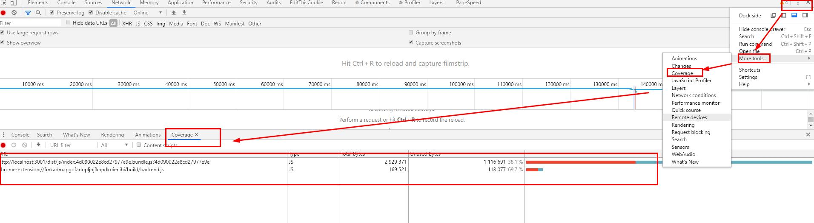
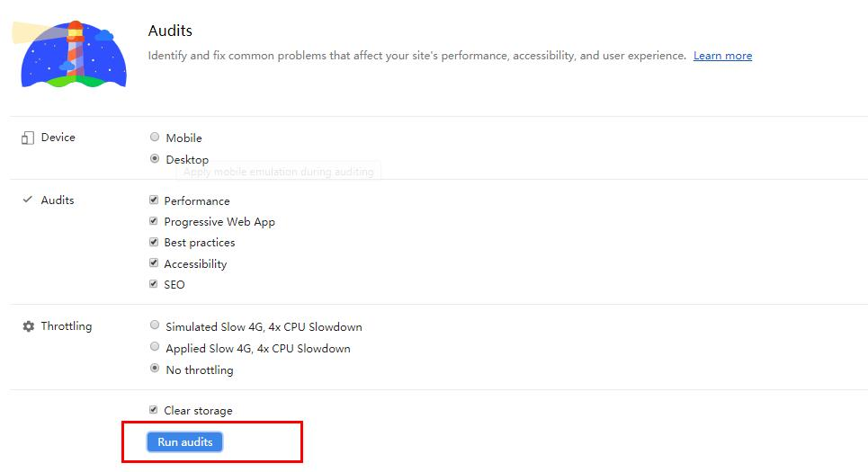
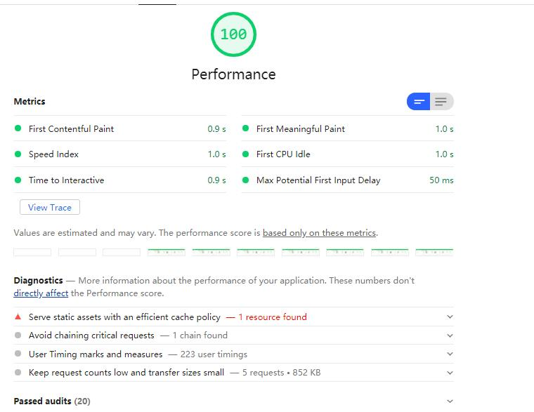

<h1>Audits 测试网站速度</h1>
这里先提一下，浏览器的Coverage,能够检测页面上运行中用到了哪些css和js。 
<br>

# 什么是Audits
Audits是站点的审计员，页面的大管家。他在5个大的方面对网站进行检测： Performance(性能)，Accessiblity(可访问性)，Best Practices(最佳实践)，SEO(搜索引擎优化)，Progressive Web App（渐进式网页应用）。

# 如何录制
点击 `Run audits`按钮，便可以得到一份测试后的报告。
<br>

# Performance
下图是性能部分
<br>
- First Contentful Paint: 搜词内容绘制，浏览器呈现第一个dom内容所花费的时间。例如页面的图片，非白色的`<canvas>`元素，SVG等。
- Frist meaningful paint: 首次有效绘制：用户看到网页主要内容的时候。该分数越低，表示页面主要内容的速度越快。
- Frist CPU Idle: 页面上的大多数元素是交互的，改时间表示页面主线程第一次能够响应处理页面的交互的时间。
- Time to Interactive(TTI):页面可以完全正常交互的时间（有些页面看似加载完毕，但是不可交互）。
- Speed Index: 衡量页面加载过程中内容可视化显示的速度。
- Max Potential First Input Delay： 首次输入延迟的最大时间，用户与网页进行交互，浏览器实际能够响应该交互的时间。发生输入延迟，一般是由于浏览器的主线程正在忙着其他的事情。<br>


# network的 资源压缩
- 勾选 User large request rows ，可以对比前后大小
- 查看具体一个文件的请求，如果有 `content-length: xxx`,则表示没有被压缩，如果是`Content-Encoding: gzip`,则表示服务器对文件进行了压缩
- 图片资源大小，选取合适大小的即可，不要过于大（例如500像素的手机，如果你发送一个1500像素的图片，实际是浪费掉了），也不要过于小。
```html

```
- 不必要的资源加载，使用tool的 coverage tab和Request blocking 可以进行测试，然后移除不需要的资源

# 编写代码注意
1. CSS避免重绘重拍
1. JS避免重绘重拍
- 对于动画效果的实现，避免使用 setTimeout 或 setInterval，请使用 requestAnimationFrame。
- 将长时间运行的 JavaScript 从主线程移到 Web Worker。
- 使用微任务来执行对多个帧的 DOM 更改。
- 使用 Chrome DevTools 的 Timeline 和 JavaScript 分析器来评估 JavaScript 的影响。


# window.performance
https://www.cnblogs.com/tugenhua0707/p/10982332.html<br>
http://www.alloyteam.com/2015/09/explore-performance/