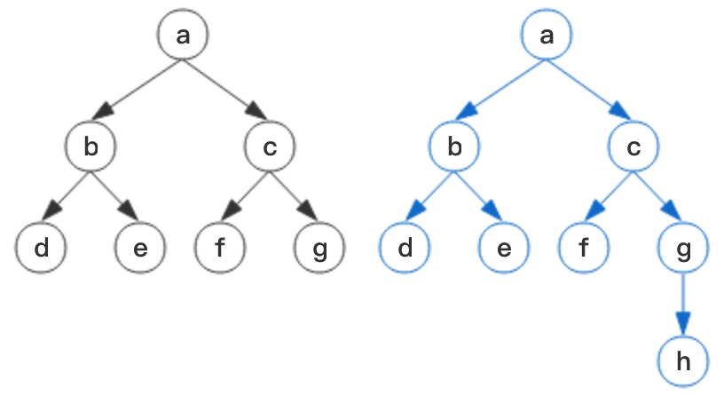
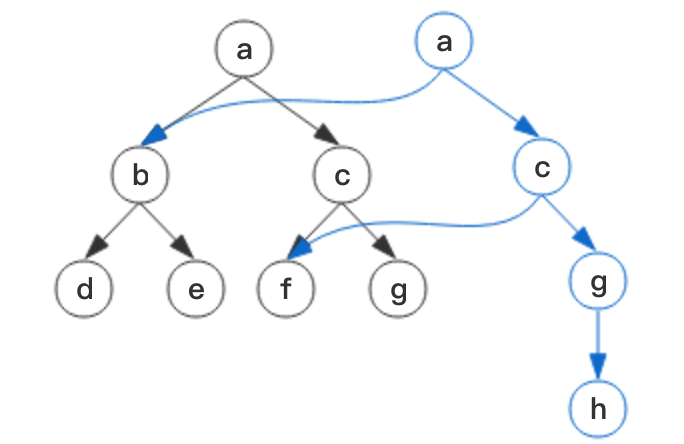
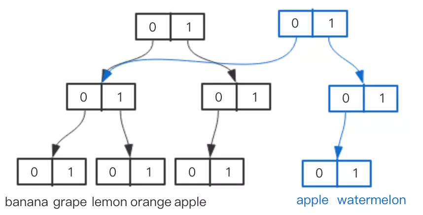
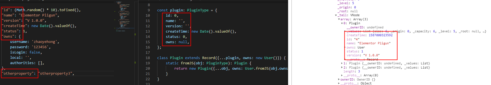

## 1. 为什么要在React中使用immutable
React常用的继承实现方式有两种，React.Component和 React.PureComponent。
- PureComponent类帮我们以浅比较的方式对比props和state，实现了shouldComponentUpdate()函数，提升性能。<br>
- Component：只要值改变，组件就会重新渲染，导致了无效的渲染。降低了性能<br>

```javascript
import * as React from 'react';
type State = {
    a: {x: number, y: number};
    b: Array<{x: number, y: number}>;
};
class Test extends React.Component<{}, State>{
    constructor(props: any) {
        super(props);
        this.state = {
            a: {x: 1, y: 2},
            b: [{x: 1, y: 2}, { x: 1, y: 2}],
        };
    }
    changeArr = () => {
        const { b } = this.state;
        b[0] = Object.assign({}, b[0], {x: (b[0].x + 1) });
        this.setState({
            b: b,
        });
    };
render() {
    const { b, a } = this.state;
    return (
        <div>
            <div>一个对象的内容显示：</div>
            <RenderAComponent a={a}/><br/><br/><br/>
            <div>一个List（可以考虑为table的一条一条的数据）的内容显示</div>
            <button onClick={this.changeArr}>pop</button>
            <RenderListComponent b={b}/>
        </div>
    );
}
}
function RenderList({b}: {b: State['b']}) {
    return (
        <ul>
        {
            b.map((item:  {x: number, y: number}, key) => <ListItemComponent key={key} item={item}/>)
        }
        </ul>
    );
}

function ListItem({item}: {item: {x: number, y: number}}) {
    return <li >{item.x} --- {item.y}</li>;
}
function RenderA({a}: {a: State['a']}) {
    const { x, y } = a;
    return <div>{x} ----- <span>{y}</span></div>;
}
const RenderListComponent = RenderList;
const ListItemComponent = ListItem;
const RenderAComponent = RenderA;
export default Test;
```
我们使用React-dev-tools工具，我们期待的是`RenderList`被修改, 但是`RenderA`都修改了。<br>
<br>

通过下面修改部分代码, 便避免重复渲染。
```javascript
class Test extends React.PureComponent<{}, State>{
  // .....
}

changeArr = () => {
    const { b } = this.state;
    let _b = Object.assign([], b);
    _b[0] = Object.assign({}, _b[0], {x: (_b[0].x + 1) });
    this.setState({
        b: _b,
    });
};
const RenderListComponent = React.memo(RenderList);
const ListItemComponent = React.memo(ListItem);
const RenderAComponent = React.memo(RenderA);
```

`RenderA` 没有渲染，`RenderList`的值被重新渲染。<br>
<br>


## 2. Object.assign 实现不可变
在上面的例子中，我们使用了Object.assign来实现不可变性。其实完全可以不适用immutable。
```javascript
let _b = Object.assign([], b);
_b[0] = Object.assign({}, _b[0], {x: (_b[0].x + 1) });
```
但是他有缺点：<br>
- 当对象属性庞大时效率较低。比如拥有 100,000 个属性的对象，这个操作耗费了 134ms。性能损失主要原因是 “结构共享” 操作需要遍历近10万个属性，而这些引用操作耗费了100ms以上的时间。（实际我们前端数据容量不会达到这个级别）
- 深层次对象的赋值书写起来很麻烦， 我们在处理数据时需要一遍一遍去拷贝（这是使用immutable的最主要的原因）


## 3. 什么是immutable
immutable.js 使用树的方式实现了 `持久化数据结构`，保证了对象是都是不可变的。任何添加，删除，修改等都是对生成一个新的对象。并且通过`结构共享`等方式大幅提高性能。例如下面的结构，希望在`g`节点下增加一个h节点<br/>
- 第一种方式：重新生成一棵树，每个节点都是新的，浪费空间和时间。<br>
<br> 
- immutable: 新生成根节点，然后对修改的部分进行父节点追踪，所有相关节点都重新生成。而不相关的节点保留，实现了结构共享。
<br>

## 4. Immutable做了哪些优化
数据的存储（重点Vector Trie， 空间换时间）， https://juejin.im/post/5b9b30a35188255c6418e67c<br>
如何压缩空间做优化（树的高度压缩， BitMap节点内部压缩）. https://juejin.im/post/5ba4a6b75188255ca1537b19<br>

- Vector Trie, 查找原理(https://www.cnblogs.com/xueqiuqiu/articles/8649521.html)<br>
<br>
- 位分区<br>
- BitMap, https://blog.csdn.net/moakun/article/details/79927791<br>
- 树高压缩<br>
<br>

## 5. Immutable 缺点如何避免
- 问题：由于实现了完整的不可变数据,immutable.js的体积过于庞大,尤其在移动端这个情况被凸显出来。<br>
```
 使用缓存中间件，例如reselect
```

- 问题：全新的api+不友好的文档。<br>
```
通过使用Immutable 的 Record 和Map,以及在项目中的改造，让开发过程中不被immutable的api所干扰
```

- 问题： 极易引起滥用， 在项目中，许多开发者很喜欢使用toJS, 让本可以大幅度提高性能的immutable反而导致不断地重复渲染<br>
```
在项目中尽量不适用toJS(),及时使用，定义在某种特定类型下才允许（例如向后端提交数据时），这样不会导致重复渲染的问题
```

调试错误困难(Immutable.js Object Formatter)<br>
- Google 浏览器安装，然后 进入浏览器 setting - Preferences -> Console -> Enable custom formatters, 重启控制台

### 6 使用 Record 解决Immutable API 的泛滥
使用继承 Record 的方式来定义数据类型，该方式的优点在于类型名既能表达一个「值」，又能表达「类型」。<br>

### 6.1 一旦构造好就不能再增加更多的属性
有效处理后台接口返回大量无用数据，而record只会记录最初定义的字段数据。不会抛出异常。<br>
<br>

### 6.2 Reacod实例可以像普通js对象访问
有效解决Immutable的API的侵入式泛滥。
```javascript
const plugin: PluginType = {
    id: 0,
    name: '',
    version: '',
    createTime: new Date().valueOf(),
    status: 0,
    owns: null,
};

class Plugin extends Record({...plugin, owns: new User()}) {
    static fromJS(obj: PluginType): Plugin {
        return new Plugin({...obj, owns: User.fromJS(obj.owns)});
    }
}

// 使用
let plugin = new Plugin();
const { id, name , version, createTime, state, owns } = plugin;
```
### 6.3 Other
- 可以给Record设置默认值
- 对Record添加命名，可以更好地进行debugg和错误处理
- 可以对Record进行extend，以从Record中提供派生数据。

## 7. 在项目中的react, redux,immutable的使用
redux中有三个核心元素：store，reducer和action。
- store作为应用的唯一数据源，用于存储应用在某一时刻的状态数据，store是只读的，且只能通过action来改变。
- reducer用于定义状态转换的具体细节，并与action相对应。
- 应用的UI部分可以通过store提供的subscribe方法来监听store的改变，当状态1下的store转换为状态2下的store时，所有通过subscribe方法注册的监听器(listener)都会被调用。<br>

### 7.1 Model 
我在项目中主要采用了Record， List这两种数据类型。
```javascript
// 用于JS数据类型，例如给后台传递的值使用类型，
interface PluginType {
    id: number;
    name: string;
    version: string;
    createTime: number;
    status: number;
    owns: UserType;
}


const plugin: PluginType = {
    id: 0,
    name: '',
    version: '',
    createTime: new Date().valueOf(),
    status: 0,
    owns: null,
};

// 用于Store存放的数据类型
class Plugin extends Record({...plugin, owns: new User()}) {
    // fromJS 很重要，用于转换 js数据=> immutable数据。 每个Record数据都有自己的formJS
    static fromJS(obj: PluginType): Plugin {
        return new Plugin({...obj, owns: User.fromJS(obj.owns)});
    }
}

export { plugin };
```

### 7.2 通用Action
传递到Action中的数据分为三种：<br>
- 原始JS数据（不需要转换为immutable类型，例如 username:'zyh'）,传递的值为`zyh`是不需要转换的
- 作为属性的JS对象。 例如 上面Plugin 的 user属性，需要将user转为immutable(recod)数据
- 作为model初始化的JS数据。直接转为immutable数据<br>

#### 在 组件和页面中，对sotre发起action
可以看到，下面没有出现immutable数据结构的参数
```javascript
actions.createAction('UPDATE_PLUGIN_NAME', 'plugin'， 'change plugin name'); // name属性，不需要修改为immutable数据
actions.createAction('UPDATE_INIT_PROPERTY_PLUGIN_USER', 'plugin'， { id: 1, username: 'changeName', password: 'changepassword'}); // 存储在Store中需要是Immutable数据
actions.createAction('INIT_PLUGIN', 'plugin'， {id: 1, name: 'plugin', ....}); // 需要被转为immutabledata
```
#### 通用Action提取
```javascript
/**
 * 用于集中处理 原始JS数据 =》 immutable数据
 * @param value JS 数据
 * @param className  JS 数据对应的immutable class 类型
 */
const convertDataToRecord = (value: OriginStateType, className: string) => {
    let InitCls = initClasses[className];
        if (Array.isArray(value)) {
            return List(value).map((item) => (InitCls.fromJS(item)));
        }
        return InitCls.fromJS(value);
};
/**
 * 
 * @param type  命名规则： INIT_XXXX, UPDATE_XXXX
 * @param key 命名规则：type===INIT_XXXX： 对象传入对象名称（例如alert）, 数组传入item类型名称（Array<Plugin> 传入 plugin）
 *                     type===UPDATE_XXXX， 传递修改值的key集合
 *                     type===UPDATE_INIT_PROPERTY_XXXX : 将某个属性整体替换为一个对象
 * @param value 可以是原始类型，也可以是Record List类型
 */
const createAction = (type: string, key: string | Array<string>, value: OriginStateType | RecordStateType) => {

    return {
        type: type.replace('INIT_PROPERTY_', ''),
        payload: {
            key,
            value: type.includes('INIT_') ? convertDataToRecord(value, key as string) : value,
        },
    };
};
```
### 7.3 Store数据（reducer存储通用函数）
```javascript
// 每当新增一个Model模型，只需要在initClasses中添加一个key值 即可
export const initClasses = {
    alert: Alert,
    pluginQuery: PluginQuery,
    loading: Loading,
    user: User,
    plugin: Plugin,
    pluginList: List,
};

class Root {
    rootReducer = {};

    constructor() {
        this.initReducer();
    }
    private initReducer() {
        for (const key in initClasses) {
            if (initClasses.hasOwnProperty(key)) {
                let keyUpper = key.toUpperCase();
               
                this.rootReducer[key] = (state: RecordStateType = new initClasses[key], action: Action) => {
                    switch(action.type) {
                        case `INIT_${keyUpper}`:
                            return action.payload.value;
                        case `UPDATE_${keyUpper}`:
                            return this.basePropertyChange(state, action);
                        default:
                            return state;
                    }
                };
            }
        }
    }
    private basePropertyChange(state: RecordStateType, action: Action) {
        let {
            key,
            value,
        } : Payload = action.payload;
        // // change store based on string(eg: 'isShow'=>false,  'message':'id' => 10)
        if (typeof key === 'string') {
            let index = key.includes(':') ? key.split(':') : [key];
            return state.setIn(index, value);
        }

        // // chnage store bases on array, ['isShow', 'message:name'] => ['true', 'i am a message.']
        if (Array.isArray(key) && Array.isArray(value)) {
            let tempState = state;
            key.forEach((ck: string, index: number) => {
                let cIndex = ck.includes(':') ? ck.split(':') : [ck]; 
                tempState = tempState.setIn(cIndex, value[index]);
            });
            return tempState;
        } 

        return state;
    }
}
export default new Root().rootReducer;
```
### 7.4 在组件中属性的使用
由于存储的所有Model都是immutable的（Record）类型，因此在使用的时候就是和普通js对象一样。
```javascript
const { id, name, user } = plugin;
```
但是我依然遇到了一个没注意的坑,下面是数组的转换，由于store的subscribe方法注册的监听器(listener)都会被调用，如果我们修改pluginQuery的值，对导致 `mapStateToProps`方法调用，则`pluginList.toArray()`被执行，那么在我组件中 `pluginList`的地址就被改变，则相关的组件都会被重新渲染。因此请不要在`mapStateToProps`中转换，还是在使用的地方转换比较好。
```javascript
// as is
class Test {
    render() {
      const { pluginList } = this.props;
      // xxxx
    }
    const mapStateToProps = (state: MapState) => {
      let  { pluginQuery, pluginList }: Partial<InitState> = state.toObject();
      return {
          pluginQuery,
          pluginList: pluginList.toArray(),
      }; 
  };
}

// to be
class Test {
    render() {
      const { pluginList } = this.props;
      let _pluginList = pluginList.toArray();
      // xxxx
    }

    const mapStateToProps = (state: MapState) => {
      let  { pluginQuery, pluginList }: Partial<InitState> = state.toObject();
      return {
          pluginQuery,
          pluginList,
      }; 
  };
}
```