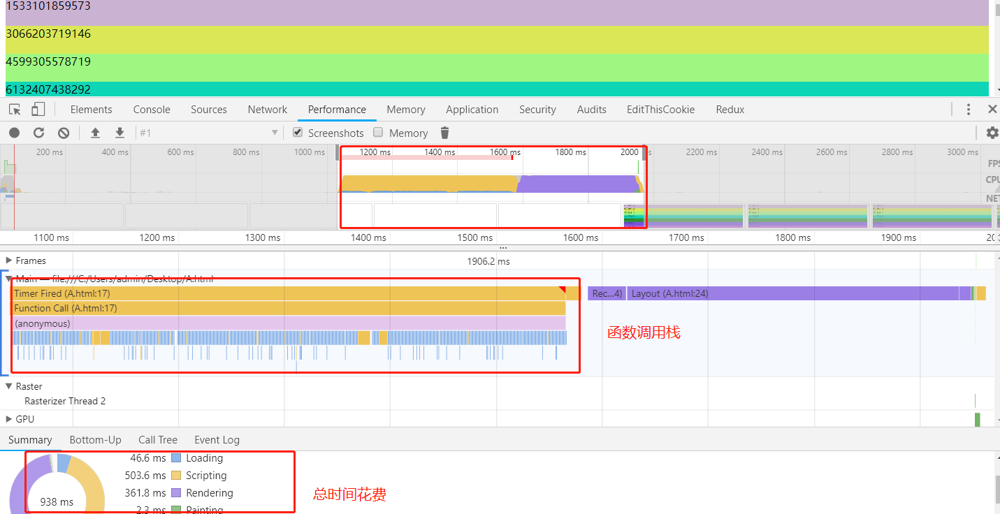
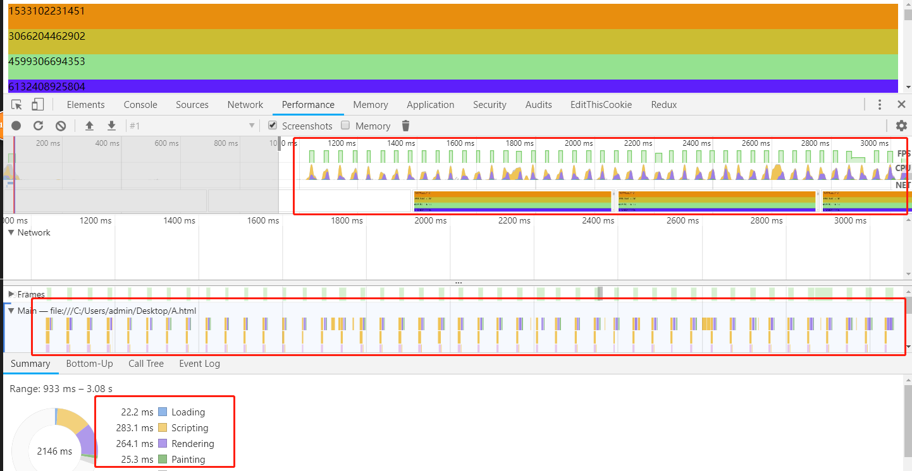
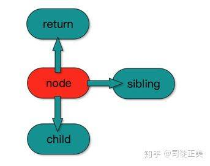
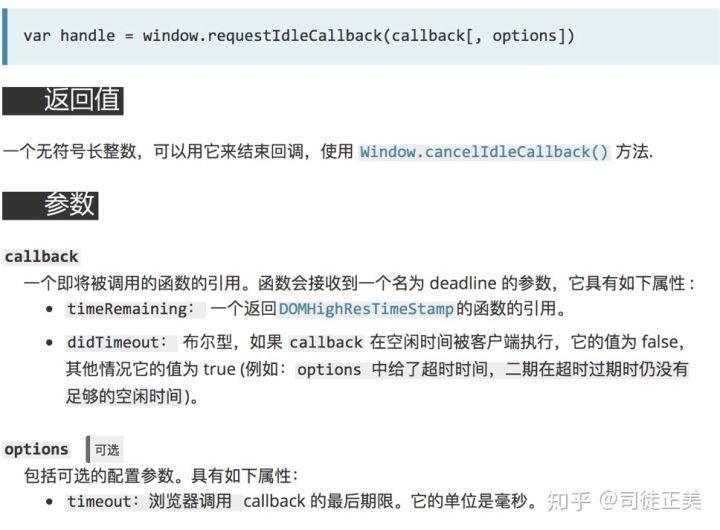
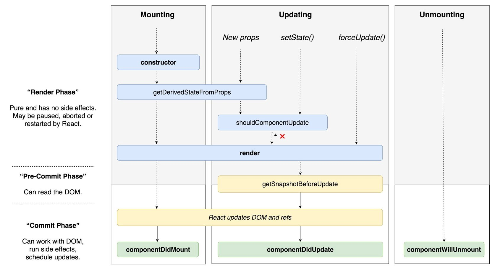

# 1. Fiber 架构
React16中，使用了一种全新的架构Fiber,它的最大作用是解决React项目的性能问题以及未来开启异步渲染做贡献。在React16顺便还解决了一些之前的同点。
# 1.1 痛点
- 组件不能返回数组：例如UL下只能用li,TR下只能用TD或TH,此时如果是使用组件循环生成的LI或TD,必须使用一个DIV进行包裹。（16版本已解决）
- 弹窗问题：之前使用不稳定的unstable_renderSubtreeIntoContainer方法，弹窗依赖原来DOM树的上下文，因为这个API第一个参数是组件实例，通过它可以得到虚拟DOM，然后可以一级一级往上找得到上下文。（16版本推出createPortal API,解决了弹窗问题,tooltips ,hovercard场景也一样）
```javascript
const modalNode = document.getElementById('modal-node');
...
render() {
  // React does *not* create a new div. It renders the children into `domNode`.
  // `domNode` is any valid DOM node, regardless of its location in the DOM.
  return ReactDOM.createPortal(
    this.props.children,
    modalNode
  );
}
```
- 异常处理： 想知道哪个组件出错，虽然有了React DevTool，但是太深的组件树查找起来还是很吃力。(16.0版本推出componentDidCatch钩子，划分出错误组件和边界组件，每个边界组件能够修复下方组件错误一次，再次出错转交给上层边界函数处理，解决异常处理函数)
```javascript
class extends React.Component {   
  constructor(props) {     
    super(props);     
    this.state = { error: false };
  }
  componentDidCatch(error, info) {     
    this.setState({ error, info });
  }
  render() {
    if (this.state.error) {
      return <h1>Error: {this.state.error.toString()}</h1>;
    }
    return this.props.children;   
  } 
}

// 在其他控件中使用
<PotentialError><AwesomeApp /></PotentialError>
```
- HOC的流行也存在两个问题，没有考虑ref和context的向下传递。
```javascript
class MyComponent extends React.Component {
    constructor(props) {
        super(props);
        this.myRef = React.createRef();
    }
    focusTextInput = () =>  (
        // Explicitly focus the text input using the raw DOM API
        // Note: we're accessing "current" to get the DOM node
        this.myRef.current.focus();
    );

    render() {
        // You may not use the ref attribute on functional components because they don’t have instances
        // You should convert the component to a class if you need a ref to it, just like you do when you need lifecycle methods or state.
        return <Child 
            inputRef={this.myRef}
            focusTextInput={this.focusTextInput}
        />
    }
}

class Child extends React.Component {
    render() {
        return (<input ref={this.props.inputRef}/>)
    }
}
```
- 组件性能的优化：全凭人肉。从16.0开始一直由一些内部机制来保证，涉及到批量更新及基于时间分片的限量更新。

# 1.2 React16思想
先通过以下的试验来学习以下react16的优化思想。
```javascript
function randomHexColor(){
    return "#" + ("0000"+ (Math.random() * 0x1000000 << 0).toString(16)).substr(-6);
}
setTimeout(function() {
    var k = 0;
    var root = document.getElementById("root");
    for(var i = 0; i < 10000; i++){
        k += new Date - 0 ;
        var el = document.createElement("div");
        el.innerHTML = k;
        root.appendChild(el);
        el.style.cssText = `background:${randomHexColor()};height:40px`;
    }
}, 1000);
```
这是一个拥有10000个节点的插入操作，包含了innerHTML与样式设置，花掉900多ms。<br>
<br>
我们再改进一下，分派次插入节点，每次只操作100个节点，共100次，发现性能异常的好！
```javascript
function randomHexColor() {
    return "#" + ("0000" + (Math.random() * 0x1000000 << 0).toString(16)).substr(-6);
}
var root = document.getElementById("root");
setTimeout(function () {
    function loop(n) {
        var k = 0;
        console.log(n);
        for (var i = 0; i < 100; i++) {
            k += new Date - 0;
            var el = document.createElement("div");
            el.innerHTML = k;
            root.appendChild(el);
            el.style.cssText = `background:${randomHexColor()};height:40px`;
        }
        if (n) {
            setTimeout(function () {
                loop(n - 1);
            }, 40);
        }
    }
    loop(100);
}, 1000);
```
<br>
究其原因是因为浏览器是单线程，它将GUI描绘，时间器处理，事件处理，JS执行，远程资源加载统统放在一起。当做某件事，只有将它做完才能做下一件事。如果有足够的时间，浏览器是会对我们的代码进行编译优化（JIT）及进行热代码优化，一些DOM操作，内部也会对reflow进行处理。reflow是一个性能黑洞，很可能让页面的大多数元素进行重新布局。浏览器的运作流程：
```
渲染 -> tasks -> 渲染 -> tasks -> 渲染 -> tasks -> ....
```
这些tasks中有些我们可控，有些不可控，比如setTimeout什么时候执行不好说，它总是不准时; 资源加载时间不可控。但一些JS我们可以控制，让它们分派执行，tasks的时长不宜过长，这样浏览器就有时间优化JS代码与修正reflow！总结一句，就是让浏览器休息好，浏览器就能跑得更快。

# 2. Fiber 如何让代码断开重连
在React16之前，被称为是栈调度器。栈没有什么不好，浅显易懂，代码量上。但是也有不好的点，不能随意break,continue。<br>
而链表是对异步友好的，链表在循环的时候不用每次都进入递归函数，重新生成什么执行上下文   ，变量对象，激活对象，性能当然就比递归好。因此React16设法将组件的递归更新，改变为链表的依次执行。如果页面多个虚拟DOM树，那么就将它们保存在一个数组中。
```javascript
ReactDOM.render(<A/>, node1);
ReactDOM.render(<B/>, node2);
// node1 与node2 不存在包含关系，那么这个页面就有两颗虚拟DOM树
```
React源码中，也分为了3层架构：
- 虚拟DOM层: 描述结构与逻辑(组件与组件之间的虚拟DOM的关系)
- 内部组件层： 负责组件的功能新,ReactDOM.render(), setState(), forceUpdate都是与它们打交道，能够让你多次setState,只执行一次真实的渲染，在合适的时机执行组件实例的生命周期的钩子。
- 底层渲染层：不同的显示介质有不同的渲染方法。比如说：浏览器端，使用的是元素节点，文本节点。在Native端，调用oc，java的GUI。在canvas中，有专门的API方法...<br>
虚拟DOM是由JSX转义过来的，JSX的入口函数是React.createElement，可操作控件不打。第三层的API也比较稳定，因此只能改变第二层。<br>
React16将内部组件层改成Fiber这种数据结构，因此它的架构名称也改为了Fiber架构。Fiber架构拥有`return`, `child`, `slibing`三个属性，分别对应父节点，第一个子节点和右边的兄弟节点。有了它们就足够将一棵树变成一个链表，实现深度优化遍历。<br>
<br>

# 3. Fiber 如何决定每次更新的数量
在React15中，每次更新时，都是从跟组件或者setState后的组件开始，更新整个子树。我们唯一能做的，就是在某个节点中使用SUC断开某一部分的更新，或者优化SUC的比较效率。<br>
React16中，将虚拟DOM转化为Fiber节点，首先它规定了一个时间段，然后在这个时间段能转换多少个FiberNode，就更新多少个。<br>
因此我们需要将更新逻辑分为两个阶段：将虚拟DOM转化为Fiber,第二个阶段是Fiber转化为组件实例或者真实DOM(不插入DOM树，插入DOM树会reflow)。Fiber转化为后者明显会耗时，因此需要计算自己还剩下多少时间，并且转化实例需要调用一些钩子，例如getSnapshotBeforeUpdate。如果要重复利用已有的实例，调用getDerivedStateFromProps,shouldComponentUpdate和getSnapshotBeforeUpdate也会耗时。

# 4. Fiber运作流程模仿
```javascript
// 存储需要更新的vnode
var quque =[];
ReactDOM.render = function(root, container) {
    queue.push(root)
    // updateFiberAndView要实现React的时间分片
    updateFiberAndView();
}

// 获取界面的某一个虚拟DOM根部
function getVdomFromQueue() {
    return queue.shift();
}

// 虚拟DOM转化为Fiber对象
function Fiber(vnode) {
    for (var i in vnode) {
        this[i] = vnode[i];
    }
    this.uuid = Math.random();
}

//我们简单的Fiber目前来看，只比vdom多了一个uuid属性
function toFiber(vnode){
    if(!vnode.uuid){
       return new Fiber(vnode)
    }
    return vnode
}

```
updateFiberAndView要实现React的时间分片。我们先用setTimeout模拟。我们暂时不用理会updateView怎么实现，可能它就是updateComponentOrElement中将它们放到又一个列队，需再出来执行insertBefore, componentDidMount操作呢！
```javascript
function updateFiberAndView() {
    // 当前时间
    var now = new Date() - 0;
    // 截止时间段
    var deadline = new Date() + 100;
    updateView(); // 更新视图，这会耗时，因此需要check时间

    if (new Date() < deadline) {
        var vdom = getVdomFormQueue();
        var fiber = vdom , firstFiber;
        var hasVisited = {};
        do {
            // 深度遍历优先
            var fiber = toFiber(fiber); // 虚拟DOM转化为fiber
            if (!firstFiber) {
                firstFiber = fiber; // 存储当前更新vnode的顶层父节点
            }
            // 该节点没有被访问
            if (!hasVisited[fiber.uuid]) {
                hasVisited[fiber.uuid] = 1; // 存入访问对象中
                // 根据fiber.type实例化组件或者创建真实的DOM
                // 这会耗时，因此需要check时间
                updateComponentOrElement(fiber);
                if (fiber.child) {
                    // 向下转换
                    if (new Date() - 0 > deadline) {
                        // 时间不够，放入队列中
                        queue.push(fiber.child);
                        break;
                    }
                    fiber = fiber.child; //让逻辑跑回A处，不断转换child, child.child, child.child.child
                    continue;
                }
            }
            //如果组件没有children，那么就向右找
            if (fiber.sibling) {
                fiber = fiber.sibling;
                continue; //让逻辑跑回A处
            }
            // 向上找。当前节点的深度遍历已完成。往上进行。
            fiber = fiber.return;
            if (fiber === fibstFiber || !fiber) {
                break;
            }
        } while(1)
    }
    if (queue.length) {
        setTimeout(updateFiberAndView, 40)
    }
}
```
里面有一个do while循环，每一次都是小心翼翼进行计时，时间不够就将来不及处理的节点放进列队。updateComponentOrElement的思路如下：通过这样Fiber的return, child, sibling就有了，可以happy地进行深度优先遍历了。
```javascript
function updateComponentOrElement(fiber) {
    var {
        type,
        stateNode,
        props
    } = fiber;
    if (!stateNode) {
        if (typeof type === 'string') {
            fiber.stateNode = document.createElement(type)
        } else {
            var context = {}; 
            fiber.stateNode = new type(props, context);
        }
    }
    if(stateNode.render){
        //执行钩子函数等
        children = stateNode.render()
    }else{
        children = fiber.childen
    }
    var pre = null;
    // 这里只是mount的实现，update时还需要一个oldChildren，进行key匹配，重复利用已有节点
    for (var i = 0, n = children.length; i < n; i++) {
        var child = children[i];
        child.return = fiber; // 将fiber设置到孩子节点的return上
        if (!prev) { 
            fiber.child = child;
        } else {
            prev.sibling = child;
        }
        prev = child;
    }
}
```
# 5. 如何调度时间才能保证流畅
在updateFiberAndView中，如果安排100ms来更新视图和虚拟DOM，再安排40ms给浏览器做其他事。如果我们的虚拟DOM树很小，其实用不了100ms,如果我们的代码之后，浏览器有更多其他事要干，40ms可能不够。IE10出现了setImmediate,requestAnimationFreame这些新的定时器。让我们能够让浏览器有能力让页面更流畅地运行起来。<br>
浏览器本身也不断进化中，随着页面由简单的展示转向WebAPP，它需要一些新能力来承载更多节点的展示与更新。下面是一些自救措施:
- requestAnimationFrame: 帧数控制调用,做动画时经常用到，jQuery新版本都使用它
- web worker: 多线程调用。在angular2开始就释出一些包，实验性地用它进行diff数据
- IntersectionObserver:  进入可视区调用。可以用到ListView中。
- requestIdleCallback: 闲时调用。是一个生脸孔，而React官方恰恰看上它。<br>
刚刚在updateFiberAndView中，说到有两个时间段，一个是给自己进行Fiber转换DOM,一个是给浏览器执行其他事情的。requestAnimationFrame能帮我们解决第二个时间段，从而确保整体都是60帧或75帧（这个帧数可以在操作系统的显示器刷新频率中设置）流畅运行。而第一个Fiber转换可以通过requestIdleCalback进行解决办法。<br>
- 第一个参数是一个回调: 回调的参数对象中有一个timeRemaining方法，相当于`new Date() - deadline`,并且它是一个高精度数据，比毫秒更准确。至少浏览器到底安排了多少时间给更新DOM与虚拟DOM，我们不用管。
- 第二个参数是option:其中有一个timeout，浏览器调用callback的最后期限。实际中，浏览器在1,2秒后才执行这个回调，我们可以设置第二个参数，让它在回调结束后300ms才执行。<br>
<br>
通过这个方法，我们的updateFiberAndView可以修改为这样：<br>
```javascript
function updateFiberAndView(dl) {
    updateView(); // 更新视图，耗时需要check事件
    if (dl.timeRemaining > 1) {
        var vdom = getVdomFormQueue()
        var fiber = vdom, firstFiber
        var hasVisited = {}
        do {//深度优先遍历
            var fiber = toFiber(fiber);//A处
            if(!firstFiber){
                fibstFiber = fiber
            }
            if (!hasVisited[fiber.uuid]) {
                hasVisited[fiber.uuid] = 1
                //根据fiber.type实例化组件或者创建真实DOM
                //这会耗时，因此需要check时间
                updateComponentOrElement(fiber);
                if (fiber.child) {
                    //向下转换
                     if (dl.timeRemaining() > 1) {
                        queue.push(fiber.child)//时间不够，放入栈
                        break
                    }
                    fiber = fiber.child;
                    continue  //让逻辑跑回A处，不断转换child, child.child, child.child.child
                }
            }
            //....略
        } while (1)
    }
    if (queue.length) {
        requetIdleCallback(updateFiberAndView, {
           timeout:new Date + 100
        }
      )
    }
}
```
到这里，ReactFiber基于时间分片的限量更新就是这样。实际上React为了照顾绝大多数的浏览器，自己实现了requestIdleCallback。
# 6. 批量更新
因为有的业务对视图的实时同步需求并不强烈，希望将所有逻辑都跑完才更新视图，于是有了batchedUpdates，目前它还不是一个稳定的API，因此大家使用它时要这样用ReactDOM.unstable_batchedUpdates。这个东西怎么实现呢？就是搞一个开局的开关，如果打开了，就让updateView不起作用。<br>
```javascript
var isBatching = false
function batchedUpdates(callback, event) {
    let keepbook = isBatching;
    isBatching = true;
    try {
        return callback(event);
    } finally {
        isBatching = keepbook;
        if (!isBatching) {
            requetIdleCallback(updateFiberAndView, {
               timeout:new Date + 1
            }
        }
    }
};

function updateView(){
   if(isBatching){
      return
   }
   //更新视图
}
```
React内部也大量使用batchedUpdates来优化用户代码，比如说在事件回调中setState，在commit阶段的钩子（componentDidXXX）中setState 。<br>

可以说，setState是对单个组件的合并渲染，batchedUpdates是对多个组件的合并渲染。合并渲染是React最主要的优化手段。<br>

# 为什么要对生命周期大换血
React将虚拟DOM的更新划分为连个阶段，reconciler阶段(早期的differ过程)和commit阶段。commit阶段对应早期版本的patch过程。<br>
differ算法是用于组件的新旧children对比，children一般不会出现过长的情况，有点大炮打蚊子的意思。况且我们的系统如果非常庞大，页面上有上万个组件，要diff这么多组件，再卓越的算法也不能保证浏览器不会累趴。就类似与短跑当然越快越好，但是如果是马拉松，就应该保存体力休息了。性能是一个系统性的工程。而休息就是`检测事件，然后断开Fiber链`。<br>
updateFiberAndView里面先进行udpateView.由于节点更新不可控可因此需要全部更新完毕再检测事件。并且我们不需要担心updateView出问题，因为它实质是在batchedUpdates，里面有try catch。而在接下来基于DFS更新节点中，每次都需要check时间，这个过程怕出错，因为组件在挂载过程中会调用三个钩子(constructor,componentWillMount,render),在更新过程中调用4次钩子(componentWillRecieveProps, shouldUpdate, componentWillUpdate, render),但是不可能全部try catch。性能会很差。而constructor和render是不可避免的，因此在WillXXX上动刀。<br>
componentWillMount与componentWillReceiveProps会做内部优化，执行多次setState都会延后到render时进行合并处理。因此用户就肆意setState了。这些willXXX还可以让用户任意操作DOM。 操作DOM会可能reflow，这是官方不愿意看到的。于是退出getDerivedStateFromProps,是应该静态方法，并且不能操作instance。阻止使用了setState,也没有机会操作DOM(instance.refs.xxx)。该方法的逻辑会很简单，不会出错，就不会打断DFS过程。而componentWillUpdate本来是为了方法对称，可有可无，因此也就动刀了。<br>
在即使到来的异步更新中，reconciler阶段可能执行多次，才执行一次commit，这样也会导致willXXX钩子执行多次，违反它们的语义，它们的废弃是不可逆转的。<br>
在进入commi阶段时，组件多了一个新钩子叫getSnapshotBeforeUpdate，它与commit阶段的钩子一样只执行一次。<br>
如果出错呢，在componentDidMount/Update后，我们可以使用componentDidCatch方法。于是整个流程变成这样：<br>
<br>
reconciler阶段的钩子都不应该操作DOM，最好也不要setState，我们称之为轻量钩子*。commit阶段的钩子则对应称之为重量钩子**。