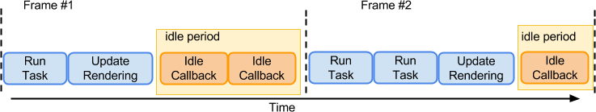

根据上面的fiber基础可以知道，Fiber是分为调和(Reconciliation)和渲染。下面先来看调和。
#1. Fiber 中的Reconciliation(调和)
React核心是定义组件。渲染组件由环境决定。而定义组件、组件状态管理、生命周期方法管理、组件更新等应该跨平台一致处理，不受环境影响，这部分统一由`调和器Reconciliation`处理。不同渲染器都是使用该模块。调和器的主要作用就是在组件状态变更时，调用组件树组件的render方法，渲染和卸载组件。 

# 1.1 Stack Reconciler（栈调和器）
我们知道浏览器渲染时单线程的，在React15版本中，计算组件树变更时会阻塞整个线程，整个渲染过程是连续不中断完成的。而这时的其他任务都会被阻塞，如动画等，这回让用户感觉到明显的卡顿。比如当在某一个网站输入搜索关键字，更优先的应该是交互反馈与动画效果，如果交互反馈延迟200ms,用户则会感觉到明显的卡顿，而数据响应晚200毫秒没什么太大问题。这个版本的调和器可以称之为栈调和器(stack Reconcilier) 
Stack Reconcilier 的主要缺陷：不能暂停渲染任务，也不能切分任务，无法有效平衡更新渲染和动画相关任务间的执行顺序，不能跨分任务优先级，导致任务卡顿、 动画掉帧等问题。

# 1.2 Fiber Reconciler（纤维调和器）
Fiber 调和器，是一个更加先进的调和器，它允许渲染进程分片完成，而不需要一次性完成，中间能够返回到主线程进行控制其他任务，而这是通过计算部分组件的变更、并暂停渲染更新，询问主进程是否有更高需求的绘制或者更新任务需要执行，这些高需求的任务完成后才开始渲染。 
这一切的实现是在代码层引入一个新的结构：Fiber，每一个组件实例对应都有一个fiber实例，此fiber实例负责管理组件实例的更新，渲染任务与其他fiber实例的关联。这个新推出的Fiber Reconciler （纤维调和器）的新功能主要有：
- 可切分，可中断任务
- 可重用各分阶段任务，且可以设置优先级
- 可以在父子组件任务间前进后退切换任务
- render方法可以返回多元素(即可以返回数组)
- 支持异常边界处理异常

#2 Fiber 与javascript
Fiber是拥有异步实现不同优先级任务的协调执行，那么对于DOM渲染器而言，在javascript层是否提供这种方式呢？还是说只能使用setTimeout模拟？其实在目前新版本的主流浏览器中，已经提供了可用的API: 
- requestIdleCallback: 在线程空闲使其调度执行低优先级函数
- requerstAnimationFrame: 在下一个动画帧调度执行高优先级函数 
# 2.1 空闲期(Idle Period)
客户端线程执行任务时会以帧的形式划分，大部分设备控制在30-60帧是不会影响用户体验，在执行两个帧之间，主线程通常还有一小段空闲时间，requestIdleCallback可以在这个空闲期(Idle Period)调用空闲期回调(Idle Callback),执行一些任务。 
 
Fiber 所做的就是分解渲染任务，然后根据优先级使用API调度，异步执行指定任务,React优先使用浏览器的方法，如果没有会使用自定义的方法（自己内部实现了类似的方法，解决兼容性） 
- 优先级低的任务由RequestIdleCallback处理
- 优先级高的任务：如动画相关的由requestAnimationFrame处理
- requestIdleCallback可以在多个空闲期调用空闲期回调，执行任务
- requestIdleCallback方法提供deadline,即任务执行限制时间，以切分任务，避免长时间执行，阻塞渲染而导致掉帧 

# 2.2 Fiber 与组件
- React应用中的基础单元是组件，应用以组件树的形式组织，渲染组件
- Fiber调和器基础单元则是fiber(调和单元)，应以fiber树形式组织，应用Fiber算法
- 组件树和fiber树结构对应，一个组件实例有一个对应的fiber实例
- Fiber负责整个应用层面的调和，fiber实例负责对应组件的调和 
注意Fiber和fiber的区别：Fiber是调和器算法，fiber则是调和器算法组成单元。与组件和应用的关系类似。每一个组件实例会有对应的fiber实例负责该组件的调和。

参考：http://blog.codingplayboy.com/2017/12/02/react_fiber/comment-page-1/#i-6