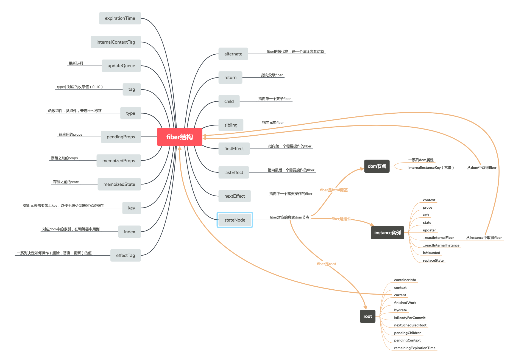

# 1. Fiber数据结构
一个fiber就是一个Javascript对象，以键值对形式存储了一个关联组件的信息。包括组件接收的props,维护的state,最后需要算然出来的内容等。下面看看Fiber对象的主要属性。
```javascript
// 一个Fiber对象作用于一个组件
export type Fiber = {
    tag: TypeOfWork, // 标记fiber类型tag
    type: any, // fiber对应的function /class /module 类型组件名(对于组合组件：值为function或class组件本身；对于原生组件（div等）：值为该元素类型字符串；)
    stateNode: any, // fiber所在组件树的根组件FiberRoot对象
    return:  Fiber | null, // 处理完当前fiber后返回的fiber,也是当前fiber所在fiber树上的父级fiber实例
    child: Fiber | null, // 当前fiber的第一个child对应的fiber实例
    sibling: Fiber | null, // 当前fiber的右边兄弟节点对应的fiber实例
    index: number, // 对应DOM的索引，在调节器中用到
    key:  null | string, // 调和阶段，标识fiber，以检测是否可重用该fiber实例；（数组元素需要带上key,以便减少调节器荣誉冗余操作）
    pendingProps: any, // 当前处理过程中的组件props对象(待应用的props对象)
    menoizedProps: any, // 缓存的之前组件的props(在调和算法的过程中，work-in-progress有很多个，而这个值保存的是已经提交到fiber实例上的props，即上一个work-in-progress的值)
    memoizedState: any, // 同menoizedProps
    updateQueue: UpdateQueue<any> | null, // 组件状态更新及对应回调函数的存储队列
    // 描述当前fiber实例及其子fiber树的数位.如AsyncUpdates特殊字表示默认以异步形式处理子树，一个fiber实例创建时，此属性继承自父级fiber，在创建时也可以修改值，但随后将不可修改。
    internalContextTag: TypeOfInternalContext,
    expirationTime: ExpirationTime, // 更新任务的最晚执行时间
    alternate: Fiber | null, // fiber的版本池，即记录fiber更新过程，便于恢复
    // Conceptual aliases
    // workInProgress : Fiber ->  alternate The alternate used for reuse happens to be the same as work in progress. 正在处理的fiber.概念上叫法，实际上没有此属性；

    effectTag: TypeOfSideEffect,  // 一系列决定如何操作(删除、替换、更新)的值
    nextEffect: Fiber | null, // 指向下一个需要操作的fiber
    firstEffect: Fiber | null, // 指向第一个需要操作的fiber
    lastEffect: Fiber | null, // 指向最后一个需要操作的fiber
};
```
<br>
- return ： 是处理workInProgress后返回的fiber，被视为parent fiber
- props是应一个函数的参数。在fiber中，pendingProps在它执行之前被设置, memoizedProps在它执行之后被设置。当即将到来的pendingProps和memoizedProps相同，标志着fiber之前的输出能被重用,避免了不必要的工作
- work-in-progress阶段：fiber 只是current fiber 的代替物
- current fiber的alternate是workInProgress ，workInProgress的alternate是current
- 在fiberRoot中stateNode指向root，是一个循环对象，在root.current.alternate下的fiber中的stateNode则是每个fiber对应的dom或者 instance

# 1.1 创建Fiber实例
创建fiber实例即返回一个带有上一小节描述的诸多熟悉的javascript，FiberNode即根据传入的参数构造返回一个初始化的对象。
```javascript
const createFiber = function(
  tag: TypeOfWork,
  pendingProps: mixed,
  key: null | string,
  mode: TypeOfMode,
): Fiber {
  // $FlowFixMe: the shapes are exact here but Flow doesn't like constructors
  return new FiberNode(tag, pendingProps, key, mode);
};

function FiberNode(
  tag: TypeOfWork,
  pendingProps: mixed,
  key: null | string,
  mode: TypeOfMode,
) {
  // Instance
  this.tag = tag; // fiber 类型：代表是函数式组件，class组件，内部组件，文本组件等...
  this.key = key;
  this.type = null; // fiber对应的function /class /module 类型组件名
  this.stateNode = null; // 当前fiber所在的fiber组件树的FiberRoot对象

  // Fiber
  this.return = null; // 父fiber节点
  this.child = null; // 第一个孩子节点
  this.sibling = null; // 右边的兄弟节点
  this.index = 0;

  this.ref = null;

  this.pendingProps = pendingProps; // 当前处理过程中的组件props对象
  this.memoizedProps = null; // 当前fiber实例的最新props
  this.updateQueue = null; // 当前fiber身上的更新队列（在执行的过程中，props,state，effects信息都会改变）
  this.memoizedState = null; // 当前fiber实例的最新state

    // export const NoContext = 0b00;
    // export const AsyncMode = 0b01;
    // export const StrictMode = 0b10;
    // 模式的值，代表严格模式，异步模式，无内容
  this.mode = mode; 

  // Effects
  this.effectTag = NoEffect; // 一系列决定如何操作(删除、替换、更新)的值
  this.nextEffect = null; // 指向下一个操作的fiber节点

  this.firstEffect = null;  // 指向第一个操作的fiber节点
  this.lastEffect = null; // 指向最后一个操作的fiber节点

  this.expirationTime = NoWork; // 当前fiber的过期时间

  this.alternate = null; // 指向work-in-progress ，更新进行过程中的fiber
}
```
# 1.2 Fiber 类型（fiber 实例 的 tag： TypeOfWork）
在Fiber的类型定义总，有一个属性`tag`，标记fiber的类型，而fiber实例和组件对应的，所以其类型基本上对应于组件类型。在调度执行任务的时候会根据不同类型fiber，即fiber.tag值进行不同处理。
```javascript
// react/packages/shared/ReactTypeOfWork.js
export const IndeterminateComponent = 0; // 尚不知是类组件还是函数式组件,Before we know whether it is functional or class
export const FunctionalComponent = 1; // 函数式组件
export const ClassComponent = 2; // class 类组件
export const HostRoot = 3; //组件树根组件，可以嵌套。 Root of a host tree. Could be nested inside another node.
export const HostPortal = 4; // A subtree. Could be an entry point to a different renderer.
export const HostComponent = 5; // 标准组件，如地div， span等
export const HostText = 6; // 文本
export const CallComponent_UNUSED = 7; // 组件调用
export const CallHandlerPhase_UNUSED = 8; // 调用组件方法
export const ReturnComponent_UNUSED = 9; // placeholder（占位符）
export const Fragment = 10; // // 片段
export const Mode = 11;
export const ContextConsumer = 12;
export const ContextProvider = 13;
export const ForwardRef = 14;
export const Profiler = 15;
export const PlaceholderComponent = 16;
```

# 1.3 Fiber 类型的 alternate
可以理解为一个fiber版本池，用于交替记录组件更新过程中fiber的更新(切分任务后变成多阶段更新)。因为在组件更新的各个阶段，更新前及更新过程中fiber状态并不一致，在需要恢复时(如发生冲突)，即可使用另一者直接退回至上一版本。<br>
- 使用alertnate 属性双向连接 `当前fiber` 和 `workInProgress更新中的fiber副本`。 当前fiber实例的alertnate属性指向 worksInProgress。而worksInProgress的alertnate属性指向当前fiber。
```javascript
// 创建一个alternate fiber处理任务
export function createWorkInProgress(
    current: Fiber, // 当前fiber实例
    pendingProps: any, // 当前最新的props属性（ 当前处理过程中的组件props对象）
    expirationTime: ExpirationTime, // 过期时间
) {
// 将当前fiber 的alertnate赋值给workInProgress,没有则通过current fiber的属性创建一个相同内容的fiber实例。相当于一个副本
  let workInProgress = current.alternate;
  if (workInProgress === null) {
    workInProgress = createFiber(
      current.tag,
      current.key,
      current.internalContextTag,
    );
    workInProgress.type = current.type;
    workInProgress.stateNode = current.stateNode;

    // 形成alternate关系，互相交替模拟版本池。
    workInProgress.alternate = current;
    current.alternate = workInProgress;
  } 
  // 复制其他属性
  workInProgress.expirationTime = expirationTime;
  workInProgress.pendingProps = pendingProps;
  workInProgress.child = current.child;
  workInProgress.memoizedProps = current.memoizedProps;
  workInProgress.memoizedState = current.memoizedState;
  workInProgress.updateQueue = current.updateQueue;
  ...
  return workInProgress;
}
```
# 2. FiberRoot 
FiberRoot对象主要是用于管理组件树组件的更新进程，同时记录组件树挂在的DOM容器相关信息。
- curent fiber的alertnate是workInProgress,worksProgress的alertnate是current
```javascript
// react/packages/react-reconciler/src/ReactFiberRoot.js
export type FiberRoot = {
  // fiber节点的容器元素相关信息，通常会直接传入容器元素
  containerInfo: any,
  // 当前fiber树中激活状态（正在处理）的fiber节点，
  current: Fiber,
  // 此节点剩余的任务到期时间
  remainingExpirationTime: ExpirationTime,
  // 更新是否可以提交
  isReadyForCommit: boolean,
  // 准备好提交的已处理完成的work-in-progress
  finishedWork: Fiber | null,
  // 多组件树FirberRoot对象以单链表存储链接，指向下一个需要调度的FiberRoot
  nextScheduledRoot: FiberRoot | null,
};

```
<br>
创建FiberRoot实例： 也就是创建一个fiber对象，然后将根root的信息保存后，挂载到fiber的stateNode属性上。
- dom 元素中有以
```javascript
import {
  ClassComponent,
  HostRoot
} from 'shared/ReactTypeOfWork';

// 创建返回一个初始根组件对应的fiber实例
function createHostRootFiber(): Fiber {
  // 创建fiber
  const fiber = createFiber(HostRoot, null, NoContext);
  return fiber;
}

export function createFiberRoot(
  containerInfo: any,
  hydrate: boolean,
) {
  // 创建初始根组件对应的fiber实例
  const uninitializedFiber = createHostRootFiber();
  // 组件树根组件的FiberRoot对象
  const root = {
    // 根组件对应的fiber实例
    current: uninitializedFiber,
    containerInfo: containerInfo,
    pendingChildren: null,
    remainingExpirationTime: NoWork,
    isReadyForCommit: false,
    finishedWork: null,
    context: null,
    pendingContext: null,
    hydrate,
    nextScheduledRoot: null,
  };
  // 组件树根组件fiber实例的stateNode指向FiberRoot对象
  uninitializedFiber.stateNode = root;
  return root;
}
```
# 3. ReactChildFiber
在生成组件树的FiberRoot对象后，会为子组件生成各自的fiber实例。而ChildReconciler方法所做的则是根据传入参数判断是调用初始化子组件fibers逻辑还是执行调和已有子组件fibers逻辑。
```javascript
// react/packages/react-reconciler/src/ReactChildFiber.js

// 调和（处理更新）子fibers
export const reconcileChildFibers = ChildReconciler(true);
// 挂载（初始化）子fibers
export const mountChildFibers = ChildReconciler(false);
```
ChildReconciler方法返回reconcileChildFibers方法：<br>
- 判断子组件传递内容的数据类型，执行不同的处理。这也对应着我们写React组件时传递props.children时，其类型可以是对象，数组，字符串或数字等。
- 然后根据子组件类型，调用不同的具体调和处理函数
- 最后返回根据子组件创建或更新得到的fiber实例
```javascript
function ChildReconciler(a) {
  function reconcileChildFibers(
    returnFiber: Fiber, currentFirstChild: Fiber | null,
    newChild: any, expirationTime: ExpirationTime,
  ) {
    // Handle object types
    const isObject = typeof newChild === 'object' && newChild !== null;

    if (isObject) {
      // 子组件实例类型，以Symbol符号表示的
      switch (newChild.$$typeof) {
        // React Element
        case REACT_ELEMENT_TYPE:
          return placeSingleChild(
            reconcileSingleElement(
              returnFiber, currentFirstChild,
              newChild, expirationTime
            )
          );
        // React组件调用
        case REACT_CALL_TYPE:
          return placeSingleChild(reconcileSingleCall(...));
        // placeholder
        case REACT_RETURN_TYPE:
          return ...;
        case REACT_PORTAL_TYPE:
          return ...;
      }
    }
    if (typeof newChild === 'string' || typeof newChild === 'number') {
      return placeSingleChild(reconcileSingleTextNode(...));
    }
    if (isArray(newChild)) {
      return reconcileChildrenArray(...);
    }
    if (getIteratorFn(newChild)) {
      return reconcileChildrenIterator(...);
    }
    ...   
  }
}
```

# 4.如何找到fiber?
- 如何从组件的实例中取得 fiber?
从思维导图中可以看到，如果stateNode 为组件实例 instance ，则其中有_reactInternalFiber 属性，指向该组件的 fiber
```javascript
function get(key) { // 得到instance的fiber
    return key._reactInternalFiber;
}
```
- 如何从 dom 中找到 fiber?
dom 元素中有以 __reactInternalInstance 开头的属性，此属性即指向dom 对应的 fiber
```javascript
var internalInstanceKey = '__reactInternalInstance$' + randomKey;

function getInstanceFromNode$1(node) {
    var inst = node[internalInstanceKey];
    if (inst) {
        if (inst.tag === HostComponent || inst.tag === HostText) {
            return inst;
        } else {
            return null;
        }
    }
    return null;
}
```
- 如何得到fiber对应的dom?
如果fiber.tag === HostComponent，即fiber 是div、span 等 html 元素类型，则该fiber的stateNode指向的就是具体的 dom节点

参考：http://blog.codingplayboy.com/2017/12/02/react_fiber/comment-page-1/#i-6