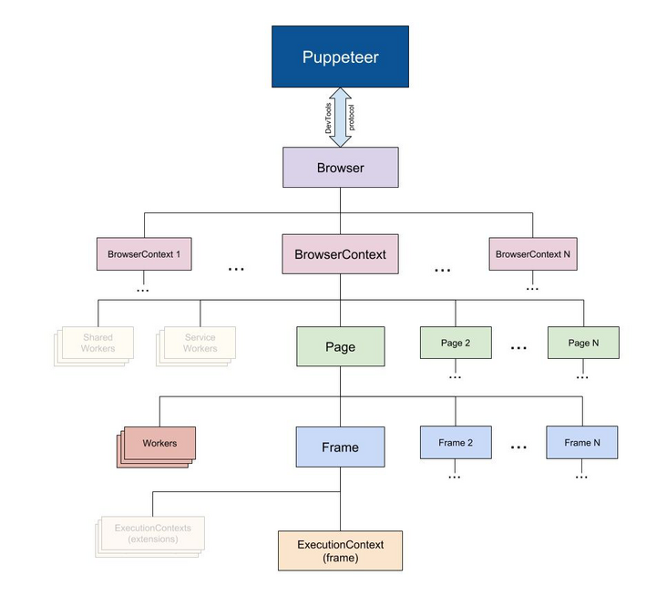

## 1. 什么是服务端录制

在项目的中，加入了录制会议的功能。什么是服务端录制呢？就是在服务器端，通过进入需要录制的房间，然后将房间的声音、视频的情况录制下来，保存到视频文件中。

## 2. 技术选型（puppeteer + puppeteer-stream）

## 2.1 什么是 puppeteer

Puppeteer 是一个 Node 库，它提供了各种高级的 API,通过 DevTools 协议来控制浏览器（chrome, chromium)。可以理解成为一个 headless chrome 浏览器。当前，我们也可以通过 option,设置为有 UI 的浏览器。<br>
Puppeteer API 分层结构：<br>
<br>

## 2.2 puppeteer api

[Puppeteer API](https://pptr.dev/#?product=Puppeteer&version=v10.1.0&show=api-class-cdpsession)<br>
| API | 描述 |
| --------- | ----------------- |
| Browser | 浏览器实例，可以包含多个 BrowserContext |
| BrowserContext | 对应浏览器的一个上下文回话。例如普通的浏览器中打开隐身模式的浏览器，具有独立的 cookie 和 cache, 拥有多个 page|
| Page | 表示一个 Tab 页面： browser.newPage() |
| Frame | 每个页面有一个主框架（page.MainFrame()，可以拥有多个子框架，由 iframe 标签创建 |
| ExecutionContext | JavaScript 执行环境。每一个 frame 有一个默认的 JavaScript 执行环境 |
| ElementHandle | 对应 Dom 的一个元素节点，通过该实例可以实现对元素的点击，操作 |
| JsHandle | 对应 Dom 中的 JavaScript 对象，ElementHandle 继承于 JSHandle.由于我们无法直接操作 DOM 中对象，所以封装成 JsHandle 来实现相关功能 |
| CDPSession | 可以直接与[原生的 CDP 进行通信](https://github.com/aslushnikov/getting-started-with-cdp/blob/master/README.md)，通过 session.send 函数直接发消息，通过 session.on 接收消息，可以实现 Puppeteer API 中没有涉及的功能 |
| Coverage | 获取 JavaScript 和 css 代码覆盖率 |
| Tracing | 抓取性能数据进行分析 |
| Response | 页面收到的响应 |
| Request | 页面发出的请求 |

## 2.3 什么是 puppeteer-stream

会议录制其实就是讲页面的音频视频转换为流，然后将流存入文件中。[puppeteer-stream](https://github.com/Flam3rboy/puppeteer-stream#readme)通过调用`Chrome Extension API`: [chrome.tabCapture.capture](https://developer.chrome.com/docs/extensions/reference/tabCapture/), 返回整个页面的音频视频流。<br>
当然，我们也可以不使用 puppeteer-stream,自己使用`Chrome Extension API`来捕获页面的 stream 流，包含了音频和视频。然后通过`MediaRecorder`创建一个变量，并监听新进来的 stream， 最后将该流保存为 webm 格式的视频文件。<br>

tips:<br>
`chrome.tabCapture.capture`: 捕获当前活动标签页的可视区域。该方法只能在扩展程序被调用之后在当前活动网页上使用，与 activeTab 的工作方式类似。

# 3. 实现录制

`puppeteer-stream` 已经`puppeteer`引入改造，在实际的录制中，我们只需要引入`puppeteer-stream`即可。按照以下步骤实现功能：

- 打开浏览器
- 访问需要录制的页面
- 获取录制页面的 stream 对象，存放如 webm 格式视频文件

## 3.1 打开浏览器

这里需要注意`defaultViewport` 和 `--window-size`需要结合配置，让窗体才能 100%打开。不然打开后是一个很小的窗体。<br>

args 参数可以访问这里：https://peter.sh/experiments/chromium-command-line-switches/

```javascript
import { launch } from "puppeteer-stream";
let width = 1920,
  height = 1080;
this.browser = await launch({
  headless: true,
  args: [
    "--no-sandbox",
    "--disable-setuid-sandbox",
    `--window-size=${width},${height}`,
    "--autoplay-policy=no-user-gesture-required",
    // '--remote-debugging-port=3333',
    // "--auto-open-devtools-for-tabs",
  ],
  defaultViewport: {
    width: 0,
    height: 0,
  },
  ignoreDefaultArgs: ["--disable-extensions", "--mute-audio"],
});
```

## 3.2 访问需要录制的页面

创建一个 page, 在 page 中输入需要访问的地址， 并处理界面上各种点击事件操作。

```javascript
let [page] = await this.browser.pages();
this.page = page;
await page.goto(this.address, { waitUntil: "networkidle0" });

// dom 操作
await page.waitForSelector('button[role="xxx"]', { visible: true });
await page.click(
  'button[role="xxx"]',
  page.waitForNavigation({ waitUntil: "networkidle2" })
);
```

如果需要在页面里执行一些操作，可以通过 `page.evaluate(function, option)`方法实现。这相当于在控制台编写代码。`function` 为控制台执行的内容，option 是想从外面传递到内部的参数。

```javascript
 const result = await page.evaluate(
  async (option: { [key in string]: any }) => {
    let { _client } = window as any;
    console.log(options.id);
    return JSON.stringify(joinResult)
  },
  {
    id: this.id,
  }
);
```

## 3.3 保存视频文件

`getStream`会返回整个页面的 stream,将该流生成一个 webm 格式的视频。

```javascript
import fs from "fs";
import { Page } from "puppeteer";
import { getStream } from "puppeteer-stream";
 this.stream = await getStream(this.page as Page, {
    audio: true,
    video: true,
    frameSize: 20,
  });

  this.file = fs.createWriteStream(`${this.filePath}.webm`);
  this.stream.pipe(this.file);
```

# 4. xvfb-run 虚拟桌面

因为最终部署需要在服务器上走 docker, 都是无桌面的方式。但是 chrome 是不支持 headless（无头）模式下注入插件。这里我们可以使用`xvfb`还实现，该软件会帮我们生成一个虚拟桌面，然后代码就会在改虚拟的左面进行运行。

```
xvfb-run --server-args="-screen 0, 3840x2160x24" npm run server
```

ffmpeg -i rebirth-demo.webm -vcodec copy -acodec copy new_rebirth-demo.webm。这个十分的快，因为本身是直接复制，而不是转化

至此，录制功能完美结束~~
