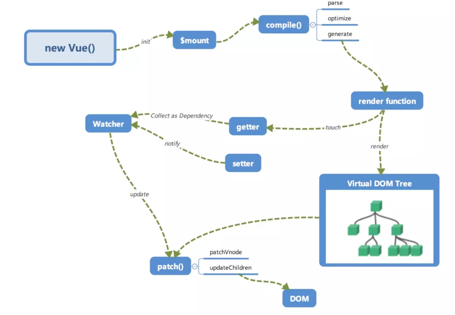

# lifeCycle基本方法
当一个vue被创建的时候，它想Vue的响应式系统中加入了其Data对象中能够找到的所有属性，当这些属性发生改变的时候，视图就会产生`响应`，即匹配更新为新的值。<br>
vue在创建的时候，会经过一系列的初始化过程，会设置数据监听，编译模板，实例挂载到DOM，数据变化响应式更新。在这个过程中，会运行到一些关于生命周期钩子的函数。我们可以在这些不同阶段的钩子函数中添加自己的代码。

| method | description |
| :--- | :----- |
| beforeCreate | 组件实例刚被创建，组件属性计算之前，如data属性 |
| created | 组件实例创建完成，属性已绑定，但DOM还未完成，`$el`属性还不存在 |
| beforeMount | 模板编译/挂载之前 |
| Mounted | 模板编译/挂载之后(不能保证组件已经在document中) |
| beforeUpdate | 组件更新之前 |
| updated | 组件更新之后 |
| activated | for `keep-alive` ,组件被激活时调用 |
| deactivated | for `keep-alive`,组件被移除时调用 |
| beforeDestroy | 组件销毁前调用 |
| destroyed | 组件销毁后调用 |
# 图解
<br>
# 例子
```javascript
<!DOCTYPE html>
<html>
<head>
    <title></title>
    <script type="text/javascript" src="https://cdn.jsdelivr.net/vue/2.1.3/vue.js"></script>
</head>
<body>

<div id="app">
     <p>{{ message }}</p>
</div>

<script type="text/javascript">
  var app = new Vue({
      el: '#app',
      data: {
          message : "test" 
      },
       beforeCreate: function () {
                console.group('beforeCreate 创建前状态===============》');
               console.log("%c%s", "color:red" , "el     : " + this.$el); //undefined
               console.log("%c%s", "color:red","data   : " + this.$data); //undefined 
               console.log("%c%s", "color:red","message: " + this.message)  
        },
        created: function () {
            console.group('created 创建完毕状态===============》');
            console.log("%c%s", "color:red","el     : " + this.$el); //undefined
               console.log("%c%s", "color:red","data   : " + this.$data); //已被初始化 
               console.log("%c%s", "color:red","message: " + this.message); //已被初始化
        },
        beforeMount: function () {
            console.group('beforeMount 挂载前状态===============》');
            console.log("%c%s", "color:red","el     : " + (this.$el)); //已被初始化
            console.log(this.$el);
               console.log("%c%s", "color:red","data   : " + this.$data); //已被初始化  
               console.log("%c%s", "color:red","message: " + this.message); //已被初始化  
        },
        mounted: function () {
            console.group('mounted 挂载结束状态===============》');
            console.log("%c%s", "color:red","el     : " + this.$el); //已被初始化
            console.log(this.$el);    
               console.log("%c%s", "color:red","data   : " + this.$data); //已被初始化
               console.log("%c%s", "color:red","message: " + this.message); //已被初始化 
        },
        beforeUpdate: function () {
            console.group('beforeUpdate 更新前状态===============》');
            console.log("%c%s", "color:red","el     : " + this.$el);
            console.log(this.$el);   
               console.log("%c%s", "color:red","data   : " + this.$data); 
               console.log("%c%s", "color:red","message: " + this.message); 
        },
        updated: function () {
            console.group('updated 更新完成状态===============》');
            console.log("%c%s", "color:red","el     : " + this.$el);
            console.log(this.$el); 
               console.log("%c%s", "color:red","data   : " + this.$data); 
               console.log("%c%s", "color:red","message: " + this.message); 
        },
        beforeDestroy: function () {
            console.group('beforeDestroy 销毁前状态===============》');
            console.log("%c%s", "color:red","el     : " + this.$el);
            console.log(this.$el);    
               console.log("%c%s", "color:red","data   : " + this.$data); 
               console.log("%c%s", "color:red","message: " + this.message); 
        },
        destroyed: function () {
            console.group('destroyed 销毁完成状态===============》');
            console.log("%c%s", "color:red","el     : " + this.$el);
            console.log(this.$el);  
               console.log("%c%s", "color:red","data   : " + this.$data); 
               console.log("%c%s", "color:red","message: " + this.message)
        }
    })
</script>
</body>
</html>
```
- 测试update ，在chrome console里执行以下命令：
```javascript
app.message = 'yes ，I do';
```
- 有关于销毁，暂时还不是很清楚。我们在console里执行下命令对 vue实例进行销毁。销毁完成后，我们再重新改变message的值，vue不再对此动作进行响应了。但是原先生成的dom元素还存在，可以这么理解，执行了destroy操作，后续就不再受vue控制了。<br>
```javascript
app.$destroy();
```

# 2. 生命周期的使用
- beforecreate : 举个栗子：可以在这加个loading事件 
- created ：在这结束loading，还做一些初始化，实现函数自执行 
- mounted ： 在这发起后端请求，拿回数据，配合路由钩子做一些事情
- beforeDestroy： 你确认删除XX吗？ destroyed ：当前组件已被删除，清空相关内容

引用：https://segmentfault.com/a/1190000008010666

# 3 运行机制全局概览
下面的图是对整个流程的一个大概的认识。<br>
<br>
 