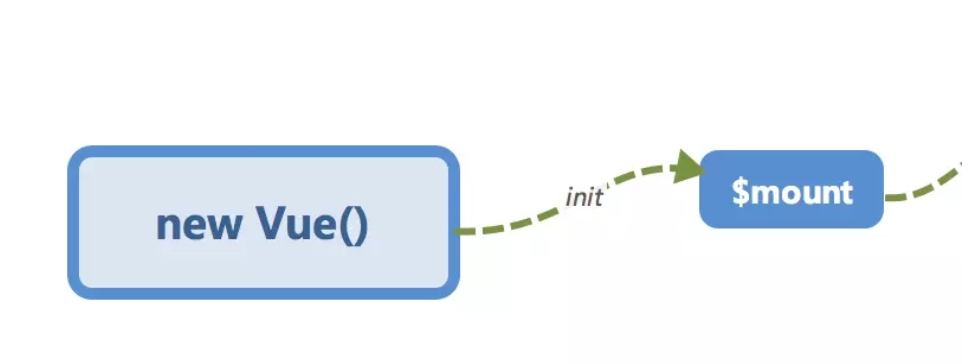
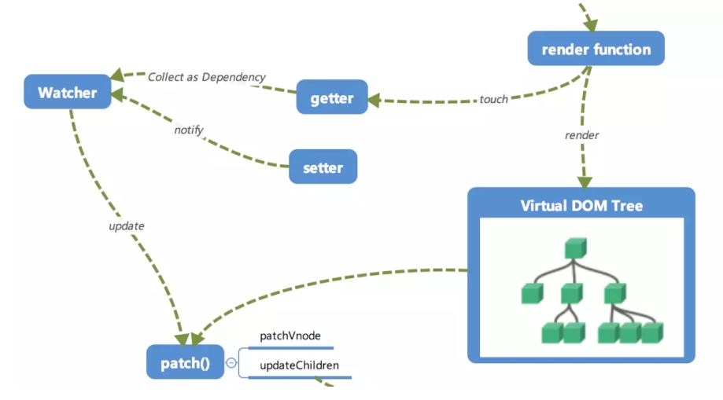

# 1. 关于vue.js
vue.js是一款MVVM的框架，通过响应式在修改数据的时候更新视图。vue.js的响应式原理依赖于`Object.defineProperty`方法，这也是Vue.js不支持IE8以及更低版本浏览器的原因。<br>
Vue.js通过设定对象属性的setter和getter方法，来监听数据的变化，通过getter进行依赖收集，而setter方法是观察者，在数据变更的时候，通知各个关于该属性的订阅者更细视图。<br>

# 2. 初始化及挂载
<br>
`new Vue`执行后，到挂载，Vue执行了哪些步骤呢？
- 调用_init函数进行初始化，包含初始化声明周期、事件、props、methods、data、computed与watch等。
```javascript
export function initMixin (Vue: Class<Component>) {
  Vue.prototype._init = function (options?: Object) {
    const vm: Component = this
    // expose real self
    vm._self = vm
    initLifecycle(vm) // 生命周期
    initEvents(vm) // 事件 
    initRender(vm)
    callHook(vm, 'beforeCreate') // 调用beforeCreate声明周期函数
    initInjections(vm) // resolve injections before data/props
    initState(vm) // 初始化props,methods,data，computed,watch
    initProvide(vm) // resolve provide after data/props
    callHook(vm, 'created') // 调用created声明周期方法
    if (vm.$options.el) {
      vm.$mount(vm.$options.el)
    }
  }
}
```
# 3. 响应式原理 之 将数据data变成可观察(observable)
<br>
在Vue构造函数中的`initState`里，调用了`initData`来设置`data`属性。那么Vue是如何将所有的data下面的属性编程可观察的(observable)呢？其实是利用了`Object.defineProperty`进行绑定，在对属性进行设置的时候调用`setter`方法，读取的时候调用`getter`方法。
- 在Vue的构造函数中为vue对象的_data属性调用observe观察者函数，将_data的所有属性设置为`observable`,通过触发`getter`函数进行`依赖收集`。目的是将观察者`Watcher`对象存放到当前闭包中的订阅者`Dep`的subs中，成为订阅者。
- 当_data发生变化的时候，就会触发属性相关的setter方法，而在setter方法中，对订阅者进行了回调，会通知之前`依赖收集`得到的`Dep`中的每一个Watcher，告诉它们自己的值已经变化了，需要重新渲染视图。这些watcher就会开始调用`update`来更新视图(当然这里面会涉及到patch的过程以及使用队列来进行异步更新的策略)。
```javascript
class Vue {
    constructor(options) {
        // 实际代码是在构造器中调用initData方法，该方法内部如下内容..........initData start ........
        let i = keys.length
        while (i--) {
            const key = keys[i]
            }
            // 将data的属性一一挂载到vue实例对象上（具体方法在下面proxy方法）
            proxy(vm, `_data`, key)
        }
        // 观察data的所有属性
       observe(data, true /* asRootData */)
        // ......initData end .......
    }
}

// 为一个value值创建一个observer instance,不存在则创建，存在则直接返回
export function observe (value: any, asRootData: ?boolean): Observer | void {
  let ob: Observer | void
  if (hasOwn(value, '__ob__') && value.__ob__ instanceof Observer) {
    ob = value.__ob__
  } else if (...) {
    ob = new Observer(value)
  }
  if (asRootData && ob) {
    ob.vmCount++
  }
  return ob
}

// 观察者对象
export class Observer {
  value: any;
  dep: Dep;
  vmCount: number; // number of vms that has this object as root $data
  constructor (value: any) {
    this.value = value
    this.dep = new Dep()
    this.vmCount = 0
    def(value, '__ob__', this) // def是调用Object.defineProperty()，将自己挂载到了__ob__属性上
    if (Array.isArray(value)) {
      this.observeArray(value)
    } else {
      this.walk(value)
    }
  }

// 该方法用于处理value是对象时，为每个属性添加getter和setter
  walk (obj: Object) {
    const keys = Object.keys(obj)
    for (let i = 0; i < keys.length; i++) {
      defineReactive(obj, keys[i])
    }
  }

  /**
   * 处理是数组
   */
  observeArray (items: Array<any>) {
    for (let i = 0, l = items.length; i < l; i++) {
      observe(items[i])
    }
  }
}


export function defineReactive (obj: Object, key: string, val: any, customSetter?: ?Function, shallow?: boolean) {
  const dep = new Dep()
  // 获取对象描述符
  const property = Object.getOwnPropertyDescriptor(obj, key)
  // 自定义getter,setter,则使用自定义的
  const getter = property && property.get
  if (!getter && arguments.length === 2) {
    val = obj[key]
  }
  const setter = property && property.set
  // 定义getter,setter
  Object.defineProperty(obj, key, {
    enumerable: true,
    configurable: true,
    get: function reactiveGetter () {
      const value = getter ? getter.call(obj) : val
      // 假如是数组，会深度遍历,继续defineProperty
      ....
      if (Dep.target) {
        // 内部调用了dep的 Dep.target.addDep(this)，将观察者Watcher实例赋值给全局的Dep.target
       
        dep.depend()
        if (childOb) {
          childOb.dep.depend()
          if (Array.isArray(value)) {
            dependArray(value)
          }
        }
      }
      return value
    },
    set: function reactiveSetter (newVal) {
      const value = getter ? getter.call(obj) : val
      // 自定义的setter
      if (setter) {
        setter.call(obj, newVal)
      } else {
        val = newVal
      }
      childOb = !shallow && observe(newVal)
      // 订阅者收到消息的回调,notify()方法用于通知所有使用到该属性的对象进行更新
      dep.notify()
    }
  })
}
```
# 4. 响应式原理 之 代理
通过上面的处理，我们可以看出，只有当调用`app._data.xxx`属性才回触发setter操作。为了方便，我们需要一种简单的方法，当调用`app.xxx`就直接能够触发setter，从而对视图进行重绘，那么此时就需要用到代理。<br>
我们可以在Vue的构造函数中为data执行一个代理proxy,将data上面的属性代理，挂载到vm实例上。
```javascript
const sharedPropertyDefinition = {
  enumerable: true,
  configurable: true,
  get: noop,
  set: noop
}
export function proxy (target: Object, sourceKey: string, key: string) {
  sharedPropertyDefinition.get = function proxyGetter () {
    return this[sourceKey][key]
  }
  sharedPropertyDefinition.set = function proxySetter (val) {
    this[sourceKey][key] = val
  }
  Object.defineProperty(target, key, sharedPropertyDefinition)
}
```
我们就可以用app.text代替app._data.text了

# 5. 依赖搜集 之 Dep 发布者
上面提到，当对data上的对象进行修改值的时候，就会触发setter，取值的时候触发getter事件。所以我们只要再最开始进行一次render,那么所有被渲染所依赖的data数据都会被getter收集到Dep的subs中去，在对data中的数据进行修改的时候，setter就会触发Dep中的subs的函数。
- 首次调用$mount渲染时，会创建watcher对象
- 再调用getter时，Dep发布者会将关于该属性相关的watcher对象添加到subs中
- 当调用setter时，就会通知subs中所有的订阅者进行重绘
```javascript
export default class Dep {
  static target: ?Watcher;
  id: number;
  subs: Array<Watcher>;

  constructor () {
    this.id = uid++
    // 用来存放Watcher对象的数组
    this.subs = []
  }
  // 增加订阅者，增加一个Wathcer对象
  addSub (sub: Watcher) {
    this.subs.push(sub)
  }
  // 移除订阅者
  removeSub (sub: Watcher) {
    remove(this.subs, sub)
  }

  depend () {
    if (Dep.target) {
      Dep.target.addDep(this)
    }
  }
  // 发布消息，通知所有Wathcer对象更新视图
  notify () {
    // stabilize the subscriber list first
    const subs = this.subs.slice()
    for (let i = 0, l = subs.length; i < l; i++) {
      subs[i].update()
    }
  }
}
```
# 依赖收集 之 Watcher 订阅者（简洁版）
订阅者，当依赖收集的时候会addSub到sub中，在修改data中数据的时候会触发dep对象的notify，通知所有Watcher对象去修改对应视图。
```javascript
class Watcher {
    constructor (vm, expOrFn, cb, options) {
        this.cb = cb;
        this.vm = vm;

        /*在这里将观察者本身赋值给全局的target，只有被target标记过的才会进行依赖收集。在getter依赖收集中需要用到*/
        Dep.target = this;
        /*触发渲染操作进行依赖收集*/
        this.cb.call(this.vm);
    }

    update () {
        this.cb.call(this.vm);
    }
}
```
# 开始依赖收集（简洁版）
将观察者Watcher实例赋值给全局的Dep.target，然后触发render操作只有被Dep.target标记过的才会进行依赖收集。有Dep.target的对象会将Watcher的实例push到subs中，在对象被修改出发setter操作的时候dep会调用subs中的Watcher实例的update方法进行渲染。
```javascript
class Vue {
    constructor(options) {
        this._data = options.data;
        observer(this._data, options.render);
        // 实际是在$mount => mountComponent 内部调用的Watcher
        let watcher = new Watcher(this, );
    }
}

function defineReactive (obj, key, val, cb) {
    /*在闭包内存储一个Dep对象*/
    const dep = new Dep();

    Object.defineProperty(obj, key, {
        enumerable: true,
        configurable: true,
        get: ()=>{
            if (Dep.target) {
                /*Watcher对象存在全局的Dep.target中*/
                dep.addSub(Dep.target);
            }
        },
        set:newVal=> {
            /*只有之前addSub中的函数才会触发*/
            dep.notify();
        }
    })
}

Dep.target = null;
```