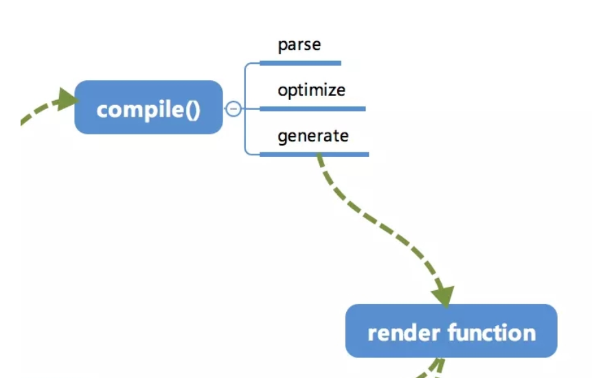

# 1. template 编译过程
compile 编译分为parse,optimize 与generate三个阶段。最终得到了render function。<br>
<br>
- parse: 会用正则表达式将template模板进行字符串解析，得到指令，class,style等数据。形成`AST`（抽象语法树）。
- optimize: 用作优化。是对静态的节点做一些`标记`,在后面patch的过程中，直接跳过这些被标记的节点，从而达到优化的目的。
- generate：将AST转化为render function。最终得到render的字符串以及staticRenderFns字符串
# 2. 编译入口 之 $mount
在vue的构造函数中，有调用$mount函数的步骤
```javascript
Vue.prototype._init = function (options?: Object) {
    ...
    if (vm.$options.el) {
      vm.$mount(vm.$options.el)
    }
  }
}
```
那么，现看一下$mount的代码。可以看出，在mount的过程中，如果render函数(存在则优先使用render)不能存在，会将template进行`compileToFunctions`,得到`render`和`staticRenderFns`.
- `render`:返回VNode节点，供页面渲染以及update时候patch
- `staticRenderFns`:static静态资源在VNode更新时，不需要进行patch,性能优化
```javascript
/*把原本不带编译的$mount方法保存下来，在最后会调用。*/
const mount = Vue.prototype.$mount
/*挂载组件，带模板编译*/
Vue.prototype.$mount = function (el?: string | Element,hydrating?: boolean): Component {
  el = el && query(el)
  ...
  const options = this.$options
  /*处理模板templete，编译成render函数，render不存在的时候才会编译template，否则优先使用render*/
  if (!options.render) {
    let template = options.template
    /*template存在的时候取template，不存在的时候取el的outerHTML*/
    if (template) {
      /*当template是字符串的时候*/
      if (typeof template === 'string') {
        if (template.charAt(0) === '#') {
          template = idToTemplate(template)
         ...
        }
      } else if (template.nodeType) {
        /*当template为DOM节点的时候*/
        template = template.innerHTML
      }....
    } else if (el) {
      /*获取element的outerHTML*/
      template = getOuterHTML(el)
    }
    if (template) {
        ...
      /*将template编译成render函数，这里会有render以及staticRenderFns两个返回，这是vue的编译时优化，static静态不需要在VNode更新时进行patch，优化性能*/
      const { render, staticRenderFns } = compileToFunctions(template, {
        shouldDecodeNewlines,
        delimiters: options.delimiters
      }, this)
      options.render = render
      options.staticRenderFns = staticRenderFns
    }
  }
  /*调用const mount = Vue.prototype.$mount保存下来的不带编译的mount*/
  return mount.call(this, el, hydrating)
}
```
# 3. createCompiler
createCompiler用以创建编译器，使用的createCompilerCreator是一个高阶函数，返回值是compile和compileFunctions。
- compile： 编译器，将传入的template转换为对应的AST, render函数，以及 staticRenderFns。（都是字符串）
- compileFunctions： 带缓存的编译器，通staticRenderFns以及render函数会被转换为Function。（将字符串转为函数）
```javascript
export const createCompiler = createCompilerCreator(function baseCompile (
  template: string,
  options: CompilerOptions
): CompiledResult {
  const ast = parse(template.trim(), options)
  if (options.optimize !== false) {
    // optimize的主要作用是标记static静态节点，这是Vue在编译过程中的一处优化，后面当update更新界面时，会有一个patch的过程，diff算法会直接跳过静态节点，从而减少了比较的过程，优化了patch的性能。
    optimize(ast, options)
  }
  // generate是将AST转化成render funtion字符串的过程，得到结果是render的字符串以及staticRenderFns字符串。
  const code = generate(ast, options)
  return {
    ast,
    render: code.render,
    staticRenderFns: code.staticRenderFns
  }
})
```
