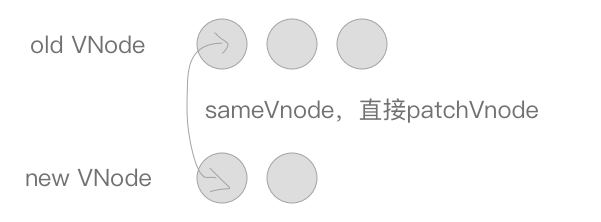

# 1. VNode
根据template模板编译后，render函数最终的调用，最终返回VNode。什么是VNode ?<br>
把真实DOM树抽象成一棵以JavaScript对象构成的抽象树，在修改抽象树数据后将抽象树转化成真实DOM重绘到页面上。于是虚拟DOM出现了，它是真实DOM的一层抽象，用属性描述真实DOM的各个特性。当它发生变化的时候，就会去修改视图。<br>
将整个DOM结构用innerHTML修改到页面上，整个视图都会重绘相当消耗性能，因此如果我们每次只对更新它的修改部分就会美好的多。因此Vue.js将DOM抽象成一个以JavaScript对象为节点的虚拟DOM树，以VNode节点模拟真实DOM，可以对这颗抽象树进行创建节点、删除节点以及修改节点等操作，在这过程中都不需要操作真实DOM，只需要操作JavaScript对象后只对差异修改，相对于整块的innerHTML的粗暴式修改，大大提升了性能。<br>
修改以后经过diff算法得出一些需要修改的最小单位，再将这些小单位的视图进行更新。这样做减少了很多不需要的DOM操作，大大提高了性能。
# 2. 修改视图
Vue通过数据绑定来修改视图，当某个数据被修改的时候，set方法会让闭包中的Dep调用notify，通知所有订阅者Wathcer,Watcher通过get方法执行vm._update(vm._render(), hydrating)。
```javascript
Vue.prototype._update = function(vnode: VNode, hydrating?:boolean) {
    const vm: Component = this
    // 如果该组件已经挂在过，则表示本次步骤是一个更新过程，触发beforeUpdate钩子函数
    if (vm._isMounted) {
        callHook(vm, 'beforeUpdate')
    }
    // $el：该节点真实的DOM元素
    const prevEl = vm.$el
    // _vnode：该实例的虚拟DOM
    const prevVnode = vm._vnode
    // activeInstance： 激活的实例对象
    const prevActiveInstance = activeInstance
    // 将当前实例挂载到activeInstance
    activeInstance = vm
    // 更新_vnode
    vm._vnode = vnode
    // 通过__patch__()更新DOM
    vm.$el = vm.__patch__(prevVnode, vnode)
    activeInstance = prevActiveInstance
    /*更新新的实例对象的__vue__*/
    if (prevEl) {
      prevEl.__vue__ = null
    }
    if (vm.$el) {
      vm.$el.__vue__ = vm
    }
}
```
# 3. patch 方法
patch将新老VM节点进行比较，然后根据两者的比较结果进行最小单位地修改视图，而不是将整个视图根据VNode重绘。patch的核心在于diff算法。通过将同一层的树节点进行比较，而非对树逐层搜索遍历的方式。所以时间复杂度只有O(n)。<br>
<br>
- 新节点不存在，旧节点存在，移除旧节点
- 旧节点不存在，新节点存在，直接创建一个新节点
- 新旧节点存在，且是同一个节点，则直接修改现有节点（只有是同一个节点，才进行patch）
- 新旧节点存在，不是同一个节点，取代现有节点，移除旧节点
```javascript
 /*createPatchFunction的返回值，一个patch函数*/
  return function patch (oldVnode, vnode, hydrating, removeOnly, parentElm, refElm) {

    // isDef:存在
    // isUndef：不存在

    /*vnode不存在则直接调用销毁钩子*/
    if (isUndef(vnode)) {
      if (isDef(oldVnode)) invokeDestroyHook(oldVnode)
      return
    }

    let isInitialPatch = false
    const insertedVnodeQueue = []

    if (isUndef(oldVnode)) {
      /*oldVnode未定义的时候，其实也就是root节点，创建一个新的节点*/
      isInitialPatch = true
      createElm(vnode, insertedVnodeQueue, parentElm, refElm)
    } else {
      /*标记旧的VNode是否有nodeType*/
      const isRealElement = isDef(oldVnode.nodeType)
      if (!isRealElement && sameVnode(oldVnode, vnode)) {
        // patch existing root node
        /*是同一个节点的时候直接修改现有的节点*/
        patchVnode(oldVnode, vnode, insertedVnodeQueue, removeOnly)
      } else {
        if (isRealElement) {
          // mounting to a real element
          // check if this is server-rendered content and if we can perform
          // a successful hydration.
          if (oldVnode.nodeType === 1 && oldVnode.hasAttribute(SSR_ATTR)) {
            /*当旧的VNode是服务端渲染的元素，hydrating记为true*/
            oldVnode.removeAttribute(SSR_ATTR)
            hydrating = true
          }
          if (isTrue(hydrating)) {
            /*需要合并到真实DOM上*/
            if (hydrate(oldVnode, vnode, insertedVnodeQueue)) {
              /*调用insert钩子*/
              invokeInsertHook(vnode, insertedVnodeQueue, true)
              return oldVnode
            } else if (process.env.NODE_ENV !== 'production') {
              ...
            }
          }
          // either not server-rendered, or hydration failed.
          // create an empty node and replace it
          /*如果不是服务端渲染或者合并到真实DOM失败，则创建一个空的VNode节点替换它*/
          oldVnode = emptyNodeAt(oldVnode)
        }
        // replacing existing element
        /*取代现有元素*/
        const oldElm = oldVnode.elm
        const parentElm = nodeOps.parentNode(oldElm)
        createElm(
          vnode,
          insertedVnodeQueue,
          // extremely rare edge case: do not insert if old element is in a
          // leaving transition. Only happens when combining transition +
          // keep-alive + HOCs. (#4590)
          oldElm._leaveCb ? null : parentElm,
          nodeOps.nextSibling(oldElm)
        )

        if (isDef(vnode.parent)) {
          // component root element replaced.
          // update parent placeholder node element, recursively
          /*组件根节点被替换，遍历更新父节点element*/
          let ancestor = vnode.parent
          while (ancestor) {
            ancestor.elm = vnode.elm
            ancestor = ancestor.parent
          }
          if (isPatchable(vnode)) {
            /*调用create回调*/
            for (let i = 0; i < cbs.create.length; ++i) {
              cbs.create[i](emptyNode, vnode.parent)
            }
          }
        }
        if (isDef(parentElm)) {
          /*移除老节点*/
          removeVnodes(parentElm, [oldVnode], 0, 0)
        } else if (isDef(oldVnode.tag)) {
          /*调用destroy钩子*/
          invokeDestroyHook(oldVnode)
        }
      }
    }
    /*调用insert钩子*/
    invokeInsertHook(vnode, insertedVnodeQueue, isInitialPatch)
    return vnode.elm
  }
```
# 4. sameVnode
判断两个VNode节点是否是同一个节点，需要满足以下条件：
- key相同
- tag（当前节点的标签名）相同
- isComment(是否为注释节点)相同
- 是否data（当前节点对应的对象，包含了具体的一些数据信息，是一个VNodeData类型）都定义，当标签是`<input>`的时候，type必须相同
```javascript
function sameVnode (a, b) {
  return (
    a.key === b.key &&
    a.tag === b.tag &&
    a.isComment === b.isComment &&
    isDef(a.data) === isDef(b.data) &&
    sameInputType(a, b)
  )
}
//判断当标签是<input>的时候，type是否相同。某些浏览器不支持动态修改<input>类型，所以他们被视为不同类型
function sameInputType (a, b) {
  if (a.tag !== 'input') return true
  let i
  const typeA = isDef(i = a.data) && isDef(i = i.attrs) && i.type
  const typeB = isDef(i = b.data) && isDef(i = i.attrs) && i.type
  return typeA === typeB
}
```
# 4. patchVnode
当两个节点是同一个节点上时，会进行patch更新操作。下面是patchVNode的源码
- 节点相同，直接返回
- 新旧节点都是static,且key值相同（同一节点），并且新的VNode是clone或者标记了once(v-once,只执行一次)，则只需要替换elm以及componentInstance
- 新旧节点都有children,则对子节点进行diff操作，调用updateChildren
- 旧节点没有chilren,新节点有children,清空旧节点DOM的文本内容，然后为当前DOM节点加入子节点
- 旧节点有children,新节点没有children,移除该DOM节点的所有节点
- 当新旧节点无子节点，只是文本替换
```javascript
/*patch VNode节点*/
  function patchVnode (oldVnode, vnode, insertedVnodeQueue, removeOnly) {
    /*两个VNode节点相同则直接返回*/
    if (oldVnode === vnode) {
      return
    }
    /*
      如果新旧VNode都是静态的，同时它们的key相同（代表同一节点），
      并且新的VNode是clone或者是标记了once（标记v-once属性，只渲染一次），
      那么只需要替换elm以及componentInstance即可。
    */
    if (isTrue(vnode.isStatic) &&
        isTrue(oldVnode.isStatic) &&
        vnode.key === oldVnode.key &&
        (isTrue(vnode.isCloned) || isTrue(vnode.isOnce))) {
      vnode.elm = oldVnode.elm
      vnode.componentInstance = oldVnode.componentInstance
      return
    }
    let i
    const data = vnode.data
    if (isDef(data) && isDef(i = data.hook) && isDef(i = i.prepatch)) {
      /*i = data.hook.prepatch，如果存在的话，见"./create-component componentVNodeHooks"。*/
      i(oldVnode, vnode)
    }
    const elm = vnode.elm = oldVnode.elm
    const oldCh = oldVnode.children
    const ch = vnode.children
    if (isDef(data) && isPatchable(vnode)) {
      /*调用update回调以及update钩子*/
      for (i = 0; i < cbs.update.length; ++i) cbs.update[i](oldVnode, vnode)
      if (isDef(i = data.hook) && isDef(i = i.update)) i(oldVnode, vnode)
    }
    /*如果这个VNode节点没有text文本时*/
    if (isUndef(vnode.text)) {
      if (isDef(oldCh) && isDef(ch)) {
        /*新老节点均有children子节点，则对子节点进行diff操作，调用updateChildren*/
        if (oldCh !== ch) updateChildren(elm, oldCh, ch, insertedVnodeQueue, removeOnly)
      } else if (isDef(ch)) {
        /*如果老节点没有子节点而新节点存在子节点，先清空elm的文本内容，然后为当前节点加入子节点*/
        if (isDef(oldVnode.text)) nodeOps.setTextContent(elm, '')
        addVnodes(elm, null, ch, 0, ch.length - 1, insertedVnodeQueue)
      } else if (isDef(oldCh)) {
        /*当新节点没有子节点而老节点有子节点的时候，则移除所有ele的子节点*/
        removeVnodes(elm, oldCh, 0, oldCh.length - 1)
      } else if (isDef(oldVnode.text)) {
        /*当新老节点都无子节点的时候，只是文本的替换，因为这个逻辑中新节点text不存在，所以直接去除ele的文本*/
        nodeOps.setTextContent(elm, '')
      }
    } else if (oldVnode.text !== vnode.text) {
      /*当新老节点text不一样时，直接替换这段文本*/
      nodeOps.setTextContent(elm, vnode.text)
    }
    /*调用postpatch钩子*/
    if (isDef(data)) {
      if (isDef(i = data.hook) && isDef(i = i.postpatch)) i(oldVnode, vnode)
    }
  }
```
# 5. updateChildren
```javascript
function updateChildren (parentElm, oldCh, newCh, insertedVnodeQueue, removeOnly) {
    let oldStartIdx = 0
    let newStartIdx = 0
    let oldEndIdx = oldCh.length - 1
    let oldStartVnode = oldCh[0]
    let oldEndVnode = oldCh[oldEndIdx]
    let newEndIdx = newCh.length - 1
    let newStartVnode = newCh[0]
    let newEndVnode = newCh[newEndIdx]
    let oldKeyToIdx, idxInOld, elmToMove, refElm

    // removeOnly is a special flag used only by <transition-group>
    // to ensure removed elements stay in correct relative positions
    // during leaving transitions
    const canMove = !removeOnly

    // 当oldChildren集合遍历完毕，或newChildren集合遍历完毕，结束循环
    while (oldStartIdx <= oldEndIdx && newStartIdx <= newEndIdx) {
      if (isUndef(oldStartVnode)) {
        oldStartVnode = oldCh[++oldStartIdx] // Vnode has been moved left
      } else if (isUndef(oldEndVnode)) {
        oldEndVnode = oldCh[--oldEndIdx]
      } else if (sameVnode(oldStartVnode, newStartVnode)) {
        /*前四种情况其实是指定key的时候，判定为同一个VNode，则直接patchVnode即可，分别比较oldCh以及newCh的两头节点2*2=4种情况*/
        patchVnode(oldStartVnode, newStartVnode, insertedVnodeQueue)
        oldStartVnode = oldCh[++oldStartIdx]
        newStartVnode = newCh[++newStartIdx]
      } else if (sameVnode(oldEndVnode, newEndVnode)) {
        patchVnode(oldEndVnode, newEndVnode, insertedVnodeQueue)
        oldEndVnode = oldCh[--oldEndIdx]
        newEndVnode = newCh[--newEndIdx]
      } else if (sameVnode(oldStartVnode, newEndVnode)) { // Vnode moved right
        patchVnode(oldStartVnode, newEndVnode, insertedVnodeQueue)
        // 将oldStartNode真实的DOM节点移动到oldEndNode的后面
        canMove && nodeOps.insertBefore(parentElm, oldStartVnode.elm, nodeOps.nextSibling(oldEndVnode.elm))
        oldStartVnode = oldCh[++oldStartIdx]
        newEndVnode = newCh[--newEndIdx]
      } else if (sameVnode(oldEndVnode, newStartVnode)) { // Vnode moved left
        patchVnode(oldEndVnode, newStartVnode, insertedVnodeQueue)
        canMove && nodeOps.insertBefore(parentElm, oldEndVnode.elm, oldStartVnode.elm)
        oldEndVnode = oldCh[--oldEndIdx]
        newStartVnode = newCh[++newStartIdx]
      } else {
        /*
          生成一个key与旧VNode的key对应的哈希表（只有第一次进来undefined的时候会生成，也为后面检测重复的key值做铺垫）
          比如childre是这样的 [{xx: xx, key: 'key0'}, {xx: xx, key: 'key1'}, {xx: xx, key: 'key2'}]  beginIdx = 0   endIdx = 2  
          结果生成{key0: 0, key1: 1, key2: 2}
        */
        if (isUndef(oldKeyToIdx)) oldKeyToIdx = createKeyToOldIdx(oldCh, oldStartIdx, oldEndIdx)
        /*如果newStartVnode新的VNode节点存在key并且这个key在oldVnode中能找到则返回这个节点的idxInOld（即第几个节点，下标）*/
        idxInOld = isDef(newStartVnode.key) ? oldKeyToIdx[newStartVnode.key] : null
        if (isUndef(idxInOld)) { // New element
          /*newStartVnode没有key或者是该key没有在老节点中找到则创建一个新的节点*/
          createElm(newStartVnode, insertedVnodeQueue, parentElm, oldStartVnode.elm)
          newStartVnode = newCh[++newStartIdx]
        } else {
          /*获取同key的老节点*/
          elmToMove = oldCh[idxInOld]
          /* istanbul ignore if */
          if (process.env.NODE_ENV !== 'production' && !elmToMove) {
            /*如果elmToMove不存在说明之前已经有新节点放入过这个key的DOM中，提示可能存在重复的key，确保v-for的时候item有唯一的key值*/
            warn(
              'It seems there are duplicate keys that is causing an update error. ' +
              'Make sure each v-for item has a unique key.'
            )
          }
          if (sameVnode(elmToMove, newStartVnode)) {
            /*如果新VNode与得到的有相同key的节点是同一个VNode则进行patchVnode*/
            patchVnode(elmToMove, newStartVnode, insertedVnodeQueue)
            /*因为已经patchVnode进去了，所以将这个老节点赋值undefined，之后如果还有新节点与该节点key相同可以检测出来提示已有重复的key*/
            oldCh[idxInOld] = undefined
            /*当有标识位canMove实可以直接插入oldStartVnode对应的真实DOM节点前面*/
            canMove && nodeOps.insertBefore(parentElm, newStartVnode.elm, oldStartVnode.elm)
            newStartVnode = newCh[++newStartIdx]
          } else {
            // same key but different element. treat as new element
            /*当新的VNode与找到的同样key的VNode不是sameVNode的时候（比如说tag不一样或者是有不一样type的input标签），创建一个新的节点*/
            createElm(newStartVnode, insertedVnodeQueue, parentElm, oldStartVnode.elm)
            newStartVnode = newCh[++newStartIdx]
          }
        }
      }
    }
    if (oldStartIdx > oldEndIdx) {
      /*全部比较完成以后，发现oldStartIdx > oldEndIdx的话，说明老节点已经遍历完了，新节点比老节点多，所以这时候多出来的新节点需要一个一个创建出来加入到真实DOM中*/
      refElm = isUndef(newCh[newEndIdx + 1]) ? null : newCh[newEndIdx + 1].elm
      addVnodes(parentElm, refElm, newCh, newStartIdx, newEndIdx, insertedVnodeQueue)
    } else if (newStartIdx > newEndIdx) {
      /*如果全部比较完成以后发现newStartIdx > newEndIdx，则说明新节点已经遍历完了，老节点多余新节点，这个时候需要将多余的老节点从真实DOM中移除*/
      removeVnodes(parentElm, oldCh, oldStartIdx, oldEndIdx)
    }
  }
```
- 在新旧两个VNode节点的左右头尾两侧有一个变量标记，在遍历过程中向中间靠拢。当`oldStartIndex > oldEndIdx` 或 `newStartIndex > newEndIndex`结束循环。起始节点图：
<br>
- 遍历中，如果是sameNode则将DOM进行复用，直接进行patchVnode即可。否则出现一个新的DOM节点。（oldStart与newStart,oldStart与newEnd,oldEnd与newStart,oldEnd与newEnd）4种比较方式。<br>
oldStart与newStart,oldEnd与newEnd是sameNode时：直接patch<br>
<br>
oldStart与newEnd是sameNode时，说明节点位置已经被移动了，进行patchNode的同时，还需要将oldStart真实DOM节点移动到oldEnd后面。oldEnd与newStart同理，需要将oldEnd节点移动到oldStart前面。<br>
<br>
<br>
- 当以上情况均不符合，通过createKeyToOldIdx会得到一个oldKeyToIdx，里面存放了一个key为旧的VNode，value为对应index序列的哈希表，从这个哈希表中可以找到是否有与newStartVnode一致key的旧的VNode节点，如果同时满足sameVnode，patchVnode的同时会将这个真实DOM（elmToMove）移动到oldStartVnode对应的真实DOM的前面。<br>
<br>
- newStartVnode在旧的VNode节点找不到一致的key，或者是即便key相同却不是sameVnode，这个时候会调用createElm创建一个新的DOM节点。<br>
<br>
- 到这里循环已经结束了，那么剩下我们还需要处理多余或者不够的真实DOM节点。<br>
当结束时oldStartIdx > oldEndIdx，这个时候老的VNode节点已经遍历完了，但是新的节点还没有。说明了新的VNode节点实际上比老的VNode节点多，也就是比真实DOM多，需要将剩下的（也就是新增的）VNode节点插入到真实DOM节点中去，此时调用addVnodes（批量调用createElm的接口将这些节点加入到真实DOM中去）。<br>
<br>
同理，当newStartIdx > newEndIdx时，新的VNode节点已经遍历完了，但是老的节点还有剩余，说明真实DOM节点多余了，需要从文档中删除，这时候调用removeVnodes将这些多余的真实DOM删除。<br>
<br>

# 6. DOM操作
由于Vue使用了虚拟DOM，所以虚拟DOM可以在任何支持JavaScript语言的平台上操作，譬如说目前Vue支持的浏览器平台或是weex，在虚拟DOM的实现上是一致的。那么最后虚拟DOM如何映射到真实的DOM节点上呢？<br>

Vue为平台做了一层适配层，浏览器平台见/platforms/web/runtime/node-ops.js以及weex平台见/platforms/weex/runtime/node-ops.js。不同平台之间通过适配层对外提供相同的接口，虚拟DOM进行操作真实DOM节点的时候，只需要调用这些适配层的接口即可，而内部实现则不需要关心，它会根据平台的改变而改变。<br>

现在又出现了一个问题，我们只是将虚拟DOM映射成了真实的DOM。那如何给这些DOM加入attr、class、style等DOM属性呢？<br>

这要依赖于虚拟DOM的生命钩子。虚拟DOM提供了如下的钩子函数，分别在不同的时期会进行调用。<br>
```javascript
const hooks = ['create', 'activate', 'update', 'remove', 'destroy']

/*构建cbs回调函数，web平台上见/platforms/web/runtime/modules*/
  for (i = 0; i < hooks.length; ++i) {
    cbs[hooks[i]] = []
    for (j = 0; j < modules.length; ++j) {
      if (isDef(modules[j][hooks[i]])) {
        cbs[hooks[i]].push(modules[j][hooks[i]])
      }
    }
  }
```
同理，也会根据不同平台有自己不同的实现，我们这里以Web平台为例。Web平台的钩子函数见/platforms/web/runtime/modules。里面有对attr、class、props、events、style以及transition（过渡状态）的DOM属性进行操作。<br>
以attr为例，attr只需要在create以及update钩子被调用时更新DOM的attr属性即可。<br>
```javascript
/* @flow */

import { isIE9 } from 'core/util/env'

import {
  extend,
  isDef,
  isUndef
} from 'shared/util'

import {
  isXlink,
  xlinkNS,
  getXlinkProp,
  isBooleanAttr,
  isEnumeratedAttr,
  isFalsyAttrValue
} from 'web/util/index'

/*更新attr*/
function updateAttrs (oldVnode: VNodeWithData, vnode: VNodeWithData) {
  /*如果旧的以及新的VNode节点均没有attr属性，则直接返回*/
  if (isUndef(oldVnode.data.attrs) && isUndef(vnode.data.attrs)) {
    return
  }
  let key, cur, old
  /*VNode节点对应的Dom实例*/
  const elm = vnode.elm
  /*旧VNode节点的attr*/
  const oldAttrs = oldVnode.data.attrs || {}
  /*新VNode节点的attr*/
  let attrs: any = vnode.data.attrs || {}
  // clone observed objects, as the user probably wants to mutate it
  /*如果新的VNode的attr已经有__ob__（代表已经被Observe处理过了）， 进行深拷贝*/
  if (isDef(attrs.__ob__)) {
    attrs = vnode.data.attrs = extend({}, attrs)
  }

  /*遍历attr，不一致则替换*/
  for (key in attrs) {
    cur = attrs[key]
    old = oldAttrs[key]
    if (old !== cur) {
      setAttr(elm, key, cur)
    }
  }
  // #4391: in IE9, setting type can reset value for input[type=radio]
  /* istanbul ignore if */
  if (isIE9 && attrs.value !== oldAttrs.value) {
    setAttr(elm, 'value', attrs.value)
  }
  for (key in oldAttrs) {
    if (isUndef(attrs[key])) {
      if (isXlink(key)) {
        elm.removeAttributeNS(xlinkNS, getXlinkProp(key))
      } else if (!isEnumeratedAttr(key)) {
        elm.removeAttribute(key)
      }
    }
  }
}

/*设置attr*/
function setAttr (el: Element, key: string, value: any) {
  if (isBooleanAttr(key)) {
    // set attribute for blank value
    // e.g. <option disabled>Select one</option>
    if (isFalsyAttrValue(value)) {
      el.removeAttribute(key)
    } else {
      el.setAttribute(key, key)
    }
  } else if (isEnumeratedAttr(key)) {
    el.setAttribute(key, isFalsyAttrValue(value) || value === 'false' ? 'false' : 'true')
  } else if (isXlink(key)) {
    if (isFalsyAttrValue(value)) {
      el.removeAttributeNS(xlinkNS, getXlinkProp(key))
    } else {
      el.setAttributeNS(xlinkNS, key, value)
    }
  } else {
    if (isFalsyAttrValue(value)) {
      el.removeAttribute(key)
    } else {
      el.setAttribute(key, value)
    }
  }
}

export default {
  create: updateAttrs,
  update: updateAttrs
}
```
